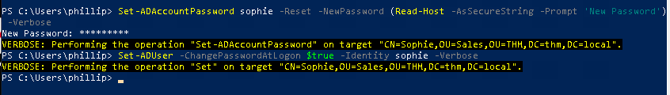
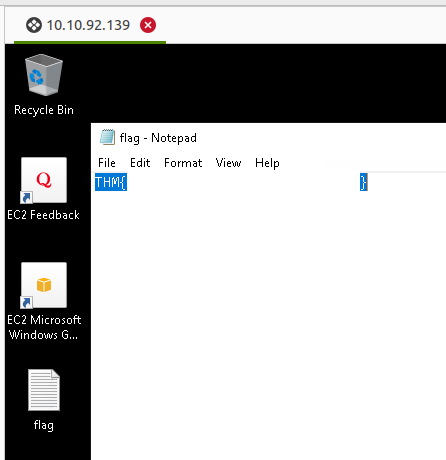
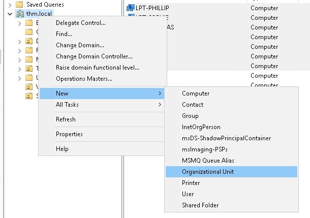
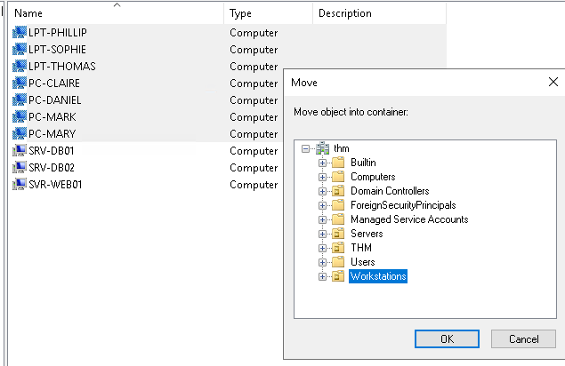

> # Active Directory Basics - Tryhackme

# Summary

## Task 2 - Windows Domains
1. In a Windows domain, credentials are stored in a centralised repository called... 
    > The main idea behind a domain is to centralise the administration of common components of a Windows computer network in a single repository called Active Directory (AD).
    
    **Answer:** Active Directory

1. The server in charge of running the Active Directory services is called... 
    > The server that runs the Active Directory services is known as a Domain Controller (DC).

    **Answer:** Domain Controller

## Task 3 - Active Directory
1. Which group normally administrates all computers and resources in a domain? 
    > Domain Admins: Users of this group have administrative privileges over the entire domain. By default, they can administer any computer on the domain, including the DCs.
    
    **Answer:** Domain Admins

1. What would be the name of the machine account associated with a machine named TOM-PC? 
    > The machine account name is the computer's name followed by a dollar sign. For example, a machine named DC01 will have a machine account called DC01$.

    **Answer:** TOM-PC$

1. Suppose our company creates a new department for Quality Assurance. What type of containers should we use to group all Quality Assurance users so that policies can be applied consistently to them? 
    **Answer:** Organizational Units

## Task 4 - Managing Users in AD
1. What was the flag found on Sophie's desktop?  
    Follow the steps on Tryhackme's document. 
     
    Open `falg` file. 
     
    **Answer:** THM{}

1. The process of granting privileges to a user over some OU or other AD Object is called... 
    **Answer:** Delegation

## Task 5 - Managing Computers in AD
1. After organising the available computers, how many ended up in the Workstations OU? 
    Create new OUs with name `Workstations` and `Servers`. 
     
    Move all laptops and personal computers to Workstations OU. 
     
    Thus, we have 7 machines in Workstaion OU and 3 machines in Servers OU. 
    **Answer:** 7

1. Is it recommendable to create separate OUs for Servers and Workstations? (yay/nay) 
    To easyly apply pilicies to all machine in OU. 
    **Answer:** yay

## Task 6 - Group Policies
1. What is the name of the network share used to distribute GPOs to domain machines? 
    > GPOs are distributed to the network via a network share called SYSVOL

    **Answer:** SYSVOL

1. Can a GPO be used to apply settings to users and computers? (yay/nay) 
    **Answer:** yay

## Task 7 - Authentication Methods
1. Will a current version of Windows use NetNTLM as the preferred authentication protocol by default? (yay/nay) 
    > Kerberos authentication is the default authentication protocol for any recent version of Windows. 

    **Answer:** nay

1. When referring to Kerberos, what type of ticket allows us to request further tickets known as TGS? 
    > When a user wants to connect to a service on the network like a share, website or database, they will use their TGT to ask the KDC for a Ticket Granting Service (TGS). 

    **Answer:** Ticket Granting Ticket

1. When using NetNTLM, is a user's password transmitted over the network at any point? (yay/nay) 
    > Note that the user's password (or hash) is never transmitted through the network for security.

    **Answer:** nay

## Task 8 - Trees, Forests and Trusts
1. What is a group of Windows domains that share the same namespace called? 
    > If you have two domains that share the same namespace (thm.local in our example), those domains can be joined into a Tree.

    **Answer:** Tree

1. What should be configured between two domains for a user in Domain A to access a resource in Domain B? 
    **Answer:** A trust relationships

