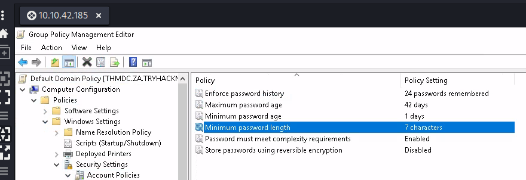
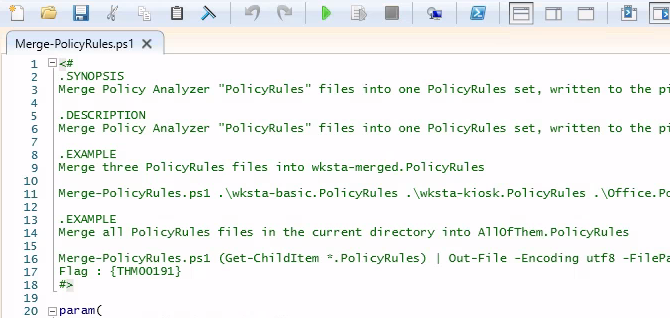
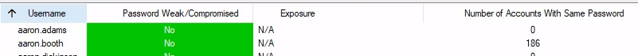

> # Active Directory Hardening

# Summary
<!-- TOC -->

- [Summary](#summary)
    - [Task 2  Understanding General Active Directory Concepts](#task-2--understanding-general-active-directory-concepts)
    - [Task 3 - Securing Authentication Methods](#task-3---securing-authentication-methods)
    - [Task 4 - Implementing Least Privilege Model](#task-4---implementing-least-privilege-model)
    - [Task 5 - Microsoft Security Compliance Toolkit](#task-5---microsoft-security-compliance-toolkit)
    - [Task 6 - Protecting Against Known Attacks](#task-6---protecting-against-known-attacks)

<!-- /TOC -->

## Task 2  Understanding General Active Directory Concepts
1. What is the root domain in the attached AD machine?<br>
    Run `ipconfig /all` to see the root domain.<br>
    ```
    C:\Users\Administrator>ipconfig /all

    Windows IP Configuration

    Host Name . . . . . . . . . . . . : THMDC
    Primary Dns Suffix  . . . . . . . : za.tryhackme.loc
    Node Type . . . . . . . . . . . . : Hybrid
    IP Routing Enabled. . . . . . . . : No
    WINS Proxy Enabled. . . . . . . . : No
    DNS Suffix Search List. . . . . . : eu-west-1.ec2-utilities.amazonaws.com
                                        za.tryhackme.loc
                                        tryhackme.loc
                                        eu-west-1.compute.internal

    Ethernet adapter Ethernet 3:

    Connection-specific DNS Suffix  . : eu-west-1.compute.internal
    Description . . . . . . . . . . . : AWS PV Network Device #0
    Physical Address. . . . . . . . . : 02-2D-04-94-55-99
    DHCP Enabled. . . . . . . . . . . : Yes
    Autoconfiguration Enabled . . . . : Yes
    IPv4 Address. . . . . . . . . . . : 10.10.42.185(Preferred)
    Subnet Mask . . . . . . . . . . . : 255.255.0.0
    Lease Obtained. . . . . . . . . . : Saturday, August 5, 2023 4:20:46 AM
    Lease Expires . . . . . . . . . . : Saturday, August 5, 2023 6:20:46 AM
    Default Gateway . . . . . . . . . : 10.10.0.1
    DHCP Server . . . . . . . . . . . : 10.10.0.1
    DNS Servers . . . . . . . . . . . : 10.10.42.100
    NetBIOS over Tcpip. . . . . . . . : Enabled
    ```
    **Answer:** tryhackme.loc

## Task 3 - Securing Authentication Methods
1. What is the default minimum password length (number of characters) in the attached VM?<br>   
    <br>
    **Answer:** 7

## Task 4 - Implementing Least Privilege Model
1. Computers and Printers must be added to Tier 0 - yea/nay?<br>
    > Tier 0: Top level and includes all the admin accounts, Domain Controller, and groups.

    **Answer:** nay

1. Suppose a vendor arrives at your facility for a 2-week duration task. Being a System Administrator, you should create a high privilege account for him - yea/nay?<br>
    **Answer:**  nay

## Task 5 - Microsoft Security Compliance Toolkit
1. Find and open BaselineLocalInstall script in PowerShell editor - Can you find the flag?<br>
    Open `BaselineLocalInstall.ps1`, you will see the THM flag.<br>
    <br>
    **Answer:** THM{00001}

1. Find and open MergePolicyRule script (Policy Analyser) in PowerShell editor - Can you find the flag?<br>
    Path: `"C:\Users\Administrator\Desktop\Scripts\PolicyAnalyzer\PolicyAnalyzer_40\Merge-PolicyRules.ps1"`
    <br>
    **Answer:** {THM00191}

## Task 6 - Protecting Against Known Attacks
* [Zero Logon](https://tryhackme.com/room/zer0logon) (Get admin access to an AD without credentials).
* [Breaching AD](https://tryhackme.com/room/breachingad) (Getting the first set of credentials in an AD environment).
* [Exploiting AD](https://tryhackme.com/room/exploitingad) (Learn common AD exploitation techniques).
* [Post-Exploitation basics](https://tryhackme.com/room/postexploit) (What an attacker does after gaining an initial foothold of AD).

1. Does Kerberoasting utilise an offline-attack scheme for cracking encrypted passwords - yea/nay?<br>
    > Kerberoasting is a common and successful post-exploitation technique for attackers to get privileged access to AD. The attacker exploits Kerberos Ticket Granting Service (TGS) to request an encrypted password, and then the attacker cracks it offline through various brute force techniques.

    **Answer:** yea

1. As per the generated report, how many users have the same password as aaron.booth?<br>
    <br>
    **Answer:** 186
