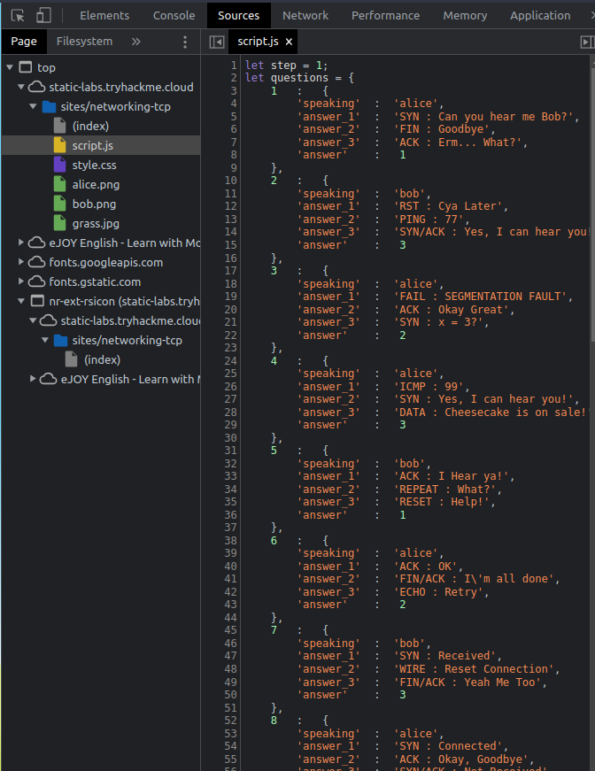

> # Active Reconnaissance

# Summary
* [Summary](#summary)
   * [Task 2 - Web Browser](#task-2---web-browser)
   * [Task 3 - Ping](#task-3---ping)
   * [Task 4 - Traceroute](#task-4---traceroute)
   * [Task 5 - Telnet](#task-5---telnet)
   * [Task 6 - Netcat](#task-6---netcat)
   
## Task 2 - Web Browser
1. Browse to the following website and ensure that you have opened your Developer Tools on AttackBox Firefox, or the browser on your computer. Using the Developer Tools, figure out the total number of questions.<br>
    Find file script.js in DevTool -> Sources Tab, lenght of question is 8.<br>
    <br>
    **Answer:** 8

## Task 3 - Ping
1. Which option would you use to set the size of the data carried by the ICMP echo request?<br>
    Use `ping -h` to find the answer.
    <pre><code>$ ping -h

    Usage
    ping [options] <destination>

    Options:
    <destination>      dns name or ip address
    -a                 use audible ping
    -A                 use adaptive ping
    -B                 sticky source address
    -c \<count\>         stop after <count> replies
    -D                 print timestamps
    -d                 use SO_DEBUG socket option
    -f                 flood ping
    -h                 print help and exit
    -I \<interface\>     either interface name or address
    -i \<interval>      seconds between sending each packet
    -L                 suppress loopback of multicast packets
    -l \<preload>       send <preload> number of packages while waiting replies
    -m \<mark>          tag the packets going out
    -M \<pmtud opt>     define mtu discovery, can be one of <do|dont|want>
    -n                 no dns name resolution
    -O                 report outstanding replies
    -p \<pattern>       contents of padding byte
    -q                 quiet output
    -Q \<tclass>        use quality of service <tclass> bits
    <span style="color:red"><b>-s \<size>          use <size> as number of data bytes to be sent</b></span>
    -S \<size>          use <size> as SO_SNDBUF socket option value
    -t \<ttl>           define time to live
    -U                 print user-to-user latency
    -v                 verbose output
    -V                 print version and exit
    -w \<deadline>      reply wait <deadline> in seconds
    -W &lt;timeout&gt;       time to wait for response

    IPv4 options:
    -4                 use IPv4
    -b                 allow pinging broadcast
    -R                 record route
    -T \<timestamp>     define timestamp, can be one of <tsonly|tsandaddr|tsprespec>

    IPv6 options:
    -6                 use IPv6
    -F \<flowlabel>     define flow label, default is random
    -N \<nodeinfo opt>  use icmp6 node info query, try <help> as argument

    For more details see ping(8).</code></pre>
    **Answer:** -s

1. What is the size of the ICMP header in bytes?<br>
    **Answer:** 8

1. Does MS Windows Firewall block ping by default? (Y/N)<br>
    **Answer:** 8

1. Deploy the VM for this task and using the AttackBox terminal, issue the command `ping -c 10 10.10.252.199`. How many ping replies did you get back?<br>
    ```sh
    $ ping -c 10 10.10.252.199
    PING 10.10.252.199 (10.10.252.199) 56(84) bytes of data.
    64 bytes from 10.10.252.199: icmp_seq=1 ttl=60 time=206 ms
    64 bytes from 10.10.252.199: icmp_seq=2 ttl=60 time=208 ms
    64 bytes from 10.10.252.199: icmp_seq=3 ttl=60 time=203 ms
    64 bytes from 10.10.252.199: icmp_seq=4 ttl=60 time=210 ms
    64 bytes from 10.10.252.199: icmp_seq=5 ttl=60 time=207 ms
    64 bytes from 10.10.252.199: icmp_seq=6 ttl=60 time=208 ms
    64 bytes from 10.10.252.199: icmp_seq=7 ttl=60 time=204 ms
    64 bytes from 10.10.252.199: icmp_seq=8 ttl=60 time=204 ms
    64 bytes from 10.10.252.199: icmp_seq=9 ttl=60 time=206 ms
    64 bytes from 10.10.252.199: icmp_seq=10 ttl=60 time=206 ms

    --- 10.10.252.199 ping statistics ---
    10 packets transmitted, 10 received, 0% packet loss, time 9013ms
    rtt min/avg/max/mdev = 203.306/206.242/209.502/1.849 ms
    ```
    **Answer:** 10

## Task 4 - Traceroute
1. In Traceroute A, what is the IP address of the last router/hop before reaching tryhackme.com?<br>
    **Answer:** 172.67.69.208

1. In Traceroute B, what is the IP address of the last router/hop before reaching tryhackme.com?<br>
    **Answer:** 104.26.11.229

1. In Traceroute B, how many routers are between the two systems?<br>
    **Answer:** 26

1. Start the attached VM from Task 3 if it is not already started. On the AttackBox, run traceroute 10.10.248.92. Check how many routers/hops are there between the AttackBox and the target VM.<br>
    <pre><code>$ traceroute 10.10.248.92
    traceroute to 10.10.248.92 (10.10.248.92), 30 hops max, 60 byte packets
    1  10.17.0.1 (10.17.0.1)  95.601 ms  95.556 ms  95.547 ms
    2  * * *
    3  * * *
    4  * * *
    5  10.10.248.92 (10.10.248.92)  220.965 ms  221.009 ms  221.641 ms</code></pre>

## Task 5 - Telnet
1. Start the attached VM from Task 3 if it is not already started. On the AttackBox, open the terminal and use the telnet client to connect to the VM on port 80. What is the name of the running server?
    <pre><code>$ telnet 10.10.248.92 80
    Trying 10.10.248.92...
    Connected to 10.10.248.92.
    Escape character is '^]'.
    GET / HTTP/1.1
    GET /page.html HTTP/1.1
    host: telnet
    HTTP/1.1 400 Bad Request
    Date: Mon, 18 Jul 2022 04:59:34 GMT
    <span style="color:red"><b>Server: Apache/2.4.10 (Debian)</b></span>
    Content-Length: 308
    Connection: close
    Content-Type: text/html; charset=iso-8859-1

    &lt;!DOCTYPE HTML PUBLIC &quot;-//IETF//DTD HTML 2.0//EN&quot;&gt;
    &lt;html&gt;&lt;head&gt;
    &lt;title&gt;400 Bad Request&lt;/title&gt;
    &lt;/head&gt;&lt;body&gt;
    &lt;h1&gt;Bad Request&lt;/h1&gt;
    &lt;p&gt;Your browser sent a request that this server could not understand.&lt;br /&gt;
    &lt;/p&gt;
    &lt;hr&gt;
    &lt;address&gt;Apache/2.4.10 (Debian) Server at debra2.thm.local Port 80&lt;/address&gt;
    &lt;/body&gt;&lt;/html&gt;
    Connection closed by foreign host.</code></pre>
    **Answer:** Apache

1. What is the version of the running server (on port 80 of the VM)?<br>
    **Answer:** 2.4.10

## Task 6 - Netcat
1. Start the VM and open the AttackBox. Once the AttackBox loads, use Netcat to connect to the VM port 21. What is the version of the running server?<br>
    <pre><code>$ nc 10.10.149.233 21
    220 debra2.thm.local FTP server (Version 6.4/OpenBSD/Linux-ftpd-<span style="color:red"><b>0.17</b></span>) ready. </code></pre>
    **Answer:** 0.17
