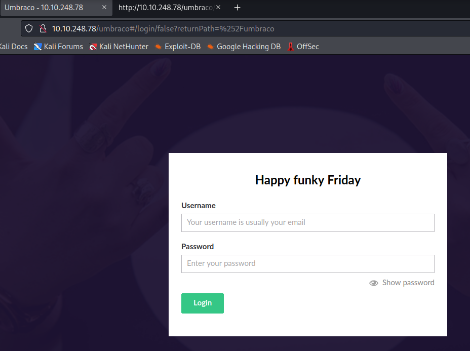
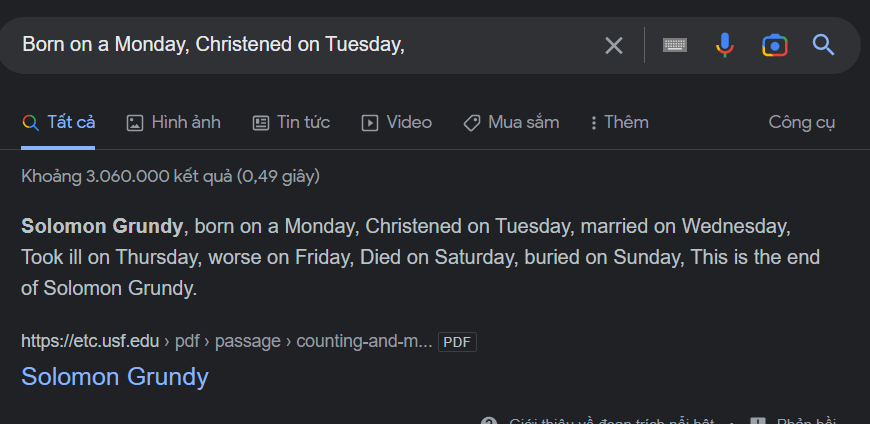
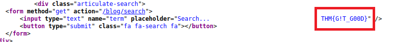
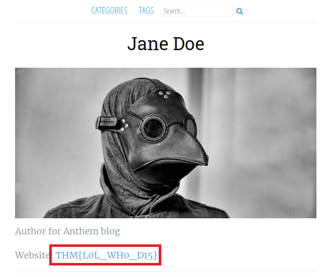
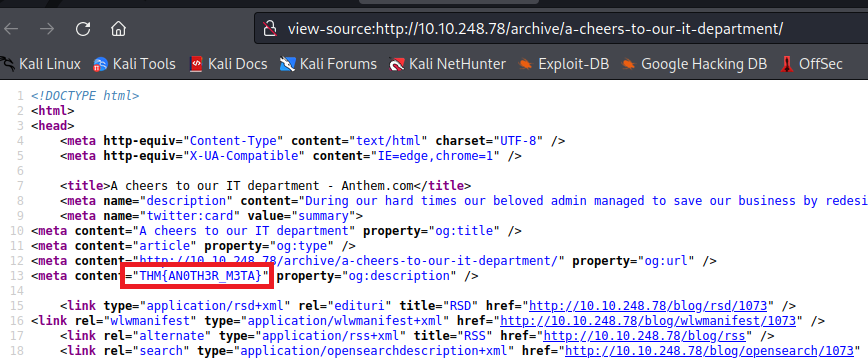
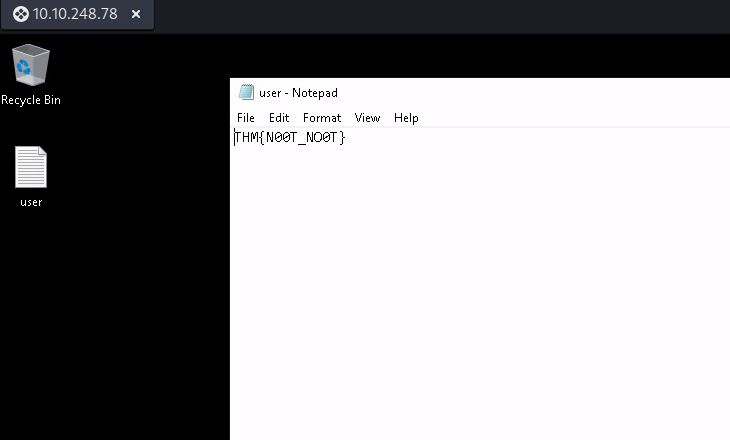
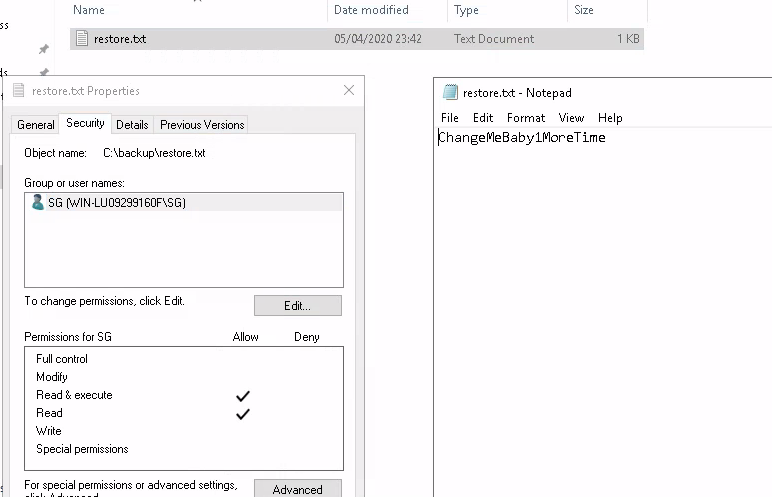
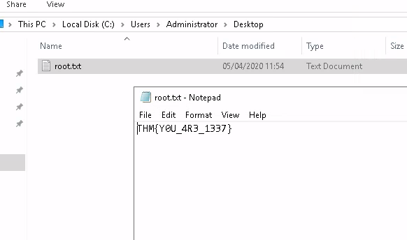

> # Anthem

# Summary
<!-- TOC -->

- [Summary](#summary)
    - [Task 1 - Website Analysis](#task-1---website-analysis)
    - [Task 2 - Spot the flags](#task-2---spot-the-flags)
    - [Task 3 - Final stage](#task-3---final-stage)

<!-- /TOC -->

## Task 1 - Website Analysis
Scan the target with `nmap` first.<br>
```
sudo nmap -Pn 10.10.248.78 -A 
[sudo] password for kali: 
Starting Nmap 7.92 ( https://nmap.org ) at 2023-01-27 08:35 EST
Nmap scan report for 10.10.248.78
Host is up (0.22s latency).
Not shown: 998 filtered tcp ports (no-response)
PORT     STATE SERVICE       VERSION
80/tcp   open  http          Microsoft HTTPAPI httpd 2.0 (SSDP/UPnP)
3389/tcp open  ms-wbt-server Microsoft Terminal Services
| ssl-cert: Subject: commonName=WIN-LU09299160F
| Not valid before: 2023-01-26T13:30:52
|_Not valid after:  2023-07-28T13:30:52
|_ssl-date: 2023-01-27T13:37:26+00:00; +18s from scanner time.
| rdp-ntlm-info: 
|   Target_Name: WIN-LU09299160F
|   NetBIOS_Domain_Name: WIN-LU09299160F
|   NetBIOS_Computer_Name: WIN-LU09299160F
|   DNS_Domain_Name: WIN-LU09299160F
|   DNS_Computer_Name: WIN-LU09299160F
|   Product_Version: 10.0.17763
|_  System_Time: 2023-01-27T13:36:19+00:00
Warning: OSScan results may be unreliable because we could not find at least 1 open and 1 closed port
Device type: specialized|general purpose
Running (JUST GUESSING): AVtech embedded (87%), Microsoft Windows XP (85%)
OS CPE: cpe:/o:microsoft:windows_xp::sp3
Aggressive OS guesses: AVtech Room Alert 26W environmental monitor (87%), Microsoft Windows XP SP3 (85%)
No exact OS matches for host (test conditions non-ideal).
Network Distance: 2 hops
Service Info: OS: Windows; CPE: cpe:/o:microsoft:windows

Host script results:
|_clock-skew: mean: 16s, deviation: 1s, median: 15s
```
1. What port is for the web server?<br>
    **Answer:** 80

1. What port is for remote desktop service?
    **Answer:** 3389

1. What is a possible password in one of the pages web crawlers check for?<br>
    Crawlers always check `robots.txt` first to see which directorys are not allowed to crawl.<br>
    Navigate to http://<IP>/robots.txt, you will see a strings display which may be a password.<br>
    ```
    UmbracoIsTheBest!

    # Use for all search robots
    User-agent: *

    # Define the directories not to crawl
    Disallow: /bin/
    Disallow: /config/
    Disallow: /umbraco/
    Disallow: /umbraco_client/
    ```
    **Answer:** UmbracoIsTheBest!

1. What CMS is the website using?<br>
    GET `/umbraco/`, you will see the webapp is Umbraco.<br>
    <br>
    **Answer:** Umbraco

1. What is the domain of the website?<br>
    At home page, the domain is displayed.<br>
    **Answer:** anthem.com

1. What's the name of the Administrator<br>
    The website has a blog talk about their admin using poem, search this poem on Google to get name of authors.<br>
    <br>
    **Answer:** Solomon Grundy

1. Can we find find the email address of the administrator?<br>
    In `We are hiring` post contains email of Jane Doe is JD@anthem.com, so the email address of Solomon Grundy would be SG@anthem.com<br>
    **Answer:** SG@anthem.com

## Task 2 - Spot the flags
1. What is flag 1?<br>
    In source page of `We are hiring`, contains flag 1.<br>
    **Answer:** THM{L0L_WH0_US3S_M3T4}

1. What is flag 2?<br>
    In place holder of search bar, contains flag 2.<br>
    <br>
    **Answer:** THM{G!T_G00D}

1. What is flag 3?<br>
    In Jane Doe profile contains flag 3.<br>
    <br>
    **Answer:** THM{L0L_WH0_D15}

1. What is flag 4?<br>
    View source page of `IT Department`, contains flag 4.<br>
    <br>
    **Answer:** THM{AN0TH3R_M3TA}

## Task 3 - Final stage
1. Gain initial access to the machine, what is the contents of user.txt?<br>
    Use RDP to gain access to the machine, the username is `sg` and password is the string above, then read the user.txt<br>
    <br>
    **Answer:** THM{N00T_NO0T}

1. Can we spot the admin password?<br>
    Unhide all files/folders in the target, in C drive you will see a folder `backup` has `restore.txt` but SG doesn't have permission to access it, so I add SG read permission to this file and retrieve admin's password.<br>
    <br>
    **Answer:** ChangeMeBaby1MoreTime

1. Escalate your privileges to root, what is the contents of root.txt?
    Read the flag on Administrator's Desktop folder.<br>
    <br>
    **Answer:** THM{Y0U_4R3_1337}

