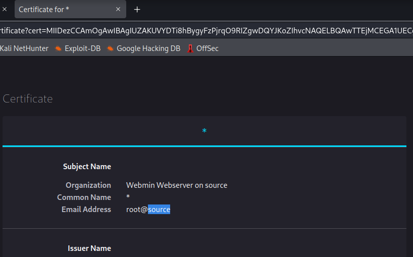
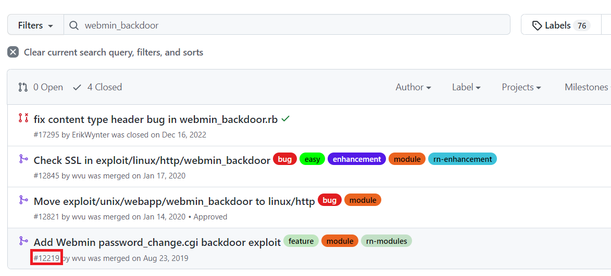

> # AttackerKB

# Summary
<!-- TOC -->

- [Summary](#summary)
    - [Task 2 - Discovering the Lay of the Land](#task-2---discovering-the-lay-of-the-land)
    - [Task 3 - Learning to Fly](#task-3---learning-to-fly)
    - [Task 4 - Blasting Away](#task-4---blasting-away)

<!-- /TOC -->

## Task 2 - Discovering the Lay of the Land
Scan the target with nmap first.<br>
```
sudo nmap -Pn 10.10.224.25 -sV    
Starting Nmap 7.92 ( https://nmap.org ) at 2023-01-25 09:04 EST
Stats: 0:01:14 elapsed; 0 hosts completed (1 up), 1 undergoing Service Scan
Service scan Timing: About 50.00% done; ETC: 09:05 (0:00:07 remaining)
Nmap scan report for 10.10.224.25
Host is up (0.23s latency).
Not shown: 998 closed tcp ports (reset)
PORT      STATE SERVICE  VERSION
22/tcp    open  ssh      OpenSSH 7.6p1 Ubuntu 4ubuntu0.3 (Ubuntu Linux; protocol 2.0)
10000/tcp open  ssl/http MiniServ 1.890 (Webmin httpd)
Service Info: OS: Linux; CPE: cpe:/o:linux:linux_kernel
```
1. Scan the machine with Nmap. What non-standard service can be found running on the high-port?<br>
    **Answer:** webmin

1. Further enumerate this service, what version of it is running?<br>
    **Answer:** 1.890

1. What hostname can we find on the cert details?<br>
    View certificate, you will the hostname of the target.<br>
    <br>
    **Answer:** source

## Task 3 - Learning to Fly
1. Which version of Webmin is immediately vulnerable to this exploit?<br>
    From this [link](https://attackerkb.com/topics/hxx3zmiCkR/webmin-password-change-cgi-command-injection?referrer=search), the version is 1.890.<br>
    **Answer:** 1.890

1. What type of attack was this?<br>
    **Answer:** supply chain

1. Can you find a link to a post on the webmin's website explaining what happened? What day was Webmin informed of an 0day exploit?<br>
    From this [link](https://www.webmin.com/exploit.html), you will the line that webmin's page inform about 0-day exploit.<br>
    **Answer:** August 17th 2019

1. Last but certainly not least, let's find the link to our exploit. We can see in the Assessments that a Metasploit module was added for this backdoor. What pull number was this added in?<br>
    Select `Pull Requests` tab and filter `webmin_backdoor`, the bottom one is the time this module was added.<br>
    <br>
    **Answer:** 12219

## Task 4 - Blasting Away
1. Beyond RHOSTS and LHOST, what is the third option we must set to 'True'?<br>
    **Answer:** ssl

1. Run the exploit. What is the user flag?<br>
    The user flag is in /home/dark/user.txt<br>
    **Answer:** THM{SUPPLY_CHAIN_COMPROMISE}

1. How about the root flag?<br>
    The root flag is in /root/root.txt<br>
    **Answer:** THM{UPDATE_YOUR_INSTALL}

