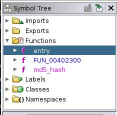
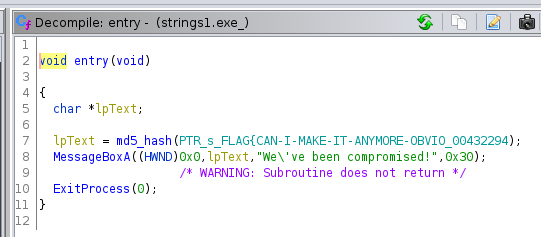
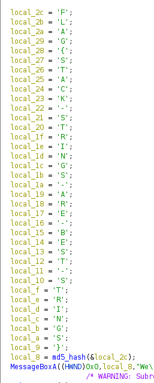
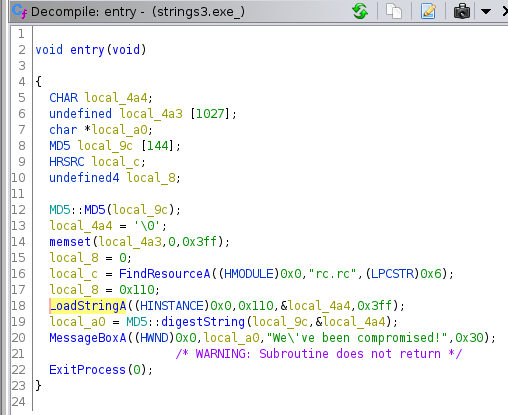
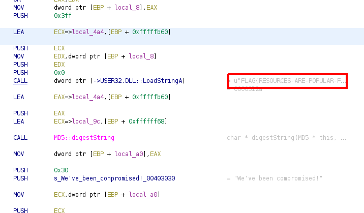
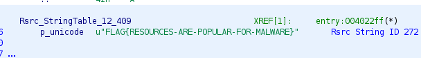

> # Basic Malware RE - Tryhackme

# Summary
* [Summary](#summary)
   * [Task 1 - Introduction](#task-1---introduction)
   * [Task 2 - Strings :: Challenge 1](#task-2---strings--challenge-1)
   * [Task 3 - Strings :: Challenge 2](#task-3---strings--challenge-2)
   * [Task 4 - Strings 3 :: Challenge 3](#task-4---strings-3--challenge-3)
   
## Task 1 - Introduction
No answer needed. 

## Task 2 - Strings :: Challenge 1
1. What is the flag of which that MD5 gets generated? 
    Load the material with Ghidra without execute it. 
    In Symbol Tree, select Functions to display all function. 
     
    The `entry` function is similar to `main` function in almost program. Select it to view code details. 
     
    In `Decompile` panel, we see a function named md5_hash receive a flag as input. 
    **Answer:** FLAG{CAN-I-MAKE-IT-ANYMORE-OBVIOUS}

## Task 3 - Strings :: Challenge 2
1. What is the flag of which that MD5 gets generated? 
    Similar to task 1, view `entry` code, we will see they initialize a char array and declare a char for each element in it. So we only change the present of it to char to get flag. 
     
    **Answer:** FLAG{STACK-STRING-ARE-BEST-STRINGS}

## Task 4 - Strings 3 :: Challenge 3
1. What is the flag of which that MD5 gets generated? 
    View `entry` code, we see the program perform find a resource named `rc.rc` then load a string from an address. 
     
    In Assembly panel, we see the flag as string. 
     
    The full flag. 
     
    **Answer:** FLAG{RESOURCES-ARE-POPULAR-FOR-MALWARE}

