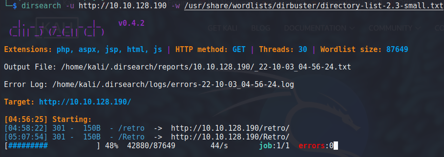
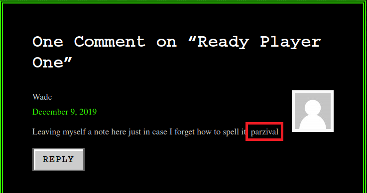
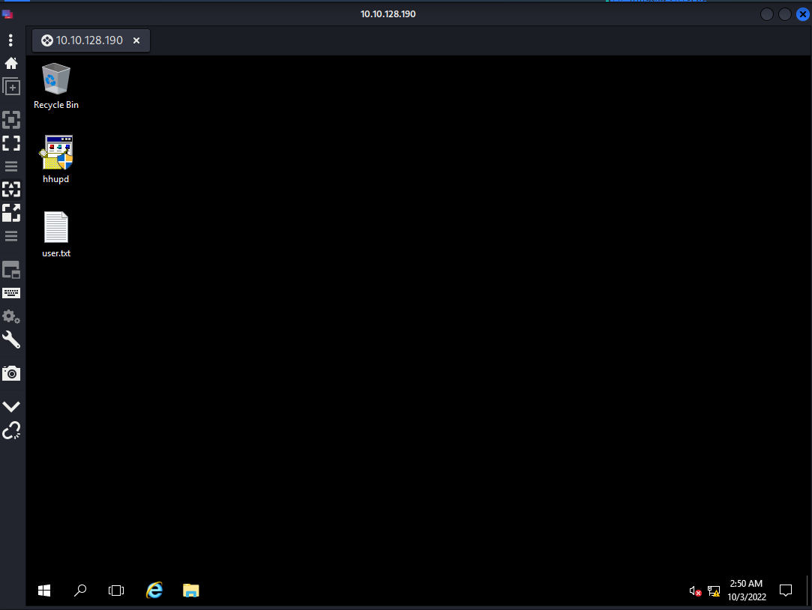
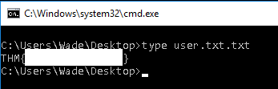
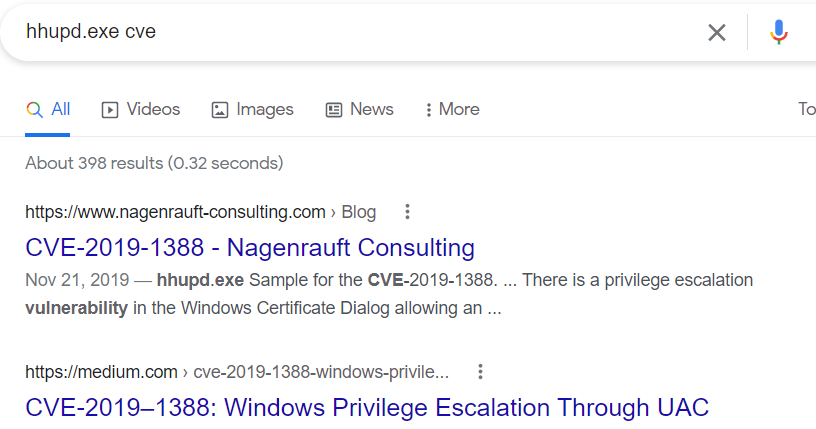
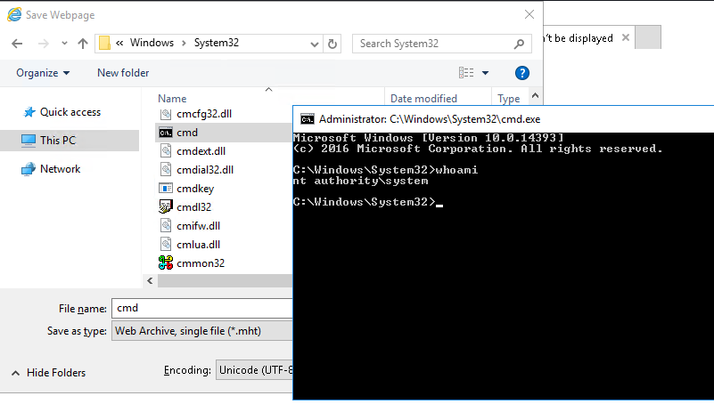
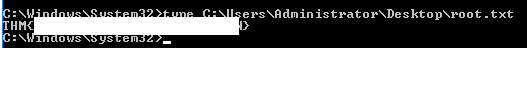
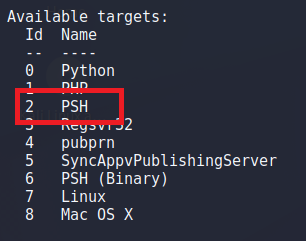
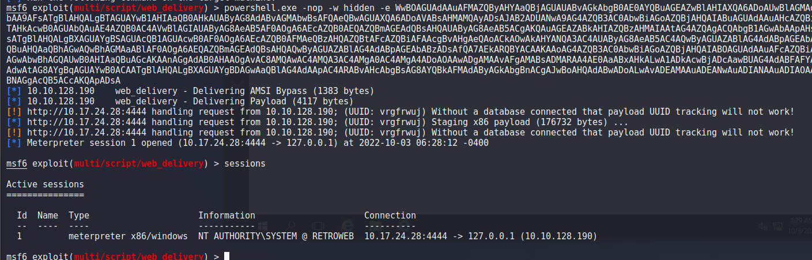
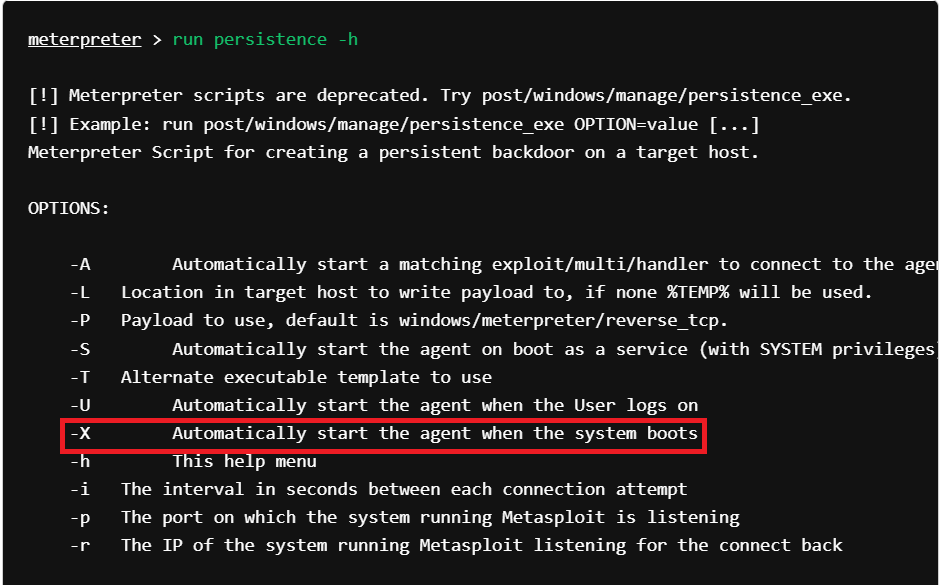

> # Blaster 

# Summary

## Task 2 - Activate Forward Scanners and Launch Proton Torpedoes
1. How many ports are open on our target system?<br>
    Use `nmap`.<br>
    ```
    $ nmap 10.10.128.190 -Pn  
    Starting Nmap 7.92 ( https://nmap.org ) at 2022-10-03 04:28 EDT
    Nmap scan report for 10.10.128.190
    Host is up (0.38s latency).
    Not shown: 998 filtered tcp ports (no-response)
    PORT     STATE SERVICE
    80/tcp   open  http
    3389/tcp open  ms-wbt-server

    Nmap done: 1 IP address (1 host up) scanned in 22.23 seconds
    ```
    **Answer:** 2

1. Looks like there's a web server running, what is the title of the page we discover when browsing to it?<br>
    Use `curl` then grep `title` with pipe.<br>
    ```
    $ curl http://10.10.128.190 | grep 'title'
    % Total    % Received % Xferd  Average Speed   Time    Time     Time  Current
                                    Dload  Upload   Total   Spent    Left  Speed
    100   703  100   703    0     0    826      0 --:--:-- --:--:-- --:--:--   827
    <title>IIS Windows Server</title>
    ```
    **Answer:** IIS Windows Server

1. Interesting, let's see if there's anything else on this web server by fuzzing it. What hidden directory do we discover?<bt>
    I use the `dirsearch` tool with small list of dirbuster to find hidden directory.<br>
    <br>
    When access to /retro, it receives status code 301.<br>
    **Answer:** /retro

1. Navigate to our discovered hidden directory, what potential username do we discover?<br>
    If you scroll down from begin to end, you will see that author of posts is Wade.<br>
    **Answer:** Wade

1. Crawling through the posts, it seems like our user has had some difficulties logging in recently. What possible password do we discover?<br>
    In `Ready Player One` post, there is a comment of author about a word, it may be the password which we are looking for.<br>
    <br>
    **Answer:** parzival

1. Log into the machine via Microsoft Remote Desktop (MSRDP) and read user.txt. What are it's contents?<br>
    Use this credentail Wade:parzival to login to RDP with Remmina.<br>
    <br>
    Read `user.txt`.<br>
    <br>
    **Answer:** THM{\<redacted>}

## Task 3 - Breaching the Control Room
1. When enumerating a machine, it's often useful to look at what the user was last doing. Look around the machine and see if you can find the CVE which was researched on this server. What CVE was it?<br>
    On desktop, we see an application named `hhupd`, search with this name for finding asscosiated CVE.<br>
    <br>
    **Answer:** CVE-2019-1388

1. Looks like an executable file is necessary for exploitation of this vulnerability and the user didn't really clean up very well after testing it. What is the name of this executable?<br>
    **Answer:** hhupd

1. Now that we've spawned a terminal, let's go ahead and run the command 'whoami'. What is the output of running this?<br>
    Follow this [guide](https://www.youtube.com/watch?v=0ULr7oh6TDI&themeRefresh=1), we will have a cmd with corresponding permission when the vulnerable binary is running.<br>
    Run `whoami` command.<br>
    <br>
    **Answer** nt authority\system

1. Now that we've confirmed that we have an elevated prompt, read the contents of root.txt on the Administrator's desktop. What are the contents? Keep your terminal up after exploitation so we can use it in task four!<br>
    Read content of root.txt on Admin's Desktop.<br>
    <br>
    **Answer:** THM{\<redacted>}

## Task 4 - Adoption into the Collective
1. First, let's set the target to PSH (PowerShell). Which target number is PSH?<br>
    Start `msfconsole` and select exploit\multi\script\web_dilivery module.<br>
    Use `show targets` command to see the full contents of this module.<br>
    <br>
    **Answer:** 2

1. What command can we run in our meterpreter console to setup persistence which automatically starts when the system boots? Don't include anything beyond the base command and the option for boot startup. <br>
    Follow step on document, we successfully got a reverse shell from the target.<br>
    <br>
    Research on google, I found a link https://www.offensive-security.com/metasploit-unleashed/meterpreter-service/ with guides how to persistence.<br>
    <br>
    **Answer:** run persistence -X
    