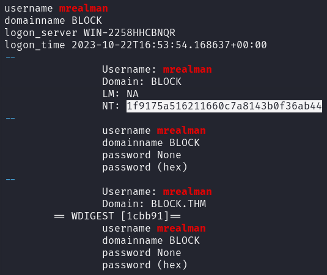
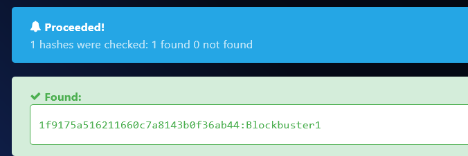

> # Block

# Summary
- [Summary](#summary)
  - [What is the username of the first person who accessed our server?](#what-is-the-username-of-the-first-person-who-accessed-our-server)
  - [What is the password of the user in question 1?](#what-is-the-password-of-the-user-in-question-1)
  - [What is the flag that the first user got access to?](#what-is-the-flag-that-the-first-user-got-access-to)
  - [What is the username of the second person who accessed our server?](#what-is-the-username-of-the-second-person-who-accessed-our-server)
  - [What is the hash of the user in question 4?](#what-is-the-hash-of-the-user-in-question-4)
  - [What is the flag that the second user got access to?](#what-is-the-flag-that-the-second-user-got-access-to)

## What is the username of the first person who accessed our server?
In Wireshark, use `ntlmssp.auth.username` to filter which users authen to machine.<br>
<br>
Use `mrealman` authen to remote machine first.<br>
**Answer:** mrealman

## What is the password of the user in question 1?
Use `pypykatz lsa minidump lsass.DMP` to find hash of `mrealman` user.<br>
<br>
<br>
**Answer:** Blockbuster1

## What is the flag that the first user got access to?
We need to decrypt SMB3 to get the raw content of packets.<br>
Follow this [link](https://medium.com/maverislabs/decrypting-smb3-traffic-with-just-a-pcap-absolutely-maybe-712ed23ff6a2) to know how to get the necessary value from retrive Random Session Key.<br>
```python
import hashlib
import hmac
import argparse
from Cryptodome.Cipher import ARC4
from Cryptodome.Cipher import DES
from Cryptodome.Hash import MD4

def generateEncryptedSessionKey(keyExchangeKey, exportedSessionKey):
    cipher = ARC4.new(keyExchangeKey)
    sessionKey = cipher.encrypt(exportedSessionKey)
    return sessionKey

parser = argparse.ArgumentParser(description="Calculate the Random Session Key based on data from a PCAP (maybe).")
parser.add_argument("-u", "--user", required=True, help="User name")
parser.add_argument("-d", "--domain", required=True, help="Domain name")
credential = parser.add_mutually_exclusive_group(required=True)
credential.add_argument("-p", "--password", help="Password of User")
credential.add_argument("-H", "--hash", help="NTLM Hash of User")
parser.add_argument("-n", "--ntproofstr", required=True, help="NTProofStr. This can be found in PCAP (provide Hex Stream)")
parser.add_argument("-k", "--key", required=True, help="Encrypted Session Key. This can be found in PCAP (provide Hex Stream)")
parser.add_argument("-v", "--verbose", action="store_true", help="increase output verbosity")

args = parser.parse_args()

#Upper Case User and Domain
user = args.user.upper().encode("utf-16le")
domain = args.domain.upper().encode("utf-16le")

if args.password:
  # If password is supplied create 'NTLM' hash of password
  passw = args.password.encode("utf-16le")
  hash1 = hashlib.new("md4", passw).digest()
else:
  hash1 = bytes.fromhex(args.hash)

# Calculate the ResponseNTKey
h = hmac.new(hash1, digestmod=hashlib.md5)
h.update(user + domain)
respNTKey = h.digest()

# Use NTProofSTR and ResponseNTKey to calculate Key Excahnge Key
NTproofStr = bytes.fromhex(args.ntproofstr)
h = hmac.new(respNTKey, digestmod=hashlib.md5)
h.update(NTproofStr)
KeyExchKey = h.digest()

# Calculate the Random Session Key by decrypting Encrypted Session Key with Key Exchange Key via RC4
RsessKey = generateEncryptedSessionKey(KeyExchKey, bytes.fromhex(args.key))

if args.verbose:
    print("USER WORK: " + user.hex() + "" + domain.hex())
    print("PASS HASH: " + hash1.hex())
    print("RESP NT:   " + respNTKey.hex())
    print("NT PROOF:  " + NTproofStr.hex())
    print("KeyExKey:  " + KeyExchKey.hex())
    print("Random SK: " + RsessKey.hex())
```
Follow `Edit → Preferencees → Protocol → SMB2` to add session ID and session key, after add two keys for two accounts we will see two files.<br>
File `clients156.csv` is of `mrealman`.<br>
**Answer:** THM{SmB_DeCrypTing_who_Could_Have_Th0ughT}

## What is the username of the second person who accessed our server?
**Answer:** eshellstrop

## What is the hash of the user in question 4?
**Answer:** 3f29138a04aadc19214e9c04028bf381

## What is the flag that the second user got access to?
The flag is in `clients978.csv`.<br>
**Answer:** THM{No_PasSw0Rd?_No_Pr0bl3m}
