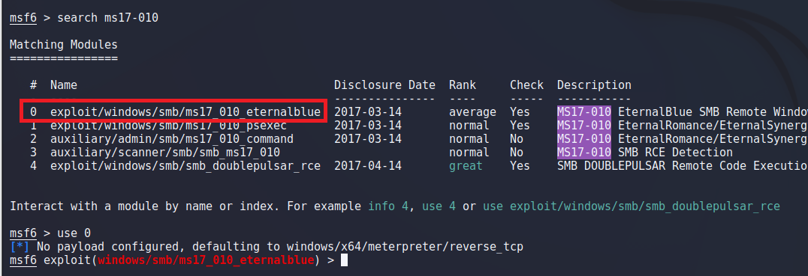
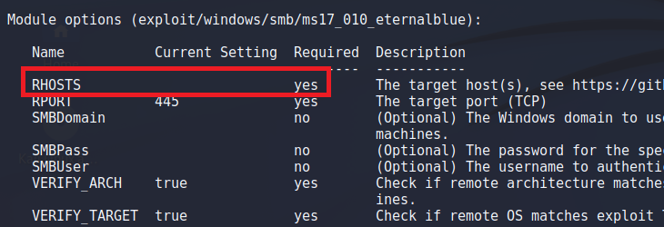
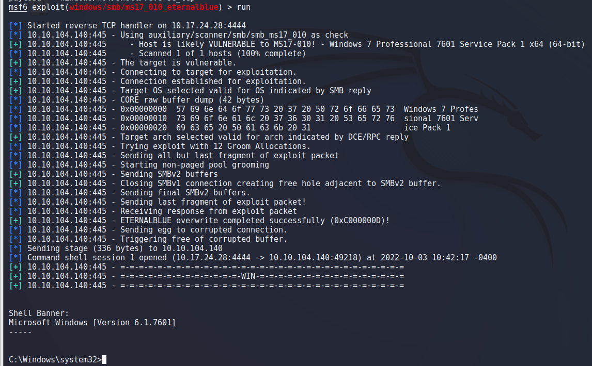
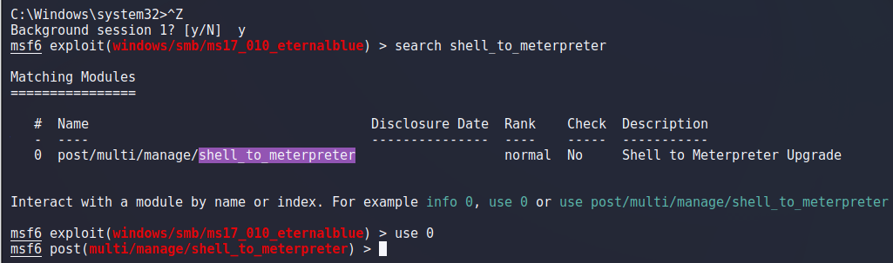
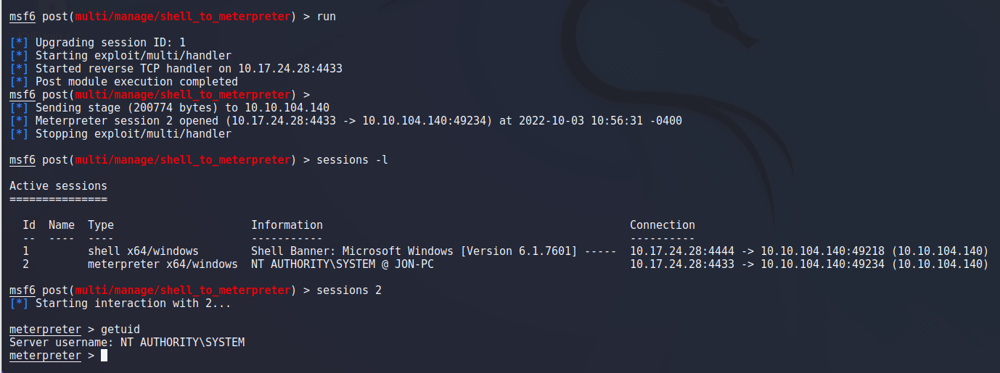
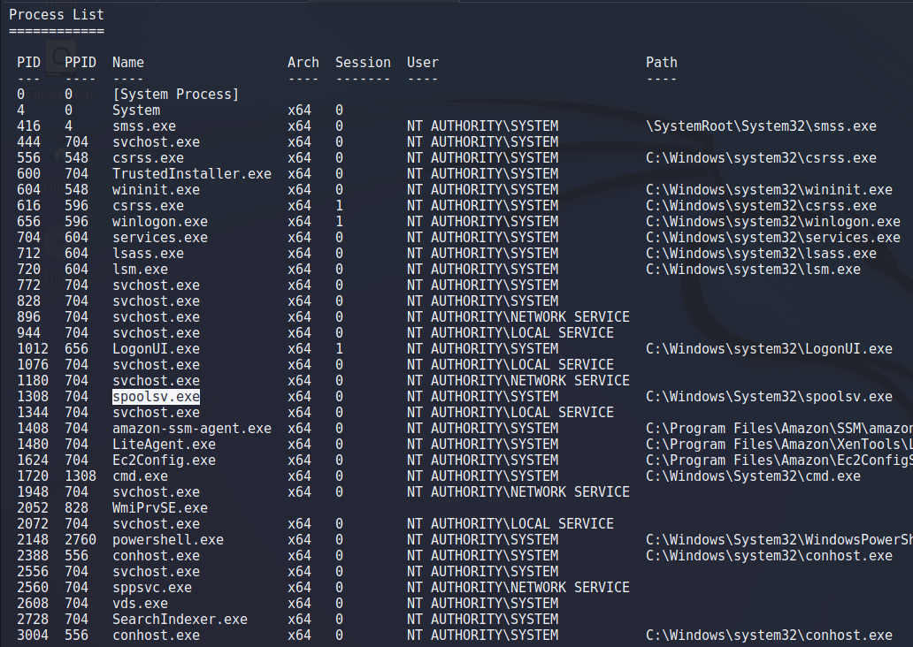

> # Blue

# Summary
<!-- TOC -->

- [Summary](#summary)
    - [Task 1 - Recon](#task-1---recon)
    - [Task 2 - Gain Access](#task-2---gain-access)
    - [Task 3 - Escalate](#task-3---escalate)
    - [Task 4 - Cracking](#task-4---cracking)
    - [Task 5 - Find flags!](#task-5---find-flags)

<!-- /TOC -->

## Task 1 - Recon
1. How many ports are open with a port number under 1000?<br>
    Scan the target with `nmap` tool.<br>
    ```
    $ nmap 10.10.104.140 -Pn
    Starting Nmap 7.92 ( https://nmap.org ) at 2022-10-03 06:57 EDT
    Nmap scan report for 10.10.104.140
    Host is up (0.25s latency).
    Not shown: 991 closed tcp ports (conn-refused)
    PORT      STATE SERVICE
    135/tcp   open  msrpc
    139/tcp   open  netbios-ssn
    445/tcp   open  microsoft-ds
    3389/tcp  open  ms-wbt-server
    49152/tcp open  unknown
    49153/tcp open  unknown
    49154/tcp open  unknown
    49158/tcp open  unknown
    49160/tcp open  unknown

    Nmap done: 1 IP address (1 host up) scanned in 19.07 seconds
    ```
    **Answer:** 3

1. What is this machine vulnerable to? (Answer in the form of: ms??-???, ex: ms08-067)<br>
    Find vulnerable with nmap.<br>
    ```
    $ nmap --script vuln 10.10.104.140
    \<SNIP>
    Host script results:
    |_samba-vuln-cve-2012-1182: NT_STATUS_ACCESS_DENIED
    |_smb-vuln-ms10-061: NT_STATUS_ACCESS_DENIED
    |_smb-vuln-ms10-054: false
    | smb-vuln-ms17-010: 
    |   VULNERABLE:
    |   Remote Code Execution vulnerability in Microsoft SMBv1 servers (ms17-010)
    |     State: VULNERABLE
    |     IDs:  CVE:CVE-2017-0143
    |     Risk factor: HIGH
    |       A critical remote code execution vulnerability exists in Microsoft SMBv1
    |        servers (ms17-010).
    |           
    |     Disclosure date: 2017-03-14
    |     References:
    |       https://cve.mitre.org/cgi-bin/cvename.cgi?name=CVE-2017-0143
    |       https://technet.microsoft.com/en-us/library/security/ms17-010.aspx
    |_      https://blogs.technet.microsoft.com/msrc/2017/05/12/customer-guidance-for-wannacrypt-attacks/
    ```
    Nmap found the ms17-010 vuln.<br>
    **Answer:** ms17-010

## Task 2 - Gain Access
1. Find the exploitation code we will run against the machine. What is the full path of the code? (Ex: exploit/........)<br>
    In metasploit, search with `ms17-010`.<br>
    <br>
    Line has id equal to 0 is correlate to this room.<br>
    **Answer:** exploit/windows/smb/ms17_010_eternalblue

1. Show options and set the one required value. What is the name of this value? (All caps for submission)<br>
    Use `show options`.<br>
    <br>
    Set rhosts to the target IP address.<br>
    **Answer:** rhosts

    Set the payload to windows/x64/shell/reverse_tcp then run the exploit, you will gain a reverse shell from the target.<br>
    <br>

## Task 3 - Escalate
1. Research online how to convert a shell to meterpreter shell in metasploit. What is the name of the post module we will use?<br>
    Follow to this [guideline](https://null-byte.wonderhowto.com/how-to/upgrade-normal-command-shell-metasploit-meterpreter-0166013/)<br>, we will use the module called `shell_to_meterpreter`.<br>
    Search it in metasploit to find full path.<br>
    <br>
    **Answer:** post/multi/manage/shell_to_meterpreter

1. Select this (use MODULE_PATH). Show options, what option are we required to change?<br>
    Show all options of this module.<br>
    <br>
    
    **Answer:** SESSION

    Because we only have one session from previous task, so we will set the value of this option to 1.<br>
    `set session 1` then run the exploitation.<br>
    Now, we have a new meterpreter session and current use is nt authority\system.<br>
    <br>

    List all running process on the target, we have to select a runnnig process has user is nt authority\system. At here, I chose spoolsv.exe which has pid 1308.<br>
    <br>
    Migrate to this process with `migrate 1308`.<br>

## Task 4 - Cracking
1. Within our elevated meterpreter shell, run the command 'hashdump'. This will dump all of the passwords on the machine as long as we have the correct privileges to do so. What is the name of the non-default user? <br> 
    Run `hashdump` command.<br>
    <br>
    The dafault uses are Admin and Guest, so Jon is the non-default user who we are looking for.<br>
    **Answer:** Jon

1. Copy this password hash to a file and research how to crack it. What is the cracked password?<br>
    Copy Jon's hash to [crackstation.net](https://crackstation.net).<br>
    <br>
    **Answer:** alqfna22

## Task 5 - Find flags!
1. Flag1? This flag can be found at the system root. <br>
    Flag1 is in `C:\flag1.txt`.<br>
    ```
    C:\Windows\system32>type C:\flag1.txt
    type C:\flag1.txt
    flag{}    
    ```
    **Answer:** flag{\<redacted>}

1. Flag2? This flag can be found at the location where passwords are stored within Windows.<br>
    Windows OS stored credential in path `C:\Windows\system32\Config`, flag2 is in this path.<br>
    ```
    C:\Windows\system32>type Config\flag2.txt
    type Config\flag2.txt
    flag{}
    ```
    **Answer:** flag{\<redacted>}

1. flag3? This flag can be found in an excellent location to loot. After all, Administrators usually have pretty interesting things saved. <br>
    The admin account is Jon, I try to list files for each directory in Jon's path and the flag3 is in `Documents`.<br>
    ```
    C:\Windows\system32>type C:\Users\Jon\Documents\flag3.txt
    type C:\Users\Jon\Documents\flag3.txt
    flag{}
    ```
    **Answer:** flag{\<redacted>}

