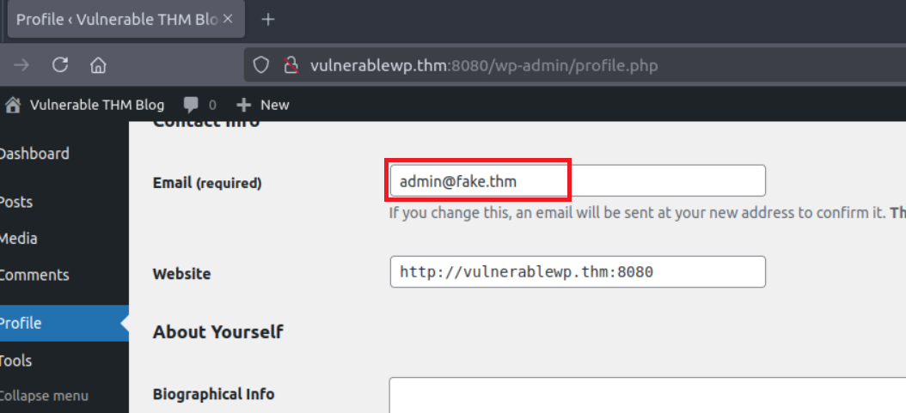
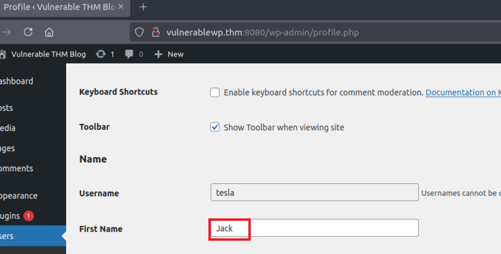

> # Bypass Really Simple Security

## Summary
- [Summary](#summary)
  - [Task 2 - How it Works](#task-2---how-it-works)
  - [Task 3 - How to Exploit](#task-3---how-to-exploit)
  - [Task 4 - Detection and Mitigation](#task-4---detection-and-mitigation)

### Task 2 - How it Works
1. What is the class name that holds the important three functions discussed in the task? 
    > The plugin contains a PHP class called Rsssl_Two_Factor_On_Board_Api,  which includes the following essential methods that lead to a bypassing authentication vulnerability

    **Answer:** Rsssl_Two_Factor_On_Board_Api

1. What is the function name that accepts user_id and login_nonce as arguments and validates them? 
    > The check_login_and_get_user function is responsible for validating the user_id and login_nonce.

    **Answer:** check_login_and_get_user

### Task 3 - How to Exploit
1. What email address is associated with the username admin (user_id 1)? 
    After you login as user_id 1, navigate to profile page to get the email address. 
     
    **Answer:** admin@fake.thm

1. What is the first name value for the username tesla (user_id 2)? 
    Repeat steps to login as user_id 2. 
     
    **Answer:** Jack

1. What is the HTTP method required for exploiting the vulnerability? (GET/POST) 
    **Answer:** POST

### Task 4 - Detection and Mitigation
1. As a security engineer, you have identified a call to the /reallysimplessl/v1/two_fa/skip_onboarding endpoint from weblogs. Does that confirm that the user is 100% infected? (yea/nay) 
    **Answer:** nay
