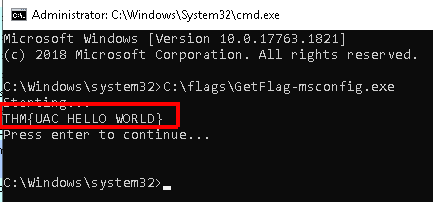
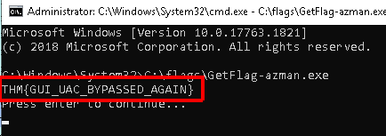
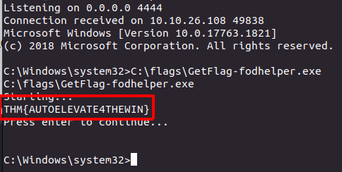
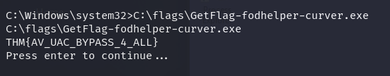
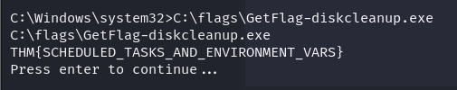

> # Bypassing UAC

# Summary
- [Summary](#summary)
  - [Task 2 - User Account Control (UAC)](#task-2---user-account-control-uac)
  - [Task 3 - UAC: GUI based bypasses](#task-3---uac-gui-based-bypasses)
  - [Task 4 - UAC: Auto-Elevating Processes](#task-4---uac-auto-elevating-processes)
  - [Task 5 - UAC: Improving the Fodhelper Exploit to Bypass Windows Defender](#task-5---uac-improving-the-fodhelper-exploit-to-bypass-windows-defender)
    - [Task 6 - UAC: Environment Variable Expansion](#task-6---uac-environment-variable-expansion)

## Task 2 - User Account Control (UAC)
1. What is the highest integrity level (IL) available on Windows? 
    **Answer:** System

1. What is the IL associated with an administrator's elevated token? 
    > Elevated Token: A token with full Administrator privileges, used when something needs to be run with administrative privileges. This token has High IL.

    **Answer:** High

1. What is the full name of the service in charge of dealing with UAC elevation requests? 
    > At the heart of UAC, we have the Application Information Service or Appinfo. Whenever a user requires elevation

    **Answer:** Application Information Service

## Task 3 - UAC: GUI based bypasses
Use applications have high IL assigned to them, then open CMD and it'll go with high IL. 
1. What flag is returned by running the msconfig exploit? 
    Follow steps of document. 
     
    **Answer:** THM{UAC_HELLO_WORLD}

1. What flag is returned by running the azman.msc exploit? 
     
    **Answer:** THM{GUI_UAC_BYPASSED_AGAIN}

## Task 4 - UAC: Auto-Elevating Processes
> Fodhelper can auto elevate when using default UAC settings so that administrators won't be prompted for elevation when performing standard administrative tasks.

1. What flag is returned by running the fodhelper exploit? 
    Follow steps on document. 
     
    **Answer:** THM{AUTOELEVATE4THEWIN}

## Task 5 - UAC: Improving the Fodhelper Exploit to Bypass Windows Defender
1. What flag is returned by running the fodhelper-curver exploit? 
    Follow steps on document. 
     
    **Answer:** THM{AV_UAC_BYPASS_4_ALL}

### Task 6 - UAC: Environment Variable Expansion
1. What flag is returned by running the DiskCleanup exploit? 
    Follow steps on document. 
     
    **Answer:** THM{SCHEDULED_TASKS_AND_ENVIRONMENT_VARS}
