# Table of Contents
* [Table of Contents](#table-of-contents)
   * [Task 2 - What does the base said?](#task-2---what-does-the-base-said)
   * [Task 3 - Meta meta](#task-3---meta-meta)
   * [Task 4 - Mon, are we going to be okay?](#task-4---mon-are-we-going-to-be-okay)
   * [Task 5 - Erm......Magick](#task-5---ermmagick)
   * [Task 6 - QRrrrr](#task-6---qrrrrr)
   * [Task 7 - Reverse it or read it?](#task-7---reverse-it-or-read-it)
   * [Task 8 - Another decoding stuff](#task-8---another-decoding-stuff)
   * [Task 9 - Left or right](#task-9---left-or-right)
   * [Task 10 - Make a comment](#task-10---make-a-comment)
   * [Task 11 - Can you fix it?](#task-11---can-you-fix-it)
   * [Task 12 - Read it](#task-12---read-it)
   * [Task 13 - Spin my head](#task-13---spin-my-head)
   * [Task 14 - An exclusive!](#task-14---an-exclusive)
   * [Task 15 - Binary walk](#task-15---binary-walk)
   * [Task 16 - Darkness](#task-16---darkness)
   * [Task 17 - A sounding QR](#task-17---a-sounding-qr)
   * [Task 18 - Dig up the past](#task-18---dig-up-the-past)
   * [Task 19 - Uncrackable!](#task-19---uncrackable)
   * [Task 20 - Small bases](#task-20---small-bases)
   * [Task 21 - Read the packet](#task-21---read-the-packet)
## Task 2 - What does the base said?
Can you decode the following?<br>
```sh
$ echo -n "VEhNe2p1NTdfZDNjMGQzXzdoM19iNDUzfQ==" | base64 -d
THM{ju57_d3c0d3_7h3_b453}
```
**Answer:** THM{ju57_d3c0d3_7h3_b453}

## Task 3 - Meta meta
I'm hungry, I need the flag.
```sh
$ exiftool Findme.jpg | grep THM
Owner Name                      : THM{3x1f_0r_3x17}
```

## Task 4 - Mon, are we going to be okay?
It is sad. Feed me the flag.<br>
Use this [link](https://futureboy.us/stegano/decinput.html), submit this file then get the result.<br>
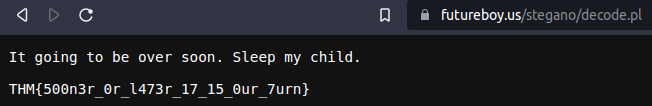<br>
**Answer:** THM{500n3r_0r_l473r_17_15_0ur_7urn}

## Task 5 - Erm......Magick
Did you find the flag?<br>
The flag is invisible after description line.<br>
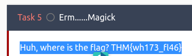<br>
**Answer:**  THM{wh173_fl46}

## Task 6 - QRrrrr
Use zbarimg to scan this image.<br>
```sh
$ zbarimg QR.png 
QR-Code:THM{qr_m4k3_l1f3_345y}
scanned 1 barcode symbols from 1 images in 0,03 seconds
```
**Answer:** THM{qr_m4k3_l1f3_345y}

## Task 7 - Reverse it or read it?
This file is executable file.<br>
```sh
$ file hello.hello 
hello.hello: ELF 64-bit LSB pie executable, x86-64, version 1 (SYSV), dynamically linked, interpreter /lib64/ld-linux-x86-64.so.2, BuildID[sha1]=02900338a56c3c8296f8ef7a8cf5df8699b18696, for GNU/Linux 3.2.0, not stripped
```

Due to description of challenge is reading it, so use `strings` to grep "THM".<br>
```sh
$ strings hello.hello | grep THM
THM{345y_f1nd_345y_60}
```
**Answer:** THM{345y_f1nd_345y_60}

## Task 8 - Another decoding stuff
Oh, Oh, Did you get it?<br>
```sh
$ echo -n "3agrSy1CewF9v8ukcSkPSYm3oKUoByUpKG4L" | base58 -d
THM{17_h45_l3553r_l3773r5}
```
**Answer:** THM{17_h45_l3553r_l3773r5}

## Task 9 - Left or right
What did you get? <br>
Use this [link](https://www.dcode.fr/caesar-cipher), brute force all cases.<br>
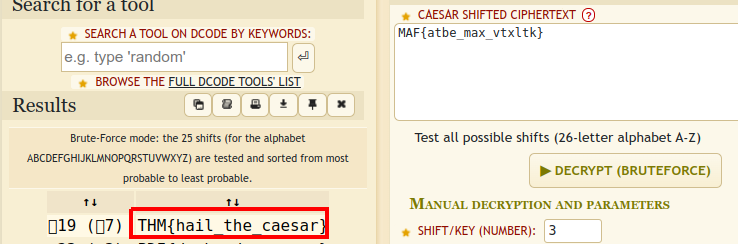<br>
**Answer:** THM{hail_the_caesar}

## Task 10 - Make a comment
I'm hungry now... I need the flag.<br>
Inspect into Task 10 based the title.<br>
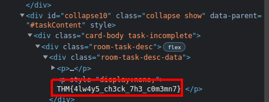<br>
**Answer:** THM{4lw4y5_ch3ck_7h3_c0m3mn7}

## Task 11 - Can you fix it?
What is the content?<br>
`file' cannot check file type.<br>
```sh
$ file spoil.png 
spoil.png: data
```
Use `ghex` to edit hex string, modify hex based on [link](https://en.wikipedia.org/wiki/List_of_file_signatures)<br>
<br>
To<br>
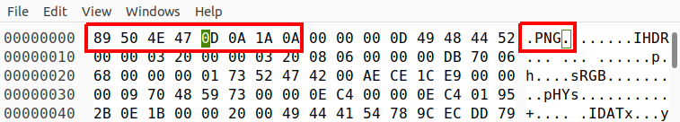<br>
We get the fixed image, open it and get the flag!<br>
<br>
**Answer:** THM{y35_w3_c4n}

## Task 12 - Read it
Did you found the hidden flag?
Search on Google with keyword "Tryhackme room Reddit", we'll see the link with image.
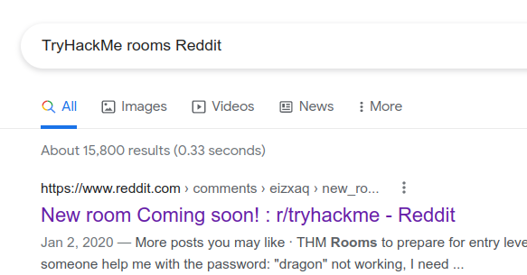<br>
In this link, we will see the flag below image.<br>
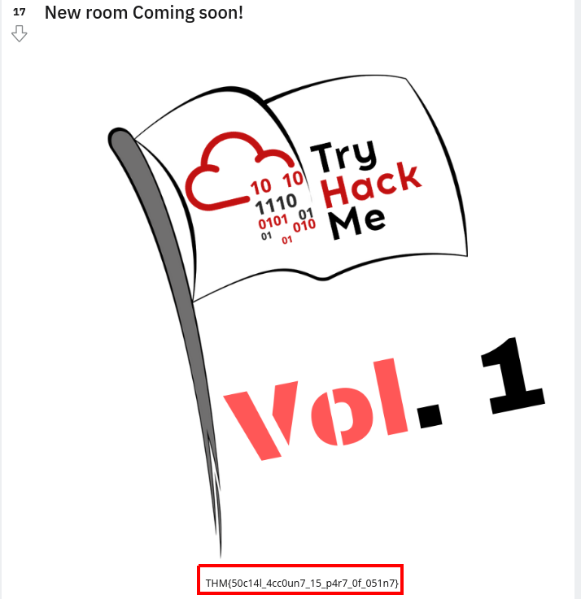<br>
**Answer:** THM{50c14l_4cc0un7_15_p4r7_0f_051n7}

## Task 13 - Spin my head
Can you decode it?
This string is encoded with brainfuck, so decode it with [link](https://www.dcode.fr/brainfuck-language)
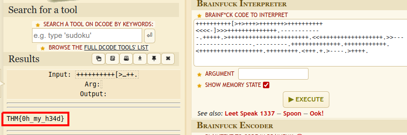<br>
**Answer:** THM{0h_my_h34d}

## Task 14 - An exclusive!
Did you crack it? Feed me now!<br>
Based on title, we will XOR two string with [link](https://xor.pw/#)<br>
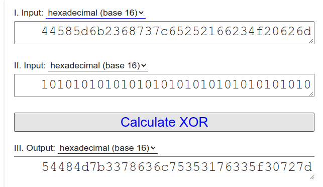<br>
Then convert hex to string, we get the flag.
```sh
$ echo 54484d7b3378636c75353176335f30727d | xxd -r -p
THM{3xclu51v3_0r}
```
**Answer:** THM{3xclu51v3_0r}

## Task 15 - Binary walk
Flag! Flag! Flag!
Use `binwalk` tool to check hidden file(s).<br>
```sh
$ binwalk hell.jpg 

DECIMAL       HEXADECIMAL     DESCRIPTION
--------------------------------------------------------------------------------
0             0x0             JPEG image data, JFIF standard 1.02
30            0x1E            TIFF image data, big-endian, offset of first image directory: 8
265845        0x40E75         Zip archive data, at least v2.0 to extract, uncompressed size: 69, name: hello_there.txt
266099        0x40F73         End of Zip archive, footer length: 22
```
We found a text file named hello_there.txt compressed in Zip, extract it.
```sh
$ binwalk -e hell.jpg 

DECIMAL       HEXADECIMAL     DESCRIPTION
--------------------------------------------------------------------------------
0             0x0             JPEG image data, JFIF standard 1.02
30            0x1E            TIFF image data, big-endian, offset of first image directory: 8
265845        0x40E75         Zip archive data, at least v2.0 to extract, uncompressed size: 69, name: hello_there.txt
266099        0x40F73         End of Zip archive, footer length: 22
```

```sh
$ unzip 40E75.zip 
Archive:  40E75.zip
replace hello_there.txt? [y]es, [n]o, [A]ll, [N]one, [r]ename: y
  inflating: hello_there.txt         

$ cat hello_there.txt 
Thank you for extracting me, you are the best!

THM{y0u_w4lk_m3_0u7}
```
**Answer:** THM{y0u_w4lk_m3_0u7}

## Task 16 - Darkness
What does the flag said?<br>
It only a black image, so I use stegsolve to view it.<br>
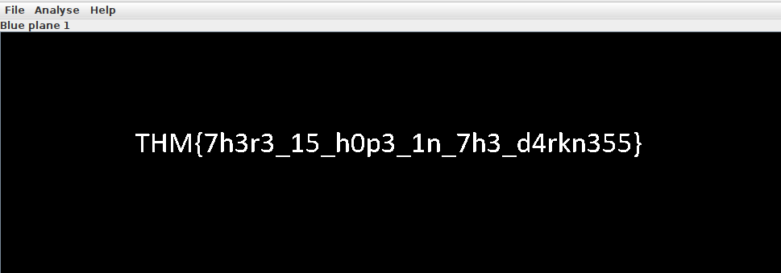<br>
**Answer:** THM{7h3r3_15_h0p3_1n_7h3_d4rkn355}

## Task 17 - A sounding QR
What does the bot said?
Use `zbarimg` to read QR.
```sh
$ zbarimg QRCTF.png 
QR-Code:https://soundcloud.com/user-86667759/thm-ctf-vol1
scanned 1 barcode symbols from 1 images in 0,02 seconds
```
Follow this link, they give a audio with voice flag, I download it and use [https://speech-to-text-demo.ng.bluemix.net/](https://speech-to-text-demo.ng.bluemix.net/) to extract text from it.
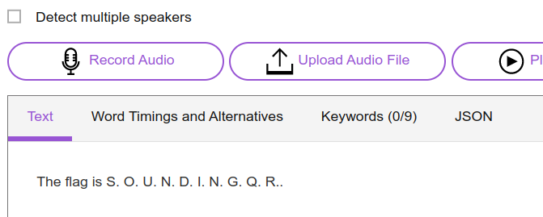<br>
**Answer:** THM{SOUNDINGQR}

## Task 18 - Dig up the past
Did you found my past?<br>
Use [Wayback Machine](https://archive.org/web/)<br>
Return to January 2, 2020<br>
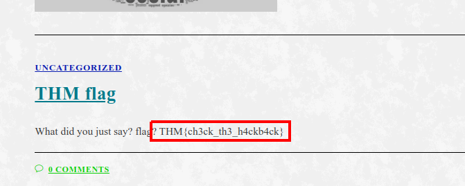<br>
**Answer:** THM{ch3ck_th3_h4ckb4ck}

## Task 19 - Uncrackable!
The deciphered text.<br>
This is Viegenere Cipher, use this [link](https://www.dcode.fr/vigenere-cipher)<br>
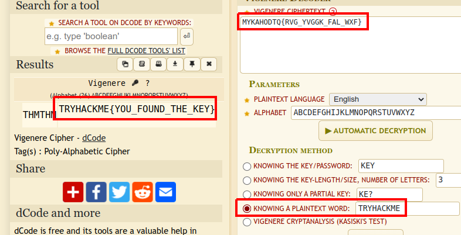<br>
**Answer:** TRYHACKME{YOU_FOUND_THE_KEY}

## Task 20 - Small bases
What is the flag?
Convert from decimal to hex, hex to ascii.<br>
```sh
$ echo "obase=16; 581695969015253365094191591547859387620042736036246486373595515576333693" | bc | xxd -r -p
THM{17_ju57_4n_0rd1n4ry_b4535}
```
**Answer:** THM{17_ju57_4n_0rd1n4ry_b4535}

## Task 21 - Read the packet
Did you captured my neighbor's flag?
In Wireshark, select File -> Export Objects -> HTTP, we found a file named flag.txt, extract it then cat the content.
```sh
cat flag.txt
THM{d0_n07_574lk_m3}

Found me!
```
**Answer:** THM{d0_n07_574lk_m3}
