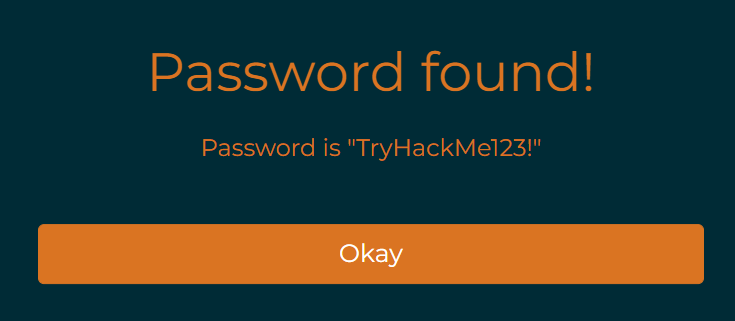

> # Common Attacks

# Summary
<!-- TOC -->

- [Summary](#summary)
    - [Task 2 - Common Attacks Social Engineering](#task-2---common-attacks-social-engineering)
    - [Task 3 - Common Attacks Social Engineering: Phishing](#task-3---common-attacks-social-engineering-phishing)
    - [Task 4 - Common Attacks Malware and Ransomware](#task-4---common-attacks-malware-and-ransomware)
    - [Task 5 - Common Attacks Passwords and Authentication](#task-5---common-attacks-passwords-and-authentication)
    - [Task 6 - Staying Safe Multi-Factor Authentication and Password Managers](#task-6---staying-safe-multi-factor-authentication-and-password-managers)
    - [Task 8 - Staying Safe Backups](#task-8---staying-safe-backups)

<!-- /TOC -->
## Task 2 - Common Attacks Social Engineering
1. What was the original target of Stuxnet? 
    >  that was originally used to target the Iran nuclear programme

    **Answer:** The Iran Nuclear Programme

## Task 3 - Common Attacks Social Engineering: Phishing
1. What is the flag? 
    **Answer:** THM{I_CAUGHT_ALL_THE_PHISH}

## Task 4 - Common Attacks Malware and Ransomware
1. [Research] What currency did the Wannacry attackers request payment in?
    Paste the question to Google search. 
     
    **Answer:** Bitcoin

## Task 5 - Common Attacks Passwords and Authentication
1. What is the password? 
     
    **Answer:** TryHackMe123!

## Task 6 - Staying Safe Multi-Factor Authentication and Password Managers
1. Where you have the option, which should you use as a second authentication factor between SMS based TOTPs or Authenticator App based TOTPs (SMS or App)? 
    App isn't tranfer data between client and server as SMS, just only QR code. 
    **Answer:** App

## Task 8 - Staying Safe Backups
1. What is the minimum number of up-to-date backups you should make? 
    > You should always keep at least three up-to-date copies of your data

    **Answer:** 3

1. Of these, how many (at minimum) should be stored in another location? 
    > One (or more) backups should be stored "off-site". 

    **Answer:** 1
