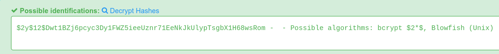
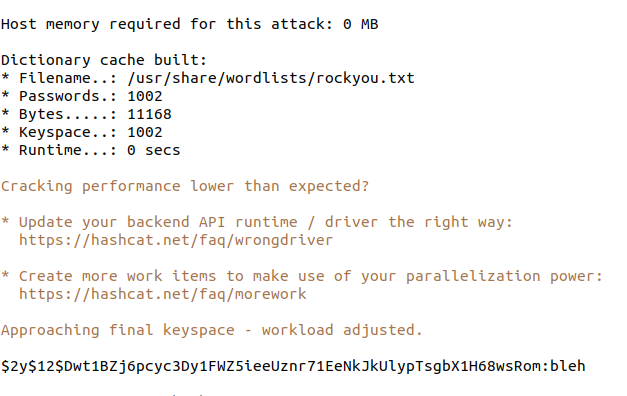
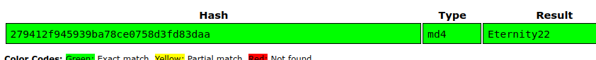
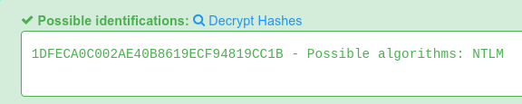
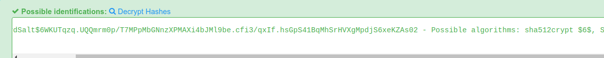
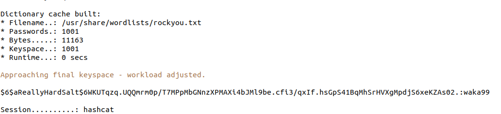
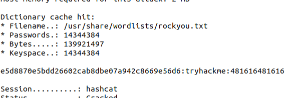

> # Crack the hash

# Summary
* [Summary](#summary)
   * [Task 1 - Level 1](#task-1---level-1)
   * [Task 2 - Level 2](#task-2---level-2)
   
## Task 1 - Level 1
1. 48bb6e862e54f2a795ffc4e541caed4d<br>
    This hash is MD5.<br>
    ```sh
    $ hashcat -m 0 48bb6e862e54f2a795ffc4e541caed4d /usr/share/wordlists/rockyou.txt
    48bb6e862e54f2a795ffc4e541caed4d:easy                     
    ```
    **Answer:** easy

1. CBFDAC6008F9CAB4083784CBD1874F76618D2A97<br>
    This hash is SHA1
    ```sh
    $ hashcat -m 100 CBFDAC6008F9CAB4083784CBD1874F76618D2A97 /usr/share/wordlists/rockyou.txt
    cbfdac6008f9cab4083784cbd1874f76618d2a97:password123      
    ```
    **Answer:** password123

1. 1C8BFE8F801D79745C4631D09FFF36C82AA37FC4CCE4FC946683D7B336B63032<br>
    This hash is SHA2-256.<br>
    ```sh
    $ hashcat -m 1400 1C8BFE8F801D79745C4631D09FFF36C82AA37FC4CCE4FC946683D7B336B63032 /usr/share/wordlists/rockyou.txt
    1c8bfe8f801d79745c4631d09fff36c82aa37fc4cce4fc946683d7b336b63032:letmein
    ```
    **Answer:** letmein

1. $2y$12$Dwt1BZj6pcyc3Dy1FWZ5ieeUznr71EeNkJkUlypTsgbX1H68wsRom<br>
    This hash is bcrypt $2$
    <br>
    ```sh
    $ hashcat --help | grep bcrypt
    3200 | bcrypt $2*$, Blowfish (Unix)                        | Operating System
    25600 | bcrypt(md5($pass)) / bcryptmd5                      | Forums, CMS, E-Commerce
    25800 | bcrypt(sha1($pass)) / bcryptsha1                    | Forums, CMS, E-Commerce
    ```

    ```sh
    $ hashcat -m 3200 hash /usr/share/wordlists/rockyou.txt -w 3 -S -O
    ```
    Based on your hardware, it took a while.<br>
    <br>
    **Answer:** bleh

1. 279412f945939ba78ce0758d3fd83daa<br>
    This hash is MD4.<br>
    ```sh
    $ hashcat -m 900 279412f945939ba78ce0758d3fd83daa /usr/share/wordlists/rockyou.txt
    ```
    Raw password of thish has does not exist in rockyou.txt, so I use an online tool is [https://crackstation.net/](https://crackstation.net/) to crack it.<br>
    <br>
    **Answer:** Eternity22

## Task 2 - Level 2
1. F09EDCB1FCEFC6DFB23DC3505A882655FF77375ED8AA2D1C13F640FCCC2D0C85<br>
    This hash is SHA256.<br>
    ```sh
    $ hashcat -m 1400 F09EDCB1FCEFC6DFB23DC3505A882655FF77375ED8AA2D1C13F640FCCC2D0C85 /usr/share/wordlists/rockyou.txt
    f09edcb1fcefc6dfb23dc3505a882655ff77375ed8aa2d1c13f640fccc2d0c85:paule
    ```
    **Answer:** paule

1. 1DFECA0C002AE40B8619ECF94819CC1B<br>
    This hash is NTLM.<br>
    <br>
    ```sh
    $ hashcat -m 1000 1DFECA0C002AE40B8619ECF94819CC1B /usr/share/wordlists/rockyou.txt
    1dfeca0c002ae40b8619ecf94819cc1b:n63umy8lkf4i
    ```
    **Answer:** n63umy8lkf4i

1. $6$aReallyHardSalt$6WKUTqzq.UQQmrm0p/T7MPpMbGNnzXPMAXi4bJMl9be.cfi3/qxIf.hsGpS41BqMhSrHVXgMpdjS6xeKZAs02<br>
    This hash is sha512crypt because it starts with `$6$`.<br>
    <br>
    ```sh
    $ hashcat -m 1800 hash /usr/share/wordlists/rockyou.txt
    ```
    <br>
    **Answer:** waka99

1. Hash: e5d8870e5bdd26602cab8dbe07a942c8669e56d6 Salt: tryhackme<br>
    Based on the hint of Tryhackme, this hash is HMAC-SHA1 with salt.<br>
    ```sh
    $ hashcat -h | grep HMAC
     50 | HMAC-MD5 (key = $pass)                              | Raw Hash authenticated
     60 | HMAC-MD5 (key = $salt)                              | Raw Hash authenticated
    150 | HMAC-SHA1 (key = $pass)                             | Raw Hash authenticated
    160 | HMAC-SHA1 (key = $salt)                             | Raw Hash authenticated
    ```
    So the -m argument for `hashcat` is 160. Put `hash:salt` info `hash` file.<br>
    ```sh
    $ hashcat -m 160 hash /usr/share/wordlists/rockyou.txt
    ```
    <br>
    **Answer:** 481616481616
