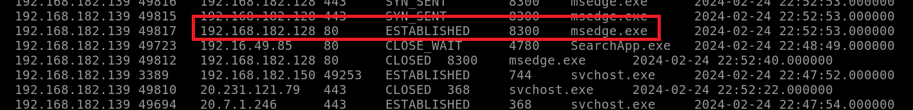
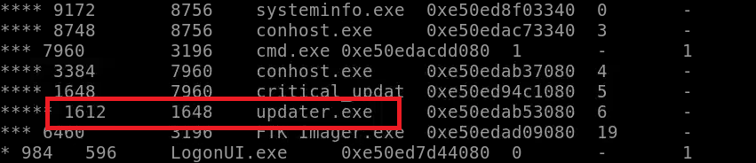
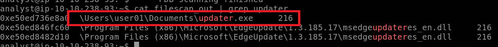
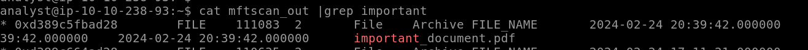
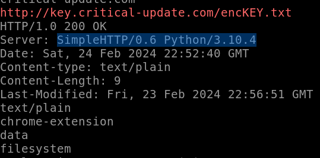

> # Critical

# Summary
- [Summary](#summary)
  - [Task 2 - Memory Forensics](#task-2---memory-forensics)
  - [Task 3 - Environment \& Setup](#task-3---environment--setup)
  - [Task 4 - Gathering Target Information](#task-4---gathering-target-information)
  - [Task 5 - Searching for Suspicious Activity](#task-5---searching-for-suspicious-activity)
  - [Task 6 - Finding Interesting Data](#task-6---finding-interesting-data)

##  Task 2 - Memory Forensics
1. What type of memory is analyzed during a forensic memory task?<br>
    > In cyber security, memory forensics is a subset of computer forensics that analyzes volatile memory, usually on a compromised machine; in Windows OS, it corresponds to the Random Access Memory (RAM)

    **Answer:** RAM

1. In which phase will you create a memory dump of the target system?<br>
    > During the memory acquisition phase, we'll copy the live memory to a file, commonly referred to as a dump, to perform the analysis without risking losing the data from an inadvertent reboot on the compromised system and have proof of the analysis inc as needed.

    **Answer:** Memory Acquisition

##  Task 3 - Environment & Setup
1. Which plugin can help us to get information about the OS running on the target machine?<br>
    > Windows.info: Show OS & kernel details of the memory sample being analyzed

    **Answer:** windows.info

1. Which tool referenced above can help us take a memory dump on a Linux OS?<br>
    **Answer:** LIME

1. Which command will display the help menu using Volatility on the target machine?<br>
    **Answer:** vol -h

##  Task 4 - Gathering Target Information
1. Is the architecture of the machine x64 (64bit) Y/N?<br>
    Run `vol -f memdump.mem windows.info` to gather information.<br>
    ```shell
    $ vol -f memdump.mem windows.info
    Volatility 3 Framework 2.5.2
    Progress:  100.00PDB scanning finished                        
    VariableValue

    Kernel Base0xf8066161b000
    DTB0x1ad000
    Symbolsfile:///home/analyst/volatility3-2.5.2/volatility3/symbols/windows/ntkrnlmp.pdb/4DBE144182FF4156845CD3BD8B654E56-1.json.xz
    Is64BitTrue
    IsPAEFalse
    layer_name0 WindowsIntel32e
    memory_layer1 FileLayer
    KdVersionBlock0xf8066222a400
    Major/Minor15.19041
    MachineType34404
    KeNumberProcessors2
    SystemTime2024-02-24 22:52:52
    NtSystemRootC:\Windows
    NtProductTypeNtProductWinNt
    NtMajorVersion10
    NtMinorVersion0
    PE MajorOperatingSystemVersion10
    PE MinorOperatingSystemVersion0
    PE Machine34404
    PE TimeDateStampSat Jan 13 03:45:32 2085
    ```
    **Answer:** Y

1. What is the Verison of the Windows OS<br>
    **Answer:** 10

1. What is the base address of the kernel?<br>
    **Answer:** 0xf8066161b000

##  Task 5 - Searching for Suspicious Activity
1. Using the plugin "windows.netscan" can you identify the IP address that establish a connection on port 80?<br>
    Run plugin `windows.netscan` to see which IP established connection on port 80.<br>
    <br>
    **AnsweR:** 192.168.182.128

1. Using the plugin "windows.netscan," can you identify the program (owner) used to access through port 80?<br>
    From the image above, the attacker use `msedge.exe` to connect to port 80.<br>
    **Answer:** msedge.exe

1. Analyzing the process present on the dump, what is the PID of the child process of critical_updat?<br>
    Run `windows.pstree` to see the result.<br>
    <br>
    **Answer:** 1612

1. What is the time stamp time for the process with the truncated name critical_updat?<br>
    The result is also in this line `critical_updt`.<br>
    **Answer:** 2024-02-24 22:51:50.000000

##  Task 6 - Finding Interesting Data
1. Analyzing the "windows.filescan" output, what is the full path and name for critical_updat?<br>
    Run `windows.filescan` then redirect all output to `filescan_out`.<br>
    <br>
    **Answer:** C:\Users\user01\Documents\updater.exe

1. Analyzing the "windows.mftscan.MFTScan" what is the Timestamp for the created date of important_document.pdf?<br>
    Run `windows.mftscan.MFTScan` then redirect all output to `mftscan_out`.<br>
    <br>
    **Answer:** 2024-02-24 20:39:42.000000

1. Analyzing the updater.exe memory output, can you observe the HTTP request and determine the server used by the attacker?<br>
    Run `-o . windows.memmap --dump --pid 1612` to dump memory of process 1612. Then follow the instuction to get the server response.<br>
    <br>
    **AnsweR:** SimpleHTTP/0.6 Python/3.10.4
