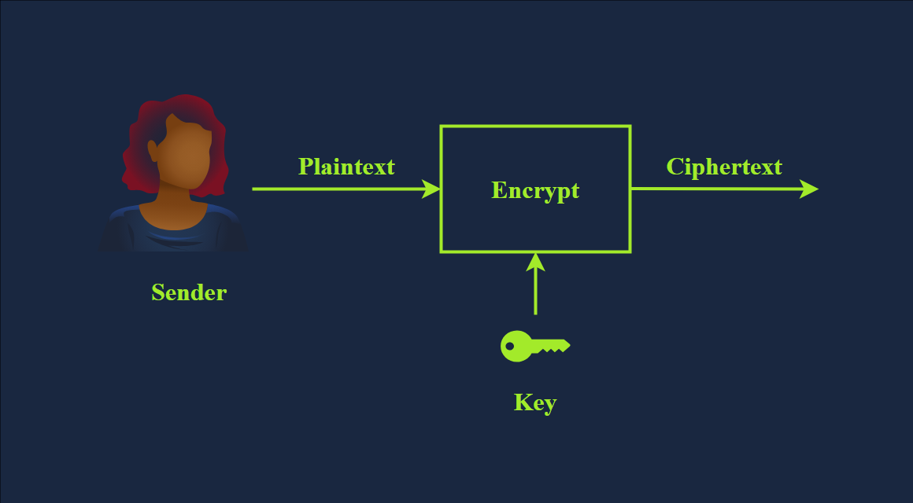
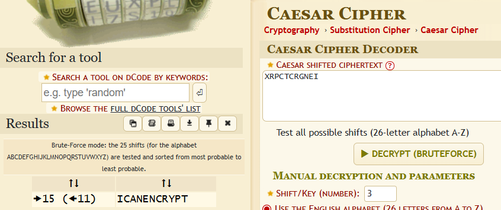

> # Cryptography Basics

## Summary
- [Summary](#summary)
  - [Task 2 - Importance of Cryptography](#task-2---importance-of-cryptography)
  - [Task 3 - Plaintext to Ciphertext](#task-3---plaintext-to-ciphertext)
  - [Task 4 - Historical Ciphers](#task-4---historical-ciphers)
  - [Task 5 - Types of Encryption](#task-5---types-of-encryption)
  - [Task 6 - Basic Math](#task-6---basic-math)

### Task 2 - Importance of Cryptography
1. What is the standard required for handling credit card information? 
    > When handling credit cards, the company must follow and enforce the Payment Card Industry Data Security Standard (PCI DSS)

    **Answer:** PCI DSS

### Task 3 - Plaintext to Ciphertext
1. What do you call the encrypted plaintext? 
     
    **Answer:** ciphertext

2. What do you call the process that returns the plaintext? 
    > Decryption is the reverse process of encryption, converting ciphertext back into plaintext using a cipher and a key. Although the cipher would be public knowledge, recovering the plaintext without knowledge of the key should be impossible (infeasible).

    **Answer:** decryption

### Task 4 - Historical Ciphers
1. Knowing that XRPCTCRGNEI was encrypted using Caesar Cipher, what is the original plaintext? 
    Use this [link](https://www.dcode.fr/caesar-cipher) to bruteforce all cases of caesar cipher. 
     
    **Answer:** ICANENCRYPT

### Task 5 - Types of Encryption
1. Should you trust DES? (Yea/Nay) 
    > DES was adopted as a standard in 1977 and uses a 56-bit key. With the advancement in computing power, in 1999, a DES key was successfully broken in less than 24 hours, motivating the shift to 3DES.
    
    **Answer:** Nay

1. When was AES adopted as an encryption standard? 
    > AES was adopted as a standard in 2001. Its key size can be 128, 192, or 256 bits.

    **Answer:** 2001

### Task 6 - Basic Math
1. What’s 1001 ⊕ 1010? 
    **Answer:** 0011

1. What’s 118613842%9091? 
    **Answer:** 3565

1. What’s 60%12? 
    **Answer:** 0
