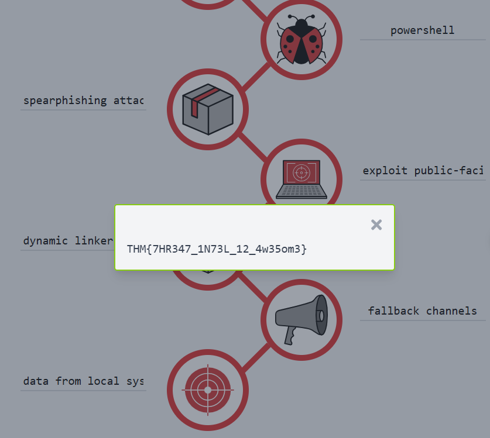

> # Cyber Kill Chain

## Summary
- [Summary](#summary)
  - [Task 2 - Reconnaissance](#task-2---reconnaissance)
  - [Task 3 - Weaponization](#task-3---weaponization)
  - [Task 4 - Delivery](#task-4---delivery)
  - [Task 5 - Exploitation](#task-5---exploitation)
  - [Task 6 - Installation](#task-6---installation)
  - [Task 7 - Command \& Control](#task-7---command--control)
  - [Task 8 - Actions on Objectives (Exfiltration)](#task-8---actions-on-objectives-exfiltration)
  - [Task 9 - Practice Analysis](#task-9---practice-analysis)

### Task 2 - Reconnaissance
1. What is the name of the Intel Gathering Tool that is a web-based interface to the common tools and resources for open-source intelligence? 
    > OSINT Framework - OSINT Framework provides the collection of OSINT tools based on various categories

    **Answer:** OSINT Framework

1. What is the definition for the email gathering process during the stage of reconnaissance? 
    > Email harvesting is the process of obtaining email addresses from public, paid, or free services. 

    **Answer:** Email harvesting

### Task 3 - Weaponization
1. This term is referred to as a group of commands that perform a specific task. You can think of them as subroutines or functions that contain the code that most users use to automate routine tasks. But malicious actors tend to use them for malicious purposes and include them in Microsoft Office documents. Can you provide the term for it?  
    > Create an infected Microsoft Office document containing a malicious macro or VBA (Visual Basic for Applications) scripts. If you want to learn about macro and VBA, please refer to the article "Intro to Macros and VBA For Script Kiddies" by TrustedSec.

    **Answer:** Marco

### Task 4 - Delivery
1. What is the name of the attack when it is performed against a specific group of people, and the attacker seeks to infect the website that the mentioned group of people is constantly visiting. 
    > Watering hole attack. A watering hole attack is a targeted attack designed to aim at a specific group of people by compromising the website they are usually visiting and then redirecting them to the malicious website of an attacker's choice.

    **Answer:** Watering hole attack

### Task 5 - Exploitation
1. Can you provide the name for a cyberattack targeting a software vulnerability that is unknown to the antivirus or software vendors? 
    **Answer:** zero-day

### Task 6 - Installation
1. Can you provide the technique used to modify file time attributes to hide new or changes to existing files? 
    > the attacker can also use the Timestomping technique to avoid detection by the forensic investigator and also to make the malware appear as a part of a legitimate program.

   **Answer:** Timestomping

1. Can you name the malicious script planted by an attacker on the webserver to maintain access to the compromised system and enables the webserver to be accessed remotely? 
    > Installing a web shell on the webserver. A web shell is a malicious script written in web development programming languages such as ASP, PHP, or JSP used by an attacker to maintain access to the compromised system.

    **Answer:** web shell

### Task 7 - Command & Control
1. What is the C2 communication where the victim makes regular DNS requests to a DNS server and domain which belong to an attacker.  
    > DNS (Domain Name Server). The infected machine makes constant DNS requests to the DNS server that belongs to an attacker, this type of C2 communication is also known as DNS Tunneling.

    **Answer:** DNS Tunneling.

### Task 8 - Actions on Objectives (Exfiltration)
1. Can you provide a technology included in Microsoft Windows that can create backup copies or snapshots of files or volumes on the computer, even when they are in use?  
    **Answer:** Shadow Copy

### Task 9 - Practice Analysis
1. What is the flag after you complete the static site? 
     
    **Answer:** THM{7HR347_1N73L_12_4w35om3}
