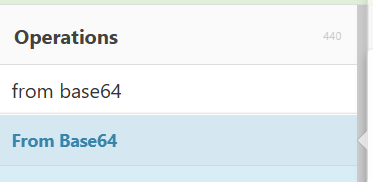
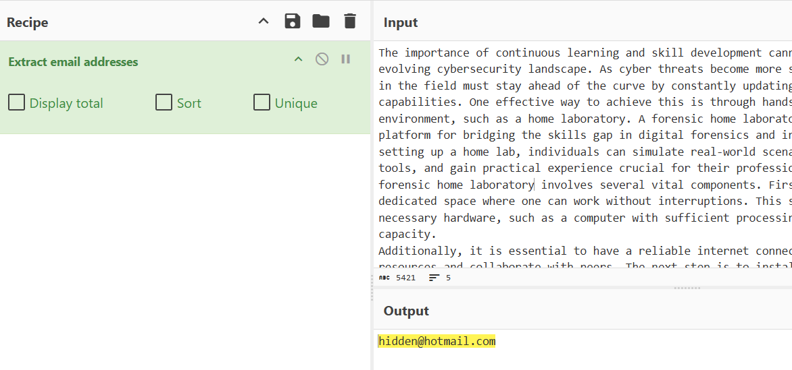
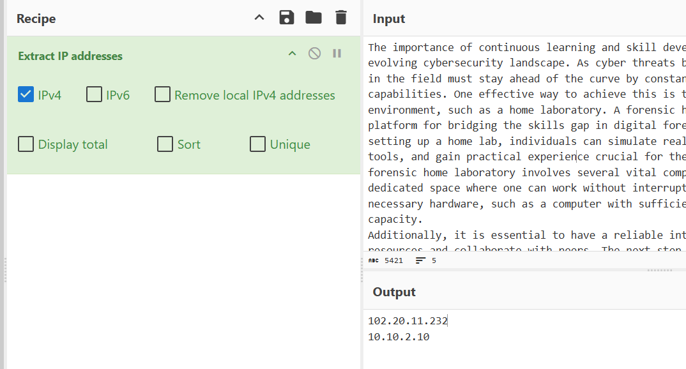
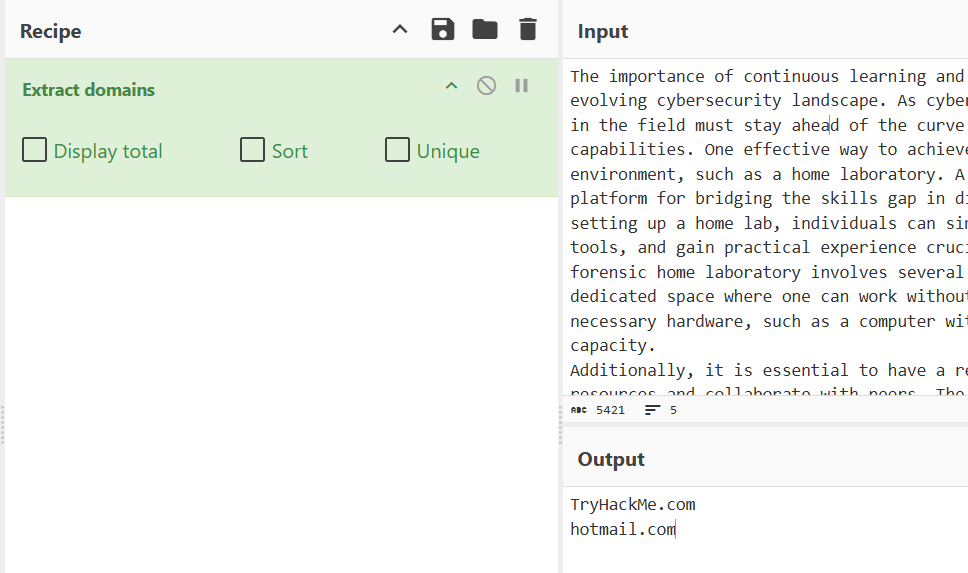
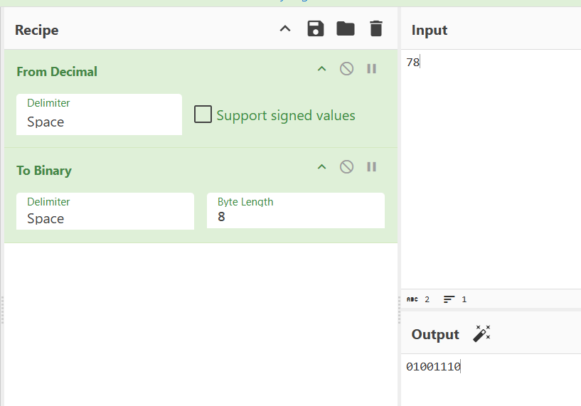
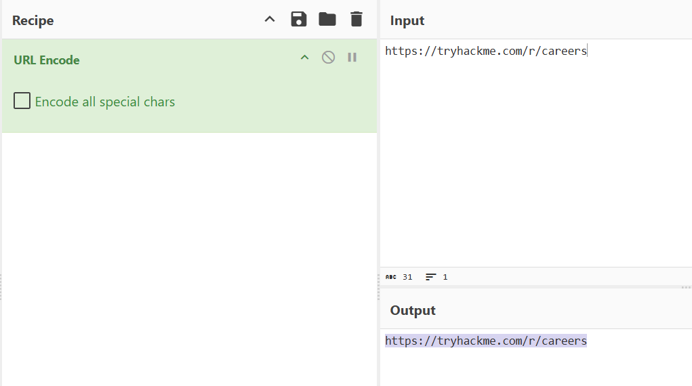
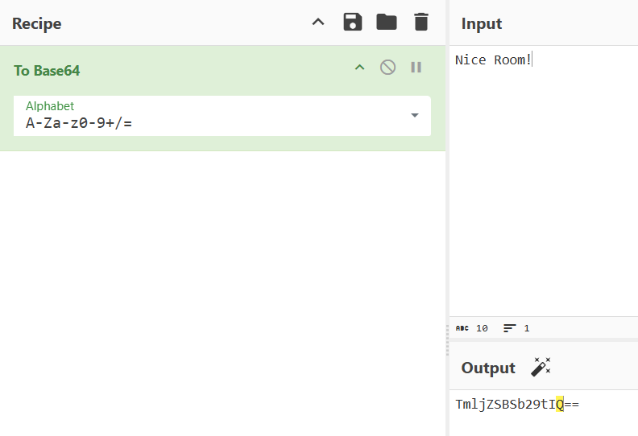
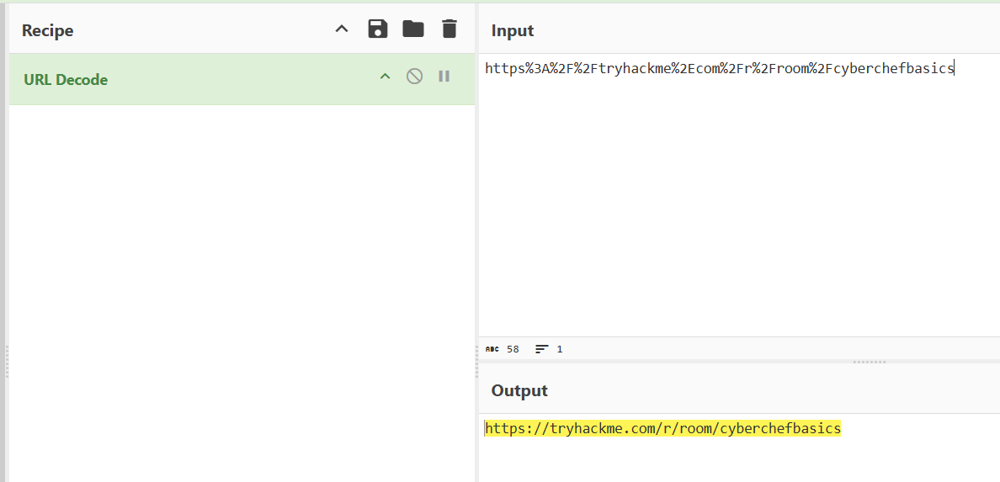

> # CyberChef: The Basics

## Summary
- [Summary](#summary)
  - [Task 3 - Navigating the Interface](#task-3---navigating-the-interface)
  - [Task 4 - Before Anything Else](#task-4---before-anything-else)
  - [Task 5 - Practice, Practice, Practice](#task-5---practice-practice-practice)
  - [Task 6 - Your First Official Cook](#task-6---your-first-official-cook)

### Task 3 - Navigating the Interface
1. In which area can you find "From Base64"? 
     

    **Answer:** Operations

1. Which area is considered the heart of the tool? 
    > The Recipe Area This is considered as the heart of the tool.

    **Answer:** Recipe

### Task 4 - Before Anything Else
1. At which step would you determine, "What do I want to accomplish? 
    > Setting a clear objective is essential. This step involves defining specific and achievable goals. It helps answer the question, "What do I want to accomplish?".

    **Answer:** 1

### Task 5 - Practice, Practice, Practice
1. What is the hidden email address? 
    Use `Extract email address` in `CyberChef`. 
     
    **Answer:** hidden@hotmail.com

1. What is the hidden IP address that ends in .232? 
    Use `Extract IP Address`. 
     
    **Answer:** 102.20.11.232

1. Which domain address starts with the letter "T"? 
    Use `Extract domains`. 
     
    **Answer:** TryHackMe.com

1. What is the binary value of the decimal number 78? 
    Use combine `From Decimal` and `To Binary`. 
     
    **Answer:** 01001110

1. What is the URL encoded value of https://tryhackme.com/r/careers? 
    Use `URL Encode`. 
     
    **Answer:** https://tryhackme.com/r/careers

### Task 6 - Your First Official Cook
1. Using the file you downloaded in Task 5, which IP starts and ends with "10"? 
    **Answer:** 10.10.2.10

1. What is the base64 encoded value of the string "Nice Room!"? 
    Use `To Base64`. 
     
    **Answer:** TmljZSBSb29tIQ==

1. What is the URL decoded value for https%3A%2F%2Ftryhackme%2Ecom%2Fr%2Froom%2Fcyberchefbasics? 
    Use `URL Decode`. 
     
    **Answer:** https://tryhackme.com/r/room/cyberchefbasics

1. What is the datetime string for the Unix timestamp 1725151258? 
    Use `From UNIX Timestamp`. 
    **Answer:** Sun 1 September 2024 00:40:58 UTC

1.  What is the Base85 decoded string of the value <+oue+DGm>Ap%u7? 
    Use `From Base85`. 
    **Answer:** This is fun!
