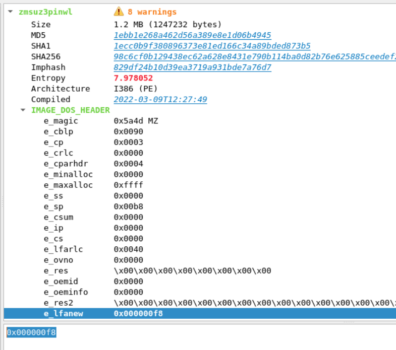
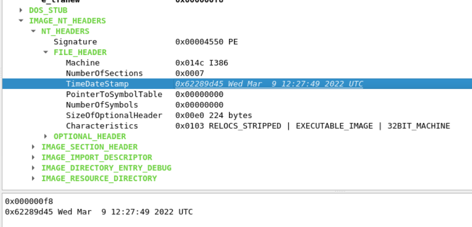
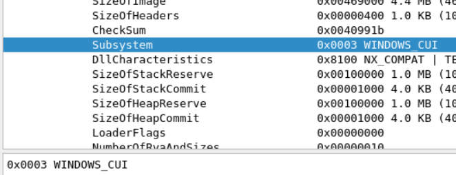
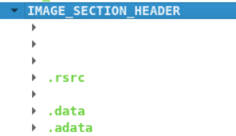
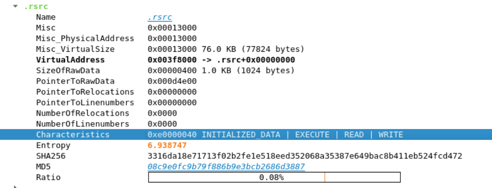
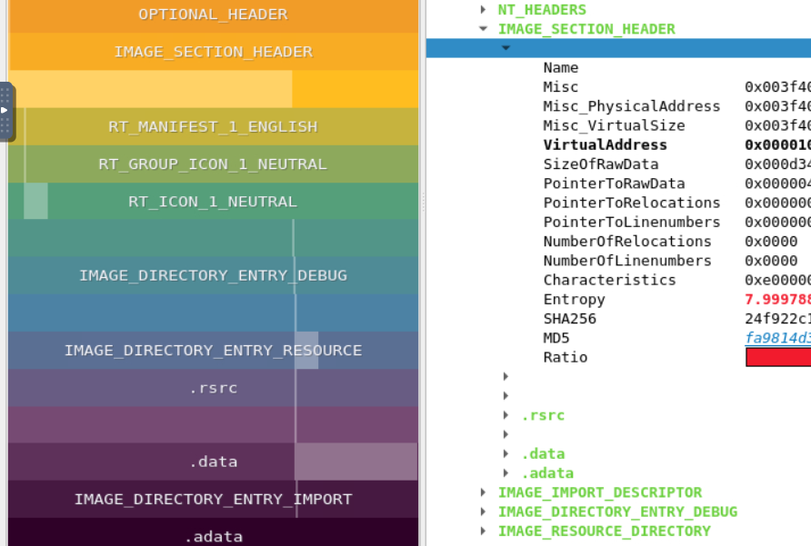

> # Dissecting PE Headers

# Summary
<!-- TOC -->

- [Summary](#summary)
    - [Task 2 - Overview of PE headers](#task-2---overview-of-pe-headers)
    - [Task 3 - IMAGEDOSHEADER and DOSSTUB](#task-3---imagedosheader-and-dosstub)
    - [Task 4 - IMAGENTHEADERS](#task-4---imagentheaders)
    - [Task 5 - OPTIONALHEADER](#task-5---optionalheader)
    - [Task 6 - IMAGESECTIONHEADER](#task-6---imagesectionheader)
    - [Task 7 - IMAGEIMPORTDESCRIPTOR](#task-7---imageimportdescriptor)
    - [Task 8 - Packing and Identifying packed executables](#task-8---packing-and-identifying-packed-executables)

<!-- /TOC -->

## Task 2 - Overview of PE headers
1. What data type are the PE headers?
    > All of these headers are of the data type STRUCT. A struct is a user-defined data type that combines several different types of data elements in a single variable.

    **Answer:** struct

## Task 3 - IMAGE_DOS_HEADER and DOS_STUB
1. How many bytes are present in the IMAGE_DOS_HEADER? 
    > The IMAGE_DOS_HEADER consists of the first 64 bytes of the PE file.

    **Answer:** 64

1. What does MZ stand for? 
    > The MZ characters denote the initials of Mark Zbikowski, one of the Microsoft architects who created the MS-DOS file format. 
    
    **Answer:** Mark Zbikowski

1. In what variable of the IMAGE_DOS_HEADER is the address of IMAGE_NT_HEADERS saved? 
    > The last value in the IMAGE_DOS_HEADER is called e_lfanew. In the above screenshot, it has a value of 0x000000d8. This denotes the address from where the IMAGE_NT_HEADERS start.

    **Answer:** e_lfanew

1. In the attached VM, open the PE file Desktop/Samples/zmsuz3pinwl in pe-tree. What is the address of IMAGE_NT_HEADERS for this PE file? 
    Open `zmsuz3pinwl` in `pe-tree`. 
     
    **Answer:** 0x000000f8

## Task 4 - IMAGE_NT_HEADERS
1. In the attached VM, there is a file Desktop\Samples\zmsuz3pinwl. Open this file in pe-tree. Is this PE file compiled for a 32-bit machine or a 64-bit machine? 
    From the image above. this file has architecture `I386`. 
    **Answer:** 32-bit machine

1. What is the TimeDateStamp of this file? 
    View in `IMAGE_NT_HEADERS`. 
     
    **Answer:** 0x62289d45 Wed Mar  9 12:27:49 2022 UTC

## Task 5 - OPTIONAL_HEADER
1. Which variable from the OPTIONAL_HEADER indicates whether the file is a 32-bit or a 64-bit application? 
    > Magic: The Magic number tells whether the PE file is a 32-bit or 64-bit application. If the value is 0x010B, it denotes a 32-bit application; if the value is 0x020B, it represents a 64-bit application.

    **Answer:** magic

1. What Magic value indicates that the file is a 64-bit application? 
    **Answer:** 0x020B

1. What is the subsystem of the file Desktop\Samples\zmsuz3pinwl? 
     
    **Answer:** 0x0003 WINDOWS_CUI

## Task 6 - IMAGE_SECTION_HEADER
1. How many sections does the file Desktop\Samples\zmsuz3pinwl have? 
     
    **Answer:** 7

1. What are the characteristics of the .rsrc section of the file Desktop\Samples\zmsuz3pinwl 
     
    **Answer:** 0xe0000040 INITIALIZED_DATA | EXECUTE | READ | WRITE

## Task 7 - IMAGE_IMPORT_DESCRIPTOR
1. The PE file Desktop\Samples\redline imports the function CreateWindowExW. From which dll file does it import this function? 
    > This API is located in User32.dll. 
    When view in `pe-tree`, you will this API in User32.dll. 
    **Answer:** User32.dll

## Task 8 - Packing and Identifying packed executables
1. Which of the files in the attached VM in the directory Desktop\Samples seems to be a packed executable? 
    In `zmsuz3pinwl` IMAGE_SECTION_HEADER, there are some Unconventional section names. 
     
    **Answer:** zmsuz3pinwl
