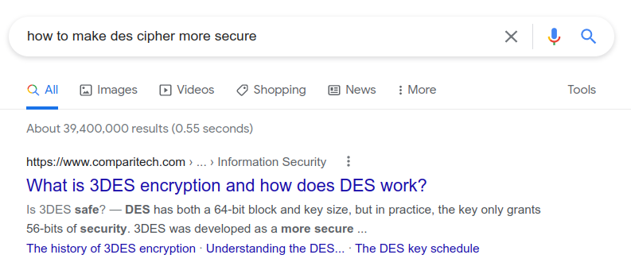
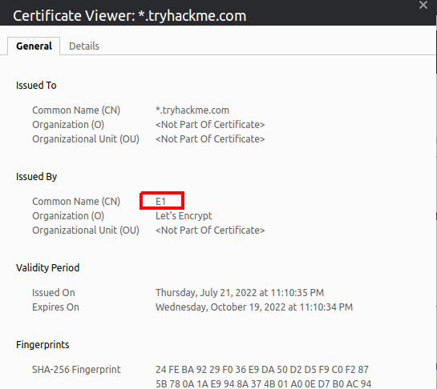
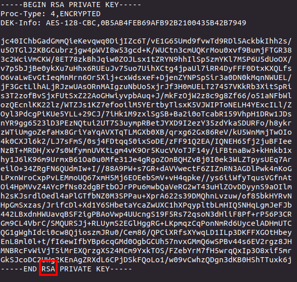
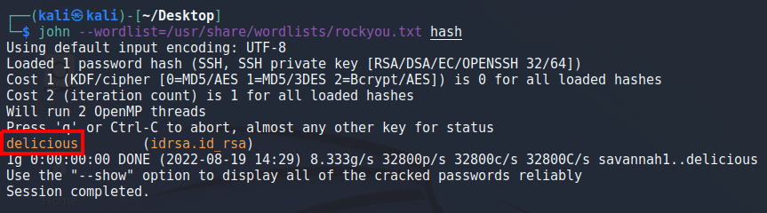
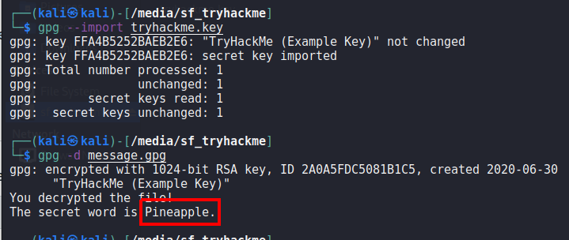

> # Encryption - Crypto 101 - Tryhackme

# Summary
* [Task 2 - Key terms](#task-2---key-terms)
* [Task 3 - Why is Encryption important?](#task-3---why-is-encryption-important)
* [Task 4 - Crucial Crypto Maths](#task-4---crucial-crypto-maths)
* [Task 5 - Types of Encryption](#task-5---types-of-encryption)
* [Task 6 - RSA - Rivest Shamir Adleman](#task-6---rsa---rivest-shamir-adleman)
* [Task 7 - Establishing Keys Using Asymmetric Cryptography](#task-7---establishing-keys-using-asymmetric-cryptography)
* [Task 8 - Digital signatures and Certificates](#task-8---digital-signatures-and-certificates)
* [Task 9 - SSH Authentication](#task-9---ssh-authentication)
* [Task 10 - Explaining Diffie Hellman Key Exchange](#task-10---explaining-diffie-hellman-key-exchange)
* [Task 11 - PGP, GPG and AES](#task-11---pgp-gpg-and-aes)

## Task 2 - Key terms
1. Are SSH keys protected with a passphrase or a password?<br>
    From documentation of Microsoft [link](https://docs.microsoft.com/en-us/azure/devops/repos/git/gcm-ssh-passphrase?view=azure-devops).<br>
    > SSH passphrases protect your private key from being used by someone who doesn't know the passphrase.

    **Answer:** Passphrase

## Task 3 - Why is Encryption important?
1. What does SSH stand for?<br>
    **Answer:** Secure Shell

1. How do webservers prove their identity?<br>
    > When you connect to your bank, there’s a certificate that uses cryptography to prove that it is actually your bank rather than a hacker.

    **Answer:** certificate

1. What is the main set of standards you need to comply with if you store or process payment card details?<br>
    >  Standards like PCI-DSS state that the data should be encrypted both at rest (in storage) AND while being transmitted. 

    **Answer:** PCI-DSS

## Task 4 - Crucial Crypto Maths
1. What's 30 % 5?<br>
    **Answer:** 0

1. What's 25 % 7<br>
    **Answer:** 4

1. What's 118613842 % 9091<br>
    ```
    $ python -c 'print (118613842 % 9091)'
    3565
    ```
    **Answer:** 3565

## Task 5 - Types of Encryption
1. Should you trust DES? Yea/Nay<br>
    > Examples of Symmetric encryption are DES (Broken)

    **Answer:** Nay

1. What was the result of the attempt to make DES more secure so that it could be used for longer?<br>
    <br>
    **Answer:** Tripple DES

1. Is it ok to share your public key? Yea/Nay<br>
    **Answer:** Yea

## Task 6 - RSA - Rivest Shamir Adleman
1. p = 4391, q = 6659. What is n?<br>
    ```
    $ python -c 'print (4391 * 6659)'
    29239669
    ```
    **Answer:** 29239669

## Task 7 - Establishing Keys Using Asymmetric Cryptography
No answer needed.

## Task 8 - Digital signatures and Certificates
1. Who is TryHackMe's HTTPS certificate issued by?<br>
    View certificate of tryhackme on brwoser.<br>
    <br>
    **Answer:** E1

## Task 9 - SSH Authentication
1. What algorithm does the key use?<br>
    Read attached file, you will see the name of algorithm the use.<br>
    <br>
    **Answer:** RSA

1. Crack the password with John The Ripper and rockyou, what's the passphrase for the key?<br>
    Use built-in tool `john` in Kali crack this private key.<br>
    <br>
    **Answer:** delicious

## Task 10 - Explaining Diffie Hellman Key Exchange
No answer needed.

## Task 11 - PGP, GPG and AES
1. You have the private key, and a file encrypted with the public key. Decrypt the file. What's the secret word?<br>
    Import `tryhackme.key` to `gpg`, then use `gpg` to decrypt `message.gpg`.<br>
    <br>
    **Answer:** Pineapple

