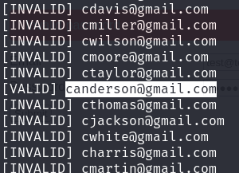
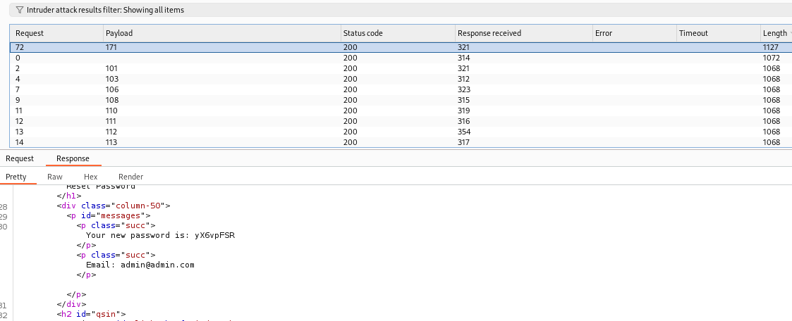
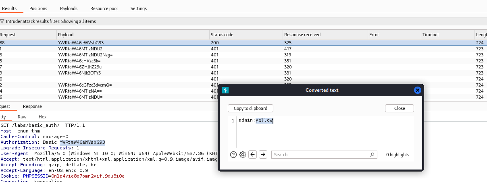

> # Enumeration & Brute Force

# Summary
- [Summary](#summary)
  - [Task 2 - Authentication Enumeration](#task-2---authentication-enumeration)
  - [Task 3 - Enumerating Users via Verbose Errors](#task-3---enumerating-users-via-verbose-errors)
  - [Task 4 - Exploiting Vulnerable Password Reset Logic](#task-4---exploiting-vulnerable-password-reset-logic)
  - [Task 5 - Exploiting HTTP Basic Authentication](#task-5---exploiting-http-basic-authentication)

##  Task 2 - Authentication Enumeration
1. What type of error messages can unintentionally provide attackers with confirmation of valid usernames? 
    > Verbose error messages during login attempts or other interactive processes can reveal too much. When these messages differentiate between "username not found" and "incorrect password," they're intended to help users understand their login issues. However, they also provide attackers with definitive clues about valid usernames, which can be exploited for more targeted attacks.

    **Answer:** Verbose Errors

##  Task 3 - Enumerating Users via Verbose Errors
1. What is the valid email address from the list? 
    Run the given python script to find which email is valid. 
     
    **Answer:** canderson@gmail.com

##  Task 4 - Exploiting Vulnerable Password Reset Logic
1. What is the flag? 
    Follow the instruction, we will bruteforce the OTP was sent to admin's email using `Intruder` in `Burpsuite`. 
     
    **Answer:** THM{50_pr3d1ct4BL333!!}

##  Task 5 - Exploiting HTTP Basic Authentication
1. What is the flag? 
    Follow instruction in document, the admin's password is `yellow`. 
     
    **Answer:** THM{b4$$1C_AuTTHHH}
