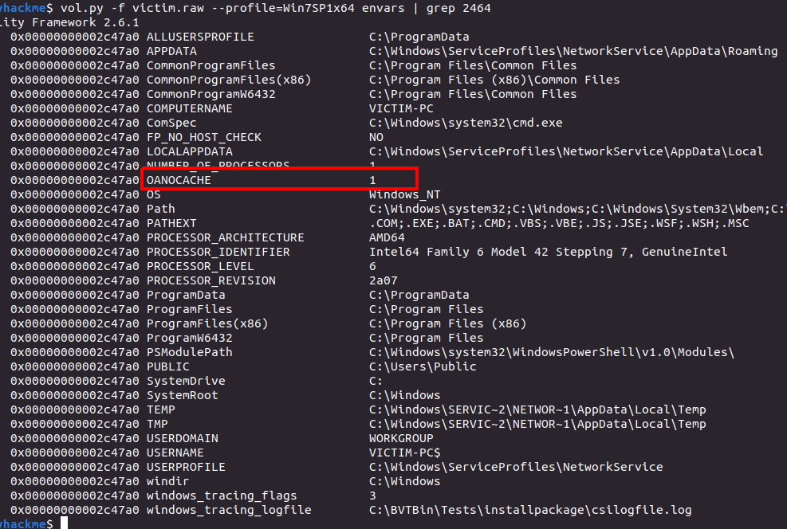

> # Forensics - Tryhackme

# Summary

## Task 1 - Volatility forensics
1. What is the Operating System of this Dump file? (OS name)<br>
    Use `volatility` for finding OS name.<br>
    ```
    $ vol.py -f victim.raw imageinfo
    Volatility Foundation Volatility Framework 2.6.1
    INFO    : volatility.debug    : Determining profile based on KDBG search...
            Suggested Profile(s) : Win7SP1x64, Win7SP0x64, Win2008R2SP0x64, Win2008R2SP1x64_24000, Win2008R2SP1x64_23418, Win2008R2SP1x64, Win7SP1x64_24000, Win7SP1x64_23418
                        AS Layer1 : WindowsAMD64PagedMemory (Kernel AS)
                        AS Layer2 : FileAddressSpace (/home/ubuntu/Downloads/tryhackme/victim.raw)
                        PAE type : No PAE
                            DTB : 0x187000L
                            KDBG : 0xf800028420a0L
            Number of Processors : 1
        Image Type (Service Pack) : 1
                    KPCR for CPU 0 : 0xfffff80002843d00L
                KUSER_SHARED_DATA : 0xfffff78000000000L
            Image date and time : 2019-05-02 18:11:45 UTC+0000
        Image local date and time : 2019-05-02 11:11:45 -0700
    ```
    **Answer:** Windows

1. What is the PID of SearchIndexer?
    Use `pslist` plugin.<br>
    ```
    $ vol.py -f victim.raw --profile=Win7SP1x64 pslist | grep SearchIndexer
    Volatility Foundation Volatility Framework 2.6.1
    0xfffffa8003367060 SearchIndexer.         2180    504     11      629      0      0 2019-05-02 18:03:32 UTC+0000                              
    ```
    **Answer:** 2180

1. What is the last directory accessed by the user?<br>
    Use `shellbags` plugin, Analysis of Shellbags is extremely useful method of determining what file or folder actions have been taken on a host by a specific user.<br>
    ```
    $ vol.py -f victim.raw --profile=Win7SP1x64 shellbags | grep "Access Date" -A 2 | grep 2019
    Volatility Foundation Volatility Framework 2.6.1
    ItemPos1366x664x96(1)     Firefox.lnk    2019-04-11 13:29:10 UTC+0000   2019-04-11 13:29:10 UTC+0000   2019-04-11 13:29:10 UTC+0000   ARC                       Firefox.lnk 
    5       3     LIFEVI~1       2019-04-13 07:46:48 UTC+0000   2019-04-13 07:46:36 UTC+0000   2019-04-13 07:46:48 UTC+0000   DIR                       Life Virus Samples
    1       3     13APRI~1       2019-04-13 07:47:06 UTC+0000   2019-04-13 07:47:06 UTC+0000   2019-04-13 07:47:06 UTC+0000   DIR                       Life Virus Samples\13 April
    0       0     logs           2019-04-27 10:38:22 UTC+0000   2019-04-27 10:38:22 UTC+0000   2019-04-27 10:38:22 UTC+0000   NI, DIR                   Z:\logs
    1       2     NEWFOL~1       2019-04-18 01:16:50 UTC+0000   2019-04-18 01:16:50 UTC+0000   2019-04-18 01:16:50 UTC+0000   DIR                       Life Virus Samples\18 April\New folder
    0       0     VIRUSS~1       2019-04-23 06:14:56 UTC+0000   2019-04-23 06:14:56 UTC+0000   2019-04-23 06:14:56 UTC+0000   DIR                       Life Virus Samples\DOC\VirusShare_edc7428ec4d6b18e2620aee95347b4fa
    0       0     CAPTUR~1       2019-04-13 05:57:48 UTC+0000   2019-04-13 05:57:44 UTC+0000   2019-04-13 05:57:48 UTC+0000   DIR                       CaptureBAT-Setup-2.0.0-5574-src\capture-client
    1       0     COMPRE~1       2019-04-13 07:28:12 UTC+0000   2019-04-13 07:28:10 UTC+0000   2019-04-13 07:28:12 UTC+0000   DIR                       Malware analysis\Compressed
    0       0     VIRUSS~1       2019-04-23 06:16:06 UTC+0000   2019-04-23 06:16:06 UTC+0000   2019-04-23 06:16:06 UTC+0000   DIR                       OfficeMalScanner\VirusShare_edc7428ec4d6b18e2620aee95347b4fa
    0       0     victim         2019-04-10 15:59:34 UTC+0000   2019-04-10 15:58:54 UTC+0000   2019-04-10 15:59:34 UTC+0000   DIR                       C:\Users\victim
    0       0     Capture        2019-04-27 10:36:06 UTC+0000   2019-04-18 00:49:00 UTC+0000   2019-04-27 10:36:06 UTC+0000   DIR                       C:\Program Files (x86)\Capture
    0       0     deleted_files  2019-04-27 10:30:26 UTC+0000   2019-04-27 10:38:24 UTC+0000   2019-04-27 10:38:24 UTC+0000   NI, DIR                   Z:\logs\deleted_files
    1       0     NEWFOL~1       2019-04-23 06:14:26 UTC+0000   2019-04-23 06:14:26 UTC+0000   2019-04-23 06:14:26 UTC+0000   DIR                       Life Virus Samples\18 April\Emotet\New folder
    1       0     SETUPS~1       2019-04-13 05:57:48 UTC+0000   2019-04-13 05:57:48 UTC+0000   2019-04-13 05:57:48 UTC+0000   DIR                       CaptureBAT-Setup-2.0.0-5574-src\capture-client\SetupScript
    0       0     DEPEND~1       2019-04-13 07:28:12 UTC+0000   2019-04-13 07:28:12 UTC+0000   2019-04-13 07:28:12 UTC+0000   DIR                       Malware analysis\Compressed\depends22_x86
    1       3     VBE            2019-04-23 07:26:08 UTC+0000   2019-04-23 07:26:08 UTC+0000   2019-04-23 07:26:08 UTC+0000   NI, DIR                   Local\Temp\VBE
    1       1     AppData        2019-04-10 15:59:04 UTC+0000   2019-04-10 15:59:04 UTC+0000   2019-04-10 15:59:04 UTC+0000   HID, NI, DIR              C:\Users\victim\AppData
    0       0     CAPTUR~2.ZIP   2019-04-27 10:36:06 UTC+0000   2019-04-27 10:36:06 UTC+0000   2019-04-27 10:36:06 UTC+0000   ARC                       C:\Program Files (x86)\Capture\capture_2742019_336.zip
    1       0     MICROS~1       2019-04-23 06:41:02 UTC+0000   2019-04-23 06:41:02 UTC+0000   2019-04-23 06:41:02 UTC+0000   DIR                       C:\Users\victim\Downloads\Microsoft Office Enterprise 2010 Corporate Final (full activated)
    1       0     Local          2019-04-13 05:59:52 UTC+0000   2019-04-10 15:59:04 UTC+0000   2019-04-13 05:59:52 UTC+0000   NI, DIR                   C:\Users\victim\AppData\Local
    0       0     MICROS~1       2019-04-23 06:44:46 UTC+0000   2019-04-23 06:41:02 UTC+0000   2019-04-23 06:44:46 UTC+0000   DIR                       C:\Users\victim\Downloads\Microsoft Office Enterprise 2010 Corporate Final (full activated)\Microsoft Office Enterprise 2010 Corporate Final (full activated)
    0       0     MICROS~1       2019-04-11 13:29:10 UTC+0000   2019-04-10 15:59:04 UTC+0000   2019-04-11 13:29:10 UTC+0000   SYS, NI, DIR              C:\Users\victim\AppData\Roaming\Microsoft
    0       0     Temp           2019-04-23 05:21:58 UTC+0000   2019-04-10 15:59:04 UTC+0000   2019-04-23 05:21:58 UTC+0000   NI, DIR                   C:\Users\victim\AppData\Local\Temp
    0       0     Mozilla        2019-04-23 07:08:44 UTC+0000   2019-04-11 13:29:20 UTC+0000   2019-04-23 07:08:44 UTC+0000   NI, DIR                   C:\Users\victim\AppData\LocalLow\Mozilla
    0       0     Windows        2019-04-10 15:59:34 UTC+0000   2019-04-10 15:59:04 UTC+0000   2019-04-10 15:59:34 UTC+0000   NI, DIR                   C:\Users\victim\AppData\Roaming\Microsoft\Windows
    0       0     STARTM~1       2019-04-10 16:01:04 UTC+0000   2019-04-10 15:59:04 UTC+0000   2019-04-10 15:59:34 UTC+0000   RO, DIR                   C:\Users\victim\AppData\Roaming\Microsoft\Windows\Start Menu
    ```
    The latest accessed folder is at `2019-04-27 10:38:24 UTC+0000` 
    **Answer:** deleted_files

## Task 2 - Task2
1. There are many suspicious open ports; which one is it? (ANSWER format: protocol:port)<br>
    Use `malfind` plugin to detect code injection. We find 5 porcesses.<br>
    ```
    $ vol.py -f victim.raw --profile=Win7SP1x64 malfind | grep ".exe"
    Volatility Foundation Volatility Framework 2.6.1
    Process: explorer.exe Pid: 1860 Address: 0x3ee0000
    Process: explorer.exe Pid: 1860 Address: 0x3f90000
    Process: svchost.exe Pid: 1820 Address: 0x24f0000
    Process: svchost.exe Pid: 1820 Address: 0x4d90000
    Process: wmpnetwk.exe Pid: 2464 Address: 0x280000
    ```
    Use `netscan` to find suspicious protocol:port correlation with malicious process above.<br>
    ```
    $ vol.py -f victim.raw --profile=Win7SP1x64 netscan
    Volatility Foundation Volatility Framework 2.6.1
    Offset(P)          Proto    Local Address                  Foreign Address      State            Pid      Owner          Created
    0x5c201ca0         UDPv4    0.0.0.0:5005                   *:*                                   2464     wmpnetwk.exe   2019-05-02 18:05:14 UTC+0000
    0x5c201ca0         UDPv6    :::5005                        *:*                                   2464     wmpnetwk.exe   2019-05-02 18:05:14 UTC+0000
    0x5c49cbb0         UDPv4    0.0.0.0:59471                  *:*                                   1368     svchost.exe    2019-05-02 18:03:06 UTC+0000
    0x5c4a31c0         UDPv4    0.0.0.0:59472                  *:*                                   1368     svchost.exe    2019-05-02 18:03:06 UTC+0000
    0x5c4a31c0         UDPv6    :::59472                       *:*                                   1368     svchost.exe    2019-05-02 18:03:06 UTC+0000
    ```
    We see `wmpnetwk.exe` has the same pid when using `malfind` to find malicious process.<br>
    **Answer:** UDP:5005

1. Vads tag and execute protection are strong indicators of malicious processes; can you find which they are? (ANSWER format: Pid1;Pid2;Pid3) <br>
    From above question, we have already known three PID of malicious processes.<br>
    To view Vads tag and Protection, use `vadinfo` then grep with PIDs above.<br>
    ```
    $ vol.py -f victim.raw --profile=Win7SP1x64 vadinfo | grep -w '1860\|1820\|2464' -A 5
    Volatility Foundation Volatility Framework 2.6.1
    Pid:   1860
    VAD node @ 0xfffffa80031729c0 Start 0x000000007ffe0000 End 0x000000007ffeffff Tag Vadl
    Flags: CommitCharge: 2251799813685247, NoChange: 1, PrivateMemory: 1, Protection: 1
    Protection: PAGE_READONLY
    Vad Type: VadNone
    First prototype PTE: 6e006f00690074 Last contiguous PTE: 69004d00000000
    --
    Pid:   1820
    VAD node @ 0xfffffa800340bbe0 Start 0x00000000027b0000 End 0x00000000027bffff Tag VadS
    Flags: CommitCharge: 16, MemCommit: 1, PrivateMemory: 1, Protection: 4
    Protection: PAGE_READWRITE
    Vad Type: VadNone

    --
    Pid:   2464
    VAD node @ 0xfffffa8003165a20 Start 0x000007fefb410000 End 0x000007fefb418fff Tag Vad 
    Flags: CommitCharge: 2, Protection: 7, VadType: 2
    Protection: PAGE_EXECUTE_WRITECOPY
    Vad Type: VadImageMap
    ControlArea @fffffa80033fcb50 Segment fffff8a001438c10
    ```
    **Answer:** 1820;1860;2464

## Task 3 - IOC SAGA
1. 'www.go****.ru' (write full url without any quotation marks)<br>
    Use `memdump` to dump all data of three mailicious processes above.<br>
    ```
    $ vol.py -f victim.raw --profile=Win7SP1x64 memdump -D dumps/ -p {1820, 1860, 2464}
    ```
    Use `strings` and `grep` with regular expression to extract needed information.<br>
    ```
    $ strings dumps/* | grep -E "^www.go[a-z]{4}.ru$"
    www.google.ru
    www.gocaps.ru
    www.goporn.ru
    ```
    Try them one by one, we will find the answer.<br>
    **Answer:** www.goporn.ru

1. 'www.i****.com' (write full url without any quotation marks)<br>
    Similar to the aboe question.<br>
    ```
    $ strings dumps/* | grep -E "www.i[a-z]{4}.com$"
    www.ikaka.com
    ```
    **Answer:** www.ikaka.com

1. 'www.ic******.com'
    ```
    $ strings dumps/* | grep -E "www.ic[a-z]{6}.com$"
    www.icsalabs.com
    ```
    **Answer:** www.icsalabs.com

1. 202.***.233.*** (Write full IP)<br>
    ```
    $ strings dumps/* | grep -E "^202.[0-9]{3}.233.[0-9]{3}$"
    202.107.233.211
    ```
    **Answer:** 202.107.233.211

1. ***.200.**.164 (Write full IP)
    ```
    $ strings dumps/* | grep -E "[0-9]*.200.[0-9]*.164"
    phttp://209.200.12.164/drm/provider_license_v7.ph
    ```
    **Answer:** 209.200.12.164

1. 209.190.***.***<br>
    ```
    $ strings dumps/* | grep -E "209.190.[0-9]{3}.[0-9]{3}"
    `http://209.190.122.186/drm/license-savenow.asp
    ```
    **Answer:** 209.190.122.186

1. What is the unique environmental variable of PID 2464?<br>
    Use `envars` plugin then `grep` with PID 2464.<br>
    <br>
    The OANOCACHE is not the built-in enviromental varuable on Windows system.<br>
    **Answer:** OANOCACHE

