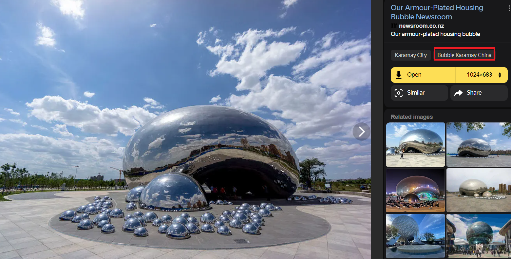
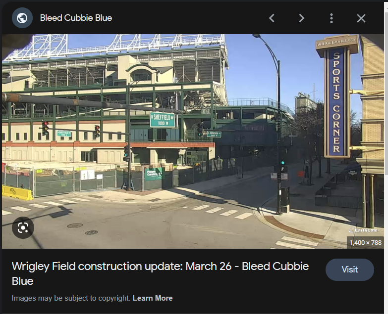
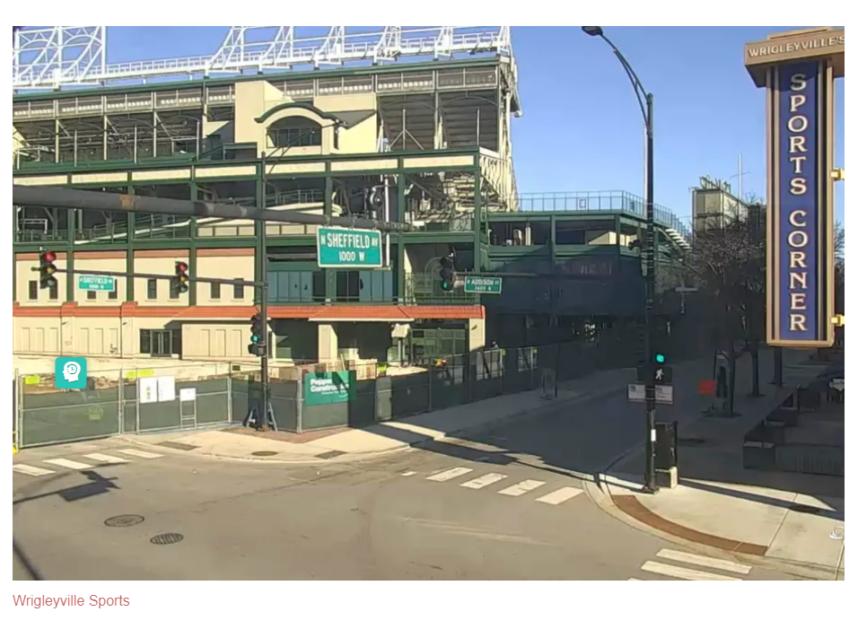
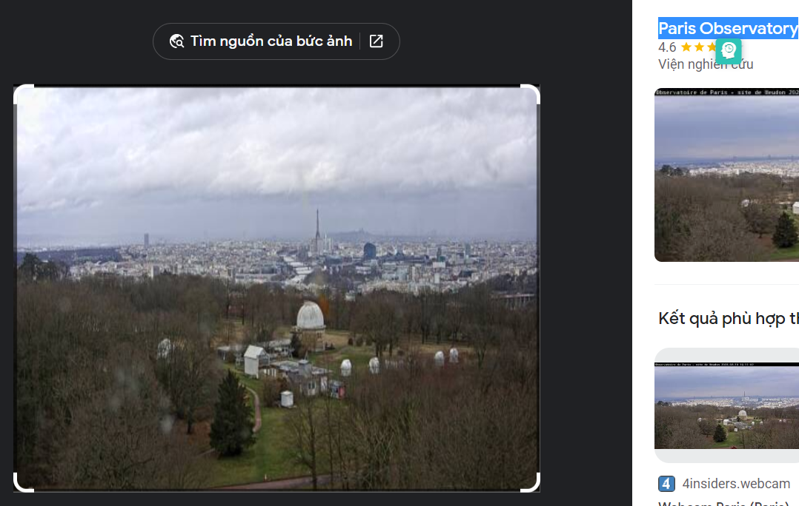
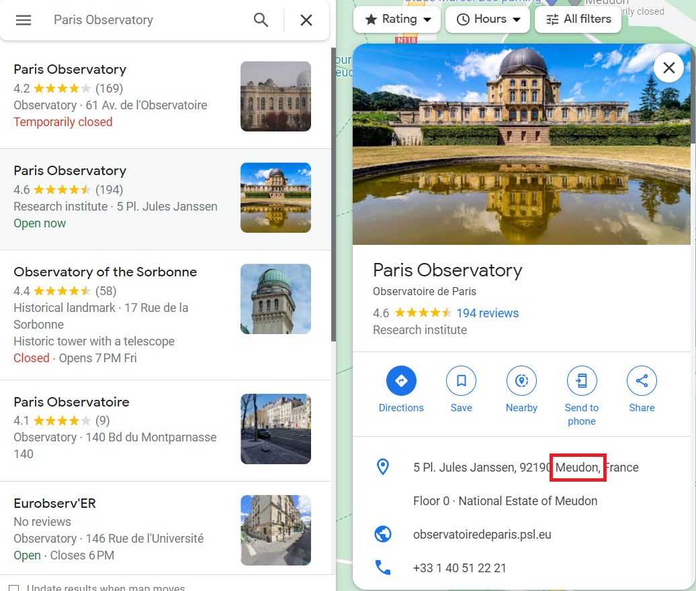
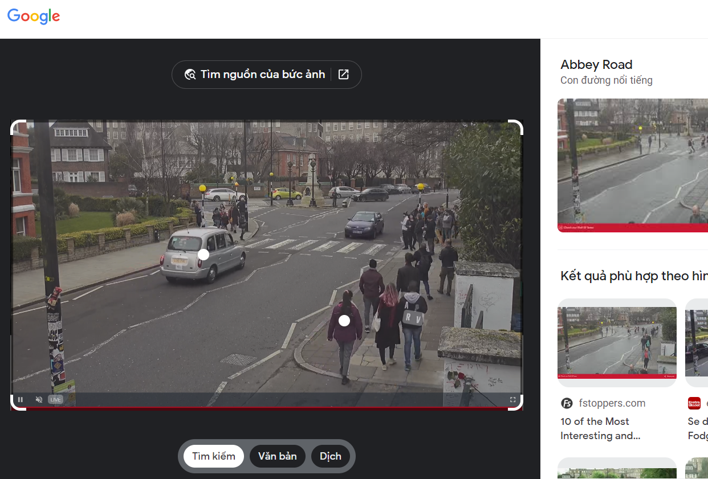

> # Geolocating Images

# Summary
<!-- TOC -->

- [Summary](#summary)
    - [Task 2 - Getting our feet wet - where is this?](#task-2---getting-our-feet-wet---where-is-this)
    - [Task 4 - Now your turn](#task-4---now-your-turn)
    - [Task 6 - Your turn, again!](#task-6---your-turn-again)
    - [Task 7 - Your turn, what can you see?](#task-7---your-turn-what-can-you-see)

<!-- /TOC -->

## Task 2 - Getting our feet wet - where is this?
1. Where in the world is image 1? The answer is the country name. 
    Upload image 1 to Yandex, it show you this image is in `Bubble Karamay China`. 
     
    **Answer:** China

## Task 4 - Now your turn
1. Where was image 2 taken? 
    I search for string `sport corner sheffield 1000 w` and found an image is the same as image 2 but in the morning. 
     
    Follow this [link](https://www.bleedcubbieblue.com/2022/3/27/22998478/wrigley-field-construction-update-march-26),`Wrigleyville Sports` is the location where the webcam was setup. 
     
    **Answer:** Wrigleyville Sports

## Task 6 - Your turn, again!
1. Where was image 3 taken? 
    Search this image on Google Lens, it returns `Paris Observatory` but it's not the answer. 
     
    So, I search this place on Google Maps and found a location not in Paris. 
     
    **Answer:** Meudon Observatory

## Task 7 - Your turn, what can you see?
1. Where is image 4 taken? 
    Upload this image to Google Lens, it returns `Abbey Road`. 
     
    **Answer:** Abbey Road

