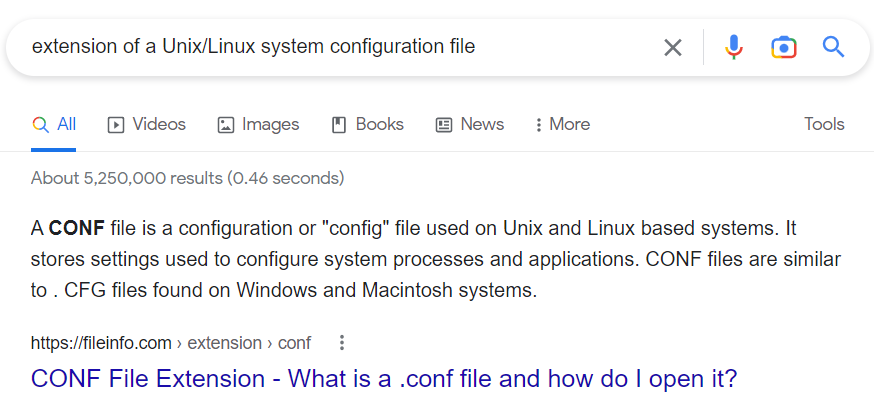

> # Google Dorking

# Summary
<!-- TOC -->

- [Summary](#summary)
    - [Task 2 - Let's Learn About Crawlers](#task-2---lets-learn-about-crawlers)
    - [Task 4 - Beepboop - Robots.txt](#task-4---beepboop---robotstxt)
    - [Task 5 - Sitemaps](#task-5---sitemaps)
    - [Task 6 - What is Google Dorking?](#task-6---what-is-google-dorking)

<!-- /TOC -->

## Task 2 - Let's Learn About Crawlers
1. Name the key term of what a "Crawler" is used to do? 
    >  Once a web crawler discovers a domain such as mywebsite.com, it will ***index*** the entire contents of the domain, looking for keywords and other miscellaneous information 

    **Answer:** index

1. What is the name of the technique that "Search Engines" use to retrieve this information about websites? 
    Verb form of crawler. 
    **Answer:** crawling

1. What is an example of the type of contents that could be gathered from a website? 
    **Answer:** keywords

## Task 4 - Beepboop - Robots.txt
1. Where would "robots.txt" be located on the domain "ablog.com" 
    **Answer:** ablog.com/robots.txt

1. If a website was to have a sitemap, where would that be located?  
    **Answer:** sitemap.xml

1. How would we only allow "Bingbot" to index the website? 
    **Answer:** User-agent:Bingbot

1. How would we prevent a "Crawler" from indexing the directory "/dont-index-me/"? 
    **Answer:** Disallow: /dont-index-me/

1. What is the extension of a Unix/Linux system configuration file that we might want to hide from "Crawlers"? 
     
    **Answer:** .conf

## Task 5 - Sitemaps
1. What is the typical file structure of a "Sitemap"? 
    **Answer:** xml

1. What real life example can "Sitemaps" be compared to? 
    **Answer:** map

1. Name the keyword for the path taken for content on a website 
    **Answer:** route

## Task 6 - What is Google Dorking?
1. What would be the format used to query the site bbc.co.uk about flood defences 
    **Answer:** site:bbc.co.uk flood defences

1. What term would you use to search by file type? 
    **Answer:** filetype:

1. What term can we use to look for login pages? 
    **Answer:** intitle:login

