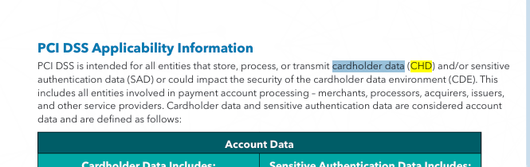
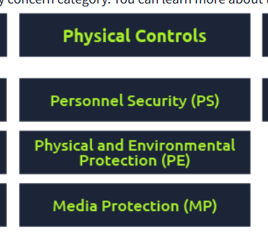
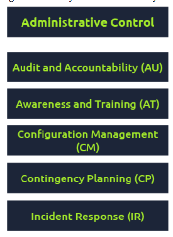
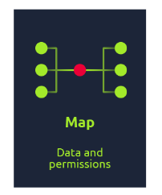
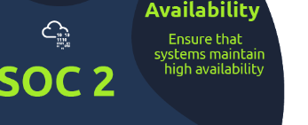
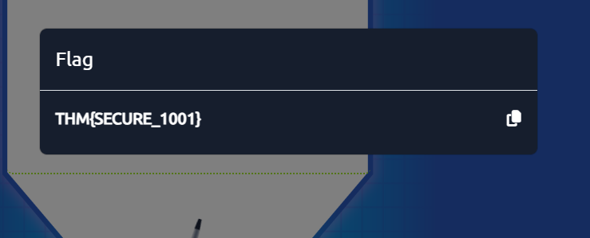

> # Governance & Regulation

## Summary
- [Summary](#summary)
  - [Task 2 - Why is it important?](#task-2---why-is-it-important)
  - [Task 3 - Information Security Frameworks](#task-3---information-security-frameworks)
  - [Task 4 - Governance Risk and Compliance (GRC)](#task-4---governance-risk-and-compliance-grc)
  - [Task 5 - Privacy and Data Protection](#task-5---privacy-and-data-protection)
  - [Task 6 - NIST Special Publications](#task-6---nist-special-publications)
  - [Task 7 - Information Security Management and Compliance](#task-7---information-security-management-and-compliance)
  - [Task 8 - Conclusion](#task-8---conclusion)

### Task 2 - Why is it important?
1. The term used for legal and regulatory frameworks that govern the use and protection of information assets is called? 
    > Regulation: A rule or law enforced by a governing body to ensure compliance and protect against harm.

    **Answer:** Regulation

1. Health Insurance Portability and Accountability Act (HIPAA) targets which domain for data protection? 
    **Answer:** Healthcare

### Task 3 - Information Security Frameworks
1. The step that involves periodic evaluation of policies and making changes as per stakeholder's input is called? 
    > Review and update: Periodically review and update the document to ensure it remains relevant and practical. Monitor compliance and adjust the document based on feedback and changes in the threat landscape or regulatory environment.

    **Answer:** Review and update

1. A set of specific steps for undertaking a particular task or process is called? 
    **Answer:** procedure

### Task 4 - Governance Risk and Compliance (GRC)
1. What is the component in the GRC framework involved in identifying, assessing, and prioritising risks to the organisation? 
    > Risk Management Activities: Identify potential risks, their possible outcomes, and countermeasures such as financial fraud risks, fraudulent transactions through cyber-attack, stolen credentials through phishing, fake ATM cards, etc.

    **Answer:** Risk Management

1. Is it important to monitor and measure the performance of a developed policy?  (yea/nay) 
    > Monitor and measure performance: Processes are established to monitor and measure the effectiveness of the GRC program. For example, the organisation can track metrics and compliance with security policies. This information is used to identify areas for improvement and adjust the program as needed.

    **Answer:** Yea

### Task 5 - Privacy and Data Protection
1. What is the maximum fine for Tier 1 users as per GDPR (in terms of percentage)? 
    > Tier 1: More severe violations, including unintended data collection, sharing data with third parties without consent, etc. Maximum penalty amounting to 4% of the organisation's revenue or 20 million euros (whichever is higher).

    **Answer:** 4

1. In terms of PCI DSS, what does CHD stand for? 
     

### Task 6 - NIST Special Publications
1. Per NIST 800-53, in which control category does the media protection lie? 
     
    **Answer:** Physical

1. Per NIST 800-53, in which control category does the incident response lie? 
     
    **Answer:** administrative

1. Which phase (name) of NIST 800-53 compliance best practices results in correlating identified assets and permissions? 
     

### Task 7 - Information Security Management and Compliance
1. Which ISO/IEC 27001 component involves selecting and implementing controls to reduce the identified risks to an acceptable level? 
    > Risk treatment: Involves selecting and implementing controls to reduce the identified risks to an acceptable level.

    **Answer:** Risk treatment

1. In SOC 2 generic controls, which control shows that the system remains available? 
     

### Task 8 - Conclusion
1. Click the View Site button at the top of the task to launch the static site in split view. What is the flag after completing the exercise? 
     
    **Answer:** THM{SECURE_1001}
