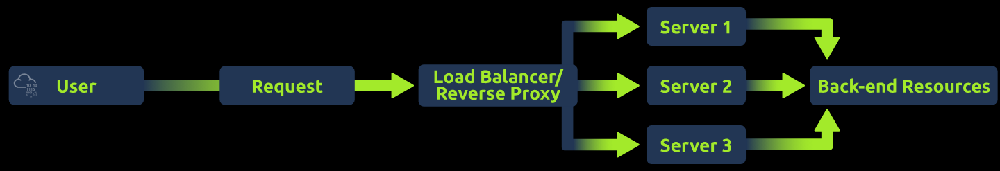

> # HTTP Request Smuggling

## Summary
- [Summary](#summary)
  - [Task 2 - Modern Infrastructure](#task-2---modern-infrastructure)
  - [Task 3 - Behind the Scenes](#task-3---behind-the-scenes)
  - [Task 4 - Request Smuggling CL.TE](#task-4---request-smuggling-clte)
  - [Task 5 - Request Smuggling TE.CL](#task-5---request-smuggling-tecl)
  - [Task 6 - Transfer Encoding Obfuscation](#task-6---transfer-encoding-obfuscation)
  - [Task 7 - Walkthrough](#task-7---walkthrough)

### Task 2 - Modern Infrastructure
1. What sits in front of one or more web servers and forwards client requests to the appropriate web server? 
     
    **Answer:** Reverse Proxy

### Task 3 - Behind the Scenes
1. What request header indicates the request or response body size in bytes? This informs the receiving server how much data to expect, ensuring the entire content is received. 
    **Answer:** Content-Length

### Task 4 - Request Smuggling CL.TE
1. What does CL.TE stand for? 
    **Answer:** Content-Length/Transfer-Encoding

### Task 5 - Request Smuggling TE.CL
1. What does TE.CL stand for? 
    **Answer:** Transfer-Encoding/Content-Length

### Task 6 - Transfer Encoding Obfuscation
1. What does TE.TE stand for? 
    **Answer:** Transfer-Encoding/Transfer-Encoding

### Task 7 - Walkthrough
1. What is the flag in the dashboard? 
    **Answer:** THM{1c4N_$mU66l3!!}
