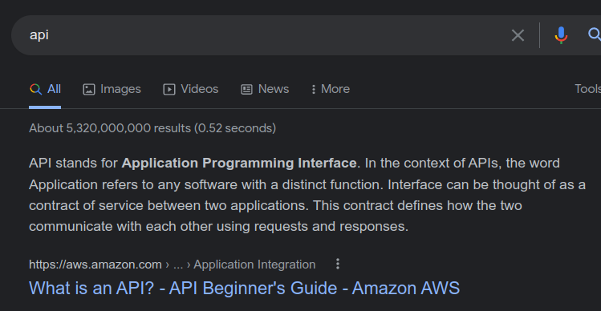
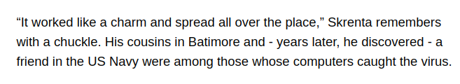

> # History of Malware

# Summary
* [Summary](#summary)
   * [Task 2 - The Creeper Program](#task-2---the-creeper-program)
   * [Task 3 - Reaper](#task-3---reaper)
   * [Task 4 - Wabbit](#task-4---wabbit)
   * [Task 5 - ANIMAL](#task-5---animal)
   * [Task 6 - Elk Cloner](#task-6---elk-cloner)
   * [Task 7 - The Morris Internet Worm](#task-7---the-morris-internet-worm)
   * [Task 8 - Cascade](#task-8---cascade)
   
## Task 2 - The Creeper Program
1. Who re-designed the Creeper Virus? 
    > Ray Tomlinson later re-designed the Creeper Virus to copy to each computer, rather than deleting the older copy of itself.

    **Answer:** Ray Tomlinson

1. How is data transferred through a network? 
    > Packet Switching is breaking data into packets to then route or send said data to the receiver.

    **Answer:** Packet Switching

1. Who created the first concept of a virus? 
    > Concepts of Malicious Software have been around since 1949, and one of the first known theories was created by John von Neumann. 

    **Answer:** John von Neumann

1. What text did the Creeper program print to the screen? 
    > Creeper would iteratively display the following message onto connected teletype computer screens: "I'm the creeper, catch me if you can!"

    **Answer:** I'm the creeper, catch me if you can!

1. What does ARPANET stand for? 
    **Answer:** Advanced Research Projects Agency Network

1. Which team created the network control program? 
    >  After their project was denied, the team working on this project (known as the Network Working Group) decided to design a program formally called the Network Control Program

    **Answer:** Network Working Group

1. What is the first virus commonly known as? 
    > The Creeper Program, also known as the "Creeper worm" or "virus", was the first-ever virus to be created. Written by Bob Thomas in 1971

    **Answer:** Creeper

## Task 3 - Reaper
1. Who created Reaper? 
    > The creator was Ray Tomlinson which you may recognise as the same person to re-design creeper.

    **Answer:** Ray Tomlinson

1. What type of malware may Reaper be known as? 
    > According to malware.wiki Reaper is called a nematode

    **Answer:** nematode

1. What was the first ever anti-virus program known as? 
    > Reaper was actually the first anti-virus software produced

    **Answer:** Reaper

1. What was Bob Thomas' main project to develop? 
    > Bob Thomas' main project was "to develop a resource-sharing capability", known as RSEXEC "so that users could develop applications that could move to and run on another computer".

    **Answer:** a resource-sharing capability

1. Research: What does API stand for? 
     
    **Answer:** Application Programming Interface

## Task 4 - Wabbit
1. What is a modern day fork bomb also known as? 
    > we would see Rabbit as being a form of denial-of-service known as a "fork bomb"

    **Answer:** denial of service attack

1. Was Rabbit one of the first malicious programs? (Y/N) 
    > It was considered the first malicious program 

    **Answer:** Y

1. What did the name "Wabbit" derive from? 
    > The Wabbit (Rabbit) virus was written in 1974. The name, which derived from Elmer Fudd's way of saying "Rabbit" in the looney tunes cartoons, was one of the first self-replicating malware.

    **Answer:** looney tunes cartoons

## Task 5 - ANIMAL
1. When was PERVADE added to ANIMAL? 
    > In 1975 the first Trojan was written. ANIMAL

    **Answer:** 1975

1. Did John think this was a good idea? (Y/N) 
    > John thought this was a good idea

    **Answer:** Y

1. What computers did the program spread across? 
    > It spread across UNIVACs (Universal Automatic Computer) when users with overlapping permissions discovered the game.

    **Answer:** UNIVACs

1. What type of malware is ANIMAL also known as? 
    > A Trojan relates to a wooden horse that the Greeks built during the Trojan War. 

    **Answer:** A Trojan

1. Who built the wooden horse? 
    **Answer:** the Greeks

## Task 6 - Elk Cloner
1. Which US Military regiment caught the virus? 
    From [Interview](https://www.theregister.com/2012/12/14/first_virus_elk_cloner_creator_interviewed/), I found this information. 
     
    **Answer:** US Navy

1. How many lines long is the Elk Cloner poem? 
    **Answer:** 7

1. When was Elk Cloner written? 
    **Answer:** 1982

1. Is a boot sector virus more or less common in modern technology? 
    > Boot Sector Viruses are less common in modern technology,

    **Answer:** less

1. How long did it take Richard to write the program? 
    > Elk Cloner took him 2 weeks to write in assembly language

    **Answer:** 2 weeks

1. Which Operating System was affected? 
    **Answer:** Apple II

## Task 7 - The Morris Internet Worm
1. What commands were a very big way that allowed Morris to access the computers? 
    > Berkeley r-commands were a very big way that allowed Morris to access the computers, that and weak passwords.

    **Answer:** Berkeley r-commands

1. Who was one the first person prosecuted for the computer misuse act? 
    > Morris was the first person to be arrested from a felony conviction in the US under the 1986 Computer Fraud and Abuse act.

    **Answer:** Robert Tappan Morris

1. What type of attack is a "Fork Bomb"? 
    > The only downfall of the worm was that it failed to check which computers it had already been to, thus infecting many computers multiple times and causing a denial of service attack, commonly known as a fork bomb.
    
    **Answer:** denial of service

1. When was this worm released? 
    **Answer:** 1988

1. How many computers did it infect within 15 hours? 
    **Answer:** 2000

1. What does rsh mean? 
    **Answer:** remote shell

1. Under which act was Morris arrested for? 
    **Answer:** the 1986 Computer Fraud and Abuse act

## Task 8 - Cascade
1. What was the name of this virus? 
    **Answer:** Cascade

1. What file extensions would this virus infect? 
    **Answer:** .com

1. How many variants of there virus were possibly found? 
    **Answer:** 40

1. What operating system would the virus run on? 
    **Answer:** DOS

1. Which Operating System/Frame Work would Cascade try to avoid? 
    > Something to note is the virus would try not to infect IBM Computers by looking for text containing a copyright statement.

    **Answer:** IBM

1. How many bytes would be added onto your file if it got infected? 
    **Answer:** 1704

