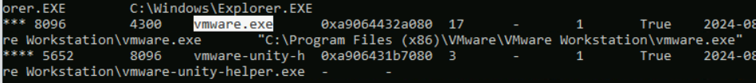
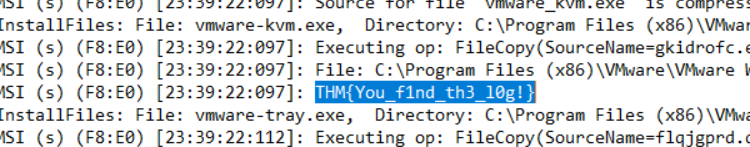
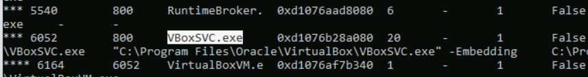
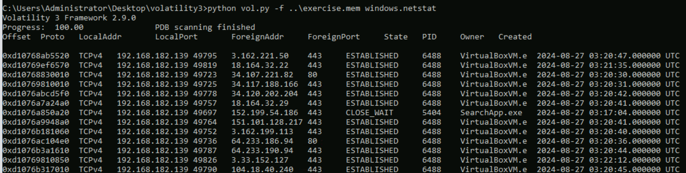

> # Hosted Hypervisors

## Summary
- [Summary](#summary)
  - [Task 3 - Networking \& Memory Investigations](#task-3---networking--memory-investigations)
  - [Task 4 - VirtualBox Investigations](#task-4---virtualbox-investigations)
  - [Task 5 - Vmware Workstation Investigations](#task-5---vmware-workstation-investigations)
  - [Task 6 - Practical](#task-6---practical)

### Task 3 - Networking & Memory Investigations
1. What is the PID of the process vmware.exe on the memory dump: memdump.mem? 
    `python vol.py -f ..\memdump.mem windows.pstree`
     
    **Answer:** 8096

1. What is the name of VirtualBox service process in Windows? 
    Search the question on Google. 
     
    **Answer:** VBoxSVC.exe

### Task 4 - VirtualBox Investigations
1. Where is the VboxManage tool typically located? 
    > One of the tools is VBoxManage. We can find it in the default location C:\Program Files\Oracle\VirtualBox, and from there, we can find an executable called VBoxManage.exe. 

    **Answer:** C:\Program Files\Oracle\VirtualBox

1. Which file contains logs about the installation and the OS? 
    > Vbox.log: This file contains information such as the OS, with details about their architecture and installation dates (timestamps). It also contains information about the VM plugins and drivers that were implemented (audio, USB, etc.).

    **Answer:** Vbox.log

### Task 5 - Vmware Workstation Investigations
1. What file should you look at to determine which VMs have an autostart functionality? 
    > vmautostart.xml: Contains configuration information on how Virtual Machines are supposed to start.

    **Answer:** vmautostart.xml

1. Where are the Hypervisor logs typically located? 
    > We can find the Hypervisor logs in Windows in the following location: C:\ProgramData\VMware\logs;

    **Answer:** C:\ProgramData\VMware\logs

### Task 6 - Practical
1. Investigate the VMware logs. Can you find the flag that starts with THM{}? 
    Open file `"C:\ProgramData\VMware\logs\vmmsi.log_20240822_234016.log"` and search the string THM. 
     
    **Answer:** THM{You_f1nd_th3_l0g!}

1. Analyze the processes on the memory dump  C:\Users\Administrator\Desktop\exercise.mem on the room VM. What is the PID of the VBoxSVC.exe process? 
    Use `windows.pstree` plugin. 
     
    **Answer:** 6052

1. Analyze the processes on the memory dump  C:\Users\Administrator\Desktop\exercise.mem on the room VM. What is the IP of the Virtual Network Adapter? 
     
    **Answer:** 192.168.182.139
