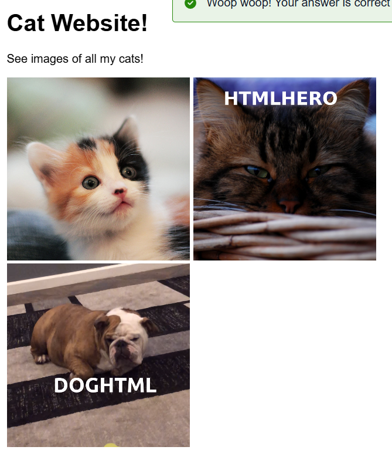
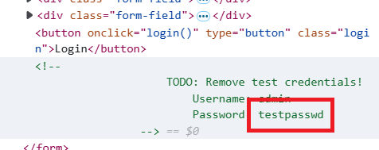

> # How Websites Work

## Summary
- [Summary](#summary)
  - [Task 1 - How websites work](#task-1---how-websites-work)
  - [Task 2 - HTML](#task-2---html)
  - [Task 3 - JavaScript](#task-3---javascript)
  - [Task 4 - Sensitive Data Exposure](#task-4---sensitive-data-exposure)
  - [Task 5 - HTML Injection](#task-5---html-injection)

### Task 1 - How websites work
1. What term best describes the component of a web application rendered by your browser? 
    **Answer:** front end

### Task 2 - HTML
1. One of the images on the cat website is broken - fix it, and the image will reveal the hidden text answer! 
    Add extension `jpg` to the end of filename. 
    **Answer:** HTMLHERO

1. Add a dog image to the page by adding another img tag () on line 11. The dog image location is img/dog-1.png. What is the text in the dog image? 
    Add this line to the html code `` 
    **Answer:** DOGHTML

### Task 3 - JavaScript
1. Click the "View Site" button on this task. On the right-hand side, add JavaScript that changes the demo element's content to "Hack the Planet" 
    **Answer:** JSISFUN

### Task 4 - Sensitive Data Exposure
1. View the website on this link. What is the password hidden in the source code? 
     
    **Answer:** testpasswd

### Task 5 - HTML Injection
1. View the website on this task and inject HTML so that a malicious link to http://hacker.com is shown. 
    Input this string `<a href="http://hacker.com">hi</a>` 
    **Answer:** HTML_INJ3CTI0N
