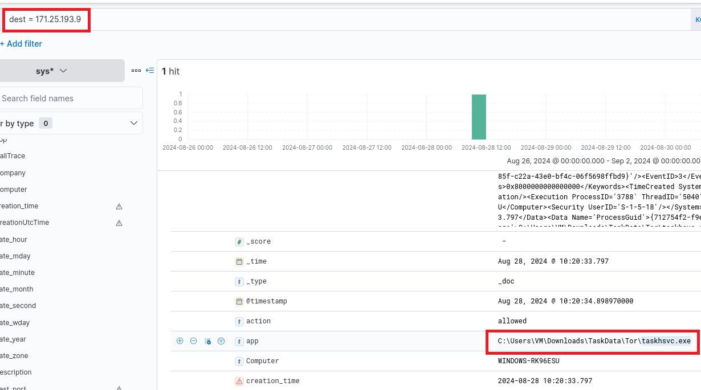
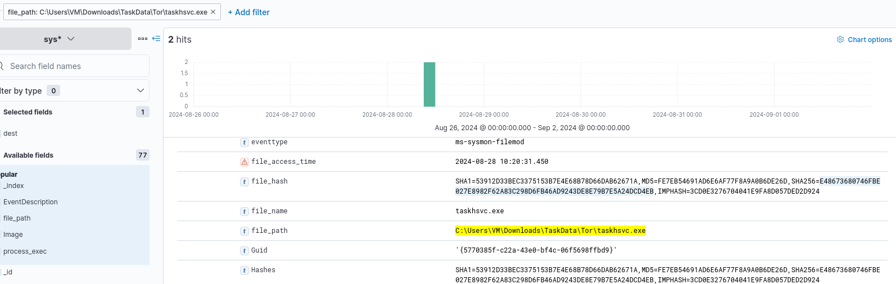
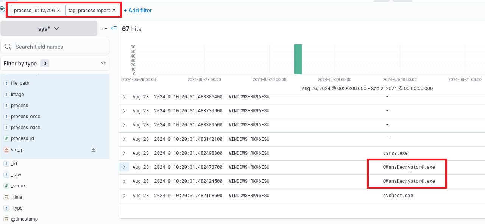

> # IR Playbooks

## Summary
- [Summary](#summary)
  - [Task 2 - The Incident Response Documentation Universe](#task-2---the-incident-response-documentation-universe)
  - [Task 3 - IR Process and Playbooks: Preparation](#task-3---ir-process-and-playbooks-preparation)
  - [Task 4 - IR Process and Playbooks: Detection and Analysis](#task-4---ir-process-and-playbooks-detection-and-analysis)
  - [Task 5 - IR Process and Playbooks: Containment, Eradication, and Recovery](#task-5---ir-process-and-playbooks-containment-eradication-and-recovery)
  - [Task 6 - IR Process and Playbooks: Post-Incident Activity](#task-6---ir-process-and-playbooks-post-incident-activity)
  - [Task 7 - Putting It Into Practice](#task-7---putting-it-into-practice)

### Task 2 - The Incident Response Documentation Universe
1. Can multiple use cases trigger a single playbook? y/n 
    >  While there is a unique playbook for every use case, multiple use cases might trigger a single playbook, making it a one-to-many mapping. 

    **Answer:** y

### Task 3 - IR Process and Playbooks: Preparation
1. What stage of the IR process can be translated into prerequisites for the playbooks? 
    **Answer:** Preparation

### Task 4 - IR Process and Playbooks: Detection and Analysis
1. What steps should we follow if the incident is a False Positive?     
    **Answer:** Close incident

### Task 5 - IR Process and Playbooks: Containment, Eradication, and Recovery
1. To recover systems affected by an incident, which configuration should we bring them back to? 
    > Reimage any machines that might have been affected by malicious attachments and restore them to their last known good configuration.

    **Answer:** last known good configuration

### Task 6 - IR Process and Playbooks: Post-Incident Activity
1. What is the last stage of the IR process? 
    > Post-incident activity is the last stage of the IR process.

    **Answer:** Post-incident activity

### Task 7 - Putting It Into Practice
1. What is the name of the process that initiated this communication? 
    Filter with `dest=171.25.193.9`, you will one log contains this IP. 
     

1. Is this process malicious, as per VirusTotal? y/n 
    To know this PE file is malicious or not by VirusTotal, you need to have its hash. So It filter with `file_path:C:\Users\VM\Downloads\TaskData\Tor\taskhsvc.exe` to get SHA256 hash. 
     
    The score is 0/75, so this file not mark as malicious by VirusTotal. 
    **Answer:** n

1. What is the name of the parent process of this process? 
    Add column `parent_process` to table, then filter `process_id` and `tag:process report` to find the parent process of the above process. 
     
    **Answer:** @WanaDecryptor@.exe

1. This process's parent was launched by another process, which is a notorious ransomware. Which ransomware is that? 
    The anwser is already in the name of the process. 
    **Answer:** Wannacry

1. Which playbook should be followed to respond to this incident? 
    Because this is a known malware, so the malware playbook will be triggered. 
    **Answer:** malware playbook

1. Is this incident an FP (False Positive) or a TP (True Positive)? 
    **Answer:** TP

1. In case the incident is a TP, what will be the next step in the IR process? 
    Because is is TP, so we need to containment this incident. 
    **Answer:** containment

