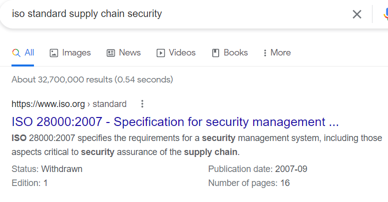
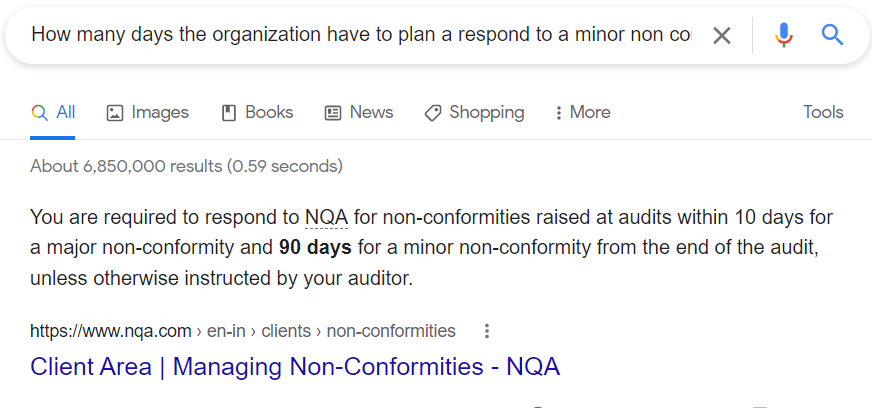
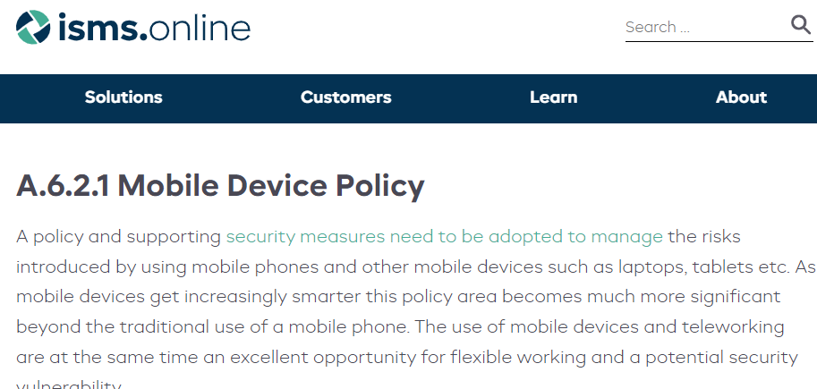

> # ISO27001

# Summary
<!-- TOC -->

- [Summary](#summary)
    - [Task 1 - Intro](#task-1---intro)
    - [Task 2 - ISO 19011](#task-2---iso-19011)
    - [Task 3 - Topics about ISMS](#task-3---topics-about-isms)
    - [Task 4 - Requirements](#task-4---requirements)
    - [Task 5 - Controls and domains](#task-5---controls-and-domains)

<!-- /TOC -->
## Task 1 - Intro
1. What does ISO stand for? 
    **Answer:** International Organization for Standardization

1. Which is the objective from an ISMS? 
    > An ISMS (Information Security Management System) consists of the policies, procedures, guidelines, and associated resources and activities, collectively managed by an organization, in the pursuit of protecting its information assets.

    **Answer:** protecting its information assets

1. Which ISO2700 families standard can be audited? 
    > OF THE ISO27001 STANDARDS ONLY 27001 CAN BE AUDITED

    **Answer:** 27001

1. Which ISO standard talk about supply chain security? 
    Research on Google. 
     
    **Answer:** 28000

1. On what type of assessment and acceptance level (appetite) is ISO 27001 based? 
    >  It is based on a risk assessment and the organization’s risk acceptance levels designed to effectively treat and manage risks.

    **Answer:** risks

## Task 2 - ISO 19011
1. Which type of audits are made by a internal team from the organization? 
    > First-party audits, or internal audits, are typically performed inside a company to measure the strengths and weaknesses relative to its internal business objectives. 

    **Answer:** First-Party Audits

1. What kind of audits cant qualify to be remote audit? 
    > Remote audit: This is from the distance, using the internet as a tool to get the audit objectives. This one can apply to first and second parties’ audits.

    **Answer:** Third-Party Audits

1. Which organization release a guide for remote audits to help organizations in the pandemic? 
    Based on the given link, you will see the name of the organization. 
    **Answer:** International Accreditation Forum

1. If you get the ISO 27001 cert for internal auditor, which types of audits are you able to do? 
    **Answer:** First-Party,Second-Party

1. In which type of audit method does the auditor go to the organization´s office? 
    > Onsite audit: This is face to face, the auditor goes to the physical site and check all the documentation

    **Answer:** onsite

## Task 3 - Topics about ISMS
1. CETS No 185 could be a example of what?... 
    Research on Google, you will see that CET No 185 related to Convention of Cybercrime, so it will be an example of Legislation. 
    **Answer:** Legislation

1. What mathematical function can help to get integrity? 
    **Answer:** hash

## Task 4 - Requirements
1. What type of context would be if gov release a new law who affect the organization? 
    Government is in External group. 
    **Answer:** External

1. Can exist proces without document? yey/nay? 
    **Answer:** nay

1. How many days the organization have to plan a respond to a minor non conformity? 
    Paste the question to Google. 
     
    **Answer:** 90

1. Which points dont need documentation? 
    > this is cause points 1,2 & 3 talks about the scope, references, and terms, so that's nothing to do on our part.

    **Answer:** 1,2,3

## Task 5 - Controls and domains
1. If i talk about "A.9.2.4" Managment of secret authentication information of users" i talking about an... 
    **Answer:** Control

1. What is the name of the "Operations security" i talking about an... 
    **Answer:** Clause

1. How many CIS controls exist? 
    Search on google, you will see the answer is 18 but this is a new of 20. 
    **Answer:** 20

1. What is the name of the control 6.2.1? 
    From this [link](https://www.isms.online/iso-27001/annex-a-6-organisation-information-security/), you will see the name of 6.2.1 section. 
     
    **Answer:** Mobile Device Policy

