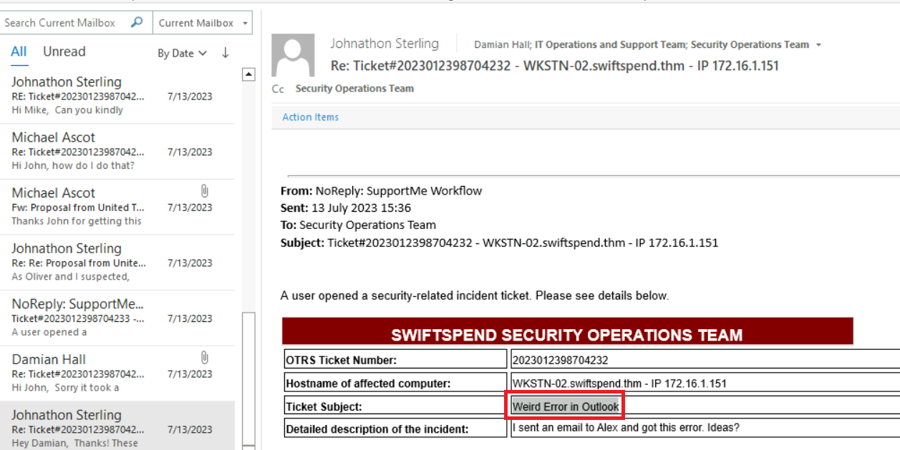
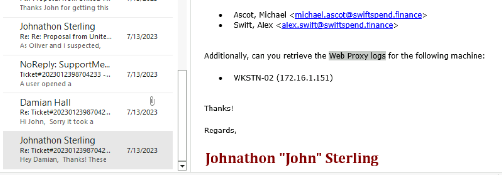
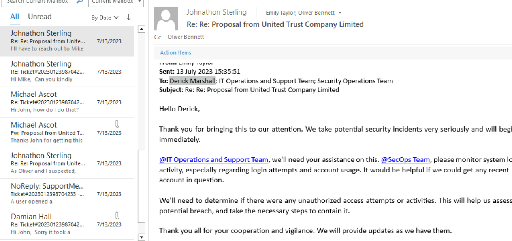
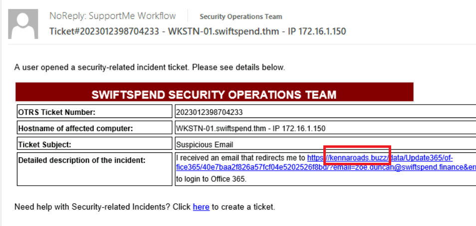
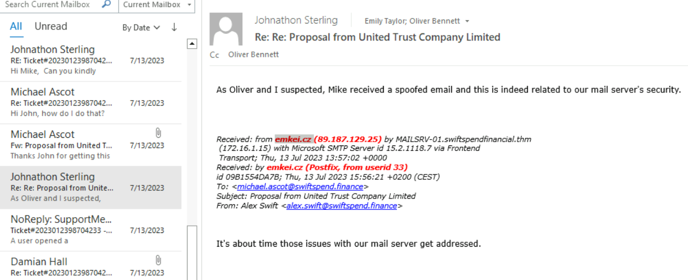
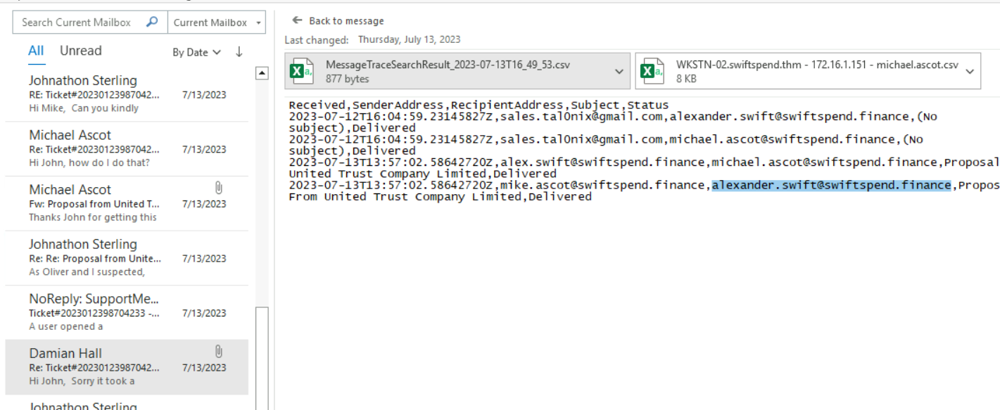
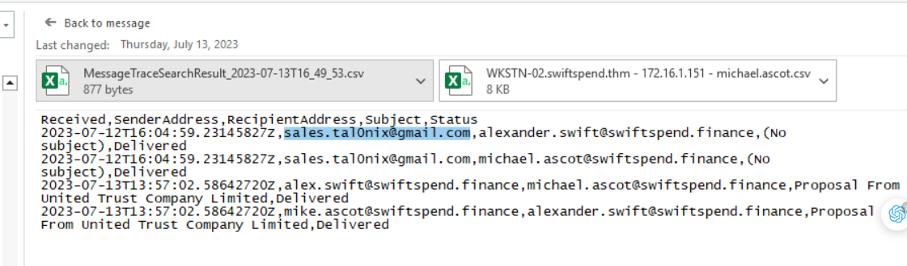
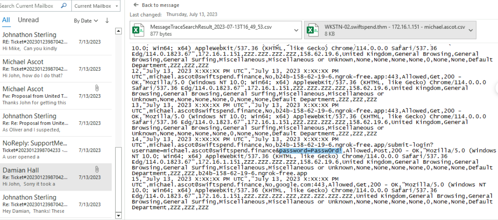

> # Identification & Scoping

# Summary
<!-- TOC -->

- [Summary](#summary)
    - [Task 2 - Identification: Unearthing the Existence of a Security Incident](#task-2---identification-unearthing-the-existence-of-a-security-incident)
    - [Task 3 - Scoping: Understanding the Extent of a Security Incident](#task-3---scoping-understanding-the-extent-of-a-security-incident)
    - [Task 4 - Identification and Scoping Feedback Loop: An Intelligence-Driven Incident Response Process](#task-4---identification-and-scoping-feedback-loop-an-intelligence-driven-incident-response-process)

<!-- /TOC -->

## Task 2 - Identification: Unearthing the Existence of a Security Incident
1. What is the Subject of Ticket#2023012398704232? 
    Open the last email, you will see the content of Ticket#2023012398704232. 
     
    **Answer:** Weird Error in Outlook

1. According to your colleague John, the issue outlined on Ticket#2023012398704232 could be related to what? 
    In the second image of John, 
     
    **Answer:** SPF, DKIM & DMARC records

1. Your colleague requested what kind of data pertaining to the machine WKSTN-02? 
    In the first email, he request the Web Proxy logs of WKSTN-02 machine. 
     
    **Answer:** Web Proxy logs

## Task 3 - Scoping: Understanding the Extent of a Security Incident
1. Based on Ticket#2023012398704231 and Asset Inventory shown in this task, who owns the computer that needs Endpoint Protection definitions updated? 
    Emily Taylor will send Derick Marshall the update version to him. 
     
    **Answer:** Derick Marshall

1. Based on the email exchanges and SoD shown in this task, what was the phishing domain where the compromised credentials in Ticket#2023012398704232 were submitted? 
    Based on the SoD of document, we see the phishing domain in the given ticket. 
    **Answer:** b24b-158-62-19-6.ngrok-free.app

1. Based on Ticket#2023012398704233, what phishing domain should be added to the SoD? 
    User receive a domain that redirect him to O365. 
     
    **Answer:** kennaroads.buzz

## Task 4 - Identification and Scoping Feedback Loop: An Intelligence-Driven Incident Response Process
1. Concerning Ticket#2023012398704232 and according to your colleague John, what domain should be added to the SoD since it was used for email spoofing? 
    The 2nd email of John, he receiven a spoofed email. 
     
    **Answer:** emkei.cz 

1. Concerning the available artefacts gathered for analysis of Ticket#2023012398704232, who is the other user that received a similar phishing email but did not open a ticket nor report the issue? 
    In the attachment excel, there is another user receive a similar phishing email. 
     
    **Answer:** alexander.swift@swiftspend.finance

1. Concerning Ticket#2023012398704232, what additional IoC could be added to the SoD and be used as a pivot point for discovery? 
    The spoofed email is sent from an email with domain "gmail.com". 
     
    **Answer:** sales.tal0nix@gmail.com

1. Based on the email exchanges and attachments in those exchanges, what is the password of the compromised user? 
    Based on the captured traffic, we see the Micheal's password. 
     
    **Answer:** Passw0rd!

