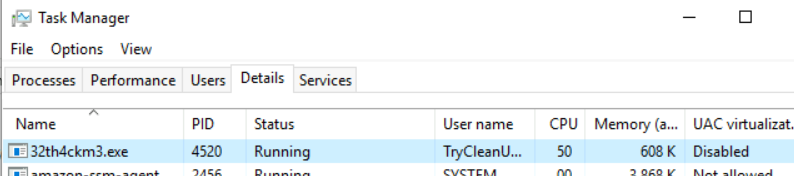
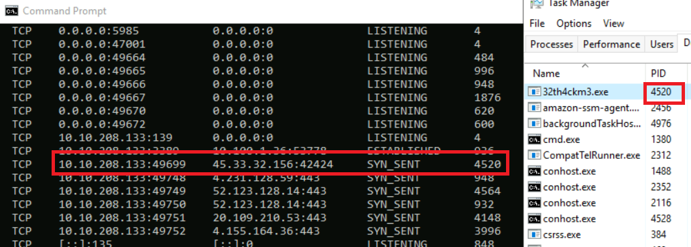
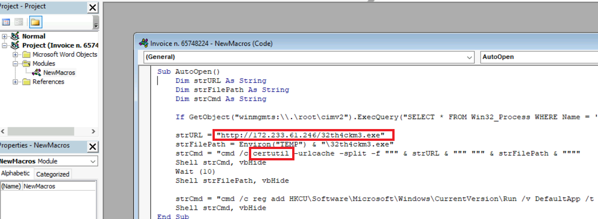
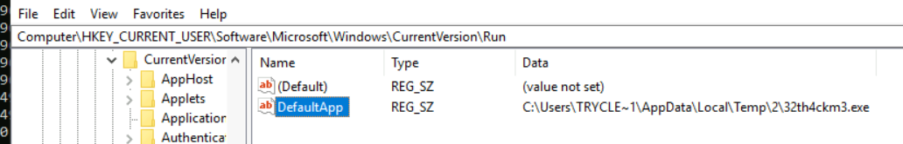

> # Incident Response Process

## Summary
- [Summary](#summary)
  - [Task 2 - Incident Response Lifecycle](#task-2---incident-response-lifecycle)
  - [Task 3 - Detection and Analysis](#task-3---detection-and-analysis)
  - [Task 4 - Containment, Eradication, and Recovery](#task-4---containment-eradication-and-recovery)
  - [Task 5 - Closing the Cycle](#task-5---closing-the-cycle)

### Task 2 - Incident Response Lifecycle
1. What is the phase of the NIST Incident Response Framework in which incident responders are usually called to action? 
    **Answer:** Detection and Analysis

### Task 3 - Detection and Analysis
1. What is the name of the process active in the attached VM that we suspect could be a miner? 
     
    **Answer:** 32th4ckm3.exe

1. What is the combination IP:port of the C2 server of the malware? 
     
    **Answer:** 45.33.32.156:42424

1. What is the name of the document containing the malicious macro? 
     
    **Answer:** invoice n. 65748224.docm

1. What is the website from which the miner was downloaded? 
     
    **Answer:** http://172.233.61.246/32th4ckm3.exe

1. What is the utility that the macro leveraged to download the malware? 
    **Answer:** certutil

### Task 4 - Containment, Eradication, and Recovery
1. Which folder should we navigate to in order to find and delete the malicious process? (Full path) 
    Select `Open file location` to see the path to file. 
    **Answer:** C:\Users\TryCleanUser\AppData\Local\Temp\2

1. In the Run registry key, what is the name of the string value that has been added by the miner for persistence? 
     
    **Answer:** DefaultApp

### Task 5 - Closing the Cycle
1. The goal of an effective preparation phase is to develop an: 
    > This phase involves thoroughly reviewing the incident, documenting lessons learned, and integrating these insights into the Incident Response Plan (IRP) developed during the preparation phase.

    **Answer:** Incident Response Plan
