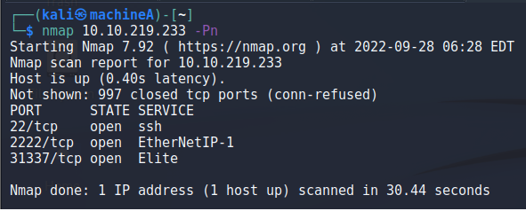
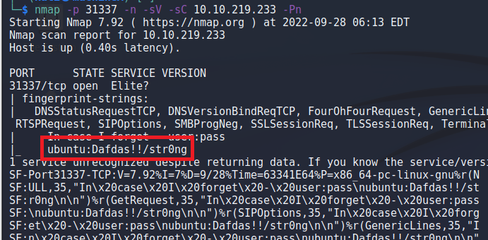
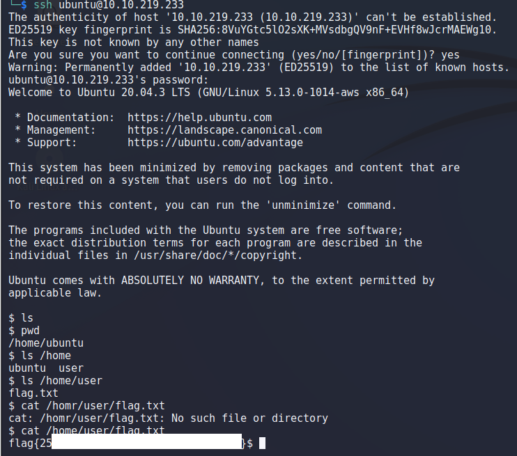

> # Intermediate Nmap

# Find the flag!
Scan for the opening ports first. 
 

We'have found three opening ports are 22, 2222, 31337. Based on the description of the task, may be we have to find the credential of SSH. 
I have try to find information about port 2222 but don't see anything. 
When try with port 31337, I found a interested things may be the credential of the target. 
 
I try to login to the target and success. The flag is in path /home/user/flag.txt. 
 
**Answer:** flag{\<redacted\>}
