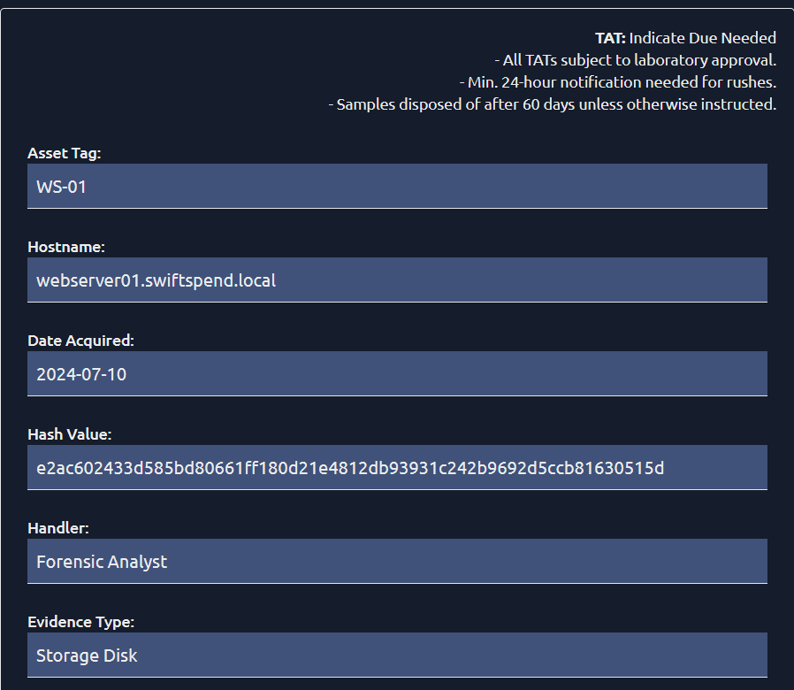

> # Intro to Cold System Forensics

# Summary
- [Summary](#summary)
  - [Task 2 - Challenges and Opportunities](#task-2---challenges-and-opportunities)
  - [Task 3 - Data Acquisition and Preservation](#task-3---data-acquisition-and-preservation)
  - [Task 4 - Forensic Tools and Techniques](#task-4---forensic-tools-and-techniques)
  - [Task 5 - Practica](#task-5---practica)

##  Task 2 - Challenges and Opportunities
1. Under what two system states are cold system forensics mainly applied? 
    >  cold system forensics focuses on dormant or powered-off machines

    **Answer:** dormant or powered-off

1. What type of attack provided a research basis for cold system forensics? 
    > Cold system forensics emerged as a direct response to a malicious technique known as a cold boot attack.

    **Answer:** cold boot attack

##  Task 3 - Data Acquisition and Preservation
1. The making of a bit-by-bit copy of forensic data is known as? 
    > Disk Imaging: An illustration of a USB write-blocker in use. This is the process of creating a bit-for-bit copy of a disk, a complete replica of the original data.

    **Answer:** Disk Imaging

1. What restricts access to sensitive data? 
    > Access control: Establishing access control measures will restrict data access and investigation access to authorised personnel. This goes hand in hand with chain of custody.

    **Answer:** Access control

1. Which sources of evidence are part of the most volatile on a host?
    > CPU registers and cache: These hold the most volatile data, typically lost once the host is powered down. When this data is captured, it can provide insights into current operations being executed.

    **Answer:** CPU registers and cache

##  Task 4 - Forensic Tools and Techniques
1. Using hash functions seeks to minimise risks associated with what element? 
    > Data Integrity: Ensuring the integrity of the disk image is paramount. Using cryptographic hash functions before and after analysis while employing write-blocking prevents accidental modification.

    **Answer:** data integrity

1. What is the name of the documentation responsible for listing the forensic evidence and its accompanying responsibilities? 
    > Chain of custody refers to the documentation of the responsible personnel in charge of evidence, its transfer from the point of collection to its presentation in court or required body after investigation.

    **Answer:** Chain of custody

##  Task 5 - Practica
1. What flag do you receive after completing the Order of Volatility challenge? 
     
    **Answer:** THM{729a68a1253a5f4c7126110c0c600740}

1. What flag do you receive after completing the Chain of Custody challenge? 
     
    **Answer:** THM{4de91692a4057c140d5a09875aba0431}
