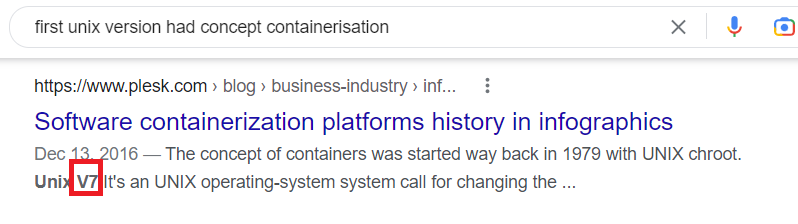
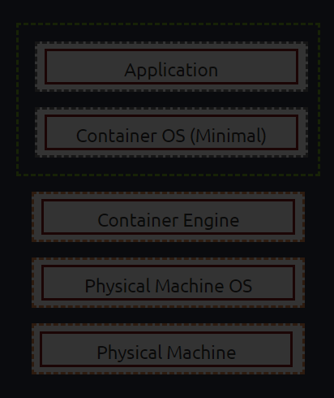

> # Intro to Containerisation

# Summary
<!-- TOC -->

- [Summary](#summary)
    - [Task 2 - What is Containerisation](#task-2---what-is-containerisation)
    - [Task 3 - Introducing Docker](#task-3---introducing-docker)
    - [Task 4 - The History of Docker](#task-4---the-history-of-docker)
    - [Task 6 - How does Containerisation Work?](#task-6---how-does-containerisation-work)
    - [Task 7 - Practical](#task-7---practical)

<!-- /TOC -->
## Task 2 - What is Containerisation
1. What is the name of the kernel feature that allows for processes to use resources of the Operating System without being able to interact with other processes?  
    > it is worth noting that containerisation platforms make use of the “namespace” feature of the kernel, which is a feature used so that processes can access resources of the operating system without being able to interact with other processes.

    **Answer:** namespace

1. In a normal configuration, can other containers interact with each other? (yay/nay) 
    > if an application in the container is compromised, usually (unless they share the same namespace), other containers are unaffected.

    **Answer:** nay

## Task 3 - Introducing Docker
1. What does an application become when it is published using Docker? Format: An xxxxx (fill in the x's)  
    > Applications can be published as “images” and shared with others. 
    
    **Answer:** An image

1. What is the abbreviation of the programming syntax language that Docker uses? 
    > Docker uses the programming syntax YAML to allow developers to instruct how a container should be built and what is run.

    **Answer:** YAML

## Task 4 - The History of Docker
1. In what year was Docker originally created? 
    **Answer:** 2013

1. Where was Docker first showcased? 
    **Answer:** PyCon

1. What version of Unix had the first concepts of containerisation? 
     
    **Answer:** V7

## Task 6 - How does Containerisation Work?
1. What command can we use to view a list of running processes? 
    The answer is already in the above image. 
    **Answer:** ps aux

## Task 7 - Practical
1. Containerise the applications in the static site. What is the flag?  
     
    **Answer:** THM{APPLICATION_SHIPPED}
