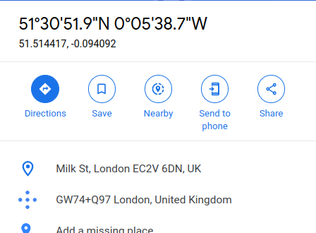

> # Intro to Digital Forensics

# Summary
* [Intro to Digital Forensics](#intro-to-digital-forensics)
* [Summary](#summary)
   * [Task 1 - Introduction To Digital Forensics](#task-1---introduction-to-digital-forensics)
   * [Task 2 - Digital Forensics Process](#task-2---digital-forensics-process)
   * [Task 3 - Practical Example of Digital Forensics](#task-3---practical-example-of-digital-forensics)
   
## Task 1 - Introduction To Digital Forensics
1. Consider the desk in the photo above. In addition to the smartphone, camera, and SD cards, what would be interesting for digital forensics?<br>
    
    **Answer:** laptop

## Task 2 - Digital Forensics Process
1. It is essential to keep track of who is handling it at any point in time to ensure that evidence is admissible in the court of law. What is the name of the documentation that would help establish that?<br>
    **Answer:** Chain of Custody

## Task 3 - Practical Example of Digital Forensics
1. Using `pdfinfo`, find out the author of the attached PDF file.<br>
    ```sh
    $ pdfinfo ransom-letter.pdf 
    Title:           Pay NOW
    Subject:         We Have Gato
    Author:          Ann Gree Shepherd
    Creator:         Microsoft® Word 2016
    Producer:        Microsoft® Word 2016
    CreationDate:    Wed Feb 23 16:10:36 2022 +07
    ModDate:         Wed Feb 23 16:10:36 2022 +07
    Custom Metadata: no
    Metadata Stream: yes
    Tagged:          yes
    UserProperties:  no
    Suspects:        no
    Form:            none
    JavaScript:      no
    Pages:           1
    Encrypted:       no
    Page size:       595.44 x 842.04 pts (A4)
    Page rot:        0
    File size:       71371 bytes
    Optimized:       no
    PDF version:     1.7
    ```
    **Answer:** Ann Gree Shepherd

1. Using `exiftool` or any similar tool, try to find where the kidnappers took the image they attached to their document. What is the name of the street?<br>
    ```sh
    $ exiftool letter-image.jpg | grep GPS
    GPS Latitude Ref                : North
    GPS Longitude Ref               : West
    GPS Time Stamp                  : 13:37:33
    GPS Latitude                    : 51 deg 30' 51.90" N
    GPS Longitude                   : 0 deg 5' 38.73" W
    GPS Position                    : 51 deg 30' 51.90" N, 0 deg 5' 38.73" W
    ```
    Search on [Google Maps](https://www.google.com/maps) with this GPS, we will see the result.
    <br>
    **Answer:** Milk Street

1. What is the model name of the camera used to take this photo?
    Use `exiftool` and grep with "Camera"
    ```sh
    $ exiftool letter-image.jpg | grep Camera
    Camera Model Name               : Canon EOS R6
    Camera Profile                  : Adobe Standard
    Camera Profile Digest           : 441F68BD6BC3369B59256B103CE2CD5C
    History Software Agent          : Adobe Photoshop Lightroom Classic 10.2 (Macintosh), Adobe Photoshop Camera Raw 14.0, Adobe Photoshop Camera Raw 14.0.1 (Windows), Adobe Photoshop Camera Raw 14.0.1 (Windows), Adobe Photoshop 22.4 (Windows), Adobe Photoshop 22.4 (Windows), Adobe Photoshop 22.4 (Windows), Gimp 2.10 (Linux)
    Look Parameters Camera Profile  : Adobe Standard
    ```
    **Answer:** Canon EOS R6
