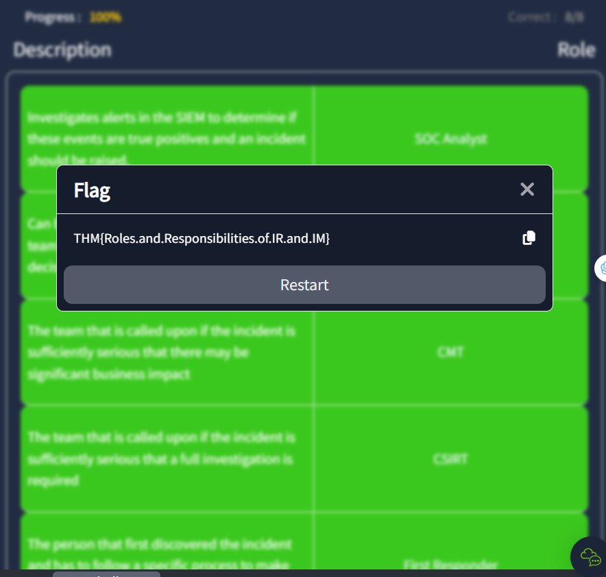
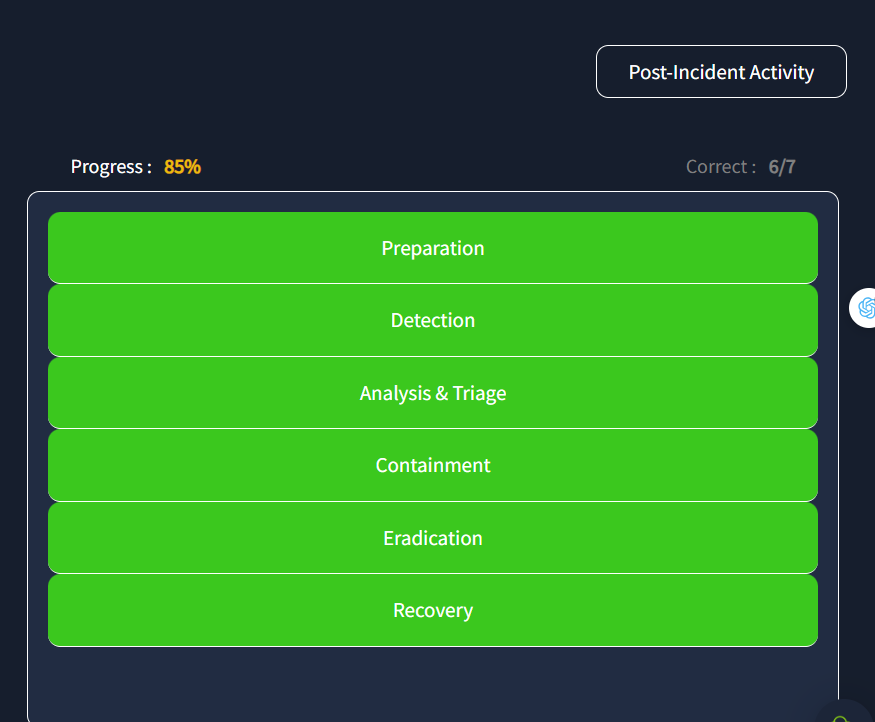

> # Intro to IR and IM

# Summary
<!-- TOC -->

- [Summary](#summary)
    - [Task 2 - What is Incident Response and Management](#task-2---what-is-incident-response-and-management)
    - [Task 3 - The Different Roles During an Incident](#task-3---the-different-roles-during-an-incident)
    - [Task 4 - The Process of Incident Management](#task-4---the-process-of-incident-management)
    - [Task 5 - Common Pitfalls During an Incident](#task-5---common-pitfalls-during-an-incident)

<!-- /TOC -->

## Task 2 - What is Incident Response and Management
1. At what level (number only) of an incident would the SOC be placed at high alert and to deal with an incident? 
    > Level 3: CSIRT Incident - the entire SOC is placed on high alert and actively working to resolve the incident.

    **Answer:** 3

1. At what level (number only) of an incident would it be classified as a cyber crisis? 
    > Level 4: CMT Incident - it is all hands on deck and officially a full-scale cyber crisis

    **Answer:** 4

1. Which component (IR or IM) is responsible for trying to answer the question: How do we respond to what happened? 
    From the document... 
    **Answer:** IM

1. Which component (IR or IM) is responsible for trying to answer the question: What happened? 
    **Answer:** IR

## Task 3 - The Different Roles During an Incident
1. What is the value of the flag you receive after matching the roles and responsibilities? 
    Af ccomplete pair roles, you will receive the flag. 
     
    **Answer:** THM{Roles.and.Responsibilities.of.IR.and.IM}

## Task 4 - The Process of Incident Management
1. What is the value of the flag you receive after correctly matching the steps of the incident management process? 
     
    **Answer:** THM{Preparation.is.Key.for.Incident.Management}

## Task 5 - Common Pitfalls During an Incident
1. What is the value of the flag you receive when you overcome the common pitfalls of a cyber incident? 
     
    **Answer:** THM{Avoiding.the.Common.IM.Mistakes}

