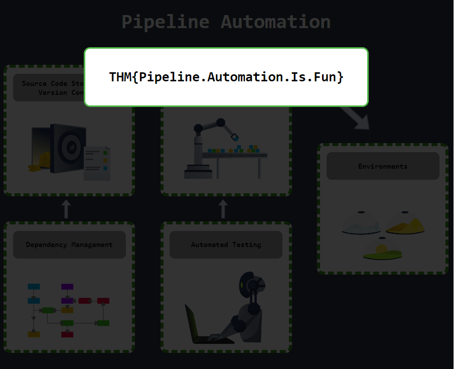

> # Intro to Pipeline Automation

# Summary
<!-- TOC -->

- [Summary](#summary)
    - [Task 2 - DevOps Pipelines Explained](#task-2---devops-pipelines-explained)
    - [Task 3 - Source Code and Version Control](#task-3---source-code-and-version-control)
    - [Task 4 - Dependency Management](#task-4---dependency-management)
    - [Task 5 - Automated Testing](#task-5---automated-testing)
    - [Task 6 - Continuous Integration and Delivery](#task-6---continuous-integration-and-delivery)
    - [Task 7 - Environments](#task-7---environments)
    - [Task 8 - Challenge](#task-8---challenge)

<!-- /TOC -->

## Task 2 - DevOps Pipelines Explained
1. Where in the pipeline is our end product deployed? 
    
    **Answer:** Environments

## Task 3 - Source Code and Version Control
1. Who is the largest online provider of Git? 
    > GitHub is by far the largest provider of Internet hosting for software development and version control using Git. 

    **Answer:** Github

1. What popular Git product is used to host your own Git server? 
    > you could also host your own git server using software such as Gitlab.
    **Answer:** Gitlab

1. What tool can be used to scan the commits of a repo for sensitive information? 
    >  If an attacker got access to the repo, they could use a tool such as GittyLeaks, which would scan through the commits for sensitive information. 
    **Answer:** GittyLeaks

## Task 4 - Dependency Management
1. What do we call the type of dependency that was created by our organisation? (Internal/External) 
    
    **Answer:** Internal

1. What type of dependency is JQuery? (Internal/External) 
    **Answer:** External

1. What is the name of Python's public dependency repo? 
    **Answer:** PyPi

1. What dependency 0day vulnerability set the world ablaze in 2021? 
    **Answer:** Log4j

## Task 5 - Automated Testing
1. What type of tool scans code to look for potential vulnerabilities? 
    > Static Application Security Testing (SAST) works by reviewing the source code of the application or service to identify sources of vulnerabilities. 

    **Answer:** SAST

1. What type of tool runs code and injects test cases to look for potential vulnerabilities? 
    > Dynamic Application Security Testing (DAST) is similar to SAST but performs dynamic testing by executing the code. 
    **Answer:** DAST

1. Can SAST and DAST be used as a replacement for penetration tests? (Yea,Nay) 
    > Sadly, SAST and DAST tools cannot fully replace manual testing, such as penetration tests. 

    **Answer:** Nay

## Task 6 - Continuous Integration and Delivery
1. What does CI in CI/CD stand for? 
    >  it was common for CI/CD to mean Continuous Integration and continuous Delivery
    **Answer:** Continuous Integration

1. What does CD in CI/CD stand for? 
    **Answer:** Continuous Development

1. What do we call the build infrastructure element that controls all builds? 
    > CI/CD pipelines require build-infrastructure to execute the actions of these elements. We usually refer to this infrastructure as build orchestrators and agents. A build orchestrator directs the various agents to perform the actions of the CI/CD pipelines as required.
    **Answer:** build orchestrators

1. What do we call the build infrastructure element that performs the build? 
    **Answer:** build agent

## Task 7 - Environments
1. Which environment usually has the weakest security configuration? 
    Based on the table in the description. 
    **Answer:** DEV

1. Which environment is used to test the application? 
    **Answer:** UAT

1. Which environment is similar to PROD but is used to verify that everything is working before it is pushed to PROD? 
    **Answer:** PreProd

1. What is a common class of vulnerabilities that is discovered in PROD due to insecure code creeping in from DEV? 
    **Answer:** Developer Bypasses

## Task 8 - Challenge
1. What is the flag received after successfully building your pipeline? 
     
    **Answer:** THM{Pipeline.Automation.Is.Fun}
